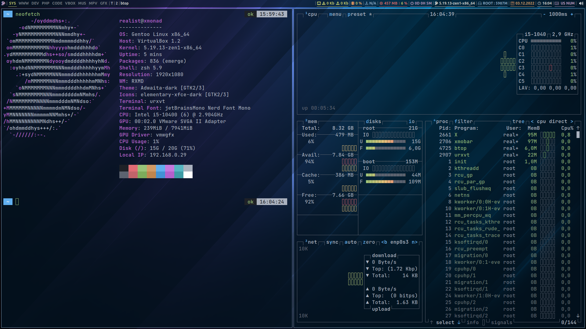
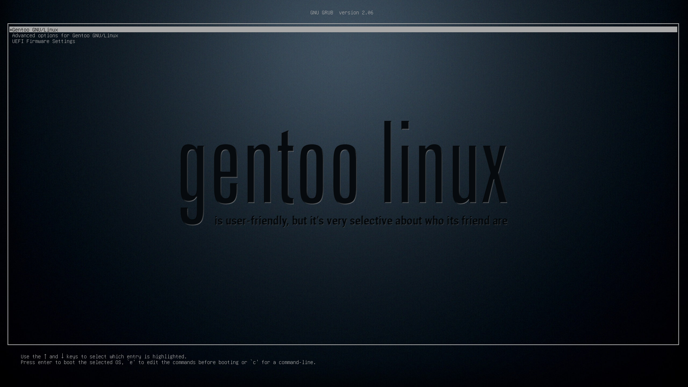

# Gentoo Xmonad Desktop for Web Developers by Realist

## Final desktop screenshot


## Grub background


## Create install environment

### Partitions
```
parted -s /dev/sda mklabel gpt
```
```
parted -a optimal /dev/sda << END
unit mib
mkpart primary fat32 1 150
name 1 UEFI
set 1 bios_grub on
mkpart primary 150 -1
name 2 ROOT
p
quit
END
```

### Filesystems
```
mkfs.fat -n UEFI -F32 /dev/sda1 && mkfs.f2fs -l ROOT -O extra_attr,inode_checksum,sb_checksum -f /dev/sda2
```
```
mkdir -p /mnt/gentoo && mount -t f2fs /dev/sda2 /mnt/gentoo
```
```
mkdir -p /mnt/gentoo/boot && mount /dev/sda1 /mnt/gentoo/boot
```

### Stage3 and config portage
```
cd /mnt/gentoo
```
```
wget https://bouncer.gentoo.org/fetch/root/all/releases/amd64/autobuilds/20221127T170156Z/stage3-amd64-openrc-20221127T170156Z.tar.xz
```
```
tar xpf stage3-amd64-openrc-20221127T170156Z.tar.xz --xattrs-include='*.*' --numeric-owner
```
```
mkdir -p /mnt/gentoo/var/db/repos/gentoo && mkdir -p /mnt/gentoo/etc/portage/repos.conf
```
```
cp /mnt/gentoo/usr/share/portage/config/repos.conf /mnt/gentoo/etc/portage/repos.conf/
```
```
cp /etc/resolv.conf /mnt/gentoo/etc/
```
### Mounting important system FS
```
mount -t proc none /mnt/gentoo/proc && mount -t sysfs none /mnt/gentoo/sys
```
```
mount --rbind /sys /mnt/gentoo/sys && mount --make-rslave /mnt/gentoo/sys
```
```
mount --rbind /dev /mnt/gentoo/dev && mount --make-rslave /mnt/gentoo/dev
```
```
mount --rbind /run /mnt/gentoo/run && mount --make-rslave /mnt/gentoo/run
```
```
test -L /dev/shm && rm /dev/shm && mkdir /dev/shm
```
```
mount --types tmpfs --options nosuid,nodev,noexec shm /dev/shm && chmod 1777 /dev/shm
```

### Chroot to prepared system
```
chroot /mnt/gentoo /bin/bash && env-update && source /etc/profile && export PS1="(chroot) ${PS1}"
```
### Sync and config portage
```
emerge-webrsync
```
```
cd /etc/portage/
```
```
rm make.conf && rm -R package.use && rm -R package.accept_keywords && rm -R package.mask
```

### Edit file - /etc/portage/make.conf 
```
nano make.conf
```
```
# RXMD - Realist Xmonad Minimal Desktop
# make.conf file (c) 2022 -> /etc/portage/make.conf

USE="alsa dbus elogind jpeg pulseaudio pipewire png nls X"

COMMON_FLAGS="-O2 -pipe -fomit-frame-pointer"
CFLAGS="${COMMON_FLAGS}"
CXXFLAGS="${COMMON_FLAGS}"
FCFLAGS="${COMMON_FLAGS}"
FFLAGS="${COMMON_FLAGS}"
MAKE_OPTS="-j6"

GENTOO_MIRRORS="https://mirror.dkm.cz/gentoo/"
PORTAGE_BINHOST="http://78.45.232.18:55/xmonad"
PORTDIR="/var/db/repos/gentoo"
DISTDIR="/var/cache/distfiles"
PKGDIR="/var/cache/binpkgs"
PORTAGE_NICENESS=19
PORTAGE_IONICE_COMMAND="ionice -c 3 -p \${PID}"
EMERGE_DEFAULT_OPTS="-v --ask-enter-invalid --jobs=4 --load-average=4"
FEATURES="pkgdir-index-trusted binpkg-logs buildpkg cgroup collision-protect downgrade-backup parallel-fetch sign"

ACCEPT_KEYWORDS="amd64"
ACCEPT_LICENSE="-* @FREE"
GRUB_PLATFORMS="pc efi-64"

LC_ALL=C
LC_MESSAGES=C
L10N="cs"

INPUT_DEVICES="libinput"
VIDEO_CARDS="nouveau vmware"
```
### Edit file - /etc/portage/package.accept_keywords
```
nano package.accept_keywords 
```
```
# RXMD - Realist Xmonad Minimal Desktop
# package.accept_keywords file -> /etc/portage/package.accept_keywords

# ADMIN-APP
app-admin/haskell-updater ~amd64

# APP-EDITORS
app-editors/sublime-text ~amd64
app-editors/vscode ~amd64

# DEV-PHP
dev-php/ca-bundle ~amd64
dev-php/composer ~amd64
dev-php/json-schema ~amd64
dev-php/jsonlint ~amd64
dev-php/metadata-minifier ~amd64
dev-php/phar-utils ~amd64
dev-php/php ~amd64
dev-php/psr-log ~amd64
dev-php/semver ~amd64
dev-php/spdx-licenses ~amd64
dev-php/symfony-config ~amd64
dev-php/symfony-console ~amd64
dev-php/symfony-dependency-injection ~amd64
dev-php/symfony-event-dispatcher ~amd64
dev-php/symfony-filesystem ~amd64
dev-php/symfony-finder ~amd64
dev-php/symfony-process ~amd64
dev-php/xdebug-handler ~amd64

# DEV-PYTHON
dev-python/python-lhafile ~amd64

# SYS-KERNEL
sys-kernel/zen-sources ~amd64

# APP-SHELLS
app-shells/oh-my-zsh ~amd64
app-shells/zsh-autosuggestions ~amd64
app-shells/zsh-syntax-highlighting ~amd64

# DEV-HASKELL
dev-haskell/adjunctions ~amd64
dev-haskell/aeson ~amd64
dev-haskell/alex ~amd64
dev-haskell/alsa-core ~amd64
dev-haskell/alsa-mixer ~amd64
dev-haskell/ansi-terminal ~amd64
dev-haskell/ansi-wl-pprint ~amd64
dev-haskell/appar ~amd64
dev-haskell/asn1-encoding ~amd64
dev-haskell/asn1-parse ~amd64
dev-haskell/asn1-types ~amd64
dev-haskell/assoc ~amd64
dev-haskell/async ~amd64
dev-haskell/attoparsec ~amd64
dev-haskell/auto-update ~amd64
dev-haskell/base-compat ~amd64
dev-haskell/base-compat-batteries ~amd64
dev-haskell/base-orphans ~amd64
dev-haskell/base64-bytestring ~amd64
dev-haskell/basement ~amd64
dev-haskell/bifunctors ~amd64
dev-haskell/binary ~amd64
dev-haskell/blaze-builder ~amd64
dev-haskell/blaze-html ~amd64
dev-haskell/blaze-markup ~amd64
dev-haskell/broadcast-chan ~amd64
dev-haskell/bsb-http-chunked ~amd64
dev-haskell/byte-order ~amd64
dev-haskell/byteorder ~amd64
dev-haskell/bytestring-builder ~amd64
dev-haskell/bytestring-to-vector ~amd64
dev-haskell/c2hs ~amd64
dev-haskell/cabal ~amd64
dev-haskell/cabal-doctest ~amd64
dev-haskell/call-stack ~amd64
dev-haskell/case-insensitive ~amd64
dev-haskell/cereal ~amd64
dev-haskell/colour ~amd64
dev-haskell/comonad ~amd64
dev-haskell/conduit ~amd64
dev-haskell/conduit-extra ~amd64
dev-haskell/configfile ~amd64
dev-haskell/connection ~amd64
dev-haskell/contravariant ~amd64
dev-haskell/cookie ~amd64
dev-haskell/cryptonite ~amd64
dev-haskell/data-default ~amd64
dev-haskell/data-default-class ~amd64
dev-haskell/data-default-instances-containers ~amd64
dev-haskell/data-default-instances-dlist  ~amd64
dev-haskell/data-default-instances-old-locale ~amd64
dev-haskell/data-fix ~amd64
dev-haskell/dbus ~amd64
dev-haskell/dbus-hslogger ~amd64
dev-haskell/distributive ~amd64
dev-haskell/dlist ~amd64
dev-haskell/dyre ~amd64
dev-haskell/easy-file ~amd64
dev-haskell/either ~amd64
dev-haskell/enclosed-exceptions ~amd64
dev-haskell/exceptions ~amd64
dev-haskell/executable-path ~amd64
dev-haskell/extensible-exceptions ~amd64
dev-haskell/fail ~amd64
dev-haskell/fast-logger ~amd64
dev-haskell/free ~amd64
dev-haskell/generic-deriving ~amd64
dev-haskell/ghc-paths ~amd64
dev-haskell/gi-atk ~amd64
dev-haskell/gi-cairo ~amd64
dev-haskell/gi-cairo-connector ~amd64
dev-haskell/gi-cairo-render ~amd64
dev-haskell/gi-dbusmenu ~amd64
dev-haskell/gi-dbusmenu ~amd64
dev-haskell/gi-dbusmenugtk3 ~amd64
dev-haskell/gi-gdk ~amd64
dev-haskell/gi-gdkpixbuf ~amd64
dev-haskell/gi-gdkx11 ~amd64
dev-haskell/gi-gio ~amd64
dev-haskell/gi-glib ~amd64
dev-haskell/gi-gobject ~amd64
dev-haskell/gi-gtk ~amd64
dev-haskell/gi-gtk-hs ~amd64
dev-haskell/gi-harfbuzz ~amd64
dev-haskell/gi-pango ~amd64
dev-haskell/gi-xlib ~amd64
dev-haskell/gtk-sni-tray ~amd64
dev-haskell/gtk-strut ~amd64
dev-haskell/happy ~amd64
dev-haskell/hashable ~amd64
dev-haskell/haskell-gi ~amd64
dev-haskell/haskell-gi-base ~amd64
dev-haskell/haskell-gi-overloading ~amd64
dev-haskell/haskell-lexer ~amd64
dev-haskell/hinotify ~amd64
dev-haskell/hostname ~amd64
dev-haskell/hourglass ~amd64
dev-haskell/hslogger ~amd64
dev-haskell/hstringtemplate ~amd64
dev-haskell/http-client ~amd64
dev-haskell/http-client-tls ~amd64
dev-haskell/http-conduit ~amd64
dev-haskell/http-date ~amd64
dev-haskell/http-types ~amd64
dev-haskell/http2 ~amd64
dev-haskell/hunit ~amd64
dev-haskell/indexed-traversable ~amd64
dev-haskell/indexed-traversable-instances ~amd64
dev-haskell/integer-logarithms ~amd64
dev-haskell/invariant ~amd64
dev-haskell/io-storage ~amd64
dev-haskell/iproute ~amd64
dev-haskell/iwlib ~amd64
dev-haskell/kan-extensions ~amd64
dev-haskell/language-c ~amd64
dev-haskell/lens ~amd64
dev-haskell/lifted-base ~amd64
dev-haskell/memory ~amd64
dev-haskell/mime-types ~amd64
dev-haskell/missingh ~amd64
dev-haskell/monad-control ~amd64
dev-haskell/monad-loops ~amd64
dev-haskell/mono-traversable ~amd64
dev-haskell/mtl ~amd64
dev-haskell/multimap ~amd64
dev-haskell/nats ~amd64
dev-haskell/netlink ~amd64
dev-haskell/network ~amd64
dev-haskell/network-bsd ~amd64
dev-haskell/network-byte-order ~amd64
dev-haskell/network-uri ~amd64
dev-haskell/old-locale ~amd64
dev-haskell/old-time ~amd64
dev-haskell/onetuple ~amd64
dev-haskell/optparse-applicative ~amd64
dev-haskell/parallel ~amd64
dev-haskell/parsec ~amd64
dev-haskell/parsec-numbers ~amd64
dev-haskell/pem ~amd64
dev-haskell/pretty-hex ~amd64
dev-haskell/pretty-show ~amd64
dev-haskell/primitive ~amd64
dev-haskell/primitive-unaligned ~amd64
dev-haskell/profunctors ~amd64
dev-haskell/psqueues ~amd64
dev-haskell/quickcheck ~amd64
dev-haskell/random ~amd64
dev-haskell/rate-limit ~amd64
dev-haskell/reflection ~amd64
dev-haskell/regex-base ~amd64
dev-haskell/regex-compat ~amd64
dev-haskell/regex-posix ~amd64
dev-haskell/regex-tdfa ~amd64
dev-haskell/resourcet ~amd64
dev-haskell/safe ~amd64
dev-haskell/scientific ~amd64
dev-haskell/scotty ~amd64
dev-haskell/semialign ~amd64
dev-haskell/semigroupoids ~amd64
dev-haskell/semigroups ~amd64
dev-haskell/setlocale ~amd64
dev-haskell/simple-sendfile ~amd64
dev-haskell/socks ~amd64
dev-haskell/split ~amd64
dev-haskell/splitmix ~amd64
dev-haskell/statevar ~amd64
dev-haskell/status-notifier-item ~amd64
dev-haskell/stm ~amd64
dev-haskell/streaming-commons ~amd64
dev-haskell/strict ~amd64
dev-haskell/syb ~amd64
dev-haskell/tagged ~amd64
dev-haskell/text ~amd64
dev-haskell/text-short ~amd64
dev-haskell/th-abstraction ~amd64
dev-haskell/th-compat ~amd64
dev-haskell/th-lift ~amd64
dev-haskell/these ~amd64
dev-haskell/time-compat ~amd64
dev-haskell/time-locale-compat ~amd64
dev-haskell/time-manager ~amd64
dev-haskell/time-units ~amd64
dev-haskell/timezone-olson ~amd64
dev-haskell/timezone-series ~amd64
dev-haskell/tls ~amd64
dev-haskell/transformers ~amd64
dev-haskell/transformers-base ~amd64
dev-haskell/transformers-compat ~amd64
dev-haskell/tuple ~amd64
dev-haskell/type-equality ~amd64
dev-haskell/typed-process ~amd64
dev-haskell/unix-compat ~amd64
dev-haskell/unix-time ~amd64
dev-haskell/unliftio-core ~amd64
dev-haskell/unordered-containers ~amd64
dev-haskell/utf8-string ~amd64
dev-haskell/uuid-types ~amd64
dev-haskell/vault ~amd64
dev-haskell/vector ~amd64
dev-haskell/vector-algorithms ~amd64
dev-haskell/void ~amd64
dev-haskell/wai ~amd64
dev-haskell/wai-extra ~amd64
dev-haskell/wai-logger ~amd64
dev-haskell/warp ~amd64
dev-haskell/witherable ~amd64
dev-haskell/word8 ~amd64
dev-haskell/x11 ~amd64
dev-haskell/x11-xft ~amd64
dev-haskell/x509 ~amd64
dev-haskell/x509-store ~amd64
dev-haskell/x509-system ~amd64
dev-haskell/x509-validation ~amd64
dev-haskell/xdg-basedir ~amd64
dev-haskell/xdg-desktop-entry ~amd64
dev-haskell/xml ~amd64
dev-haskell/xml-conduit ~amd64
dev-haskell/xml-helpers ~amd64
dev-haskell/xml-types ~amd64
dev-haskell/zlib ~amd64

# DEV-LANG
dev-lang/ghc ~amd64

# DEV-UTIL
dev-util/ragel ~amd64

# LXDE-BASE
lxde-base/lxappearance ~amd64
lxde-base/lxde-common ~amd64
lxde-base/lxrandr ~amd64

# NET-MISC
net-misc/youtube-viewer ~amd64

# MEDIA-VIDEO
media-video/pipewire ~amd64
media-video/wireplumber ~amd64

# X11-LIBS
x11-libs/libfm ~amd64

# X11-MISC
x11-misc/notify-osd ~amd64
x11-misc/pcmanfm ~amd64
x11-misc/xmobar ~amd64

# X11-THEMES
x11-themes/elementary-xfce-icon-theme ~amd64
x11-themes/notify-osd-icons ~amd64

# X11-WM
x11-wm/xmonad ~amd64
x11-wm/xmonad-contrib ~amd64
```
### Edit file - /etc/portage/package.use
```
nano package.use
```
```
# Realist Xmonad Minimal Desktop
# package.use file -> /etc/portage/package.use

# APP-ADMIN
app-admin/sudo -sendmail

# APP-EDITORS
app-editors/nano magic

# APP-CRYPT
app-crypt/gcr gtk

# APP-ESELECT
app-eselect/eselect-php apache2 fpm

# APP-MISC
app-misc/mc nls -slang unicode gpm sftp

# APP-TEXT
app-text/evince djvu tiff
app-text/ghostscript-gpl cups
app-text/poppler cairo
app-text/xmlto text

# DEV-DB
dev-db/mysql -perl

# DEV-LANG
dev-lang/php apache2 bcmath curl fpm gd mysql mysqli pdo soap sockets spell sqlite xmlreader xmlwriter zip

# DEV-LIBS
dev-libs/elfutils lzma zstd
dev-libs/libdbusmenu gtk3

# DEV-PYTHON
dev-python/PyQt5 -bluetooth dbus declarative gui multimedia network opengl printsupport svg widgets

# DEV-VCS
dev-vcs/git -perl

# GNOME-BASE
gnome-base/gvfs cdda http udisks nfs archive

# MEDIA-FONTS
media-fonts/terminus-font -ru-g

# MEDIA-GFX
media-gfx/imagemagick djvu lzma raw svg truetype zip

# MEDIA-LIBS
media-libs/audiofile flac
media-libs/gegl cairo
media-libs/flac ogg
media-libs/libsdl opengl
media-libs/libsdl2 haptic opengl
media-libs/libsndfile minimal
media-libs/libvpx postproc
media-libs/mesa d3d9 lm-sensor xa
media-libs/harfbuzz icu

# MEDIA-PLUGINS
media-plugins/alsa-plugins pulseaudio
media-plugins/audacious-plugins aac cdda cue flac http lame libnotify modplug mp3 sndfile vorbis wavpack

# MEDIA-SOUND
media-sound/mpg123 -pulseaudio
media-sound/pulseaudio alsa-plugin -bluetooth -daemon

# MEDIA-VIDEO
media-video/ffmpeg mp3 sdl svg truetype v4l vorbis webp x264 xvid
media-video/pipewire sound-server v4l -bluetooth

# SYS-KERNEL
sys-kernel/zen-sources symlink
sys-kernel/gentoo-sources symlink
sys-kernel/linux-firmware initramfs

# XFCE-BASE
# xfce-base/tumbler epub pdf

# X11-TERMS
x11-terms/rxvt-unicode perl font-styles mousewheel perl 24-bit-color 256-color blink fading-colors gdk-pixbuf startup-notification unicode3 xft

# X11-LIBS
x11-libs/cairo opengl
x11-libs/libfm gtk
x11-libs/motif xft

# X11-MISC
x11-misc/xmobar wifi xft xpm
```
### Edit file - /etc/portage/package.license
```
nano package.license
```
```
# RXMD - Realist Xmonad Minimal Desktop
# package.license file -> /etc/portage/package.license

# APP-EDITORS
app-editors/sublime-text Sublime
app-editors/vscode Microsoft-vscode

# SYS-KERNEL
sys-kernel/linux-firmware linux-fw-redistributable no-source-code
```
### Edit file - /etc/portage/package.mask
```
nano package.mask
```
```
# RXMD - Realist Xmonad Minimal Desktop
# package.mask file -> /etc/portage/package.mask

# // some custom masked package //
```
```
sed -i 's/UTC/local/g' /etc/conf.d/hwclock
```
### Edit file - /etc/fstab
```
nano /etc/fstab
```
```
/dev/sda1   /boot   vfat    noatime       0 2
/dev/sda2   /       f2fs    defaults,rw   0 0
```
```
sed -i 's/localhost/xmonad/g' /etc/conf.d/hostname
```
```
sed -i 's/default8x16/ter-v16b/g' /etc/conf.d/consolefont
```
```
sed -i 's/us/cs/g' /etc/conf.d/keymaps
```
```
sed -i 's/127.0.0.1/#127.0.0.1/g' /etc/hosts
```
```
echo "127.0.0.1 xmonad.gentoo.dev xmonad localhost" >> /etc/hosts
```
### Edit file - /etc/locale.gen
```
nano /etc/locale.gen
```
```
cs_CZ.UTF-8 UTF-8
cs_CZ ISO-8859-2
```
### Edit file - /etc/env.d/02locale
```
nano /etc/env.d/02locale
```
```
LANG="cs_CZ.UTF-8"
LC_COLLATE="C"
```
```
echo "Europe/Prague" > /etc/timezone
```
### Create locale
```
locale-gen
```
```
eselect locale set 7
```
```
env-update && source /etc/profile && export PS1="(chroot) ${PS1}"
```
### Edit file - /etc/conf.d/net
```
nano /etc/conf.d/net
```
```
config_enp0s3="192.168.0.30 netmask 255.255.255.0"
routes_enp0s3="default via 192.168.0.1"
```
```
cd /etc/init.d/
```
```
ln -s net.lo net.enp0s3
```
### Create user (replace realist and toor with custom user and password)
```
useradd -m -G audio,video,usb,cdrom,portage,users,wheel -s /bin/bash realist
```
```
echo "root:<PASSWORD>" | chpasswd -c SHA256
```
```
echo "user:<PASSWORD>" | chpasswd -c SHA256
```
## Compiling phase 
### Choose and create kernel
```
emerge -g genkernel linux-firmware zen-sources && genkernel all
```
```
emerge -g linux-firmware gentoo-sources genkernel && genkernel all
```
```
emerge -g linux-firmware && emerge -g gentoo-kernel-bin
```
### Install important system packages 
```
emerge -g dhcpcd grub usbutils terminus-font sudo f2fs-tools app-misc/mc ranger dev-vcs/git python oh-my-zsh gentoo-zsh-completions zsh-completions exa alsa-utils lsof htop neofetch eix gentoolkit clang rust --noreplace nano 
```
### Install important desktop packages 
```
emerge -g xmonad xmonad-contrib xmobar imagemagick ueberzug ubuntu-font-family numlockx trayer-srg setxkbmap volumeicon xdotool lxrandr xorg-server lxappearance lxmenu-data gnome-themes-standard rxvt-unicode urxvt-perls elementary-xfce-icon-theme notify-osd picom rofi qt5ct adwaita-qt nitrogen nm-applet pcmanfm xprop i3lock pipewire xsetroot roboto file-roller ristretto tumbler firefox mpv audacious pulsemixer btop youtube-viewer 
```
### Install web developers packages 
```
emerge -g phpmyadmin dev-db/mysql =dev-lang/php-8.1.12 =dev-lang/php-7.4.33 nodejs composer vscode sublime-text
```
### Set PHP version for CLI and APACHE 
```
eselect php set cli php7.4 && eselect php set apache2 php7.4
```
### Install oh-my-zsh plugins and theme
```
git clone https://github.com/romkatv/powerlevel10k.git /usr/share/zsh/site-contrib/oh-my-zsh/custom/themes/powerlevel10k
```
```
git clone https://github.com/zsh-users/zsh-autosuggestions.git /usr/share/zsh/site-contrib/oh-my-zsh/custom/plugins/zsh-autosuggestions
```
```
git clone https://github.com/zsh-users/zsh-syntax-highlighting.git /usr/share/zsh/site-contrib/oh-my-zsh/custom/plugins/zsh-syntax-highlighting
```

## Configurations
### Grub
```
nano /etc/default/grub
```
```
GRUB_GFXMODE=1920x1080x32
GRUB_GFXPAYLOAD_LINUX=keep
GRUB_BACKGROUND="/boot/grub/grub.png"
GRUB_DISABLE_OS_PROBER=0
GRUB_DEFAULT=0
GRUB_TIMEOUT=5
```

### Sudo
```
sed -i 's/# %wheel ALL=(ALL:ALL) ALL/%wheel ALL=(ALL:ALL) ALL/g' /etc/sudoers
```
### USER - dotfiles setting
```
cd /home/realist
```
```
rm .bashrc && wget -q http://78.45.232.18:55/xmonad/dotfiles.zip && unzip -oq dotfiles.zip
```
```
chown -R realist:realist /home/realist/
```
```
cd i3lock-fancy && make install
```
### ROOT - dotfiles setting
```
cd /root && wget -q http://78.45.232.18:55/xmonad/root_dotfiles.zip && unzip -oq root_dotfiles.zip
```
```
chown -R root:root /root
```
### System Wallpapers and Audacious Nucleo Skin
```
cd /usr && wget -q http://78.45.232.18:55/xmonad/usr.zip && unzip -oq usr.zip
```
### Change default shell to OH-MY-ZSH
```
chsh -s /bin/zsh root && chsh -s /bin/zsh realist
```
### Grub Install
```
grub-install --target=x86_64-efi --efi-directory=/boot --bootloader-id=XMONAD --recheck /dev/sda
```
```
cd /boot/grub && wget -q http://78.45.232.18:55/xmonad/grub.png
```
```
grub-mkconfig -o /boot/grub/grub.cfg
```

### Config WEB Develop enviroment PHP, APACHE, MYSQL, PHPMYADMIN
```
rm -R /usr/lib/tmpfiles.d/mysql.conf
```
```
nano /usr/lib/tmpfiles.d/mysql.conf
```
```
d /run/mysqld 0755 mysql mysql -
```
```
sed -i 's/SSL_DEFAULT_VHOST/PHP/g' /etc/conf.d/apache2
```
```
echo "ServerName localhost" >> /etc/apache2/httpd.conf
```
```
rm -R /var/www/localhost/htdocs/index.html
```
```
echo "<?php phpinfo(); ?>" > /var/www/localhost/htdocs/index.php
```
```
cp /var/www/localhost/htdocs/phpmyadmin/config.sample.inc.php /var/www/localhost/htdocs/phpmyadmin/config.inc.php
```
```
mkdir /var/www/localhost/htdocs/phpmyadmin/tmp/
```
```
chown -R apache:apache /var/www/ && usermod -aG apache realist
```
```
chmod -R 775 /var/www/localhost/htdocs && chmod -R 777 /var/www/localhost/htdocs/phpmyadmin/tmp
```
### Add Blowfish secret to phpmyadmin
```
nano /var/www/localhost/htdocs/phpmyadmin/config.inc.php
```
```
$cfg['blowfish_secret'] = 'WntN0150l71sLq/{w4V0:ZXFv7WcB-Qz'; 
```
### Mysql root password
```
emerge --config mysql
```
### Run daemons
```
rc-update add elogind boot
```
```
rc-update add consolefont default
```
```
rc-update add numlock default
```
```
rc-update add sshd default
```
```
rc-update add dbus default
```
```
rc-update add alsasound default
```
```
rc-update add dhcpcd default
```
```
rc-update add apache2 default
```
```
rc-update add mysql default
```
```
rc-update add NetworkManager default
```
### Store volume
```
alsactl store
```
### Cleaning
```
rm -R /home/realist/dotfiles.zip && rm -R /usr/usr.zip && rm -R /root/root_dotfiles.zip
```
### Reboot to Created Xmonad Desktop
```
umount -R /mnt/gentoo && reboot
```
# Keybinding of Xmonad desktop
|Keys                 |Function                                                     |
|---                  |---                                                          |
|Win-Shift-Enter      |Rofi Drun                                                    |
|Win-Shift-Backspace  |Rofi Apps                                                    |
|Win-Shift-p          |Rofi Powermenu                                               |
|Win-Shift-r          |Xmonad Restart                                               |
|Win-Shift-q          |Xmonad Quit                                                  |
|Win-Shift-c          |Kill focused window                                          |
|Win-Shift-a          |Kill all windows on current workspace                        |
|Win-Enter            |Run URxvt                                                    |
|Win-Alt-b            |Run Firefox                                                  |
|Win-Alt-e            |Run Sublime                                                  |
|Win-Alt-f            |Run Pcmanfm                                                  |
|Win-Alt-t            |Run Btop                                                     |
|Win-Alt-m            |Run Pulsemixer                                               |
|Win-d                |Decrease window spacing                                      |
|Win-i                |Increase window spacing                                      |
|Win-Shift-d          |Decrease screen spacing                                      |
|Win-Shift-i          |Increase screen spacing                                      |
|Win-h                |Shrink horiz window width                                    |
|Win-l                |Expand horiz window width                                    |
|Win-Alt-j            |Shrink vert window width                                     |
|Win-Alt-k            |Expand vert window width                                     |
|Win-m                |Move focus to the master window                              |
|Win-j                |Move focus to the next window                                |
|Win-k                |Move focus to the prev window                                |
|Win-.                |Switch focus to next monitor                                 |
|Win-,                |Switch focus to prev monitor                                 |
|Win-Shift-Right      |Shifts focused window to next Workspace                      |
|Win-Shift-Left       |Shifts focused window to prev Workspace                      |
|Win-f                |Toggles my 'floats' layout                                   |
|Win-t                |Push floating window back to tile                            |
|Win-Shift-t          |Push ALL floating windows to tile                            |
|Win-Tab              |Switch to next layout                                        |
|Win-Space            |Toggles noborder/full                                        |
|Win-S-n              |Toggles noborder                                             |
|Win-Shift-m          |Swap the focused window and the master window                |
|Win-Shift-j          |Swap focused window with next window                         |
|Win-Shift-k          |Swap focused window with prev window                         |
|Win-Backspace        |Moves focused window to master, others maintain order        |
|Win-Shift-Tab        |Rotate all windows except master and keep focus in place     |
|Win-Ctrl-Tab         |Rotate all the windows in the current stack                  |
|Win-Shift and g      |Search prompt Google                                         |

# Complete system with stage3 is 835 packages
```
[I] acct-group/apache
     Available versions:  0-r2{xpak}
     Installed versions:  0-r2{xpak}(00:45:44 11.9.2022)
     Description:         System group: apache

[I] acct-group/audio
     Available versions:  0-r1
     Installed versions:  0-r1(02:07:33 10.7.2021)
     Description:         System group: audio

[I] acct-group/cdrom
     Available versions:  0-r1
     Installed versions:  0-r1(02:07:34 10.7.2021)
     Description:         System group: cdrom

[I] acct-group/dialout
     Available versions:  0-r1
     Installed versions:  0-r1(02:07:35 10.7.2021)
     Description:         System group: dialout

[I] acct-group/disk
     Available versions:  0-r1
     Installed versions:  0-r1(02:07:35 10.7.2021)
     Description:         System group: disk

[I] acct-group/input
     Available versions:  0-r1
     Installed versions:  0-r1(21:04:22 8.7.2021)
     Description:         System group: input

[I] acct-group/kmem
     Available versions:  0-r1
     Installed versions:  0-r1(02:07:30 10.7.2021)
     Description:         System group: kmem

[I] acct-group/kvm
     Available versions:  0-r1
     Installed versions:  0-r1(21:04:23 8.7.2021)
     Description:         System group: kvm

[I] acct-group/lp
     Available versions:  0-r1
     Installed versions:  0-r1(02:07:57 10.7.2021)
     Description:         System group: lp

[I] acct-group/lpadmin
     Available versions:  0-r1{xpak}
     Installed versions:  0-r1{xpak}(09:02:10 19.11.2022)
     Description:         System group: lpadmin

[I] acct-group/man
     Available versions:  0-r1
     Installed versions:  0-r1(21:04:15 8.7.2021)
     Description:         System group: man

[I] acct-group/messagebus
     Available versions:  0-r1{xpak}
     Installed versions:  0-r1{xpak}(19:16:12 11.9.2022)
     Description:         System group: messagebus

[I] acct-group/mysql
     Available versions:  0-r1{xpak}
     Installed versions:  0-r1{xpak}(00:45:40 11.9.2022)
     Description:         MySQL program group

[I] acct-group/nullmail
     Available versions:  0{xpak}
     Installed versions:  0{xpak}(00:46:13 11.9.2022)
     Description:         A group for the nullmailer

[I] acct-group/plugdev
     Available versions:  0-r1{xpak}
     Installed versions:  0-r1{xpak}(03:31:57 13.9.2022)
     Description:         Group controlling access to removable media

[I] acct-group/polkitd
     Available versions:  0-r1{xpak}
     Installed versions:  0-r1{xpak}(19:16:56 11.9.2022)
     Description:         System group: polkitd

[I] acct-group/portage
     Available versions:  0
     Installed versions:  0(21:04:27 8.7.2021)
     Description:         System group: portage

[I] acct-group/render
     Available versions:  0-r1
     Installed versions:  0-r1(21:04:24 8.7.2021)
     Description:         System group: render

[I] acct-group/sgx
     Available versions:  0
     Installed versions:  0(02:07:58 10.7.2021)
     Description:         System group: used for SGX enclaves

[I] acct-group/sshd
     Available versions:  0-r1
     Installed versions:  0-r1(21:04:16 8.7.2021)
     Description:         System group: sshd

[I] acct-group/tape
     Available versions:  0-r1
     Installed versions:  0-r1(02:07:59 10.7.2021)
     Description:         System group: tape

[I] acct-group/tty
     Available versions:  0-r1
     Installed versions:  0-r1(02:07:31 10.7.2021)
     Description:         System group: tty

[I] acct-group/video
     Available versions:  0-r1
     Installed versions:  0-r1(02:08:01 10.7.2021)
     Description:         System group: video

[I] acct-user/apache
     Available versions:  0-r2{xpak}
     Installed versions:  0-r2{xpak}(00:48:02 11.9.2022)
     Description:         System user: apache

[I] acct-user/man
     Available versions:  1-r1
     Installed versions:  1-r1(21:06:18 8.7.2021)
     Description:         System user: man

[I] acct-user/messagebus
     Available versions:  0-r1{xpak}
     Installed versions:  0-r1{xpak}(19:18:19 11.9.2022)
     Description:         System user: messagebus

[I] acct-user/mysql
     Available versions:  0-r1{xpak}
     Installed versions:  0-r1{xpak}(00:46:22 11.9.2022)
     Description:         MySQL program user

[I] acct-user/nullmail
     Available versions:  0{xpak}
     Installed versions:  0{xpak}(00:48:05 11.9.2022)
     Description:         A user for the nullmailer

[I] acct-user/polkitd
     Available versions:  0-r1{xpak}
     Installed versions:  0-r1{xpak}(19:18:23 11.9.2022)
     Description:         System user: polkitd

[I] acct-user/portage
     Available versions:  0
     Installed versions:  0(21:06:22 8.7.2021)
     Description:         System user: portage

[I] acct-user/sshd
     Available versions:  0-r1
     Installed versions:  0-r1(21:06:27 8.7.2021)
     Description:         User for ssh

[I] app-accessibility/at-spi2-atk
     Available versions:  (2) 2.38.0^t 2.46.0{xpak}
       {test ABI_MIPS="n32 n64 o32" ABI_S390="32 64" ABI_X86="32 64 x32"}
     Installed versions:  2.46.0(2){xpak}(09:49:44 19.11.2022)(ABI_MIPS="-n32 -n64 -o32" ABI_S390="-32 -64" ABI_X86="64 -32 -x32")
     Homepage:            https://wiki.gnome.org/Accessibility
     Description:         Gtk module for bridging AT-SPI to Atk

[I] app-accessibility/at-spi2-core
     Available versions:  (2) 2.44.1^t 2.46.0^t{xpak}
       {X gtk-doc +introspection test ABI_MIPS="n32 n64 o32" ABI_S390="32 64" ABI_X86="32 64 x32"}
     Installed versions:  2.46.0(2)^t{xpak}(09:45:10 19.11.2022)(X introspection -gtk-doc -test ABI_MIPS="-n32 -n64 -o32" ABI_S390="-32 -64" ABI_X86="64 -32 -x32")
     Homepage:            https://wiki.gnome.org/Accessibility https://gitlab.gnome.org/GNOME/at-spi2-core
     Description:         D-Bus accessibility specifications and registration daemon

[I] app-admin/apache-tools
     Available versions:  2.4.53-r1^t 2.4.54^t{xpak} ~2.4.54-r1^t ~2.4.54-r2^t {ssl}
     Installed versions:  2.4.54^t{xpak}(00:50:49 11.9.2022)(ssl)
     Homepage:            https://httpd.apache.org/
     Description:         Useful Apache tools - htdigest, htpasswd, ab, htdbm

[I] app-admin/eselect
     Available versions:  1.4.17 1.4.20 **9999*l {doc emacs vim-syntax}
     Installed versions:  1.4.20(10:03:24 14.2.2022)(-doc -emacs -vim-syntax)
     Homepage:            https://wiki.gentoo.org/wiki/Project:Eselect
     Description:         Gentoo's multi-purpose configuration and management tool

[I] app-admin/haskell-updater
     Available versions:  (~)1.3.2-r1{xpak}
     Installed versions:  1.3.2-r1{xpak}(22:00:02 11.9.2022)
     Homepage:            https://wiki.haskell.org/Gentoo#haskell-updater
     Description:         Rebuild Haskell dependencies in Gentoo

[I] app-admin/metalog
     Available versions:  20220214{xpak} {unicode}
     Installed versions:  20220214{xpak}(00:49:18 11.9.2022)(unicode)
     Homepage:            https://github.com/hvisage/metalog
     Description:         A highly configurable replacement for syslogd/klogd

[I] app-admin/perl-cleaner
     Available versions:  2.30 **9999*l
     Installed versions:  2.30(21:09:19 8.7.2021)
     Homepage:            https://www.gentoo.org/proj/en/perl/
     Description:         User land tool for cleaning up old perl installs

[I] app-admin/sudo
     Available versions:  1.9.11_p3-r1 1.9.12_p1{xpak} **9999*l {gcrypt ldap nls offensive pam sasl +secure-path selinux +sendmail skey ssl sssd verify-sig}
     Installed versions:  1.9.12_p1{xpak}(16:33:16 28.11.2022)(nls pam secure-path ssl -gcrypt -ldap -offensive -sasl -selinux -sendmail -skey -sssd -verify-sig)
     Homepage:            https://www.sudo.ws/
     Description:         Allows users or groups to run commands as other users

[I] app-admin/webapp-config
     Available versions:  1.55-r2{xpak} **9999*l {+portage PYTHON_TARGETS="python3_8 python3_9 python3_10"}
     Installed versions:  1.55-r2{xpak}(21:09:26 27.11.2022)(portage PYTHON_TARGETS="python3_10 -python3_8 -python3_9")
     Homepage:            https://sourceforge.net/projects/webapp-config/
     Description:         Gentoo's installer for web-based applications

[I] app-alternatives/awk
     Available versions:  1 ~2 {busybox +gawk mawk nawk split-usr}
     Installed versions:  1(21:09:43 8.7.2021)
     Homepage:            https://wiki.gentoo.org/wiki/Project:Base/Alternatives
     Description:         /bin/awk and /usr/bin/awk symlinks

[I] app-alternatives/yacc
     Available versions:  0 ~1-r2 {+bison byacc reference}
     Installed versions:  0(21:10:51 8.7.2021)
     Homepage:            https://wiki.gentoo.org/wiki/Project:Base/Alternatives
     Description:         yacc symlinks

[I] app-arch/brotli
     Available versions:  1.0.9-r3(0/1)^t 1.0.9-r5(0/1)^t{xpak} **9999(0/9999)*l^t {python static-libs test ABI_MIPS="n32 n64 o32" ABI_S390="32 64" ABI_X86="32 64 x32" PYTHON_TARGETS="pypy3 python3_8 python3_9 python3_10 python3_11"}
     Installed versions:  1.0.9-r5(0/1)^t{xpak}(15:03:13 25.11.2022)(-python -static-libs -test ABI_MIPS="-n32 -n64 -o32" ABI_S390="-32 -64" ABI_X86="64 -32 -x32" PYTHON_TARGETS="python3_10 -pypy3 -python3_8 -python3_9 -python3_11")
     Homepage:            https://github.com/google/brotli/
     Description:         Generic-purpose lossless compression algorithm

[I] app-arch/bzip2
     Available versions:  1.0.8-r3(0/1) ~1.0.8-r4(0/1) **9999(0/1)*l {split-usr static static-libs verify-sig ABI_MIPS="n32 n64 o32" ABI_S390="32 64" ABI_X86="32 64 x32"}
     Installed versions:  1.0.8-r3(0/1)(17:14:47 11.9.2022)(split-usr -static -static-libs -verify-sig ABI_MIPS="-n32 -n64 -o32" ABI_S390="-32 -64" ABI_X86="64 -32 -x32")
     Homepage:            https://gitlab.com/bzip2/bzip2
     Description:         A high-quality data compressor used extensively by Gentoo Linux

[I] app-arch/cpio
     Available versions:  2.12-r1{xpak} ~2.13-r3 ~2.13-r4 {nls}
     Installed versions:  2.12-r1{xpak}(21:40:47 10.9.2022)(nls)
     Homepage:            https://www.gnu.org/software/cpio/cpio.html
     Description:         A file archival tool which can also read and write tar files

[I] app-arch/file-roller
     Available versions:  3.42.0{xpak} ~43.0 {gtk-doc +introspection libnotify nautilus}
     Installed versions:  3.42.0{xpak}(22:02:57 19.11.2022)(-libnotify -nautilus)
     Homepage:            https://wiki.gnome.org/Apps/FileRoller
     Description:         Archive manager for GNOME

[I] app-arch/gzip
     Available versions:  1.12-r2 ~1.12-r3 {pic static verify-sig}
     Installed versions:  1.12-r2(17:14:59 11.9.2022)(-pic -static -verify-sig)
     Homepage:            https://www.gnu.org/software/gzip/
     Description:         Standard GNU compressor

[I] app-arch/libarchive
     Available versions:  3.6.1(0/13){xpak} {acl blake2 +bzip2 +e2fsprogs expat +iconv lz4 +lzma lzo nettle static-libs verify-sig xattr zstd ABI_MIPS="n32 n64 o32" ABI_S390="32 64" ABI_X86="32 64 x32"}
     Installed versions:  3.6.1(0/13){xpak}(09:04:56 19.11.2022)(acl bzip2 e2fsprogs iconv lzma xattr -blake2 -expat -lz4 -lzo -nettle -static-libs -verify-sig -zstd ABI_MIPS="-n32 -n64 -o32" ABI_S390="-32 -64" ABI_X86="64 -32 -x32")
     Homepage:            https://www.libarchive.org/
     Description:         Multi-format archive and compression library

[I] app-arch/lz4
     Available versions:  1.9.4(0/r132){xpak} {static-libs ABI_MIPS="n32 n64 o32" ABI_S390="32 64" ABI_X86="32 64 x32"}
     Installed versions:  1.9.4(0/r132){xpak}(09:09:16 19.11.2022)(-static-libs ABI_MIPS="-n32 -n64 -o32" ABI_S390="-32 -64" ABI_X86="64 -32 -x32")
     Homepage:            https://github.com/lz4/lz4
     Description:         Extremely Fast Compression algorithm

[I] app-arch/tar
     Available versions:  1.34 ~1.34-r1 ~1.34-r2 {acl minimal nls selinux verify-sig xattr}
     Installed versions:  1.34(17:29:14 10.4.2022)(acl nls xattr -minimal -selinux -verify-sig)
     Homepage:            https://www.gnu.org/software/tar/
     Description:         Use this to make tarballs :)

[I] app-arch/unzip
     Available versions:  6.0_p26 6.0_p27-r1 {bzip2 natspec unicode}
     Installed versions:  6.0_p27-r1(17:16:06 6.11.2022)(bzip2 unicode -natspec)
     Homepage:            https://infozip.sourceforge.net/UnZip.html
     Description:         unzipper for pkzip-compressed files

[I] app-arch/xz-utils
     Available versions:  5.2.8^t ~5.2.9^t **5.3.5_beta **9999*l {+extra-filters nls split-usr static-libs verify-sig ABI_MIPS="n32 n64 o32" ABI_S390="32 64" ABI_X86="32 64 x32"}
     Installed versions:  5.2.8(17:27:47 27.11.2022)(extra-filters nls split-usr -static-libs -verify-sig ABI_MIPS="-n32 -n64 -o32" ABI_S390="-32 -64" ABI_X86="64 -32 -x32")
     Homepage:            https://tukaani.org/xz/
     Description:         Utils for managing LZMA compressed files

[I] app-arch/zstd
     Available versions:  1.4.9(0/1) 1.5.2-r2(0/1) 1.5.2-r3(0/1) {lz4 split-usr static-libs +threads ABI_MIPS="n32 n64 o32" ABI_S390="32 64" ABI_X86="32 64 x32"}
     Installed versions:  1.5.2-r3(0/1)(17:17:44 6.11.2022)(split-usr -lz4 -static-libs ABI_MIPS="-n32 -n64 -o32" ABI_S390="-32 -64" ABI_X86="64 -32 -x32")
     Homepage:            https://facebook.github.io/zstd/
     Description:         zstd fast compression library

[I] app-crypt/argon2
     Available versions:  20190702-r1(0/1){xpak} {static-libs}
     Installed versions:  20190702-r1(0/1){xpak}(03:30:49 13.9.2022)(-static-libs)
     Homepage:            https://github.com/P-H-C/phc-winner-argon2
     Description:         Password hashing software that won the Password Hashing Competition (PHC)

[I] app-crypt/gcr
     Available versions:  
     (0)    3.41.1(0/1)^t{xpak} ~3.41.1-r1(0/1)^t
     (4)    ~4.0.0(4/gcr4.4-gck2.2)^t
       {gtk gtk-doc +introspection systemd test +vala}
     Installed versions:  3.41.1(0/1)^t{xpak}(11:41:29 19.11.2022)(gtk introspection vala -gtk-doc -systemd -test)
     Homepage:            https://gitlab.gnome.org/GNOME/gcr
     Description:         Libraries for cryptographic UIs and accessing PKCS#11 modules

[I] app-crypt/gnupg
     Available versions:  2.2.39^t 2.2.40^t ~2.3.8^t {bzip2 doc ldap nls readline selinux +smartcard ssl test (+)tofu tools tpm usb user-socket verify-sig wks-server}
     Installed versions:  2.2.40^t(17:57:57 27.11.2022)(bzip2 nls readline smartcard ssl -doc -ldap -selinux -test -tofu -tools -usb -user-socket -verify-sig -wks-server)
     Homepage:            https://gnupg.org/
     Description:         The GNU Privacy Guard, a GPL OpenPGP implementation

[I] app-crypt/gpgme
     Available versions:  (1) 1.17.1-r2(1/11.6.15)^t 1.18.0-r2(1/11.6.15.1)^t
       {common-lisp +cxx python qt5 static-libs test verify-sig PYTHON_TARGETS="python3_8 python3_9 python3_10 python3_11"}
     Installed versions:  1.18.0-r2(1/11.6.15.1)^t(18:20:00 27.11.2022)(cxx -common-lisp -python -qt5 -static-libs -test -verify-sig PYTHON_TARGETS="python3_10 -python3_8 -python3_9 -python3_11")
     Homepage:            https://www.gnupg.org/related_software/gpgme
     Description:         GnuPG Made Easy is a library for making GnuPG easier to use

[I] app-crypt/libb2
     Available versions:  0.98.1-r2 ~0.98.1-r3 {native-cflags openmp static-libs ABI_MIPS="n32 n64 o32" ABI_S390="32 64" ABI_X86="32 64 x32"}
     Installed versions:  0.98.1-r2(17:33:47 27.11.2022)(-native-cflags -openmp -static-libs ABI_MIPS="-n32 -n64 -o32" ABI_S390="-32 -64" ABI_X86="64 -32 -x32")
     Homepage:            https://github.com/BLAKE2/libb2
     Description:         C library providing BLAKE2b, BLAKE2s, BLAKE2bp, BLAKE2sp

[I] app-crypt/libmd
     Available versions:  1.0.4{xpak} **9999*l {ABI_MIPS="n32 n64 o32" ABI_S390="32 64" ABI_X86="32 64 x32"}
     Installed versions:  1.0.4{xpak}(19:16:34 11.9.2022)(ABI_MIPS="-n32 -n64 -o32" ABI_S390="-32 -64" ABI_X86="64 -32 -x32")
     Homepage:            https://www.hadrons.org/software/libmd/
     Description:         Message Digest functions from BSD systems

[I] app-crypt/libsecret
     Available versions:  0.20.5-r3^t{xpak} {+crypt gtk-doc +introspection test test-rust tpm +vala ABI_MIPS="n32 n64 o32" ABI_S390="32 64" ABI_X86="32 64 x32"}
     Installed versions:  0.20.5-r3^t{xpak}(17:34:05 24.11.2022)(crypt introspection test-rust vala -gtk-doc -test -tpm ABI_MIPS="-n32 -n64 -o32" ABI_S390="-32 -64" ABI_X86="64 -32 -x32")
     Homepage:            https://wiki.gnome.org/Projects/Libsecret
     Description:         GObject library for accessing the freedesktop.org Secret Service API

[I] app-crypt/p11-kit
     Available versions:  0.23.22{xpak} ~0.24.1 {+asn1 debug +libffi systemd +trust ABI_MIPS="n32 n64 o32" ABI_S390="32 64" ABI_X86="32 64 x32"}
     Installed versions:  0.23.22{xpak}(19:23:10 11.9.2022)(asn1 libffi trust -debug -systemd ABI_MIPS="-n32 -n64 -o32" ABI_S390="-32 -64" ABI_X86="64 -32 -x32")
     Homepage:            https://p11-glue.github.io/p11-glue/p11-kit.html
     Description:         Provides a standard configuration setup for installing PKCS#11

[I] app-crypt/pinentry
     Available versions:  1.2.1-r1 {caps efl emacs gnome-keyring gtk ncurses qt5 verify-sig}
     Installed versions:  1.2.1-r1(17:55:55 27.11.2022)(ncurses -caps -efl -emacs -gnome-keyring -gtk -qt5 -verify-sig)
     Homepage:            https://gnupg.org/aegypten2
     Description:         Simple passphrase entry dialogs which utilize the Assuan protocol

[I] app-crypt/rhash
     Available versions:  1.4.2{xpak} ~1.4.3 {debug nls ssl static-libs ABI_MIPS="n32 n64 o32" ABI_S390="32 64" ABI_X86="32 64 x32"}
     Installed versions:  1.4.2{xpak}(18:42:22 1.12.2022)(nls ssl -debug -static-libs ABI_MIPS="-n32 -n64 -o32" ABI_S390="-32 -64" ABI_X86="64 -32 -x32")
     Homepage:            http://rhash.sourceforge.net/
     Description:         Console utility and library for computing and verifying file hash sums

[I] app-dicts/aspell-cs
     Available versions:  20040614.1-r1{xpak}
     Installed versions:  20040614.1-r1{xpak}(00:52:49 11.9.2022)
     Homepage:            http://aspell.net
     Description:         Aspell (Czech) language dictionary

[I] app-editors/nano
     Available versions:  6.4 ~7.0 **9999*l {debug justify magic minimal ncurses nls +spell +split-usr static unicode}
     Installed versions:  6.4(17:35:31 25.9.2022)(ncurses nls spell split-usr unicode -debug -justify -magic -minimal -static)
     Homepage:            https://www.nano-editor.org/ https://wiki.gentoo.org/wiki/Nano/Basics_Guide
     Description:         GNU GPL'd Pico clone with more functionality

[I] app-editors/sublime-text
     Available versions:  (~)3_p3211-r2^msd (~)4_p4126-r1^msd (~)4_p4143-r1^msd{xpak} {dbus}
     Installed versions:  4_p4143-r1^msd{xpak}(10:57:19 4.12.2022)(dbus)
     Homepage:            https://www.sublimetext.com
     Description:         Sophisticated text editor for code, markup and prose

[I] app-editors/vscode
     Available versions:  (~)1.73.0^msd (~)1.73.1^msd{xpak}
     Installed versions:  1.73.1^msd{xpak}(12:11:36 19.11.2022)
     Homepage:            https://code.visualstudio.com
     Description:         Multiplatform Visual Studio Code from Microsoft

[I] app-eselect/eselect-cdparanoia
     Available versions:  0.1-r1{xpak}
     Installed versions:  0.1-r1{xpak}(03:33:29 13.9.2022)
     Homepage:            https://www.gentoo.org/proj/en/eselect/
     Description:         Manage /usr/bin/cdparanoia symlink

[I] app-eselect/eselect-fontconfig
     Available versions:  20220403{xpak}
     Installed versions:  20220403{xpak}(19:19:17 11.9.2022)
     Homepage:            https://gitweb.gentoo.org/proj/eselect-fontconfig.git
     Description:         An eselect module to manage /etc/fonts/conf.d symlinks

[I] app-eselect/eselect-iptables
     Available versions:  20220320
     Installed versions:  20220320(17:14:52 3.4.2022)
     Homepage:            https://gitweb.gentoo.org/proj/eselect-iptables.git/
     Description:         Manages the {,/usr}/sbin/iptables symlink

[I] app-eselect/eselect-lib-bin-symlink
     Available versions:  0.1.1-r1 **9999*l
     Installed versions:  0.1.1-r1(21:09:25 8.7.2021)
     Homepage:            https://github.com/mgorny/eselect-lib-bin-symlink/
     Description:         An eselect library to manage executable symlinks

[I] app-eselect/eselect-lua
     Available versions:  4-r1{xpak}
     Installed versions:  4-r1{xpak}(03:38:03 13.9.2022)
     Homepage:            https://wiki.gentoo.org/wiki/No_homepage
     Description:         Lua eselect module

[I] app-eselect/eselect-mpg123
     Available versions:  0.1-r1{xpak}
     Installed versions:  0.1-r1{xpak}(00:39:10 20.11.2022)
     Homepage:            https://www.gentoo.org/proj/en/eselect/
     Description:         Manage /usr/bin/mpg123 symlink

[I] app-eselect/eselect-notify-send
     Available versions:  0.1{xpak}
     Installed versions:  0.1{xpak}(22:50:20 11.9.2022)
     Homepage:            https://www.gentoo.org/proj/en/eselect/
     Description:         Manage /usr/bin/notify-send symlink

[I] app-eselect/eselect-php
     Available versions:  0.9.6 0.9.7 ~0.9.7-r1 0.9.8{xpak} **9999*l {apache2 fpm}
     Installed versions:  0.9.8{xpak}(00:51:44 11.9.2022)(apache2 fpm)
     Homepage:            https://gitweb.gentoo.org/proj/eselect-php.git/
     Description:         PHP eselect module

[I] app-eselect/eselect-pinentry
     Available versions:  0.7.1 0.7.2
     Installed versions:  0.7.2(17:17:05 29.8.2021)
     Homepage:            https://www.gentoo.org/proj/en/eselect/
     Description:         Manage /usr/bin/pinentry symlink

[I] app-eselect/eselect-rust
     Available versions:  20210703{xpak}
     Installed versions:  20210703{xpak}(18:42:05 1.12.2022)
     Homepage:            https://gitweb.gentoo.org/proj/eselect-rust.git
     Description:         Eselect module for management of multiple Rust versions

[I] app-i18n/uchardet
     Available versions:  0.0.7^t{xpak} **9999*l^t {static-libs test CPU_FLAGS_X86="sse2"}
     Installed versions:  0.0.7^t{xpak}(23:43:00 19.11.2022)(-static-libs -test CPU_FLAGS_X86="sse2")
     Homepage:            https://www.freedesktop.org/wiki/Software/uchardet/
     Description:         An encoding detector library

[I] app-misc/c_rehash
     Available versions:  1.7-r1
     Installed versions:  1.7-r1(21:04:15 8.7.2021)
     Homepage:            https://www.openssl.org/ https://github.com/pld-linux/openssl/
     Description:         c_rehash script from OpenSSL

[I] app-misc/ca-certificates
     Available versions:  20211016.3.80 20211016.3.83 ~20211016.3.85 {cacert}
     Installed versions:  20211016.3.83(18:15:19 27.11.2022)(-cacert)
     Homepage:            https://packages.debian.org/sid/ca-certificates
     Description:         Common CA Certificates PEM files

[I] app-misc/editor-wrapper
     Available versions:  4-r1
     Installed versions:  4-r1(21:04:19 8.7.2021)
     Homepage:            https://wiki.gentoo.org/wiki/No_homepage
     Description:         Wrapper scripts that will execute EDITOR or PAGER

[I] app-misc/mc
     Available versions:  4.8.28-r2^t{xpak} **9999*l^t {X +edit gpm nls sftp +slang spell test unicode}
     Installed versions:  4.8.28-r2^t{xpak}(08:19:57 19.11.2022)(X edit gpm nls sftp unicode -slang -spell -test)
     Homepage:            https://midnight-commander.org
     Description:         GNU Midnight Commander is a text based file manager

[I] app-misc/mime-types
     Available versions:  2.1.53 {nginx}
     Installed versions:  2.1.53(17:13:49 16.1.2022)(-nginx)
     Homepage:            https://pagure.io/mailcap
     Description:         Provides /etc/mime.types file

[I] app-misc/neofetch
     Available versions:  7.1.0 7.1.0-r1{xpak} **9999*l {X}
     Installed versions:  7.1.0-r1{xpak}(22:38:30 11.9.2022)
     Homepage:            https://github.com/dylanaraps/neofetch
     Description:         Simple information system script

[I] app-misc/pax-utils
     Available versions:  1.3.4 1.3.5^t **9999*l^t {caps debug +man python seccomp test PYTHON_SINGLE_TARGET="python3_8 python3_9 python3_10 python3_11"}
     Installed versions:  1.3.5^t(17:21:06 4.9.2022)(man seccomp -caps -python -test PYTHON_SINGLE_TARGET="python3_10 -python3_8 -python3_9 -python3_11")
     Homepage:            https://wiki.gentoo.org/index.php?title=Project:Hardened/PaX_Utilities
     Description:         ELF utils that can check files for security relevant properties

[I] app-misc/ranger
     Available versions:  1.9.3^t{xpak} **9999*l^t {test PYTHON_TARGETS="python3_8 python3_9 python3_10 python3_11"}
     Installed versions:  1.9.3^t{xpak}(20:32:36 27.11.2022)(-test PYTHON_TARGETS="python3_10 -python3_8 -python3_9 -python3_11")
     Homepage:            https://ranger.github.io/
     Description:         A vim-inspired file manager for the console

[I] app-portage/eix
     Available versions:  0.36.5{xpak} {debug doc nls sqlite}
     Installed versions:  0.36.5{xpak}(01:29:54 20.11.2022)(nls -debug -doc -sqlite)
     Homepage:            https://github.com/vaeth/eix/
     Description:         Search and query ebuilds

[I] app-portage/elt-patches
     Available versions:  20211104 20220831
     Installed versions:  20220831(17:16:48 6.11.2022)
     Homepage:            https://gitweb.gentoo.org/proj/elt-patches.git/
     Description:         Collection of patches for libtool.eclass

[I] app-portage/gemato
     Available versions:  16.2^t ~17.0^t **9999*l^t {+gpg pretty-log test tools PYTHON_TARGETS="pypy3 python3_8 python3_9 python3_10 python3_11"}
     Installed versions:  16.2^t(18:21:46 27.11.2022)(gpg -test -tools PYTHON_TARGETS="python3_10 -pypy3 -python3_8 -python3_9 -python3_11")
     Homepage:            https://github.com/projg2/gemato
     Description:         Stand-alone Manifest generation & verification tool

[I] app-portage/gentoolkit
     Available versions:  0.5.0-r3^t 0.5.1-r1^t 0.6.1-r3^t{xpak} **9999*l^t {test PYTHON_TARGETS="pypy3 python3_8 python3_9 python3_10 python3_11"}
     Installed versions:  0.6.1-r3^t{xpak}(10:21:08 4.12.2022)(-test PYTHON_TARGETS="python3_10 -pypy3 -python3_8 -python3_9 -python3_11")
     Homepage:            https://wiki.gentoo.org/wiki/Project:Portage-Tools
     Description:         Collection of administration scripts for Gentoo

[I] app-portage/portage-utils
     Available versions:  0.94.1 ~0.94.3 **9999*l {nls openmp +qmanifest +qtegrity static}
     Installed versions:  0.94.1(18:27:35 27.11.2022)(nls qmanifest qtegrity -openmp -static)
     Homepage:            https://wiki.gentoo.org/wiki/Portage-utils
     Description:         Small and fast Portage helper tools written in C

[I] app-shells/bash
     Available versions:  
     (2.05b) [P]2.05b_p13
     (3.0)  [P]3.0_p22
     (3.1)  [P]3.1_p23
     (3.2)  [P]3.2_p57
     (4.0)  [P]4.0_p44
     (4.1)  [P]4.1_p17
     (4.2)  [P]4.2_p53
     (4.3)  [P]4.3_p48-r2
     (4.4)  [P]4.4_p23-r2
     (0)    5.0_p18 5.1_p16-r2 ~5.2_p12 **9999*l
       {afs bashlogger examples mem-scramble +net nls pgo plugins +readline static verify-sig}
     Installed versions:  5.1_p16-r2(18:27:26 30.10.2022)(net nls readline -afs -bashlogger -examples -mem-scramble -plugins -verify-sig)
     Homepage:            https://tiswww.case.edu/php/chet/bash/bashtop.html https://git.savannah.gnu.org/cgit/bash.git
     Description:         The standard GNU Bourne again shell

[I] app-shells/gentoo-zsh-completions
     Available versions:  20220112{xpak} **99999999*l
     Installed versions:  20220112{xpak}(21:32:38 11.9.2022)
     Homepage:            https://github.com/gentoo/gentoo-zsh-completions
     Description:         Gentoo specific zsh completion support (includes emerge and ebuild commands)

[I] app-shells/push
     Available versions:  3.4{xpak}
     Installed versions:  3.4{xpak}(21:41:24 12.9.2022)
     Homepage:            https://github.com/vaeth/push/
     Description:         A POSIX shell function to treat a variable like an array, quoting args

[I] app-shells/quoter
     Available versions:  4.2{xpak}
     Installed versions:  4.2{xpak}(21:41:29 12.9.2022)
     Homepage:            https://github.com/vaeth/quoter/
     Description:         Quote arguments or standard input for usage in POSIX shell by eval

[I] app-shells/zsh
     Available versions:  5.9-r1{xpak} ~5.9-r3 **9999*l {caps debug doc examples gdbm maildir pcre static unicode}
     Installed versions:  5.9-r1{xpak}(14:54:57 13.9.2022)(gdbm pcre unicode -caps -debug -doc -examples -maildir -static)
     Homepage:            https://www.zsh.org/
     Description:         UNIX Shell similar to the Korn shell

[I] app-shells/zsh-completions
     Available versions:  0.33.0{xpak} ~0.34.0 **9999*l
     Installed versions:  0.33.0{xpak}(21:32:43 11.9.2022)
     Homepage:            https://github.com/zsh-users/zsh-completions
     Description:         Additional completion definitions for Zsh

[I] app-text/asciidoc
     Available versions:  9.1.0^t{xpak} ~10.2.0 {doc test PYTHON_SINGLE_TARGET="pypy3 python3_8 python3_9 python3_10 python3_11"}
     Installed versions:  9.1.0^t{xpak}(19:10:48 2.12.2022)(-doc -test PYTHON_SINGLE_TARGET="python3_10 -pypy3 -python3_8 -python3_9")
     Homepage:            https://asciidoc.org/ https://github.com/asciidoc-py/asciidoc-py/
     Description:         A plain text human readable/writable document format

[I] app-text/aspell
     Available versions:  0.60.8-r4{xpak} {nls unicode L10N="af am ar ast az be bg bn br ca cs csb cy da de de-1901 el en eo es et fa fi fo fr fy ga gd gl grc gu gv he hi hil hr hsb hu hus hy ia id is it kn ku ky la lt lv mg mi mk ml mn mr ms mt nb nds nl nn no ny or pa pl pt-BR pt-PT qu ro ru rw sc sk sl sr sv sw ta te tet tk tl tn tr uk uz vi wa yi zu"}
     Installed versions:  0.60.8-r4{xpak}(00:52:34 11.9.2022)(nls unicode L10N="cs -af -am -ar -ast -az -be -bg -bn -br -ca -csb -cy -da -de -de-1901 -el -en -eo -es -et -fa -fi -fo -fr -fy -ga -gd -gl -grc -gu -gv -he -hi -hil -hr -hsb -hu -hus -hy -ia -id -is -it -kn -ku -ky -la -lt -lv -mg -mi -mk -ml -mn -mr -ms -mt -nb -nds -nl -nn -no -ny -or -pa -pl -pt-BR -pt-PT -qu -ro -ru -rw -sc -sk -sl -sr -sv -sw -ta -te -tet -tk -tl -tn -tr -uk -uz -vi -wa -yi -zu")
     Homepage:            http://aspell.net/
     Description:         Free and Open Source spell checker designed to replace Ispell

[I] app-text/build-docbook-catalog
     Available versions:  2.3-r1
     Installed versions:  2.3-r1(17:38:44 3.7.2022)
     Homepage:            https://gitweb.gentoo.org/proj/build-docbook-catalog.git/
     Description:         DocBook XML catalog auto-updater

[I] app-text/docbook-xml-dtd
     Available versions:  
     (4.1.2) 4.1.2-r7
     (4.2)  4.2-r3
     (4.3)  4.3-r2
     (4.4)  4.4-r3
     (4.5)  4.5-r2
     Installed versions:  4.1.2-r7(4.1.2)(21:09:59 8.7.2021) 4.2-r3(4.2)(21:10:01 8.7.2021) 4.5-r2(4.5)(21:09:59 8.7.2021)
     Homepage:            https://docbook.org/
     Description:         Docbook DTD for XML

[I] app-text/docbook-xsl-stylesheets
     Available versions:  1.79.1-r3^t {ruby}
     Installed versions:  1.79.1-r3^t(17:19:44 26.6.2022)(-ruby)
     Homepage:            https://github.com/docbook/wiki/wiki
     Description:         XSL Stylesheets for Docbook

[I] app-text/ghostscript-gpl
     Available versions:  9.55.0-r2(0/9.55) 9.56.1-r3(0/9.56) 10.0.0-r1(0/10.0){xpak} {X cups dbus gtk static-libs unicode L10N="de ja ko zh-CN zh-TW"}
     Installed versions:  10.0.0-r1(0/10.0){xpak}(02:05:22 26.11.2022)(X cups dbus unicode -gtk -static-libs L10N="-de -ja -ko -zh-CN -zh-TW")
     Homepage:            https://ghostscript.com/ https://git.ghostscript.com/?p=ghostpdl.git;a=summary
     Description:         Interpreter for the PostScript language and PDF

[I] app-text/iso-codes
     Available versions:  4.11.0^bs{xpak} ~4.12.0^bs
     Installed versions:  4.11.0^bs{xpak}(15:11:36 13.9.2022)
     Homepage:            https://salsa.debian.org/iso-codes-team/iso-codes
     Description:         ISO language, territory, currency, script codes and their translations

[I] app-text/libpaper
     Available versions:  1.1.28{xpak} ~2.0.3(0/2) ~2.0.4(0/2) {ABI_MIPS="n32 n64 o32" ABI_S390="32 64" ABI_X86="32 64 x32"}
     Installed versions:  1.1.28{xpak}(12:00:55 19.11.2022)(ABI_MIPS="-n32 -n64 -o32" ABI_S390="-32 -64" ABI_X86="64 -32 -x32")
     Homepage:            https://github.com/rrthomas/libpaper
     Description:         Library for handling paper characteristics

[I] app-text/manpager
     Available versions:  1
     Installed versions:  1(21:04:21 8.7.2021)
     Homepage:            https://wiki.gentoo.org/wiki/No_homepage
     Description:         Enable colorization of man pages

[I] app-text/opensp
     Available versions:  1.5.2-r9^t {doc nls static-libs test}
     Installed versions:  1.5.2-r9^t(17:39:28 27.11.2022)(nls -doc -static-libs -test)
     Homepage:            https://openjade.sourceforge.net/
     Description:         A free, object-oriented toolkit for SGML parsing and entity management

[I] app-text/po4a
     Available versions:  0.66^t ~0.67^t ~0.68^t {test}
     Installed versions:  0.66^t(17:21:22 7.8.2022)(-test)
     Homepage:            https://po4a.org/
     Description:         Tools to ease the translation of documentation

[I] app-text/poppler
     Available versions:  22.11.0(0/125)^t{xpak} **9999(0/9999)*l^t {boost cairo cjk curl +cxx debug doc +introspection +jpeg +jpeg2k +lcms nss png qt5 tiff +utils verify-sig}
     Installed versions:  22.11.0(0/125)^t{xpak}(18:10:47 24.11.2022)(cairo cxx introspection jpeg jpeg2k lcms png utils -boost -cjk -curl -debug -doc -nss -qt5 -tiff -verify-sig)
     Homepage:            https://poppler.freedesktop.org/
     Description:         PDF rendering library based on the xpdf-3.0 code base

[I] app-text/poppler-data
     Available versions:  0.4.11 0.4.11-r2{xpak}
     Installed versions:  0.4.11-r2{xpak}(09:02:16 19.11.2022)
     Homepage:            https://poppler.freedesktop.org/
     Description:         Data files for poppler to support uncommon encodings without xpdfrc

[I] app-text/qpdf
     Available versions:  10.6.3(0/28)^t 11.1.1(0/11)^t{xpak} ~11.2.0(0/11)^t {doc examples gnutls ssl test}
     Installed versions:  11.1.1(0/11)^t{xpak}(12:02:28 19.11.2022)(ssl -doc -examples -gnutls -test)
     Homepage:            https://qpdf.sourceforge.net/
     Description:         Command-line tool for structural, content-preserving transformation of PDF files

[I] app-text/sgml-common
     Available versions:  0.6.3-r7
     Installed versions:  0.6.3-r7(21:04:33 8.7.2021)
     Homepage:            https://www.iso.org/standard/16387.html
     Description:         Base ISO character entities and utilities for SGML

[I] app-text/xmlto
     Available versions:  0.0.28-r9 {latex text}
     Installed versions:  0.0.28-r9(18:26:46 27.11.2022)(-latex -text)
     Homepage:            https://pagure.io/xmlto
     Description:         Script for converting XML and DocBook documents to a variety of output formats

[U] dev-cpp/atkmm
     Available versions:  
     (0)    2.28.2-r1 2.28.3{xpak}
     (2.36) 2.36.2-r1
       {gtk-doc ABI_MIPS="n32 n64 o32" ABI_S390="32 64" ABI_X86="32 64 x32"}
     Installed versions:  2.28.3{xpak}(10:17:56 19.11.2022)(-gtk-doc ABI_MIPS="-n32 -n64 -o32" ABI_S390="-32 -64" ABI_X86="64 -32 -x32")
     Homepage:            https://www.gtkmm.org
     Description:         C++ interface for the ATK library

[U] dev-cpp/cairomm
     Available versions:  
     (0)    1.14.3-r1^t 1.14.4^t{xpak}
     (1.16) 1.16.1-r1^t 1.16.2^t
       {X gtk-doc test ABI_MIPS="n32 n64 o32" ABI_S390="32 64" ABI_X86="32 64 x32"}
     Installed versions:  1.14.4^t{xpak}(11:19:18 19.11.2022)(X -gtk-doc -test ABI_MIPS="-n32 -n64 -o32" ABI_S390="-32 -64" ABI_X86="64 -32 -x32")
     Homepage:            https://cairographics.org/cairomm/ https://gitlab.freedesktop.org/cairo/cairomm
     Description:         C++ bindings for the Cairo vector graphics library

[U] dev-cpp/glibmm
     Available versions:  
     (2)    2.66.4-r1^t 2.66.5^t{xpak}
     (2.68) 2.72.1-r1^t 2.74.0^t
       {debug gtk-doc test ABI_MIPS="n32 n64 o32" ABI_S390="32 64" ABI_X86="32 64 x32"}
     Installed versions:  2.66.5(2)^t{xpak}(09:46:11 19.11.2022)(-debug -gtk-doc -test ABI_MIPS="-n32 -n64 -o32" ABI_S390="-32 -64" ABI_X86="64 -32 -x32")
     Homepage:            https://www.gtkmm.org https://gitlab.gnome.org/GNOME/glibmm
     Description:         C++ interface for glib2

[U] dev-cpp/gtkmm
     Available versions:  
     (2.4)  2.24.5-r1^t{xpak}
     (3.0)  3.24.6-r1^t 3.24.7^t
     (4.0)  4.6.1-r1^t 4.8.0-r1^t
       {X aqua doc examples gtk-doc test wayland ABI_MIPS="n32 n64 o32" ABI_S390="32 64" ABI_X86="32 64 x32"}
     Installed versions:  2.24.5-r1(2.4)^t{xpak}(13:31:24 13.9.2022)(-doc -examples -test ABI_MIPS="-n32 -n64 -o32" ABI_S390="-32 -64" ABI_X86="64 -32 -x32")
     Homepage:            https://www.gtkmm.org
     Description:         C++ interface for GTK+

[U] dev-cpp/pangomm
     Available versions:  
     (1.4)  2.46.2-r1 2.46.3{xpak}
     (2.48) 2.50.0-r1 2.50.1
       {gtk-doc ABI_MIPS="n32 n64 o32" ABI_S390="32 64" ABI_X86="32 64 x32"}
     Installed versions:  2.46.3(1.4){xpak}(11:32:40 19.11.2022)(-gtk-doc ABI_MIPS="-n32 -n64 -o32" ABI_S390="-32 -64" ABI_X86="64 -32 -x32")
     Homepage:            https://www.gtkmm.org https://gitlab.gnome.org/GNOME/pangomm
     Description:         C++ interface for pango

[I] dev-db/mysql
     Available versions:  
     (5.7)  5.7.36-r1(5.7/18)^t ~5.7.40(5.7/18)^t
     (8.0)  8.0.27^t 8.0.31^t{xpak} ~8.0.31-r1^t
       {cjk client-libs cracklib debug experimental jemalloc latin1 numa +perl profiling router selinux +server static static-libs systemtap tcmalloc test ABI_MIPS="n32 n64 o32" ABI_S390="32 64" ABI_X86="32 64 x32"}
     Installed versions:  8.0.31(8.0)^t{xpak}(18:08:36 2.12.2022)(server -cjk -cracklib -debug -jemalloc -latin1 -numa -perl -profiling -router -selinux -tcmalloc -test)
     Homepage:            https://www.mysql.com/
     Description:         A fast, multi-threaded, multi-user SQL database server

[I] dev-db/mysql-connector-c
     Available versions:  8.0.27-r1(0/21) 8.0.31(0/21){xpak} {ldap static-libs ABI_MIPS="n32 n64 o32" ABI_S390="32 64" ABI_X86="32 64 x32"}
     Installed versions:  8.0.31(0/21){xpak}(13:27:14 2.12.2022)(-ldap -static-libs ABI_MIPS="-n32 -n64 -o32" ABI_S390="-32 -64" ABI_X86="64 -32 -x32")
     Homepage:            https://dev.mysql.com/downloads/
     Description:         C client library for MariaDB/MySQL

[I] dev-db/mysql-init-scripts
     Available versions:  2.3-r4{xpak}
     Installed versions:  2.3-r4{xpak}(14:45:08 19.11.2022)
     Homepage:            https://wiki.gentoo.org/wiki/No_homepage
     Description:         Gentoo MySQL init scripts

[I] dev-db/phpmyadmin
     Available versions:  (5.2.0) 5.2.0{xpak}
       {setup vhosts}
     Installed versions:  5.2.0(5.2.0){xpak}(17:27:06 19.11.2022)(-setup -vhosts)
     Homepage:            https://www.phpmyadmin.net/
     Description:         Web-based administration for MySQL database in PHP

[I] dev-db/sqlite
     Available versions:  (3) 3.39.4^t ~3.40.0^t **9999*l^t
       {debug doc icu +readline secure-delete static-libs tcl test tools ABI_MIPS="n32 n64 o32" ABI_S390="32 64" ABI_X86="32 64 x32"}
     Installed versions:  3.39.4(3)^t(17:35:42 27.11.2022)(readline -debug -doc -icu -secure-delete -static-libs -tcl -test -tools ABI_MIPS="-n32 -n64 -o32" ABI_S390="-32 -64" ABI_X86="64 -32 -x32")
     Homepage:            https://sqlite.org/
     Description:         SQL database engine

[I] dev-haskell/adjunctions
     Available versions:  (~)4.4(0/4.4)^t{xpak} {doc hscolour profile test}
     Installed versions:  4.4(0/4.4)^t{xpak}(22:22:53 11.9.2022)(-doc -hscolour -profile -test)
     Homepage:            https://github.com/ekmett/adjunctions/
     Description:         Adjunctions and representable functors

[I] dev-haskell/aeson
     Available versions:  (~)2.0.3.0(0/2.0.3.0)^t{xpak} {cffi doc hscolour +ordered-keymap profile test}
     Installed versions:  2.0.3.0(0/2.0.3.0)^t{xpak}(22:23:48 11.9.2022)(ordered-keymap -cffi -doc -hscolour -profile -test)
     Homepage:            https://github.com/haskell/aeson
     Description:         Fast JSON parsing and encoding

[I] dev-haskell/alsa-core
     Available versions:  (~)0.5.0.1-r2(0/0.5.0.1){xpak} {doc hscolour profile}
     Installed versions:  0.5.0.1-r2(0/0.5.0.1){xpak}(22:09:49 11.9.2022)(-doc -hscolour -profile)
     Homepage:            https://www.haskell.org/haskellwiki/ALSA
     Description:         Binding to the ALSA Library API (Exceptions)

[I] dev-haskell/alsa-mixer
     Available versions:  (~)0.3.0(0/0.3.0){xpak} {doc hscolour profile}
     Installed versions:  0.3.0(0/0.3.0){xpak}(22:18:05 11.9.2022)(-doc -hscolour -profile)
     Homepage:            https://github.com/ttuegel/alsa-mixer
     Description:         Bindings to the ALSA simple mixer API

[I] dev-haskell/appar
     Available versions:  (~)0.1.8(0/0.1.8){xpak} {doc hscolour profile}
     Installed versions:  0.1.8(0/0.1.8){xpak}(22:05:36 11.9.2022)(-doc -hscolour -profile)
     Homepage:            https://hackage.haskell.org/package/appar
     Description:         A simple applicative parser

[I] dev-haskell/asn1-encoding
     Available versions:  (~)0.9.6(0/0.9.6)^t{xpak} {doc hscolour profile test}
     Installed versions:  0.9.6(0/0.9.6)^t{xpak}(22:16:57 11.9.2022)(-doc -hscolour -profile -test)
     Homepage:            https://github.com/vincenthz/hs-asn1
     Description:         ASN1 data reader and writer in RAW, BER and DER forms

[I] dev-haskell/asn1-parse
     Available versions:  (~)0.9.5(0/0.9.5){xpak} {doc hscolour profile}
     Installed versions:  0.9.5(0/0.9.5){xpak}(22:20:46 11.9.2022)(-doc -hscolour -profile)
     Homepage:            https://github.com/vincenthz/hs-asn1
     Description:         Simple monadic parser for ASN1 stream types

[I] dev-haskell/asn1-types
     Available versions:  (~)0.3.3(0/0.3.3){xpak} {doc hscolour profile}
     Installed versions:  0.3.3(0/0.3.3){xpak}(22:12:30 11.9.2022)(-doc -hscolour -profile)
     Homepage:            https://github.com/vincenthz/hs-asn1
     Description:         ASN.1 types

[I] dev-haskell/assoc
     Available versions:  (~)1.0.2(0/1.0.2){xpak} {doc hscolour profile}
     Installed versions:  1.0.2(0/1.0.2){xpak}(22:20:23 11.9.2022)(-doc -hscolour -profile)
     Homepage:            https://hackage.haskell.org/package/assoc
     Description:         swap and assoc: Symmetric and Semigroupy Bifunctors

[I] dev-haskell/async
     Available versions:  (~)2.2.4(0/2.2.4)^t{xpak} {doc hscolour profile test}
     Installed versions:  2.2.4(0/2.2.4)^t{xpak}(22:12:20 11.9.2022)(-doc -hscolour -profile -test)
     Homepage:            https://github.com/simonmar/async
     Description:         Run IO operations asynchronously and wait for their results

[I] dev-haskell/attoparsec
     Available versions:  (~)0.14.4(0/0.14.4)^t{xpak} {doc hscolour profile}
     Installed versions:  0.14.4(0/0.14.4)^t{xpak}(22:17:36 11.9.2022)(-doc -hscolour -profile)
     Homepage:            https://github.com/bgamari/attoparsec
     Description:         Fast combinator parsing for bytestrings and text

[I] dev-haskell/base-compat
     Available versions:  (~)0.12.1(0/0.12.1){xpak} {doc hscolour profile}
     Installed versions:  0.12.1(0/0.12.1){xpak}(22:07:10 11.9.2022)(-doc -hscolour -profile)
     Homepage:            https://hackage.haskell.org/package/base-compat
     Description:         A compatibility layer for base

[I] dev-haskell/base-compat-batteries
     Available versions:  (~)0.12.1(0/0.12.1)^t{xpak} {doc hscolour profile test}
     Installed versions:  0.12.1(0/0.12.1)^t{xpak}(22:20:56 11.9.2022)(-doc -hscolour -profile -test)
     Homepage:            https://hackage.haskell.org/package/base-compat-batteries
     Description:         base-compat with extra batteries

[I] dev-haskell/base-orphans
     Available versions:  (~)0.8.6(0/0.8.6)^t{xpak} {doc hscolour profile test}
     Installed versions:  0.8.6(0/0.8.6)^t{xpak}(22:01:11 11.9.2022)(-doc -hscolour -profile -test)
     Homepage:            https://github.com/haskell-compat/base-orphans#readme
     Description:         Backwards-compatible orphan instances for base

[I] dev-haskell/base64-bytestring
     Available versions:  (~)1.0.0.3(0/1.0.0.3)^t{xpak} {doc hscolour profile test}
     Installed versions:  1.0.0.3(0/1.0.0.3)^t{xpak}(22:04:57 11.9.2022)(-doc -hscolour -profile -test)
     Homepage:            https://github.com/haskell/base64-bytestring
     Description:         Fast base64 encoding and decoding for ByteStrings

[I] dev-haskell/basement
     Available versions:  (~)0.0.12(0/0.0.12){xpak} {doc hscolour profile}
     Installed versions:  0.0.12(0/0.0.12){xpak}(22:03:03 11.9.2022)(-doc -hscolour -profile)
     Homepage:            https://github.com/haskell-foundation/foundation#readme
     Description:         Foundation scrap box of array & string

[I] dev-haskell/bifunctors
     Available versions:  (~)5.5.11(0/5.5.11)^t{xpak} {doc hscolour profile +semigroups +tagged test}
     Installed versions:  5.5.11(0/5.5.11)^t{xpak}(22:17:08 11.9.2022)(semigroups tagged -doc -hscolour -profile -test)
     Homepage:            https://github.com/ekmett/bifunctors/
     Description:         The Bifunctors package authored by Edward Kmett

[I] dev-haskell/blaze-builder
     Available versions:  (~)0.4.2.1(0/0.4.2.1)^t{xpak} {doc hscolour profile test}
     Installed versions:  0.4.2.1(0/0.4.2.1)^t{xpak}(22:03:22 11.9.2022)(-doc -hscolour -profile -test)
     Homepage:            https://github.com/lpsmith/blaze-builder
     Description:         Efficient buffered output

[I] dev-haskell/blaze-html
     Available versions:  (~)0.9.1.2-r1(0/0.9.1.2)^t{xpak} {doc hscolour profile test}
     Installed versions:  0.9.1.2-r1(0/0.9.1.2)^t{xpak}(22:15:12 11.9.2022)(-doc -hscolour -profile -test)
     Homepage:            https://jaspervdj.be/blaze/
     Description:         A blazingly fast HTML combinator library for Haskell

[I] dev-haskell/blaze-markup
     Available versions:  (~)0.8.2.8(0/0.8.2.8)^t{xpak} {doc hscolour profile test}
     Installed versions:  0.8.2.8(0/0.8.2.8)^t{xpak}(22:10:16 11.9.2022)(-doc -hscolour -profile -test)
     Homepage:            https://jaspervdj.be/blaze
     Description:         A blazingly fast markup combinator library for Haskell

[I] dev-haskell/byteorder
     Available versions:  (~)1.0.4(0/1.0.4){xpak} {doc hscolour profile}
     Installed versions:  1.0.4(0/1.0.4){xpak}(22:05:44 11.9.2022)(-doc -hscolour -profile)
     Homepage:            http://community.haskell.org/~aslatter/code/byteorder
     Description:         Exposes the native endianness or byte ordering of the system

[I] dev-haskell/bytestring-builder
     Available versions:  (~)0.10.8.2.0(0/0.10.8.2.0){xpak} {profile}
     Installed versions:  0.10.8.2.0(0/0.10.8.2.0){xpak}(22:06:00 11.9.2022)(-profile)
     Homepage:            https://hackage.haskell.org/package/bytestring-builder
     Description:         The new bytestring builder, packaged outside of GHC

[I] dev-haskell/call-stack
     Available versions:  (~)0.3.0(0/0.3.0)^t{xpak} {doc hscolour profile test}
     Installed versions:  0.3.0(0/0.3.0)^t{xpak}(22:06:08 11.9.2022)(-doc -hscolour -profile -test)
     Homepage:            https://github.com/sol/call-stack#readme
     Description:         Use GHC call-stacks in a backward compatible way

[I] dev-haskell/case-insensitive
     Available versions:  (~)1.2.1.0(0/1.2.1.0)^t{xpak} {doc hscolour profile test}
     Installed versions:  1.2.1.0(0/1.2.1.0)^t{xpak}(22:13:38 11.9.2022)(-doc -hscolour -profile -test)
     Homepage:            https://github.com/basvandijk/case-insensitive
     Description:         Case insensitive string comparison

[I] dev-haskell/cereal
     Available versions:  (~)0.5.8.1(0/0.5.8.1)^t{xpak} {doc hscolour profile test}
     Installed versions:  0.5.8.1(0/0.5.8.1)^t{xpak}(22:09:41 11.9.2022)(-doc -hscolour -profile -test)
     Homepage:            https://github.com/GaloisInc/cereal
     Description:         A binary serialization library

[I] dev-haskell/comonad
     Available versions:  (~)5.0.8(0/5.0.8){xpak} {doc hscolour +indexed-traversable profile}
     Installed versions:  5.0.8(0/5.0.8){xpak}(22:12:11 11.9.2022)(indexed-traversable -doc -hscolour -profile)
     Homepage:            https://github.com/ekmett/comonad/
     Description:         The Comonads package authored by Edward Kmett

[I] dev-haskell/conduit
     Available versions:  (~)1.3.4.2(0/1.3.4.2)^t{xpak} {doc hscolour profile test}
     Installed versions:  1.3.4.2(0/1.3.4.2)^t{xpak}(22:20:14 11.9.2022)(-doc -hscolour -profile -test)
     Homepage:            https://github.com/snoyberg/conduit
     Description:         Streaming data processing library

[I] dev-haskell/conduit-extra
     Available versions:  (~)1.3.4(0/1.3.4)^t{xpak} {doc hscolour profile test}
     Installed versions:  1.3.4(0/1.3.4)^t{xpak}(22:21:55 11.9.2022)(-doc -hscolour -profile -test)
     Homepage:            https://github.com/snoyberg/conduit
     Description:         Batteries included conduit: adapters for common libraries

[I] dev-haskell/connection
     Available versions:  (~)0.3.1(0/0.3.1){xpak} {doc hscolour profile}
     Installed versions:  0.3.1(0/0.3.1){xpak}(22:25:41 11.9.2022)(-doc -hscolour -profile)
     Homepage:            https://github.com/vincenthz/hs-connection
     Description:         Simple and easy network connections API

[I] dev-haskell/contravariant
     Available versions:  (~)1.5.3(0/1.5.3){xpak} {doc hscolour profile +semigroups +statevar +tagged}
     Installed versions:  1.5.3(0/1.5.3){xpak}(22:16:48 11.9.2022)(semigroups statevar tagged -doc -hscolour -profile)
     Homepage:            https://github.com/ekmett/contravariant/
     Description:         Contravariant functors

[I] dev-haskell/cookie
     Available versions:  (~)0.4.4(0/0.4.4)^t{xpak} {doc hscolour profile test}
     Installed versions:  0.4.4(0/0.4.4)^t{xpak}(22:10:33 11.9.2022)(-doc -hscolour -profile -test)
     Homepage:            https://github.com/snoyberg/cookie
     Description:         HTTP cookie parsing and rendering

[I] dev-haskell/cryptonite
     Available versions:  (~)0.28(0/0.28)^t{xpak} {doc hscolour +integer-gmp profile +target-attributes test CPU_FLAGS_X86="aes rdrand sse sse4_1"}
     Installed versions:  0.28(0/0.28)^t{xpak}(22:13:10 11.9.2022)(integer-gmp target-attributes -doc -hscolour -profile -test CPU_FLAGS_X86="sse -aes -rdrand -sse4_1")
     Homepage:            https://github.com/haskell-crypto/cryptonite
     Description:         Cryptography Primitives sink

[I] dev-haskell/data-default-class
     Available versions:  (~)0.1.2.0(0/0.1.2.0){xpak} {doc hscolour profile}
     Installed versions:  0.1.2.0(0/0.1.2.0){xpak}(22:01:35 11.9.2022)(-doc -hscolour -profile)
     Homepage:            https://hackage.haskell.org/package/data-default-class
     Description:         A class for types with a default value

[I] dev-haskell/data-fix
     Available versions:  (~)0.3.2(0/0.3.2){xpak} {doc hscolour profile}
     Installed versions:  0.3.2(0/0.3.2){xpak}(22:15:43 11.9.2022)(-doc -hscolour -profile)
     Homepage:            https://github.com/spell-music/data-fix
     Description:         Fixpoint data types

[I] dev-haskell/dbus
     Available versions:  (~)1.2.22(0/1.2.22)^t (~)1.2.27(0/1.2.27)^t{xpak} {doc hscolour profile test}
     Installed versions:  1.2.27(0/1.2.27)^t{xpak}(11:47:23 19.11.2022)(-doc -hscolour -profile -test)
     Homepage:            https://github.com/rblaze/haskell-dbus#readme
     Description:         A client library for the D-Bus IPC system

[I] dev-haskell/distributive
     Available versions:  (~)0.6.2.1(0/0.6.2.1)^t{xpak} {doc hscolour profile test}
     Installed versions:  0.6.2.1(0/0.6.2.1)^t{xpak}(22:08:45 11.9.2022)(-doc -hscolour -profile -test)
     Homepage:            https://github.com/ekmett/distributive/
     Description:         Distributive functors -- Dual to Traversable

[I] dev-haskell/dlist
     Available versions:  (~)1.0(0/1.0)^t{xpak} {doc hscolour profile test werror}
     Installed versions:  1.0(0/1.0)^t{xpak}(22:04:19 11.9.2022)(-doc -hscolour -profile -test -werror)
     Homepage:            https://github.com/spl/dlist
     Description:         Difference lists

[I] dev-haskell/exceptions
     Available versions:  (~)0.10.4-r1(0/0.10.4)^t{xpak} {doc hscolour profile test}
     Installed versions:  0.10.4-r1(0/0.10.4)^t{xpak}(22:09:54 11.9.2022)(-doc -hscolour -profile -test)
     Homepage:            https://github.com/ekmett/exceptions/
     Description:         Extensible optionally-pure exceptions

[I] dev-haskell/extensible-exceptions
     Available versions:  (~)0.1.1.4(0/0.1.1.4){xpak} {doc hscolour profile}
     Installed versions:  0.1.1.4(0/0.1.1.4){xpak}(22:03:31 11.9.2022)(-doc -hscolour -profile)
     Homepage:            https://hackage.haskell.org/package/extensible-exceptions
     Description:         Extensible exceptions

[I] dev-haskell/fail
     Available versions:  (~)4.9.0.0(0/4.9.0.0){xpak} {profile}
     Installed versions:  4.9.0.0(0/4.9.0.0){xpak}(22:00:20 11.9.2022)(-profile)
     Homepage:            https://prime.haskell.org/wiki/Libraries/Proposals/MonadFail
     Description:         Forward-compatible MonadFail class

[I] dev-haskell/free
     Available versions:  (~)5.1.9(0/5.1.9){xpak} {doc hscolour profile}
     Installed versions:  5.1.9(0/5.1.9){xpak}(22:21:44 11.9.2022)(-doc -hscolour -profile)
     Homepage:            https://github.com/ekmett/free/
     Description:         Monads for free

[I] dev-haskell/hashable
     Available versions:  (~)1.4.0.2(0/1.4.0.2)^t{xpak} {doc hscolour profile}
     Installed versions:  1.4.0.2(0/1.4.0.2)^t{xpak}(22:07:30 11.9.2022)(-doc -hscolour -profile)
     Homepage:            https://github.com/haskell-unordered-containers/hashable
     Description:         A class for types that can be converted to a hash value

[I] dev-haskell/hinotify
     Available versions:  (~)0.3.10(0/0.3.10)^t{xpak} {doc hscolour profile test}
     Installed versions:  0.3.10(0/0.3.10)^t{xpak}(22:18:15 11.9.2022)(-doc -hscolour -profile -test)
     Homepage:            https://github.com/kolmodin/hinotify
     Description:         Haskell binding to inotify

[I] dev-haskell/hourglass
     Available versions:  (~)0.2.12(0/0.2.12)^t{xpak} {doc hscolour profile test}
     Installed versions:  0.2.12(0/0.2.12)^t{xpak}(22:02:41 11.9.2022)(-doc -hscolour -profile -test)
     Homepage:            https://github.com/vincenthz/hs-hourglass
     Description:         simple performant time related library

[I] dev-haskell/http-client
     Available versions:  (~)0.7.11(0/0.7.11)^t{xpak} {doc hscolour profile test}
     Installed versions:  0.7.11(0/0.7.11)^t{xpak}(22:20:38 11.9.2022)(-doc -hscolour -profile -test)
     Homepage:            https://github.com/snoyberg/http-client
     Description:         An HTTP client engine

[I] dev-haskell/http-client-tls
     Available versions:  (~)0.3.6.1(0/0.3.6.1)^t{xpak} {doc hscolour profile test}
     Installed versions:  0.3.6.1(0/0.3.6.1)^t{xpak}(22:25:51 11.9.2022)(-doc -hscolour -profile -test)
     Homepage:            https://github.com/snoyberg/http-client
     Description:         http-client backend using the connection package and tls library

[I] dev-haskell/http-conduit
     Available versions:  (~)2.3.8(0/2.3.8)^t{xpak} {doc hscolour profile}
     Installed versions:  2.3.8(0/2.3.8)^t{xpak}(22:26:01 11.9.2022)(-doc -hscolour -profile)
     Homepage:            https://www.yesodweb.com/book/https-conduit
     Description:         HTTP client package with conduit interface and HTTPS support

[I] dev-haskell/http-types
     Available versions:  (~)0.12.3(0/0.12.3)^t{xpak} {doc hscolour profile test}
     Installed versions:  0.12.3(0/0.12.3)^t{xpak}(22:17:17 11.9.2022)(-doc -hscolour -profile -test)
     Homepage:            https://github.com/aristidb/http-types
     Description:         Generic HTTP types for Haskell (for both client and server code)

[I] dev-haskell/indexed-traversable
     Available versions:  (~)0.1.2(0/0.1.2){xpak} {doc hscolour profile}
     Installed versions:  0.1.2(0/0.1.2){xpak}(22:02:00 11.9.2022)(-doc -hscolour -profile)
     Homepage:            https://hackage.haskell.org/package/indexed-traversable
     Description:         FunctorWithIndex, FoldableWithIndex, TraversableWithIndex

[I] dev-haskell/indexed-traversable-instances
     Available versions:  (~)0.1(0/0.1)^t{xpak} {doc hscolour profile test}
     Installed versions:  0.1(0/0.1)^t{xpak}(22:17:45 11.9.2022)(-doc -hscolour -profile -test)
     Homepage:            https://hackage.haskell.org/package/indexed-traversable-instances
     Description:         More instances of FunctorWithIndex, FoldableWithIndex, TraversableWithIndex

[I] dev-haskell/integer-logarithms
     Available versions:  (~)1.0.3.1-r1(0/1.0.3.1)^t{xpak} {doc hscolour profile}
     Installed versions:  1.0.3.1-r1(0/1.0.3.1)^t{xpak}(22:05:53 11.9.2022)(-doc -hscolour -profile)
     Homepage:            https://github.com/haskellari/integer-logarithms
     Description:         Integer logarithms

[I] dev-haskell/invariant
     Available versions:  (~)0.5.5(0/0.5.5)^t{xpak} {doc hscolour profile test}
     Installed versions:  0.5.5(0/0.5.5)^t{xpak}(22:22:07 11.9.2022)(-doc -hscolour -profile -test)
     Homepage:            https://github.com/nfrisby/invariant-functors
     Description:         Haskell98 invariant functors

[I] dev-haskell/iproute
     Available versions:  (~)1.7.8(0/1.7.8)^t{xpak} {doc hscolour profile test}
     Installed versions:  1.7.8(0/1.7.8)^t{xpak}(22:10:45 11.9.2022)(-doc -hscolour -profile -test)
     Homepage:            http://www.mew.org/~kazu/proj/iproute/
     Description:         IP Routing Table

[I] dev-haskell/kan-extensions
     Available versions:  (~)5.2.5(0/5.2.5){xpak} {doc hscolour profile}
     Installed versions:  5.2.5(0/5.2.5){xpak}(22:24:16 11.9.2022)(-doc -hscolour -profile)
     Homepage:            https://github.com/ekmett/kan-extensions/
     Description:         Kan extensions, Kan lifts, the Yoneda lemma, and (co)density (co)monads

[I] dev-haskell/lens
     Available versions:  (~)5.1.1(0/5.1.1)^t{xpak} {doc hscolour profile test}
     Installed versions:  5.1.1(0/5.1.1)^t{xpak}(22:25:09 11.9.2022)(-doc -hscolour -profile -test)
     Homepage:            https://github.com/ekmett/lens/
     Description:         Lenses, Folds and Traversals

[I] dev-haskell/memory
     Available versions:  (~)0.15.0-r1(0/0.15.0)^t{xpak} {doc hscolour profile test}
     Installed versions:  0.15.0-r1(0/0.15.0)^t{xpak}(22:08:37 11.9.2022)(-doc -hscolour -profile -test)
     Homepage:            https://github.com/vincenthz/hs-memory
     Description:         memory and related abstraction stuff

[I] dev-haskell/mime-types
     Available versions:  (~)0.1.0.9(0/0.1.0.9){xpak} {doc hscolour profile}
     Installed versions:  0.1.0.9(0/0.1.0.9){xpak}(22:05:09 11.9.2022)(-doc -hscolour -profile)
     Homepage:            https://github.com/yesodweb/wai
     Description:         Basic mime-type handling types and functions

[I] dev-haskell/monad-loops
     Available versions:  (~)0.4.3(0/0.4.3)^t{xpak} {doc hscolour profile test}
     Installed versions:  0.4.3(0/0.4.3)^t{xpak}(12:28:44 14.9.2022)(-doc -hscolour -profile -test)
     Homepage:            https://github.com/mokus0/monad-loops
     Description:         Monadic loops

[I] dev-haskell/mono-traversable
     Available versions:  (~)1.0.15.1(0/1.0.15.1)^t{xpak} {doc hscolour profile test}
     Installed versions:  1.0.15.1(0/1.0.15.1)^t{xpak}(22:18:54 11.9.2022)(-doc -hscolour -profile -test)
     Homepage:            https://github.com/snoyberg/mono-traversable#readme
     Description:         Type classes for mapping, folding, and traversing monomorphic containers

[I] dev-haskell/mtl
     Available versions:  (~)2.2.2(0/2.2.2){xpak} {doc hscolour profile}
     Installed versions:  2.2.2(0/2.2.2){xpak}(22:00:07 11.9.2022)(-doc -hscolour -profile)
     Homepage:            https://github.com/haskell/mtl
     Description:         Monad classes, using functional dependencies

[I] dev-haskell/netlink
     Available versions:  (~)1.1.1.0-r1(0/1.1.1.0){xpak} {doc hscolour profile}
     Installed versions:  1.1.1.0-r1(0/1.1.1.0){xpak}(12:29:03 14.9.2022)(-doc -hscolour -profile)
     Homepage:            https://github.com/Ongy/netlink-hs
     Description:         Netlink communication for Haskell

[I] dev-haskell/network
     Available versions:  (~)3.1.2.5(0/3.1.2.5)^t{xpak} {devel doc hscolour profile test}
     Installed versions:  3.1.2.5(0/3.1.2.5)^t{xpak}(22:01:27 11.9.2022)(-devel -doc -hscolour -profile -test)
     Homepage:            https://github.com/haskell/network
     Description:         Low-level networking interface

[I] dev-haskell/network-uri
     Available versions:  (~)2.6.4.1(0/2.6.4.1)^t{xpak} {doc hscolour profile}
     Installed versions:  2.6.4.1(0/2.6.4.1)^t{xpak}(22:10:06 11.9.2022)(-doc -hscolour -profile)
     Homepage:            https://github.com/haskell/network-uri
     Description:         URI manipulation

[I] dev-haskell/old-locale
     Available versions:  (~)1.0.0.7(0/1.0.0.7){xpak} {doc hscolour profile}
     Installed versions:  1.0.0.7(0/1.0.0.7){xpak}(22:04:38 11.9.2022)(-doc -hscolour -profile)
     Homepage:            https://hackage.haskell.org/package/old-locale
     Description:         locale library

[I] dev-haskell/onetuple
     Available versions:  (~)0.3.1(0/0.3.1)^t{xpak} {doc hscolour profile test}
     Installed versions:  0.3.1(0/0.3.1)^t{xpak}(22:14:06 11.9.2022)(-doc -hscolour -profile -test)
     Homepage:            https://hackage.haskell.org/package/OneTuple
     Description:         Singleton Tuple

[I] dev-haskell/parallel
     Available versions:  (3) (~)3.2.2.0(3/3.2.2.0){xpak}
       {doc hscolour profile}
     Installed versions:  3.2.2.0(3/3.2.2.0){xpak}(22:06:17 11.9.2022)(-doc -hscolour -profile)
     Homepage:            https://hackage.haskell.org/package/parallel
     Description:         Parallel programming library

[I] dev-haskell/parsec
     Available versions:  (~)3.1.14.0-r1(0/3.1.14.0)^t{xpak} {doc hscolour profile}
     Installed versions:  3.1.14.0-r1(0/3.1.14.0)^t{xpak}(22:00:41 11.9.2022)(-doc -hscolour -profile)
     Homepage:            https://github.com/haskell/parsec
     Description:         Monadic parser combinators

[I] dev-haskell/parsec-numbers
     Available versions:  (~)0.1.0(0/0.1.0){xpak} {doc hscolour parsec1 profile}
     Installed versions:  0.1.0(0/0.1.0){xpak}(22:04:48 11.9.2022)(-doc -hscolour -parsec1 -profile)
     Homepage:            https://hackage.haskell.org/package/parsec-numbers
     Description:         Utilities for parsing numbers from strings

[I] dev-haskell/pem
     Available versions:  (~)0.2.4(0/0.2.4)^t{xpak} {doc hscolour profile test}
     Installed versions:  0.2.4(0/0.2.4)^t{xpak}(22:13:29 11.9.2022)(-doc -hscolour -profile -test)
     Homepage:            https://github.com/vincenthz/hs-pem
     Description:         Privacy Enhanced Mail (PEM) format reader and writer

[I] dev-haskell/pretty-hex
     Available versions:  (~)1.0(0/1.0){xpak} {doc hscolour profile}
     Installed versions:  1.0(0/1.0){xpak}(12:28:44 14.9.2022)(-doc -hscolour -profile)
     Homepage:            https://hackage.haskell.org/package/pretty-hex
     Description:         A library for hex dumps of ByteStrings

[I] dev-haskell/primitive
     Available versions:  (~)0.7.3.0(0/0.7.3.0)^t{xpak} {doc hscolour profile}
     Installed versions:  0.7.3.0(0/0.7.3.0)^t{xpak}(22:01:50 11.9.2022)(-doc -hscolour -profile)
     Homepage:            https://github.com/haskell/primitive
     Description:         Primitive memory-related operations

[I] dev-haskell/profunctors
     Available versions:  (~)5.6.2(0/5.6.2){xpak} {doc hscolour profile}
     Installed versions:  5.6.2(0/5.6.2){xpak}(22:19:44 11.9.2022)(-doc -hscolour -profile)
     Homepage:            https://github.com/ekmett/profunctors/
     Description:         The Profunctors package, authored by Edward Kmett

[I] dev-haskell/quickcheck
     Available versions:  (2) (~)2.14.2(2/2.14.2)^t{xpak}
       {doc hscolour profile +template-haskell test}
     Installed versions:  2.14.2(2/2.14.2)^t{xpak}(22:16:00 11.9.2022)(template-haskell -doc -hscolour -profile -test)
     Homepage:            https://github.com/nick8325/quickcheck
     Description:         Automatic testing of Haskell programs

[I] dev-haskell/random
     Available versions:  (~)1.2.1(0/1.2.1)^t{xpak} {doc hscolour profile}
     Installed versions:  1.2.1(0/1.2.1)^t{xpak}(22:09:02 11.9.2022)(-doc -hscolour -profile)
     Homepage:            https://hackage.haskell.org/package/random
     Description:         Pseudo-random number generation

[I] dev-haskell/reflection
     Available versions:  (~)2.1.6(0/2.1.6)^t{xpak} {doc hscolour profile test}
     Installed versions:  2.1.6(0/2.1.6)^t{xpak}(22:06:28 11.9.2022)(-doc -hscolour -profile -test)
     Homepage:            https://github.com/ekmett/reflection
     Description:         Reifies arbitrary terms into types that can be reflected back into terms

[I] dev-haskell/regex-base
     Available versions:  (~)0.94.0.1(0/0.94.0.1){xpak} {doc hscolour profile}
     Installed versions:  0.94.0.1(0/0.94.0.1){xpak}(22:04:29 11.9.2022)(-doc -hscolour -profile)
     Homepage:            https://wiki.haskell.org/Regular_expressions
     Description:         Common "Text.Regex.*" API for Regex matching

[I] dev-haskell/regex-compat
     Available versions:  (~)0.95.2.1(0/0.95.2.1){xpak} {doc hscolour profile}
     Installed versions:  0.95.2.1(0/0.95.2.1){xpak}(22:14:33 11.9.2022)(-doc -hscolour -profile)
     Homepage:            https://wiki.haskell.org/Regular_expressions
     Description:         Replaces/enhances "Text.Regex"

[I] dev-haskell/regex-posix
     Available versions:  (~)0.96.0.0(0/0.96.0.0){xpak} {doc hscolour profile}
     Installed versions:  0.96.0.0(0/0.96.0.0){xpak}(22:11:45 11.9.2022)(-doc -hscolour -profile)
     Homepage:            https://hackage.haskell.org/package/regex-posix
     Description:         Replaces/Enhances Text.Regex

[I] dev-haskell/resourcet
     Available versions:  (~)1.2.4.2(0/1.2.4.2)^t{xpak} {doc hscolour profile test}
     Installed versions:  1.2.4.2(0/1.2.4.2)^t{xpak}(22:13:21 11.9.2022)(-doc -hscolour -profile -test)
     Homepage:            https://github.com/snoyberg/conduit
     Description:         Deterministic allocation and freeing of scarce resources

[I] dev-haskell/scientific
     Available versions:  (~)0.3.7.0-r1(0/0.3.7.0)^t{xpak} {doc hscolour profile}
     Installed versions:  0.3.7.0-r1(0/0.3.7.0)^t{xpak}(22:13:50 11.9.2022)(-doc -hscolour -profile)
     Homepage:            https://github.com/basvandijk/scientific
     Description:         Numbers represented using scientific notation

[I] dev-haskell/semialign
     Available versions:  (~)1.2.0.1(0/1.2.0.1){xpak} {doc hscolour profile}
     Installed versions:  1.2.0.1(0/1.2.0.1){xpak}(22:23:05 11.9.2022)(-doc -hscolour -profile)
     Homepage:            https://github.com/haskellari/these
     Description:         Align and Zip type-classes from the common Semialign ancestor

[I] dev-haskell/semigroupoids
     Available versions:  (~)5.3.7-r1(0/5.3.7){xpak} {doc hscolour profile}
     Installed versions:  5.3.7-r1(0/5.3.7){xpak}(22:19:57 11.9.2022)(-doc -hscolour -profile)
     Homepage:            https://github.com/ekmett/semigroupoids
     Description:         Semigroupoids: Category sans id

[I] dev-haskell/semigroups
     Available versions:  (~)0.20(0/0.20){xpak} {doc hscolour profile}
     Installed versions:  0.20(0/0.20){xpak}(22:02:08 11.9.2022)(-doc -hscolour -profile)
     Homepage:            https://github.com/ekmett/semigroups/
     Description:         Anything that associates

[I] dev-haskell/setlocale
     Available versions:  (~)1.0.0.9(0/1.0.0.9){xpak} {doc hscolour profile}
     Installed versions:  1.0.0.9(0/1.0.0.9){xpak}(22:07:19 11.9.2022)(-doc -hscolour -profile)
     Homepage:            https://gitlab.com/Kritzefitz/haskell-setlocale
     Description:         Haskell bindings to setlocale

[I] dev-haskell/socks
     Available versions:  (~)0.6.1(0/0.6.1){xpak} {doc hscolour profile}
     Installed versions:  0.6.1(0/0.6.1){xpak}(22:15:00 11.9.2022)(-doc -hscolour -profile)
     Homepage:            https://github.com/vincenthz/hs-socks
     Description:         Socks proxy (version 5) implementation

[I] dev-haskell/split
     Available versions:  (~)0.2.3.4(0/0.2.3.4)^t{xpak} {doc hscolour profile test}
     Installed versions:  0.2.3.4(0/0.2.3.4)^t{xpak}(22:03:58 11.9.2022)(-doc -hscolour -profile -test)
     Homepage:            https://hackage.haskell.org/package/split
     Description:         Combinator library for splitting lists

[I] dev-haskell/splitmix
     Available versions:  (~)0.1.0.3(0/0.1.0.3)^t{xpak} {doc hscolour optimised-mixer profile}
     Installed versions:  0.1.0.3(0/0.1.0.3)^t{xpak}(22:03:41 11.9.2022)(-doc -hscolour -optimised-mixer -profile)
     Homepage:            https://hackage.haskell.org/package/splitmix
     Description:         Fast Splittable PRNG

[I] dev-haskell/statevar
     Available versions:  (~)1.2.1(0/1.2.1){xpak} {doc hscolour profile}
     Installed versions:  1.2.1(0/1.2.1){xpak}(22:10:24 11.9.2022)(-doc -hscolour -profile)
     Homepage:            https://github.com/haskell-opengl/StateVar
     Description:         State variables

[I] dev-haskell/stm
     Available versions:  (~)2.5.0.1(0/2.5.0.1){xpak} {doc hscolour profile}
     Installed versions:  2.5.0.1(0/2.5.0.1){xpak}(22:01:01 11.9.2022)(-doc -hscolour -profile)
     Homepage:            https://wiki.haskell.org/Software_transactional_memory
     Description:         Software Transactional Memory

[I] dev-haskell/streaming-commons
     Available versions:  (~)0.2.2.4(0/0.2.2.4)^t{xpak} {doc hscolour profile test}
     Installed versions:  0.2.2.4(0/0.2.2.4)^t{xpak}(22:17:56 11.9.2022)(-doc -hscolour -profile -test)
     Homepage:            https://github.com/fpco/streaming-commons
     Description:         Common lower-level functions needed by various streaming data libraries

[I] dev-haskell/strict
     Available versions:  (~)0.4.0.1(0/0.4.0.1){xpak} {doc hscolour profile}
     Installed versions:  0.4.0.1(0/0.4.0.1){xpak}(22:22:25 11.9.2022)(-doc -hscolour -profile)
     Homepage:            https://github.com/haskellari/strict
     Description:         Strict data types and String IO

[I] dev-haskell/tagged
     Available versions:  (~)0.8.6.1(0/0.8.6.1){xpak} {doc hscolour profile}
     Installed versions:  0.8.6.1(0/0.8.6.1){xpak}(22:00:56 11.9.2022)(-doc -hscolour -profile)
     Homepage:            https://github.com/ekmett/tagged
     Description:         Haskell 98 phantom types to avoid unsafely passing dummy arguments

[I] dev-haskell/text
     Available versions:  (~)1.2.4.1(0/1.2.4.1)^t (~)1.2.5.0(0/1.2.5.0)^t{xpak} {doc hscolour profile}
     Installed versions:  1.2.5.0(0/1.2.5.0)^t{xpak}(22:00:12 11.9.2022)(-doc -hscolour -profile)
     Homepage:            https://github.com/haskell/text
     Description:         An efficient packed Unicode text type

[I] dev-haskell/text-short
     Available versions:  (~)0.1.5(0/0.1.5)^t{xpak} {asserts doc hscolour profile test}
     Installed versions:  0.1.5(0/0.1.5)^t{xpak}(22:16:10 11.9.2022)(-asserts -doc -hscolour -profile -test)
     Homepage:            https://hackage.haskell.org/package/text-short
     Description:         Memory-efficient representation of Unicode text strings

[I] dev-haskell/th-abstraction
     Available versions:  (~)0.4.3.0(0/0.4.3.0)^t{xpak} {doc hscolour profile test}
     Installed versions:  0.4.3.0(0/0.4.3.0)^t{xpak}(22:02:20 11.9.2022)(-doc -hscolour -profile -test)
     Homepage:            https://github.com/glguy/th-abstraction
     Description:         Nicer interface for reified information about data types

[I] dev-haskell/th-compat
     Available versions:  (~)0.1.3(0/0.1.3)^t{xpak} {doc hscolour profile test}
     Installed versions:  0.1.3(0/0.1.3)^t{xpak}(22:05:28 11.9.2022)(-doc -hscolour -profile -test)
     Homepage:            https://github.com/haskell-compat/th-compat
     Description:         Backward- (and forward-)compatible Quote and Code types

[I] dev-haskell/th-lift
     Available versions:  (~)0.8.2(0/0.8.2)^t{xpak} {doc hscolour profile test}
     Installed versions:  0.8.2(0/0.8.2)^t{xpak}(22:10:54 11.9.2022)(-doc -hscolour -profile -test)
     Homepage:            https://github.com/RyanGlScott/th-lift
     Description:         Derive Template Haskell's Lift class for datatypes

[I] dev-haskell/these
     Available versions:  (~)1.1.1.1(0/1.1.1.1){xpak} {doc hscolour profile}
     Installed versions:  1.1.1.1(0/1.1.1.1){xpak}(22:21:29 11.9.2022)(-doc -hscolour -profile)
     Homepage:            https://github.com/haskellari/these
     Description:         An either-or-both data type

[I] dev-haskell/time-compat
     Available versions:  (~)1.9.6.1(0/1.9.6.1)^t{xpak} {doc hscolour profile test}
     Installed versions:  1.9.6.1(0/1.9.6.1)^t{xpak}(22:16:20 11.9.2022)(-doc -hscolour -profile -test)
     Homepage:            https://github.com/haskellari/time-compat
     Description:         Compatibility package for time

[I] dev-haskell/tls
     Available versions:  (~)1.5.8(0/1.5.8)^t{xpak} {+compat doc hscolour +network profile test}
     Installed versions:  1.5.8(0/1.5.8)^t{xpak}(22:24:39 11.9.2022)(compat network -doc -hscolour -profile -test)
     Homepage:            https://github.com/vincenthz/hs-tls
     Description:         TLS/SSL protocol native implementation (Server and Client)

[I] dev-haskell/transformers
     Available versions:  (~)0.5.6.2(0/0.5.6.2){xpak} {doc hscolour profile}
     Installed versions:  0.5.6.2(0/0.5.6.2){xpak}(22:00:26 11.9.2022)(-doc -hscolour -profile)
     Homepage:            https://hackage.haskell.org/package/transformers
     Description:         Concrete functor and monad transformers

[I] dev-haskell/transformers-base
     Available versions:  (~)0.4.5.2(0/0.4.5.2){xpak} {doc hscolour +orphaninstances profile}
     Installed versions:  0.4.5.2(0/0.4.5.2){xpak}(22:11:03 11.9.2022)(orphaninstances -doc -hscolour -profile)
     Homepage:            https://github.com/mvv/transformers-base
     Description:         Lift computations from the bottom of a transformer stack

[I] dev-haskell/transformers-compat
     Available versions:  (~)0.6.6(0/0.6.6){xpak} {doc hscolour profile}
     Installed versions:  0.6.6(0/0.6.6){xpak}(22:00:36 11.9.2022)(-doc -hscolour -profile)
     Homepage:            https://github.com/ekmett/transformers-compat/
     Description:         A small compatibility shim for the transformers library

[I] dev-haskell/typed-process
     Available versions:  (~)0.2.6.0(0/0.2.6.0)^t{xpak} {doc hscolour profile test}
     Installed versions:  0.2.6.0(0/0.2.6.0)^t{xpak}(22:18:25 11.9.2022)(-doc -hscolour -profile -test)
     Homepage:            https://github.com/fpco/typed-process
     Description:         Run external processes, with strong typing of streams

[I] dev-haskell/unliftio-core
     Available versions:  (~)0.1.2.0(0/0.1.2.0){xpak} {doc hscolour profile}
     Installed versions:  0.1.2.0(0/0.1.2.0){xpak}(22:02:28 11.9.2022)(-doc -hscolour -profile)
     Homepage:            https://github.com/fpco/unliftio/tree/master/unliftio-core#readme
     Description:         The MonadUnliftIO typeclass for unlifting monads to IO

[I] dev-haskell/unordered-containers
     Available versions:  (~)0.2.17.0(0/0.2.17.0)^t{xpak} {doc hscolour profile}
     Installed versions:  0.2.17.0(0/0.2.17.0)^t{xpak}(22:12:01 11.9.2022)(-doc -hscolour -profile)
     Homepage:            https://github.com/haskell-unordered-containers/unordered-containers
     Description:         Efficient hashing-based container types

[I] dev-haskell/utf8-string
     Available versions:  (~)1.0.1.1(0/1.0.1.1){xpak} {doc hscolour profile}
     Installed versions:  1.0.1.1(0/1.0.1.1){xpak}(22:03:13 11.9.2022)(-doc -hscolour -profile)
     Homepage:            https://github.com/glguy/utf8-string/
     Description:         Support for reading and writing UTF8 Strings

[I] dev-haskell/uuid-types
     Available versions:  (~)1.0.5(0/1.0.5)^t{xpak} {doc hscolour profile test}
     Installed versions:  1.0.5(0/1.0.5)^t{xpak}(22:16:30 11.9.2022)(-doc -hscolour -profile -test)
     Homepage:            https://github.com/haskell-hvr/uuid
     Description:         Type definitions for Universally Unique Identifiers

[I] dev-haskell/vector
     Available versions:  (~)0.12.3.1(0/0.12.3.1)^t{xpak} {+boundschecks doc hscolour internalchecks profile test unsafechecks}
     Installed versions:  0.12.3.1(0/0.12.3.1)^t{xpak}(22:08:26 11.9.2022)(boundschecks -doc -hscolour -internalchecks -profile -test -unsafechecks)
     Homepage:            https://github.com/haskell/vector
     Description:         Efficient Arrays

[I] dev-haskell/vector-algorithms
     Available versions:  (~)0.8.0.4(0/0.8.0.4)^t{xpak} {+bench +boundschecks doc hscolour internalchecks profile +properties test unsafechecks}
     Installed versions:  0.8.0.4(0/0.8.0.4)^t{xpak}(22:14:49 11.9.2022)(bench boundschecks properties -doc -hscolour -internalchecks -profile -test -unsafechecks)
     Homepage:            https://github.com/erikd/vector-algorithms/
     Description:         Efficient algorithms for vector arrays

[I] dev-haskell/void
     Available versions:  (~)0.7.3(0/0.7.3){xpak} {doc hscolour profile safe}
     Installed versions:  0.7.3(0/0.7.3){xpak}(22:13:58 11.9.2022)(-doc -hscolour -profile -safe)
     Homepage:            https://github.com/ekmett/void
     Description:         A Haskell 98 logically uninhabited data type

[I] dev-haskell/witherable
     Available versions:  (~)0.4.2(0/0.4.2)^t{xpak} {doc hscolour profile test}
     Installed versions:  0.4.2(0/0.4.2)^t{xpak}(22:21:08 11.9.2022)(-doc -hscolour -profile -test)
     Homepage:            https://github.com/fumieval/witherable
     Description:         filterable traversable

[I] dev-haskell/x11
     Available versions:  (~)1.10.2(0/1.10.2){xpak} {doc hscolour profile +xinerama}
     Installed versions:  1.10.2(0/1.10.2){xpak}(22:09:27 11.9.2022)(xinerama -doc -hscolour -profile)
     Homepage:            https://github.com/xmonad/X11
     Description:         A binding to the X11 graphics library

[I] dev-haskell/x11-xft
     Available versions:  (~)0.3.4(0/0.3.4){xpak} {doc hscolour profile}
     Installed versions:  0.3.4(0/0.3.4){xpak}(22:16:39 11.9.2022)(-doc -hscolour -profile)
     Homepage:            https://hackage.haskell.org/package/X11-xft
     Description:         Bindings to the Xft and some Xrender parts

[I] dev-haskell/x509
     Available versions:  (~)1.7.5(0/1.7.5)^t{xpak} {doc hscolour profile test}
     Installed versions:  1.7.5(0/1.7.5)^t{xpak}(22:21:19 11.9.2022)(-doc -hscolour -profile -test)
     Homepage:            https://github.com/vincenthz/hs-certificate
     Description:         X509 reader and writer

[I] dev-haskell/x509-store
     Available versions:  (~)1.6.7(0/1.6.7)^t{xpak} {doc hscolour profile test}
     Installed versions:  1.6.7(0/1.6.7)^t{xpak}(22:22:16 11.9.2022)(-doc -hscolour -profile -test)
     Homepage:            https://github.com/vincenthz/hs-certificate
     Description:         X.509 collection accessing and storing methods

[I] dev-haskell/x509-system
     Available versions:  (~)1.6.6(0/1.6.6){xpak} {doc hscolour profile}
     Installed versions:  1.6.6(0/1.6.6){xpak}(22:24:06 11.9.2022)(-doc -hscolour -profile)
     Homepage:            https://github.com/vincenthz/hs-certificate
     Description:         Handle per-operating-system X.509 accessors and storage

[I] dev-haskell/x509-validation
     Available versions:  (~)1.6.11(0/1.6.11)^t{xpak} {doc hscolour profile test}
     Installed versions:  1.6.11(0/1.6.11)^t{xpak}(22:23:57 11.9.2022)(-doc -hscolour -profile -test)
     Homepage:            https://github.com/vincenthz/hs-certificate
     Description:         X.509 Certificate and CRL validation

[I] dev-haskell/xml-conduit
     Available versions:  (~)1.9.1.1(0/1.9.1.1)^t{xpak} {doc hscolour profile test}
     Installed versions:  1.9.1.1(0/1.9.1.1)^t{xpak}(22:22:43 11.9.2022)(-doc -hscolour -profile -test)
     Homepage:            https://github.com/snoyberg/xml
     Description:         Pure-Haskell utilities for dealing with XML with the conduit package

[I] dev-haskell/xml-types
     Available versions:  (~)0.3.8(0/0.3.8){xpak} {doc hscolour profile}
     Installed versions:  0.3.8(0/0.3.8){xpak}(22:04:10 11.9.2022)(-doc -hscolour -profile)
     Homepage:            https://git.singpolyma.net/xml-types-haskell
     Description:         Basic types for representing XML

[I] dev-haskell/zlib
     Available versions:  (~)0.6.2.3(0/0.6.2.3)^t{xpak} {bundled-c-zlib doc hscolour non-blocking-ffi profile test}
     Installed versions:  0.6.2.3(0/0.6.2.3)^t{xpak}(22:05:20 11.9.2022)(-bundled-c-zlib -doc -hscolour -non-blocking-ffi -profile -test)
     Homepage:            https://hackage.haskell.org/package/zlib
     Description:         Compression and decompression in the gzip and zlib formats

[I] dev-lang/duktape
     Available versions:  2.7.0-r3(0/2.7.0){xpak}
     Installed versions:  2.7.0-r3(0/2.7.0){xpak}(08:12:09 19.11.2022)
     Homepage:            https://duktape.org
     Description:         Embeddable Javascript engine

[I] dev-lang/ghc
     Available versions:  (~)8.10.6-r1(0/8.10.6)^t (~)9.0.2-r2(0/9.0.2)^t{xpak} {big-endian binary +doc elfutils ghcbootstrap ghcmakebinary +gmp llvm numa profile test unregisterised}
     Installed versions:  9.0.2-r2(0/9.0.2)^t{xpak}(01:54:28 26.11.2022)(doc gmp -big-endian -binary -elfutils -ghcbootstrap -ghcmakebinary -llvm -numa -profile -test -unregisterised)
     Homepage:            https://www.haskell.org/ghc/
     Description:         The Glasgow Haskell Compiler

[I] dev-lang/lua
     Available versions:  
     (5.1)  5.1.5-r200{xpak}
     (5.3)  5.3.6-r102
     (5.4)  5.4.4-r103{xpak}
       {+deprecated readline}
     Installed versions:  5.1.5-r200(5.1){xpak}(23:43:05 19.11.2022)(deprecated readline) 5.4.4-r103(5.4){xpak}(09:46:27 19.11.2022)(deprecated readline)
     Homepage:            https://www.lua.org/
     Description:         A powerful light-weight programming language designed for extending applications

[I] dev-lang/perl
     Available versions:  5.34.1-r4(0/5.34) ~5.36.0-r1(0/5.36) {berkdb debug doc gdbm ithreads minimal quadmath}
     Installed versions:  5.34.1-r4(0/5.34)(18:16:50 30.10.2022)(gdbm -berkdb -debug -doc -ithreads -minimal -quadmath)
     Homepage:            https://www.perl.org/
     Description:         Larry Wall's Practical Extraction and Report Language

[I] dev-lang/php
     Available versions:  
     (7.4)  7.4.33^t{xpak}
     (8.0)  8.0.25^t ~8.0.26^t
     (8.1)  8.1.12^t{xpak} ~8.1.13^t
     (8.2)  [M]~8.2.0_rc5^t [M]~8.2.0_rc7^t
       {acl apache2 apparmor argon2 bcmath berkdb bzip2 calendar cdb cgi cjk +cli coverage +ctype curl debug embed enchant exif ffi +fileinfo +filter firebird +flatfile fpm ftp gd gdbm gmp +iconv imap inifile intl iodbc ipv6 +jit +json kerberos ldap ldap-sasl libedit lmdb mhash mssql mysql mysqli nls oci8-instant-client odbc +opcache pcntl pdo +phar phpdbg +posix postgres qdbm readline selinux +session session-mm sharedmem +simplexml snmp soap sockets sodium spell sqlite ssl systemd sysvipc test threads tidy +tokenizer tokyocabinet truetype unicode webp +xml xmlreader xmlrpc xmlwriter xpm xslt zip zlib}
     Installed versions:  7.4.33(7.4)^t{xpak}(19:15:56 21.11.2022)(acl apache2 bcmath bzip2 cli ctype curl fileinfo filter flatfile fpm gd gdbm iconv ipv6 jit json mysql mysqli nls opcache pdo phar posix readline session simplexml soap sockets spell sqlite ssl tokenizer unicode xml xmlreader xmlwriter zip zlib -argon2 -berkdb -calendar -cdb -cgi -cjk -coverage -debug -embed -enchant -exif -ffi -firebird -ftp -gmp -imap -inifile -intl -iodbc -kerberos -ldap -ldap-sasl -libedit -lmdb -mhash -mssql -oci8-instant-client -odbc -pcntl -phpdbg -postgres -qdbm -selinux -session-mm -sharedmem -snmp -sodium -systemd -sysvipc -test -threads -tidy -tokyocabinet -truetype -webp -xmlrpc -xpm -xslt) 8.1.12(8.1)^t{xpak}(10:21:49 20.11.2022)(acl apache2 bcmath bzip2 cli ctype curl fileinfo filter flatfile fpm gd gdbm iconv ipv6 jit mysql mysqli nls opcache pdo phar posix readline session simplexml soap sockets spell sqlite ssl tokenizer unicode xml xmlreader xmlwriter zip zlib -apparmor -argon2 -berkdb -calendar -cdb -cgi -cjk -coverage -debug -embed -enchant -exif -ffi -firebird -ftp -gmp -imap -inifile -intl -iodbc -kerberos -ldap -ldap-sasl -libedit -lmdb -mhash -mssql -oci8-instant-client -odbc -pcntl -phpdbg -postgres -qdbm -selinux -session-mm -sharedmem -snmp -sodium -systemd -sysvipc -test -threads -tidy -tokyocabinet -truetype -webp -xpm -xslt)
     Homepage:            https://www.php.net/
     Description:         The PHP language runtime engine

[I] dev-lang/python
     Available versions:  
     (2.7)  2.7.18_p16^t
     (3.8)  3.8.15_p3^t
     (3.9)  3.9.15_p3^t
     (3.10) 3.10.8_p3^t
     (3.11) 3.11.0_p2^t
     (3.12) ~3.12.0_alpha1_p2^t ~3.12.0_alpha2^t
       {berkdb bluetooth build +ensurepip examples gdbm hardened libedit lto +ncurses pgo +readline +sqlite +ssl test tk valgrind verify-sig wininst +xml}
     Installed versions:  3.10.8_p3(3.10)^t(17:45:11 27.11.2022)(ensurepip gdbm ncurses readline sqlite ssl xml -bluetooth -build -examples -hardened -libedit -lto -pgo -test -tk -valgrind -verify-sig) 3.11.0_p2(3.11)^t(18:00:35 27.11.2022)(ensurepip gdbm ncurses readline sqlite ssl -bluetooth -build -examples -hardened -libedit -lto -pgo -test -tk -valgrind -verify-sig)
     Homepage:            https://www.python.org/ https://github.com/python/cpython/
     Description:         An interpreted, interactive, object-oriented programming language

[I] dev-lang/python-exec
     Available versions:  (2) 2.4.9^t
       {+native-symlinks test PYTHON_TARGETS="pypy3 python3_8 python3_9 python3_10 python3_11"}
     Installed versions:  2.4.9(2)^t(17:15:52 6.11.2022)(native-symlinks -test PYTHON_TARGETS="pypy3 python3_8 python3_9 python3_10 python3_11")
     Homepage:            https://github.com/mgorny/python-exec/
     Description:         Python script wrapper

[I] dev-lang/python-exec-conf
     Available versions:  (2) 2.4.6
       {PYTHON_TARGETS="pypy3 python3_8 python3_9 python3_10 python3_11"}
     Installed versions:  2.4.6(2)(17:25:52 3.7.2022)(PYTHON_TARGETS="python3_10 -pypy3 -python3_8 -python3_9 -python3_11")
     Homepage:            https://github.com/mgorny/python-exec/
     Description:         Configuration file for dev-lang/python-exec

[I] dev-lang/rust
     Available versions:  (stable) 1.64.0-r1(stable/1.64)^t 1.65.0(stable/1.65)^t{xpak}
       {clippy debug dist doc llvm-libunwind miri nightly parallel-compiler profiler rls rust-analyzer rust-src rustfmt system-bootstrap system-llvm test verify-sig wasm ABI_MIPS="n32 n64 o32" ABI_S390="32 64" ABI_X86="32 64 x32" CPU_FLAGS_X86="sse2" LLVM_TARGETS="AArch64 AMDGPU ARM AVR BPF Hexagon Lanai MSP430 Mips NVPTX PowerPC RISCV Sparc SystemZ WebAssembly X86 XCore"}
     Installed versions:  1.65.0(stable/1.65)^t{xpak}(19:34:14 1.12.2022)(-clippy -debug -dist -doc -llvm-libunwind -miri -nightly -parallel-compiler -profiler -rust-analyzer -rust-src -rustfmt -system-bootstrap -system-llvm -test -verify-sig -wasm ABI_MIPS="-n32 -n64 -o32" ABI_S390="-32 -64" ABI_X86="64 -32 -x32" CPU_FLAGS_X86="sse2" LLVM_TARGETS="X86 -AArch64 -AMDGPU -ARM -AVR -BPF -Hexagon -Lanai -MSP430 -Mips -NVPTX -PowerPC -RISCV -Sparc -SystemZ -WebAssembly -XCore")
     Homepage:            https://www.rust-lang.org/
     Description:         Systems programming language from Mozilla

[I] dev-lang/tcl
     Available versions:  8.6.11(0/8.6) 8.6.12-r1(0/8.6) ~8.6.13(0/8.6) {debug +threads ABI_MIPS="n32 n64 o32" ABI_S390="32 64" ABI_X86="32 64 x32"}
     Installed versions:  8.6.12-r1(0/8.6)(17:34:11 27.11.2022)(threads -debug ABI_MIPS="-n32 -n64 -o32" ABI_S390="-32 -64" ABI_X86="64 -32 -x32")
     Homepage:            http://www.tcl.tk/
     Description:         Tool Command Language

[I] dev-libs/apr
     Available versions:  (1) 1.7.0-r4(1/1.7) 1.7.0-r5(1/1.7){xpak} ~1.7.0-r6(1/1.7)
       {doc older-kernels-compatibility selinux static-libs +urandom}
     Installed versions:  1.7.0-r5(1/1.7){xpak}(12:04:02 19.11.2022)(urandom -doc -older-kernels-compatibility -selinux -static-libs)
     Homepage:            https://apr.apache.org/
     Description:         Apache Portable Runtime Library

[I] dev-libs/apr-util
     Available versions:  (1) 1.6.1-r8 1.6.1-r9{xpak} ~1.6.1-r10
       {berkdb doc gdbm ldap mysql nss odbc openssl postgres sqlite static-libs}
     Installed versions:  1.6.1-r9(1){xpak}(12:06:34 19.11.2022)(gdbm -berkdb -doc -ldap -mysql -nss -odbc -openssl -postgres -sqlite -static-libs)
     Homepage:            https://apr.apache.org/
     Description:         Apache Portable Runtime Utility Library

[I] dev-libs/atk
     Available versions:  2.38.0 2.46.0{xpak} {gtk-doc +introspection ABI_MIPS="n32 n64 o32" ABI_S390="32 64" ABI_X86="32 64 x32"}
     Installed versions:  2.46.0{xpak}(09:49:18 19.11.2022)(introspection ABI_MIPS="-n32 -n64 -o32" ABI_S390="-32 -64" ABI_X86="64 -32 -x32")
     Homepage:            https://wiki.gnome.org/Accessibility
     Description:         GTK+ & GNOME Accessibility Toolkit

[I] dev-libs/dbus-glib
     Available versions:  0.110^t 0.112^t{xpak} {debug static-libs test ABI_MIPS="n32 n64 o32" ABI_S390="32 64" ABI_X86="32 64 x32"}
     Installed versions:  0.112^t{xpak}(22:47:31 11.9.2022)(-debug -static-libs -test ABI_MIPS="-n32 -n64 -o32" ABI_S390="-32 -64" ABI_X86="64 -32 -x32")
     Homepage:            https://dbus.freedesktop.org/
     Description:         D-Bus bindings for glib

[I] dev-libs/double-conversion
     Available versions:  3.2.1(0/3)^t{xpak} {test}
     Installed versions:  3.2.1(0/3)^t{xpak}(23:02:44 11.9.2022)(-test)
     Homepage:            https://github.com/google/double-conversion
     Description:         Binary-decimal and decimal-binary conversion routines for IEEE doubles

[I] dev-libs/elfutils
     Available versions:  0.187^t 0.187-r2^t{xpak} ~0.188^t {bzip2 lzma nls static-libs test +threads +utils valgrind verify-sig zstd ABI_MIPS="n32 n64 o32" ABI_S390="32 64" ABI_X86="32 64 x32"}
     Installed versions:  0.187-r2^t{xpak}(08:13:55 19.11.2022)(bzip2 lzma nls utils zstd -static-libs -test -valgrind -verify-sig ABI_MIPS="-n32 -n64 -o32" ABI_S390="-32 -64" ABI_X86="64 -32 -x32")
     Homepage:            https://sourceware.org/elfutils/
     Description:         Libraries/utilities to handle ELF objects (drop in replacement for libelf)

[I] dev-libs/expat
     Available versions:  2.5.0 {examples static-libs unicode ABI_MIPS="n32 n64 o32" ABI_S390="32 64" ABI_X86="32 64 x32"}
     Installed versions:  2.5.0(17:31:20 27.11.2022)(unicode -examples -static-libs ABI_MIPS="-n32 -n64 -o32" ABI_S390="-32 -64" ABI_X86="64 -32 -x32")
     Homepage:            https://libexpat.github.io/
     Description:         Stream-oriented XML parser library

[I] dev-libs/fribidi
     Available versions:  1.0.12^t{xpak} {doc test ABI_MIPS="n32 n64 o32" ABI_S390="32 64" ABI_X86="32 64 x32"}
     Installed versions:  1.0.12^t{xpak}(19:19:32 11.9.2022)(-doc -test ABI_MIPS="-n32 -n64 -o32" ABI_S390="-32 -64" ABI_X86="64 -32 -x32")
     Homepage:            https://fribidi.org/
     Description:         A free implementation of the unicode bidirectional algorithm

[I] dev-libs/glib
     Available versions:  (2) 2.72.3^t 2.74.1-r1^t{xpak} ~2.74.3-r1^t
       {dbus debug +elf fam gtk-doc +mime selinux static-libs sysprof systemtap test utils xattr ABI_MIPS="n32 n64 o32" ABI_S390="32 64" ABI_X86="32 64 x32"}
     Installed versions:  2.74.1-r1(2)^t{xpak}(08:15:59 19.11.2022)(dbus elf mime xattr -debug -gtk-doc -selinux -static-libs -sysprof -systemtap -test -utils ABI_MIPS="-n32 -n64 -o32" ABI_S390="-32 -64" ABI_X86="64 -32 -x32")
     Homepage:            https://www.gtk.org/
     Description:         The GLib library of C routines

[I] dev-libs/gmp
     Available versions:  6.2.1-r2(0/10.4) ~6.2.1-r4(0/10.4)^d {+asm +cpudetection +cxx doc pic static-libs ABI_MIPS="n32 n64 o32" ABI_S390="32 64" ABI_X86="32 64 x32"}
     Installed versions:  6.2.1-r2(0/10.4)(17:23:41 19.12.2021)(asm cxx -doc -pic -static-libs ABI_MIPS="-n32 -n64 -o32" ABI_S390="-32 -64" ABI_X86="64 -32 -x32")
     Homepage:            https://gmplib.org/
     Description:         Library for arbitrary-precision arithmetic on different type of numbers

[I] dev-libs/gobject-introspection
     Available versions:  1.72.0^t 1.74.0^t{xpak} {doctool gtk-doc test PYTHON_SINGLE_TARGET="python3_8 python3_9 python3_10 python3_11"}
     Installed versions:  1.74.0^t{xpak}(20:23:30 27.11.2022)(-doctool -gtk-doc -test PYTHON_SINGLE_TARGET="python3_10 -python3_8 -python3_9 -python3_11")
     Homepage:            https://wiki.gnome.org/Projects/GObjectIntrospection
     Description:         Introspection system for GObject-based libraries

[I] dev-libs/gobject-introspection-common
     Available versions:  1.72.0 1.74.0{xpak}
     Installed versions:  1.74.0{xpak}(09:02:34 19.11.2022)
     Homepage:            https://wiki.gnome.org/Projects/GObjectIntrospection
     Description:         Build infrastructure for GObject Introspection

[I] dev-libs/icu
     Available versions:  72.1(0/72.1)^t{xpak} {debug doc examples static-libs test verify-sig ABI_MIPS="n32 n64 o32" ABI_S390="32 64" ABI_X86="32 64 x32"}
     Installed versions:  72.1(0/72.1)^t{xpak}(16:18:05 24.11.2022)(-debug -doc -examples -static-libs -test -verify-sig ABI_MIPS="-n32 -n64 -o32" ABI_S390="-32 -64" ABI_X86="64 -32 -x32")
     Homepage:            https://icu.unicode.org/
     Description:         International Components for Unicode

[I] dev-libs/json-c
     Available versions:  0.16-r1(0/5){xpak} **9999(0/5)*l {doc static-libs threads ABI_MIPS="n32 n64 o32" ABI_S390="32 64" ABI_X86="32 64 x32" CPU_FLAGS_X86="rdrand"}
     Installed versions:  0.16-r1(0/5){xpak}(03:33:51 13.9.2022)(-doc -static-libs -threads ABI_MIPS="-n32 -n64 -o32" ABI_S390="-32 -64" ABI_X86="64 -32 -x32" CPU_FLAGS_X86="-rdrand")
     Homepage:            https://github.com/json-c/json-c/wiki
     Description:         A JSON implementation in C

[I] dev-libs/json-glib
     Available versions:  1.6.6-r1{xpak} {gtk-doc +introspection ABI_MIPS="n32 n64 o32" ABI_S390="32 64" ABI_X86="32 64 x32"}
     Installed versions:  1.6.6-r1{xpak}(22:02:39 19.11.2022)(introspection -gtk-doc ABI_MIPS="-n32 -n64 -o32" ABI_S390="-32 -64" ABI_X86="64 -32 -x32")
     Homepage:            https://wiki.gnome.org/Projects/JsonGlib
     Description:         Library providing GLib serialization and deserialization for the JSON format

[I] dev-libs/jsoncpp
     Available versions:  1.9.5(0/25)^t{xpak} {doc test}
     Installed versions:  1.9.5(0/25)^t{xpak}(18:42:22 1.12.2022)(-doc -test)
     Homepage:            https://github.com/open-source-parsers/jsoncpp
     Description:         C++ JSON reader and writer

[I] dev-libs/libaio
     Available versions:  0.3.113^t{xpak} **9999*l^t {split-usr static-libs test ABI_MIPS="n32 n64 o32" ABI_S390="32 64" ABI_X86="32 64 x32"}
     Installed versions:  0.3.113^t{xpak}(09:02:27 19.11.2022)(split-usr -static-libs -test ABI_MIPS="-n32 -n64 -o32" ABI_S390="-32 -64" ABI_X86="64 -32 -x32")
     Homepage:            https://pagure.io/libaio
     Description:         Asynchronous input/output library that uses the kernels native interface

[I] dev-libs/libassuan
     Available versions:  2.5.5
     Installed versions:  2.5.5(21:13:30 8.7.2021)
     Homepage:            https://www.gnupg.org/related_software/libassuan/index.en.html
     Description:         IPC library used by GnuPG and GPGME

[I] dev-libs/libatasmart
     Available versions:  0.19_p5(0/4){xpak} {static-libs}
     Installed versions:  0.19_p5(0/4){xpak}(03:44:16 13.9.2022)(-static-libs)
     Homepage:            https://salsa.debian.org/utopia-team/libatasmart
     Description:         A small and lightweight parser library for ATA S.M.A.R.T. hard disks

[I] dev-libs/libatomic_ops
     Available versions:  7.6.14{xpak} {ABI_MIPS="n32 n64 o32" ABI_S390="32 64" ABI_X86="32 64 x32"}
     Installed versions:  7.6.14{xpak}(08:12:22 19.11.2022)(ABI_MIPS="-n32 -n64 -o32" ABI_S390="-32 -64" ABI_X86="64 -32 -x32")
     Homepage:            https://github.com/ivmai/libatomic_ops
     Description:         Implementation for atomic memory update operations

[I] dev-libs/libbsd
     Available versions:  0.11.7{xpak} {static-libs verify-sig ABI_MIPS="n32 n64 o32" ABI_S390="32 64" ABI_X86="32 64 x32"}
     Installed versions:  0.11.7{xpak}(01:18:40 26.11.2022)(-static-libs -verify-sig ABI_MIPS="-n32 -n64 -o32" ABI_S390="-32 -64" ABI_X86="64 -32 -x32")
     Homepage:            https://libbsd.freedesktop.org/wiki/ https://gitlab.freedesktop.org/libbsd/libbsd
     Description:         Library to provide useful functions commonly found on BSD systems

[I] dev-libs/libbytesize
     Available versions:  2.6^t 2.7^t{xpak} {doc python test tools PYTHON_TARGETS="python3_8 python3_9 python3_10"}
     Installed versions:  2.7^t{xpak}(03:33:41 13.9.2022)(-doc -python -test -tools PYTHON_TARGETS="python3_10 -python3_8 -python3_9")
     Homepage:            https://github.com/storaged-project/libbytesize
     Description:         Tiny library providing a C "class" for working with arbitrary big sizes in bytes

[I] dev-libs/libcdio
     Available versions:  2.1.0-r1(0/19)^t{xpak} {cddb +cxx minimal static-libs test ABI_MIPS="n32 n64 o32" ABI_S390="32 64" ABI_X86="32 64 x32"}
     Installed versions:  2.1.0-r1(0/19)^t{xpak}(03:40:55 13.9.2022)(cxx -cddb -minimal -static-libs -test ABI_MIPS="-n32 -n64 -o32" ABI_S390="-32 -64" ABI_X86="64 -32 -x32")
     Homepage:            https://www.gnu.org/software/libcdio/
     Description:         A library to encapsulate CD-ROM reading and control

[I] dev-libs/libcdio-paranoia
     Available versions:  2.0.1(0/2)^t{xpak} {+cxx static-libs test ABI_MIPS="n32 n64 o32" ABI_S390="32 64" ABI_X86="32 64 x32"}
     Installed versions:  2.0.1(0/2)^t{xpak}(13:24:16 13.9.2022)(cxx -static-libs -test ABI_MIPS="-n32 -n64 -o32" ABI_S390="-32 -64" ABI_X86="64 -32 -x32")
     Homepage:            https://www.gnu.org/software/libcdio/
     Description:         an advanced CDDA reader with error correction

[I] dev-libs/libconfig
     Available versions:  1.7.3(0/11){xpak} {+cxx static-libs ABI_MIPS="n32 n64 o32" ABI_S390="32 64" ABI_X86="32 64 x32"}
     Installed versions:  1.7.3(0/11){xpak}(22:54:14 11.9.2022)(cxx -static-libs ABI_MIPS="-n32 -n64 -o32" ABI_S390="-32 -64" ABI_X86="64 -32 -x32")
     Homepage:            http://www.hyperrealm.com/libconfig/libconfig.html https://github.com/hyperrealm/libconfig
     Description:         Libconfig is a simple library for manipulating structured configuration files

[I] dev-libs/libev
     Available versions:  4.33{xpak} {static-libs ABI_MIPS="n32 n64 o32" ABI_S390="32 64" ABI_X86="32 64 x32"}
     Installed versions:  4.33{xpak}(22:53:57 11.9.2022)(-static-libs ABI_MIPS="-n32 -n64 -o32" ABI_S390="-32 -64" ABI_X86="64 -32 -x32")
     Homepage:            http://software.schmorp.de/pkg/libev.html
     Description:         A high-performance event loop/event model with lots of feature

[I] dev-libs/libevdev
     Available versions:  1.12.1^t 1.13.0^t{xpak} **9999*l^t {doc test ABI_MIPS="n32 n64 o32" ABI_S390="32 64" ABI_X86="32 64 x32"}
     Installed versions:  1.13.0^t{xpak}(13:26:05 2.12.2022)(-doc -test ABI_MIPS="-n32 -n64 -o32" ABI_S390="-32 -64" ABI_X86="64 -32 -x32")
     Homepage:            https://www.freedesktop.org/wiki/Software/libevdev/ https://gitlab.freedesktop.org/libevdev/libevdev
     Description:         Handler library for evdev events

[I] dev-libs/libevent
     Available versions:  2.1.11(0/2.1-7)^t 2.1.12(0/2.1-7)^t{xpak} **2.1.9999(0/2.1-7)*l^t **9999*l^t {+clock-gettime debug malloc-replacement mbedtls +ssl static-libs test +threads verbose-debug ABI_MIPS="n32 n64 o32" ABI_S390="32 64" ABI_X86="32 64 x32"}
     Installed versions:  2.1.12(0/2.1-7)^t{xpak}(00:46:37 11.9.2022)(clock-gettime ssl threads -debug -malloc-replacement -static-libs -test -verbose-debug ABI_MIPS="-n32 -n64 -o32" ABI_S390="-32 -64" ABI_X86="64 -32 -x32")
     Homepage:            https://libevent.org/ https://github.com/libevent/libevent
     Description:         Library to execute a function when a specific event occurs on a file descriptor

[I] dev-libs/libffi
     Available versions:  3.3-r2(0/7)^t 3.4.2-r2(0/8)^t 3.4.4(0/8)^t {debug exec-static-trampoline experimental-loong pax-kernel static-libs test ABI_MIPS="n32 n64 o32" ABI_S390="32 64" ABI_X86="32 64 x32"}
     Installed versions:  3.4.4(0/8)^t(17:23:30 27.11.2022)(-debug -exec-static-trampoline -pax-kernel -static-libs -test ABI_MIPS="-n32 -n64 -o32" ABI_S390="-32 -64" ABI_X86="64 -32 -x32")
     Homepage:            https://sourceware.org/libffi/
     Description:         a portable, high level programming interface to various calling conventions

[I] dev-libs/libgcrypt
     Available versions:  1.9.4-r2(0/20) 1.10.1-r2(0/20) {+asm doc +getentropy static-libs verify-sig ABI_MIPS="n32 n64 o32" ABI_S390="32 64" ABI_X86="32 64 x32" CPU_FLAGS_ARM="aes neon sha1 sha2" CPU_FLAGS_PPC="altivec vsx2 vsx3" CPU_FLAGS_X86="aes avx avx2 padlock sha sse4_1"}
     Installed versions:  1.10.1-r2(0/20)(17:40:31 27.11.2022)(asm getentropy -doc -static-libs -verify-sig ABI_MIPS="-n32 -n64 -o32" ABI_S390="-32 -64" ABI_X86="64 -32 -x32" CPU_FLAGS_ARM="-aes -neon -sha1 -sha2" CPU_FLAGS_PPC="-altivec -vsx2 -vsx3" CPU_FLAGS_X86="-aes -avx -avx2 -padlock -sha -sse4_1")
     Homepage:            https://www.gnupg.org/
     Description:         General purpose crypto library based on the code used in GnuPG

[I] dev-libs/libgit2
     Available versions:  1.3.2(0/1.3)^t 1.5.0(0/1.5)^t{xpak} {examples gssapi +ssh test +threads trace}
     Installed versions:  1.5.0(0/1.5)^t{xpak}(13:26:44 13.9.2022)(ssh threads -examples -gssapi -test -trace)
     Homepage:            https://libgit2.org/
     Description:         A linkable library for Git

[I] dev-libs/libgpg-error
     Available versions:  1.45^t 1.46-r1^t {common-lisp nls static-libs test verify-sig ABI_MIPS="n32 n64 o32" ABI_S390="32 64" ABI_X86="32 64 x32"}
     Installed versions:  1.46-r1^t(17:39:49 27.11.2022)(nls -common-lisp -static-libs -test -verify-sig ABI_MIPS="-n32 -n64 -o32" ABI_S390="-32 -64" ABI_X86="64 -32 -x32")
     Homepage:            https://www.gnupg.org/related_software/libgpg-error
     Description:         Contains error handling functions used by GnuPG software

[I] dev-libs/libgudev
     Available versions:  ~236(0/0) 237-r1(0/0)^t{xpak} {introspection test ABI_MIPS="n32 n64 o32" ABI_S390="32 64" ABI_X86="32 64 x32"}
     Installed versions:  237-r1(0/0)^t{xpak}(03:40:23 13.9.2022)(-introspection -test ABI_MIPS="-n32 -n64 -o32" ABI_S390="-32 -64" ABI_X86="64 -32 -x32")
     Homepage:            https://wiki.gnome.org/Projects/libgudev
     Description:         GObject bindings for libudev

[I] dev-libs/libinput
     Available versions:  1.21.0-r1(0/10)^t{xpak} ~1.22.0(0/10)^t {doc test INPUT_DEVICES="wacom"}
     Installed versions:  1.21.0-r1(0/10)^t{xpak}(21:29:14 11.9.2022)(-doc -test INPUT_DEVICES="-wacom")
     Homepage:            https://www.freedesktop.org/wiki/Software/libinput/ https://gitlab.freedesktop.org/libinput/libinput
     Description:         Library to handle input devices in Wayland

[I] dev-libs/libksba
     Available versions:  1.6.2 {static-libs verify-sig}
     Installed versions:  1.6.2(17:16:51 23.10.2022)(-static-libs -verify-sig)
     Homepage:            https://www.gnupg.org/related_software/libksba
     Description:         X.509 and CMS (PKCS#7) library

[I] dev-libs/libltdl
     Available versions:  2.4.6^t 2.4.7 {static-libs ABI_MIPS="n32 n64 o32" ABI_S390="32 64" ABI_X86="32 64 x32"}
     Installed versions:  2.4.7(17:16:56 19.6.2022)(-static-libs ABI_MIPS="-n32 -n64 -o32" ABI_S390="-32 -64" ABI_X86="64 -32 -x32")
     Homepage:            https://www.gnu.org/software/libtool/
     Description:         A shared library tool for developers

[I] dev-libs/libnl
     Available versions:  (3) 3.5.0^t{xpak} ~3.6.0-r1^t ~3.7.0^t **9999*l^t
       {+debug python test utils ABI_MIPS="n32 n64 o32" ABI_S390="32 64" ABI_X86="32 64 x32" PYTHON_TARGETS="python3_8 python3_9 python3_10"}
     Installed versions:  3.5.0(3)^t{xpak}(03:33:19 13.9.2022)(debug -python -test -utils ABI_MIPS="-n32 -n64 -o32" ABI_S390="-32 -64" ABI_X86="64 -32 -x32" PYTHON_TARGETS="python3_10 -python3_8 -python3_9")
     Homepage:            https://www.infradead.org/~tgr/libnl/ https://github.com/thom311/libnl
     Description:         Libraries providing APIs to netlink protocol based Linux kernel interfaces

[I] dev-libs/libpcre
     Available versions:  (3) 8.45-r1
       {bzip2 +cxx +jit libedit pcre16 pcre32 +readline split-usr static-libs unicode zlib ABI_MIPS="n32 n64 o32" ABI_S390="32 64" ABI_X86="32 64 x32"}
     Installed versions:  8.45-r1(3)(17:22:14 27.3.2022)(bzip2 cxx jit readline split-usr static-libs unicode zlib -libedit -pcre16 -pcre32 ABI_MIPS="-n32 -n64 -o32" ABI_S390="-32 -64" ABI_X86="64 -32 -x32")
     Homepage:            http://www.pcre.org/
     Description:         Perl-compatible regular expression library

[I] dev-libs/libpcre2
     Available versions:  10.40(0/3) ~10.40-r1(0/3) {bzip2 +jit libedit +pcre16 pcre32 +readline split-usr static-libs unicode verify-sig zlib ABI_MIPS="n32 n64 o32" ABI_S390="32 64" ABI_X86="32 64 x32"}
     Installed versions:  10.40(0/3)(17:16:34 22.5.2022)(bzip2 jit pcre16 readline split-usr unicode zlib -libedit -pcre32 -static-libs -verify-sig ABI_MIPS="-n32 -n64 -o32" ABI_S390="-32 -64" ABI_X86="64 -32 -x32")
     Homepage:            https://www.pcre.org/
     Description:         Perl-compatible regular expression library

[I] dev-libs/libpipeline
     Available versions:  1.5.6^t ~1.5.7^t {test}
     Installed versions:  1.5.6^t(18:40:05 5.6.2022)(-test)
     Homepage:            https://libpipeline.nongnu.org/
     Description:         A pipeline manipulation library

[I] dev-libs/libptytty
     Available versions:  2.0{xpak}
     Installed versions:  2.0{xpak}(22:48:19 11.9.2022)
     Homepage:            http://software.schmorp.de/pkg/libptytty.html
     Description:         A library for mostly OS-independent handling of pty/tty/utmp/wtmp/lastlog

[U] dev-libs/libsigc++
     Available versions:  
     (2)    2.10.7-r1^t 2.10.8^t{xpak}
     (3)    3.2.0-r1^t
       {gtk-doc test ABI_MIPS="n32 n64 o32" ABI_S390="32 64" ABI_X86="32 64 x32"}
     Installed versions:  2.10.8(2)^t{xpak}(09:42:30 19.11.2022)(-gtk-doc -test ABI_MIPS="-n32 -n64 -o32" ABI_S390="-32 -64" ABI_X86="64 -32 -x32")
     Homepage:            https://libsigcplusplus.github.io/libsigcplusplus/ https://github.com/libsigcplusplus/libsigcplusplus
     Description:         Typesafe callback system for standard C++

[I] dev-libs/libtasn1
     Available versions:  4.19.0(0/6)^t {static-libs test valgrind verify-sig ABI_MIPS="n32 n64 o32" ABI_S390="32 64" ABI_X86="32 64 x32"}
     Installed versions:  4.19.0(0/6)^t(17:19:43 4.9.2022)(-static-libs -test -valgrind -verify-sig ABI_MIPS="-n32 -n64 -o32" ABI_S390="-32 -64" ABI_X86="64 -32 -x32")
     Homepage:            https://www.gnu.org/software/libtasn1/
     Description:         ASN.1 library

[I] dev-libs/libunistring
     Available versions:  0.9.10-r1(0/2) ~1.0(0/2) ~1.1-r1(0/5) {doc static-libs ABI_MIPS="n32 n64 o32" ABI_S390="32 64" ABI_X86="32 64 x32"}
     Installed versions:  0.9.10-r1(0/2)(21:08:41 8.7.2021)(-doc -static-libs ABI_MIPS="-n32 -n64 -o32" ABI_S390="-32 -64" ABI_X86="64 -32 -x32")
     Homepage:            https://www.gnu.org/software/libunistring/
     Description:         Library for manipulating Unicode and C strings according to Unicode standard

[I] dev-libs/libusb
     Available versions:  (1) 1.0.26^t{xpak}
       {debug doc examples split-usr static-libs test udev ABI_MIPS="n32 n64 o32" ABI_S390="32 64" ABI_X86="32 64 x32"}
     Installed versions:  1.0.26(1)^t{xpak}(10:15:43 25.11.2022)(split-usr -debug -doc -examples -static-libs -test -udev ABI_MIPS="-n32 -n64 -o32" ABI_S390="-32 -64" ABI_X86="64 -32 -x32")
     Homepage:            https://libusb.info/ https://github.com/libusb/libusb
     Description:         Userspace access to USB devices

[I] dev-libs/libuv
     Available versions:  1.44.2-r1(0/1){xpak} **9999(0/1)*l
     Installed versions:  1.44.2-r1(0/1){xpak}(14:59:00 25.11.2022)
     Homepage:            https://github.com/libuv/libuv
     Description:         Cross-platform asychronous I/O

[I] dev-libs/libxml2
     Available versions:  (2) 2.10.3-r1^t{xpak} **9999*l^t
       {debug examples +ftp icu lzma +python readline static-libs test ABI_MIPS="n32 n64 o32" ABI_S390="32 64" ABI_X86="32 64 x32" PYTHON_TARGETS="python3_8 python3_9 python3_10 python3_11"}
     Installed versions:  2.10.3-r1(2)^t{xpak}(16:52:42 1.12.2022)(ftp python readline -debug -examples -icu -lzma -static-libs -test ABI_MIPS="-n32 -n64 -o32" ABI_S390="-32 -64" ABI_X86="64 -32 -x32" PYTHON_TARGETS="python3_10 -python3_8 -python3_9 -python3_11")
     Homepage:            http://www.xmlsoft.org/ https://gitlab.gnome.org/GNOME/libxml2
     Description:         XML C parser and toolkit

[I] dev-libs/libxslt
     Available versions:  1.1.37 **9999*l {crypt debug examples python static-libs ABI_MIPS="n32 n64 o32" ABI_S390="32 64" ABI_X86="32 64 x32" PYTHON_TARGETS="python3_8 python3_9 python3_10 python3_11"}
     Installed versions:  1.1.37(17:17:40 9.10.2022)(crypt -debug -examples -python -static-libs ABI_MIPS="-n32 -n64 -o32" ABI_S390="-32 -64" ABI_X86="64 -32 -x32" PYTHON_TARGETS="python3_10 -python3_8 -python3_9 -python3_11")
     Homepage:            https://gitlab.gnome.org/GNOME/libxslt
     Description:         XSLT libraries and tools

[I] dev-libs/libzip
     Available versions:  1.9.2(0/5)^t{xpak} {bzip2 gnutls lzma mbedtls ssl static-libs test tools zstd}
     Installed versions:  1.9.2(0/5)^t{xpak}(00:50:41 11.9.2022)(bzip2 ssl -gnutls -lzma -mbedtls -static-libs -test -tools -zstd)
     Homepage:            https://nih.at/libzip/
     Description:         Library for manipulating zip archives

[I] dev-libs/lzo
     Available versions:  (2) 2.10{xpak}
       {examples split-usr static-libs ABI_MIPS="n32 n64 o32" ABI_S390="32 64" ABI_X86="32 64 x32"}
     Installed versions:  2.10(2){xpak}(19:16:07 11.9.2022)(split-usr -examples -static-libs ABI_MIPS="-n32 -n64 -o32" ABI_S390="-32 -64" ABI_X86="64 -32 -x32")
     Homepage:            https://www.oberhumer.com/opensource/lzo/
     Description:         An extremely fast compression and decompression library

[I] dev-libs/mpc
     Available versions:  1.2.1(0/3) **1.3.0_rc2(0/3) {static-libs ABI_MIPS="n32 n64 o32" ABI_S390="32 64" ABI_X86="32 64 x32"}
     Installed versions:  1.2.1(0/3)(21:09:15 8.7.2021)(-static-libs ABI_MIPS="-n32 -n64 -o32" ABI_S390="-32 -64" ABI_X86="64 -32 -x32")
     Homepage:            https://www.multiprecision.org/mpc/
     Description:         A library for multiprecision complex arithmetic with exact rounding

[I] dev-libs/mpfr
     Available versions:  4.1.0_p13-r1(0/6) ~4.1.1_p1(0/6) {static-libs ABI_MIPS="n32 n64 o32" ABI_S390="32 64" ABI_X86="32 64 x32"}
     Installed versions:  4.1.0_p13-r1(0/6)(17:32:40 2.1.2022)(-static-libs ABI_MIPS="-n32 -n64 -o32" ABI_S390="-32 -64" ABI_X86="64 -32 -x32")
     Homepage:            https://www.mpfr.org/ https://gitlab.inria.fr/mpfr
     Description:         Library for multiple-precision floating-point computations with exact rounding

[I] dev-libs/nettle
     Available versions:  3.7.3(0/8-6)^t 3.8.1(0/8-6) {+asm doc +gmp static-libs test verify-sig ABI_MIPS="n32 n64 o32" ABI_S390="32 64" ABI_X86="32 64 x32" CPU_FLAGS_ARM="aes neon sha1 sha2" CPU_FLAGS_PPC="altivec" CPU_FLAGS_X86="aes pclmul sha"}
     Installed versions:  3.8.1(0/8-6)(17:38:16 27.11.2022)(asm gmp -doc -static-libs -verify-sig ABI_MIPS="-n32 -n64 -o32" ABI_S390="-32 -64" ABI_X86="64 -32 -x32" CPU_FLAGS_ARM="-aes -neon -sha1 -sha2" CPU_FLAGS_PPC="-altivec" CPU_FLAGS_X86="-aes -pclmul -sha")
     Homepage:            http://www.lysator.liu.se/~nisse/nettle/
     Description:         Low-level cryptographic library

[I] dev-libs/newt
     Available versions:  0.52.21_p20210816^t{xpak} ~0.52.22^t ~0.52.23^t {gpm nls tcl PYTHON_TARGETS="python3_8 python3_9 python3_10 python3_11"}
     Installed versions:  0.52.21_p20210816^t{xpak}(20:26:36 27.11.2022)(nls -gpm -tcl PYTHON_TARGETS="python3_10 -python3_8 -python3_9 -python3_11")
     Homepage:            https://pagure.io/newt
     Description:         Redhat's Newt windowing toolkit development files

[I] dev-libs/npth
     Available versions:  1.6-r1^t {test}
     Installed versions:  1.6-r1^t(17:32:06 27.11.2022)(-test)
     Homepage:            https://git.gnupg.org/cgi-bin/gitweb.cgi?p=npth.git
     Description:         New GNU Portable Threads Library

[I] dev-libs/nspr
     Available versions:  4.35{xpak} {debug ABI_MIPS="n32 n64 o32" ABI_S390="32 64" ABI_X86="32 64 x32"}
     Installed versions:  4.35{xpak}(09:43:46 19.11.2022)(-debug ABI_MIPS="-n32 -n64 -o32" ABI_S390="-32 -64" ABI_X86="64 -32 -x32")
     Homepage:            https://www.mozilla.org/projects/nspr/
     Description:         Netscape Portable Runtime

[I] dev-libs/nss
     Available versions:  3.79.2^t{xpak} ~3.85^t {cacert test +utils ABI_MIPS="n32 n64 o32" ABI_S390="32 64" ABI_X86="32 64 x32" CPU_FLAGS_PPC="altivec vsx"}
     Installed versions:  3.79.2^t{xpak}(09:47:51 19.11.2022)(utils -cacert -test ABI_MIPS="-n32 -n64 -o32" ABI_S390="-32 -64" ABI_X86="64 -32 -x32" CPU_FLAGS_PPC="-altivec -vsx")
     Homepage:            https://developer.mozilla.org/en-US/docs/Mozilla/Projects/NSS
     Description:         Mozilla's Network Security Services library that implements PKI support

[I] dev-libs/oniguruma
     Available versions:  6.9.8(0/5){xpak} **9999(0/5)*l {crnl-as-line-terminator static-libs ABI_MIPS="n32 n64 o32" ABI_S390="32 64" ABI_X86="32 64 x32"}
     Installed versions:  6.9.8(0/5){xpak}(00:46:26 11.9.2022)(-crnl-as-line-terminator -static-libs ABI_MIPS="-n32 -n64 -o32" ABI_S390="-32 -64" ABI_X86="64 -32 -x32")
     Homepage:            https://github.com/kkos/oniguruma
     Description:         Regular expression library for different character encodings

[I] dev-libs/openssl
     Available versions:  [M]1.0.2u-r1^td 1.1.1q(0/1.1)^t ~1.1.1s(0/1.1)^t [M]~3.0.7(0/3)^t {+asm bindist fips gmp kerberos ktls rfc3779 sctp sslv2 (+)sslv3 static-libs test tls-compression (+)tls-heartbeat vanilla verify-sig weak-ssl-ciphers ABI_MIPS="n32 n64 o32" ABI_S390="32 64" ABI_X86="32 64 x32" CPU_FLAGS_X86="sse2"}
     Installed versions:  1.1.1q(0/1.1)^t(00:03:50 15.11.2022)(asm -rfc3779 -sctp -sslv3 -static-libs -test -tls-compression -tls-heartbeat -vanilla -verify-sig -weak-ssl-ciphers ABI_MIPS="-n32 -n64 -o32" ABI_S390="-32 -64" ABI_X86="64 -32 -x32" CPU_FLAGS_X86="sse2")
     Homepage:            https://www.openssl.org/
     Description:         Robust, full-featured Open Source Toolkit for the Transport Layer Security (TLS)

[I] dev-libs/popt
     Available versions:  1.18 ~1.19 {nls static-libs ABI_MIPS="n32 n64 o32" ABI_S390="32 64" ABI_X86="32 64 x32"}
     Installed versions:  1.18(21:16:33 8.7.2021)(nls -static-libs ABI_MIPS="-n32 -n64 -o32" ABI_S390="-32 -64" ABI_X86="64 -32 -x32")
     Homepage:            https://github.com/rpm-software-management/popt
     Description:         Parse Options - Command line parser

[I] dev-libs/protobuf
     Available versions:  3.19.3(0/30)^t ~3.19.6(0/30)^t 3.20.1-r1(0/31)^t ~3.20.3(0/31)^t ~21.8(0/32)^t 21.9(0/32)^t{xpak} **9999(0/32)*l^t {emacs examples static-libs test zlib ABI_MIPS="n32 n64 o32" ABI_S390="32 64" ABI_X86="32 64 x32"}
     Installed versions:  21.9(0/32)^t{xpak}(12:03:11 19.11.2022)(zlib -emacs -examples -static-libs -test ABI_MIPS="-n32 -n64 -o32" ABI_S390="-32 -64" ABI_X86="64 -32 -x32")
     Homepage:            https://developers.google.com/protocol-buffers/
     Description:         Google's Protocol Buffers - Extensible mechanism for serializing structured data

[I] dev-libs/uthash
     Available versions:  2.3.0^t{xpak} {test}
     Installed versions:  2.3.0^t{xpak}(22:53:44 11.9.2022)(-test)
     Homepage:            https://troydhanson.github.io/uthash/index.html
     Description:         An easy-to-use hash implementation for C programmers

[I] dev-perl/Data-Dump
     Available versions:  1.230.0-r1^t 1.250.0^t{xpak} {test}
     Installed versions:  1.250.0^t{xpak}(21:28:25 21.11.2022)(-test)
     Homepage:            https://metacpan.org/release/Data-Dump
     Description:         Pretty printing of data structures

[I] dev-perl/Encode-Locale
     Available versions:  1.50.0-r1^t{xpak} {test}
     Installed versions:  1.50.0-r1^t{xpak}(19:26:14 11.9.2022)(-test)
     Homepage:            https://metacpan.org/release/Encode-Locale
     Description:         Determine the locale encoding

[I] dev-perl/File-BaseDir
     Available versions:  0.80.0^t 0.90.0^t{xpak} {test}
     Installed versions:  0.90.0^t{xpak}(12:06:18 19.11.2022)(-test)
     Homepage:            https://metacpan.org/release/File-BaseDir
     Description:         Use the Freedesktop.org base directory specification

[I] dev-perl/File-DesktopEntry
     Available versions:  0.220.0-r1^t{xpak} {test}
     Installed versions:  0.220.0-r1^t{xpak}(12:06:42 19.11.2022)(-test)
     Homepage:            https://metacpan.org/release/File-DesktopEntry
     Description:         Object to handle .desktop files

[I] dev-perl/File-Listing
     Available versions:  6.140.0^t{xpak} ~6.150.0^t {test}
     Installed versions:  6.140.0^t{xpak}(21:29:35 21.11.2022)(-test)
     Homepage:            https://metacpan.org/release/File-Listing
     Description:         Parse directory listings

[I] dev-perl/File-MimeInfo
     Available versions:  0.300.0^t{xpak} {test}
     Installed versions:  0.300.0^t{xpak}(12:06:53 19.11.2022)(-test)
     Homepage:            https://metacpan.org/release/File-MimeInfo
     Description:         Determine file type

[I] dev-perl/HTML-Parser
     Available versions:  3.760.0^t{xpak} {test}
     Installed versions:  3.760.0^t{xpak}(21:29:49 21.11.2022)(-test)
     Homepage:            https://metacpan.org/release/HTML-Parser
     Description:         Parse HTML documents

[I] dev-perl/HTML-Tagset
     Available versions:  3.200.0-r2{xpak}
     Installed versions:  3.200.0-r2{xpak}(21:28:40 21.11.2022)
     Homepage:            https://metacpan.org/release/HTML-Tagset
     Description:         Data tables useful in parsing HTML

[I] dev-perl/HTTP-Cookies
     Available versions:  6.100.0^t{xpak} {test}
     Installed versions:  6.100.0^t{xpak}(21:29:48 21.11.2022)(-test)
     Homepage:            https://metacpan.org/release/HTTP-Cookies
     Description:         Storage of cookies

[I] dev-perl/HTTP-Date
     Available versions:  6.50.0{xpak}
     Installed versions:  6.50.0{xpak}(21:29:16 21.11.2022)
     Homepage:            https://metacpan.org/release/HTTP-Date
     Description:         Date conversion for HTTP date formats

[I] dev-perl/HTTP-Message
     Available versions:  6.320.0^t 6.330.0^t{xpak} ~6.440.0^t {test}
     Installed versions:  6.330.0^t{xpak}(21:29:38 21.11.2022)(-test)
     Homepage:            https://metacpan.org/release/HTTP-Message
     Description:         Base class for Request/Response

[I] dev-perl/HTTP-Negotiate
     Available versions:  6.10.0-r2^t{xpak} {test}
     Installed versions:  6.10.0-r2^t{xpak}(21:29:57 21.11.2022)(-test)
     Homepage:            https://metacpan.org/release/HTTP-Negotiate
     Description:         HTTP content negotiation

[I] dev-perl/IO-HTML
     Available versions:  1.4.0^t{xpak} {test}
     Installed versions:  1.4.0^t{xpak}(21:29:18 21.11.2022)(-test)
     Homepage:            https://metacpan.org/release/IO-HTML
     Description:         Open an HTML file with automatic charset detection

[I] dev-perl/IO-Socket-INET6
     Available versions:  2.720.0-r2^t{xpak} {test}
     Installed versions:  2.720.0-r2^t{xpak}(21:29:10 21.11.2022)(-test)
     Homepage:            https://metacpan.org/release/IO-Socket-INET6
     Description:         Work with IO sockets in ipv6

[I] dev-perl/IO-Socket-SSL
     Available versions:  2.71.0^t 2.72.0^t{xpak} ~2.74.0^t ~2.76.0^t {examples idn test}
     Installed versions:  2.72.0^t{xpak}(19:26:05 11.9.2022)(-examples -idn -test)
     Homepage:            https://metacpan.org/release/IO-Socket-SSL
     Description:         Nearly transparent SSL encapsulation for IO::Socket::INET

[I] dev-perl/IPC-System-Simple
     Available versions:  1.300.0^t{xpak} {test}
     Installed versions:  1.300.0^t{xpak}(12:04:12 19.11.2022)(-test)
     Homepage:            https://metacpan.org/release/IPC-System-Simple
     Description:         Run commands simply, with detailed diagnostics

[I] dev-perl/JSON
     Available versions:  4.30.0^t{xpak} {examples test +xs}
     Installed versions:  4.30.0^t{xpak}(21:29:51 21.11.2022)(xs -examples -test)
     Homepage:            https://metacpan.org/release/JSON
     Description:         JSON (JavaScript Object Notation) encoder/decoder

[I] dev-perl/JSON-XS
     Available versions:  4.30.0^t{xpak} {examples test}
     Installed versions:  4.30.0^t{xpak}(21:29:39 21.11.2022)(-examples -test)
     Homepage:            https://metacpan.org/release/JSON-XS
     Description:         JSON::XS - JSON serialising/deserialising, done correctly and fast

[I] dev-perl/LWP-MediaTypes
     Available versions:  6.40.0^t{xpak} {test}
     Installed versions:  6.40.0^t{xpak}(21:29:08 21.11.2022)(-test)
     Homepage:            https://metacpan.org/release/LWP-MediaTypes
     Description:         Media types and mailcap processing

[I] dev-perl/LWP-Protocol-https
     Available versions:  6.100.0^t{xpak} {test}
     Installed versions:  6.100.0^t{xpak}(21:30:08 21.11.2022)(-test)
     Homepage:            https://metacpan.org/release/LWP-Protocol-https
     Description:         Provide https support for LWP::UserAgent

[I] dev-perl/Locale-gettext
     Available versions:  1.70.0-r1^t {test}
     Installed versions:  1.70.0-r1^t(17:24:28 14.11.2021)(-test)
     Homepage:            https://metacpan.org/release/gettext
     Description:         A Perl module for accessing the GNU locale utilities

[I] dev-perl/MIME-Charset
     Available versions:  1.12.2-r1^t {test L10N="ja zh"}
     Installed versions:  1.12.2-r1^t(17:24:52 14.11.2021)(-test L10N="-ja -zh")
     Homepage:            https://metacpan.org/release/MIME-Charset
     Description:         Charset Informations for MIME

[I] dev-perl/Module-Build
     Available versions:  0.423.100^t {test}
     Installed versions:  0.423.100^t(17:32:27 8.8.2021)(-test)
     Homepage:            https://metacpan.org/release/Module-Build
     Description:         Build and install Perl modules

[I] dev-perl/Mozilla-CA
     Available versions:  20999999-r1^t{xpak} {test}
     Installed versions:  20999999-r1^t{xpak}(19:25:40 11.9.2022)(-test)
     Homepage:            https://metacpan.org/release/Mozilla-CA
     Description:         Mozilla's CA cert bundle in PEM format (Gentoo stub)

[I] dev-perl/Net-HTTP
     Available versions:  6.210.0^t{xpak} {minimal test}
     Installed versions:  6.210.0^t{xpak}(21:29:45 21.11.2022)(-minimal -test)
     Homepage:            https://metacpan.org/release/Net-HTTP
     Description:         Low-level HTTP connection (client)

[I] dev-perl/Net-SSLeay
     Available versions:  1.900.0^t 1.920.0^t{xpak} {examples minimal test}
     Installed versions:  1.920.0^t{xpak}(09:46:43 19.11.2022)(-examples -minimal -test)
     Homepage:            https://metacpan.org/release/Net-SSLeay
     Description:         Perl extension for using OpenSSL

[I] dev-perl/Pod-Parser
     Available versions:  1.630.0-r1^t {test}
     Installed versions:  1.630.0-r1^t(10:23:07 22.7.2021)(-test)
     Homepage:            https://metacpan.org/release/Pod-Parser
     Description:         POD filters and translators

[I] dev-perl/SGMLSpm
     Available versions:  1.1-r2^t {test}
     Installed versions:  1.1-r2^t(17:32:53 8.8.2021)(-test)
     Homepage:            https://metacpan.org/release/SGMLSpm
     Description:         Perl library for parsing the output of nsgmls

[I] dev-perl/Socket6
     Available versions:  0.290.0^t{xpak} {test}
     Installed versions:  0.290.0^t{xpak}(21:28:35 21.11.2022)(-test)
     Homepage:            https://metacpan.org/release/Socket6
     Description:         IPv6 related part of the C socket.h defines and structure manipulators

[I] dev-perl/Term-ReadLine-Gnu
     Available versions:  1.420.0-r1{xpak} {examples}
     Installed versions:  1.420.0-r1{xpak}(21:28:33 21.11.2022)(-examples)
     Homepage:            https://metacpan.org/release/Term-ReadLine-Gnu
     Description:         Perl extension for the GNU Readline/History Library

[U] dev-perl/TermReadKey
     Available versions:  2.380.0-r1^t {examples test}
     Installed versions:  2.380.0^t(18:27:07 17.10.2021)(-examples -test)
     Homepage:            https://metacpan.org/release/TermReadKey
     Description:         Change terminal modes, and perform non-blocking reads

[I] dev-perl/Text-CharWidth
     Available versions:  0.40.0-r2^t {test}
     Installed versions:  0.40.0-r2^t(17:23:30 26.9.2021)(-test)
     Homepage:            https://metacpan.org/release/Text-CharWidth
     Description:         Get number of occupied columns of a string on terminal

[I] dev-perl/Text-WrapI18N
     Available versions:  0.60.0-r2^t {test}
     Installed versions:  0.60.0-r2^t(17:20:31 3.10.2021)(-test)
     Homepage:            https://metacpan.org/release/Text-WrapI18N
     Description:         Internationalized substitute of Text::Wrap

[I] dev-perl/TimeDate
     Available versions:  2.330.0-r1^t{xpak} {test}
     Installed versions:  2.330.0-r1^t{xpak}(21:28:35 21.11.2022)(-test)
     Homepage:            https://metacpan.org/release/TimeDate
     Description:         A Date/Time Parsing Perl Module

[I] dev-perl/Try-Tiny
     Available versions:  0.300.0-r1^t 0.310.0^t{xpak} {minimal test}
     Installed versions:  0.310.0^t{xpak}(21:29:13 21.11.2022)(-minimal -test)
     Homepage:            https://metacpan.org/release/Try-Tiny
     Description:         Minimal try/catch with proper localization of $@

[I] dev-perl/Types-Serialiser
     Available versions:  1.10.0^t{xpak} {test}
     Installed versions:  1.10.0^t{xpak}(21:29:23 21.11.2022)(-test)
     Homepage:            https://metacpan.org/release/Types-Serialiser
     Description:         simple data types for common serialisation formats

[I] dev-perl/URI
     Available versions:  5.90.0^t 5.100.0^t{xpak} ~5.110.0^t {test}
     Installed versions:  5.100.0^t{xpak}(19:27:54 11.9.2022)(-test)
     Homepage:            https://metacpan.org/release/URI
     Description:         Uniform Resource Identifiers (absolute and relative)

[I] dev-perl/Unicode-LineBreak
     Available versions:  2019.1.0
     Installed versions:  2019.1.0(10:23:24 22.7.2021)
     Homepage:            https://metacpan.org/release/Unicode-LineBreak
     Description:         UAX #14 Unicode Line Breaking Algorithm

[I] dev-perl/WWW-RobotRules
     Available versions:  6.20.0-r2^t{xpak} {test}
     Installed versions:  6.20.0-r2^t{xpak}(21:28:32 21.11.2022)(-test)
     Homepage:            https://metacpan.org/release/WWW-RobotRules
     Description:         Parse /robots.txt file

[I] dev-perl/YAML-Tiny
     Available versions:  1.730.0-r1^t {minimal test}
     Installed versions:  1.730.0-r1^t(17:22:17 10.10.2021)(-minimal -test)
     Homepage:            https://metacpan.org/release/YAML-Tiny
     Description:         Read/Write YAML files with as little code as possible

[I] dev-perl/common-sense
     Available versions:  3.750.0{xpak}
     Installed versions:  3.750.0{xpak}(21:28:25 21.11.2022)
     Homepage:            https://metacpan.org/release/common-sense
     Description:         Save a tree AND a kitten, use common::sense!

[I] dev-perl/libwww-perl
     Available versions:  6.550.0^t ~6.580.0-r1^t 6.600.0-r1^t{xpak} {ssl test}
     Installed versions:  6.600.0-r1^t{xpak}(21:30:02 21.11.2022)(ssl -test)
     Homepage:            https://metacpan.org/release/libwww-perl
     Description:         A collection of Perl Modules for the WWW

[I] dev-php/ca-bundle
     Available versions:  1.1.3 1.2.11 1.3.1{xpak}
     Installed versions:  1.3.1{xpak}(21:15:27 11.9.2022)
     Homepage:            https://github.com/composer/ca-bundle
     Description:         Find the system CA bundle or fall back to the Mozilla one

[I] dev-php/composer
     Available versions:  (~)1.10.22-r1^t 2.0.13 (~)2.0.14 (~)2.1.1 (~)2.1.2 (~)2.1.3 (~)2.1.5 (~)2.1.6 (~)2.1.8 (~)2.1.9 (~)2.1.10 (~)2.1.11 2.1.12{xpak} {test}
     Installed versions:  2.1.12{xpak}(21:16:36 11.9.2022)
     Homepage:            https://github.com/composer/composer
     Description:         Dependency Manager for PHP

[I] dev-php/fedora-autoloader
     Available versions:  1.0.1^t{xpak} {test}
     Installed versions:  1.0.1^t{xpak}(21:14:50 11.9.2022)(-test)
     Homepage:            https://github.com/php-fedora/autoloader
     Description:         Fedora's Static PSR-4, PSR-0, and classmap autoloader

[I] dev-php/json-schema
     Available versions:  5.2.10^t 5.2.11^t{xpak} {test}
     Installed versions:  5.2.11^t{xpak}(21:15:31 11.9.2022)(-test)
     Homepage:            https://github.com/justinrainbow/json-schema
     Description:         PHP implementation of JSON schema

[I] dev-php/jsonlint
     Available versions:  (~)1.8.2^t 1.8.3-r1{xpak} {test}
     Installed versions:  1.8.3-r1{xpak}(21:15:53 11.9.2022)
     Homepage:            https://github.com/Seldaek/jsonlint
     Description:         JSON Lint for PHP

[I] dev-php/metadata-minifier
     Available versions:  1.0.0{xpak}
     Installed versions:  1.0.0{xpak}(21:15:58 11.9.2022)
     Homepage:            https://github.com/composer/metadata-minifier
     Description:         Small utility library that handles metadata minification and expansion

[I] dev-php/phar-utils
     Available versions:  1.1.1 1.1.2{xpak}
     Installed versions:  1.1.2{xpak}(21:15:35 11.9.2022)
     Homepage:            https://github.com/Seldaek/phar-utils
     Description:         PHAR file format utilities, for when PHP phars you up

[I] dev-php/psr-log
     Available versions:  1.1.3 1.1.4{xpak}
     Installed versions:  1.1.4{xpak}(21:15:13 11.9.2022)
     Homepage:            https://github.com/php-fig/log
     Description:         Common interface for logging libraries

[I] dev-php/reactphp-promise
     Available versions:  2.8.0{xpak}
     Installed versions:  2.8.0{xpak}(21:16:02 11.9.2022)
     Homepage:            https://reactphp.org/promise/
     Description:         A lightweight implementation of CommonJS Promises/A for PHP

[I] dev-php/semver
     Available versions:  (~)1.4.2 (~)1.5.1 (~)1.7.0 (~)1.7.1 3.2.4 3.2.6{xpak}
     Installed versions:  3.2.6{xpak}(21:16:07 11.9.2022)
     Homepage:            https://github.com/composer/semver
     Description:         Semantic versioning utilities, constraint parsing, and checking

[I] dev-php/spdx-licenses
     Available versions:  1.5.4{xpak}
     Installed versions:  1.5.4{xpak}(21:15:40 11.9.2022)
     Homepage:            https://github.com/composer/spdx-licenses
     Description:         Tools for working with and validating SPDX licenses

[I] dev-php/symfony-config
     Available versions:  2.8.20^t{xpak} {test}
     Installed versions:  2.8.20^t{xpak}(21:16:17 11.9.2022)(-test)
     Homepage:            https://github.com/symfony/config
     Description:         Symfony Config Component

[I] dev-php/symfony-console
     Available versions:  2.8.52{xpak}
     Installed versions:  2.8.52{xpak}(21:16:31 11.9.2022)
     Homepage:            https://github.com/symfony/console
     Description:         Subtree split of the Symfony Console Component

[I] dev-php/symfony-dependency-injection
     Available versions:  (~)2.8.20^t 2.8.50^t{xpak} {test}
     Installed versions:  2.8.50^t{xpak}(21:16:22 11.9.2022)(-test)
     Homepage:            https://github.com/symfony/dependency-injection
     Description:         Symfony DependencyInjection Component

[I] dev-php/symfony-event-dispatcher
     Available versions:  (~)2.1.0-r1^t 2.8.50^t{xpak} {test}
     Installed versions:  2.8.50^t{xpak}(21:16:27 11.9.2022)(-test)
     Homepage:            https://github.com/symfony/event-dispatcher
     Description:         Symfony EventDispatcher Component

[I] dev-php/symfony-filesystem
     Available versions:  (~)3.4.28^t 3.4.36^t{xpak} {test}
     Installed versions:  3.4.36^t{xpak}(21:15:18 11.9.2022)(-test)
     Homepage:            https://github.com/symfony/filesystem
     Description:         Symfony Filesystem Component

[I] dev-php/symfony-finder
     Available versions:  3.4.38^t{xpak} {test}
     Installed versions:  3.4.38^t{xpak}(21:15:44 11.9.2022)(-test)
     Homepage:            https://github.com/symfony/finder
     Description:         Symfony Finder Component

[I] dev-php/symfony-process
     Available versions:  (~)3.4.29^t 3.4.38^t{xpak} {test}
     Installed versions:  3.4.38^t{xpak}(21:15:22 11.9.2022)(-test)
     Homepage:            https://github.com/symfony/process
     Description:         Symfony Process Component

[I] dev-php/symfony-yaml
     Available versions:  2.1.0^t{xpak} {test}
     Installed versions:  2.1.0^t{xpak}(21:15:49 11.9.2022)(-test)
     Homepage:            https://github.com/symfony/yaml
     Description:         Symfony YAML Component

[I] dev-php/xdebug-handler
     Available versions:  1.4.3 2.0.1{xpak}
     Installed versions:  2.0.1{xpak}(21:16:12 11.9.2022)
     Homepage:            https://github.com/composer/xdebug-handler
     Description:         Restart a CLI process without loading the xdebug extension

[I] dev-python/PySocks
     Available versions:  1.7.1-r2^t {PYTHON_TARGETS="pypy3 python3_8 python3_9 python3_10 python3_11"}
     Installed versions:  1.7.1-r2^t(18:21:13 27.11.2022)(PYTHON_TARGETS="python3_10 -pypy3 -python3_8 -python3_9 -python3_11")
     Homepage:            https://github.com/Anorov/PySocks https://pypi.org/project/PySocks/
     Description:         SOCKS client module

[I] dev-python/appdirs
     Available versions:  1.4.4-r2 {PYTHON_TARGETS="pypy3 python3_8 python3_9 python3_10 python3_11"}
     Installed versions:  1.4.4-r2(18:18:07 27.11.2022)(PYTHON_TARGETS="python3_10 -pypy3 -python3_8 -python3_9 -python3_11")
     Homepage:            https://github.com/ActiveState/appdirs
     Description:         Module for determining appropriate platform-specific dirs

[I] dev-python/attrs
     Available versions:  21.4.0-r1^t 22.1.0^t{xpak} {test PYTHON_TARGETS="pypy3 python3_8 python3_9 python3_10 python3_11"}
     Installed versions:  22.1.0^t{xpak}(20:32:40 27.11.2022)(-test PYTHON_TARGETS="python3_10 -pypy3 -python3_8 -python3_9 -python3_11")
     Homepage:            https://github.com/python-attrs/attrs/ https://attrs.readthedocs.io/ https://pypi.org/project/attrs/
     Description:         Attributes without boilerplate

[I] dev-python/autocommand
     Available versions:  2.2.1_p20211118^t ~2.2.2^t {test PYTHON_TARGETS="pypy3 python3_8 python3_9 python3_10 python3_11"}
     Installed versions:  2.2.1_p20211118^t(18:20:31 27.11.2022)(-test PYTHON_TARGETS="python3_10 -pypy3 -python3_8 -python3_9 -python3_11")
     Homepage:            https://github.com/Lucretiel/autocommand/ https://pypi.org/project/autocommand/
     Description:         Library to create a command-line program from a function

[I] dev-python/certifi
     Available versions:  3021.3.16-r2^t ~3021.3.16-r3^t {test PYTHON_TARGETS="pypy3 python3_8 python3_9 python3_10 python3_11"}
     Installed versions:  3021.3.16-r2^t(18:20:44 27.11.2022)(-test PYTHON_TARGETS="python3_10 -pypy3 -python3_8 -python3_9 -python3_11")
     Homepage:            https://github.com/tiran/certifi-system-store/ https://pypi.org/project/certifi-system-store/
     Description:         A certifi hack to use system trust store on Linux/FreeBSD

[I] dev-python/charset_normalizer
     Available versions:  3.0.1^t{xpak} {test PYTHON_TARGETS="pypy3 python3_8 python3_9 python3_10 python3_11"}
     Installed versions:  3.0.1^t{xpak}(16:53:13 1.12.2022)(-test PYTHON_TARGETS="python3_10 -pypy3 -python3_8 -python3_9 -python3_11")
     Homepage:            https://pypi.org/project/charset-normalizer/ https://github.com/Ousret/charset_normalizer/
     Description:         The Real First Universal Charset Detector

[I] dev-python/cython
     Available versions:  0.29.32^t {doc emacs test PYTHON_TARGETS="pypy3 python3_8 python3_9 python3_10 python3_11"}
     Installed versions:  0.29.32^t(18:22:59 27.11.2022)(-doc -emacs -test PYTHON_TARGETS="python3_10 -pypy3 -python3_8 -python3_9 -python3_11")
     Homepage:            https://cython.org/ https://github.com/cython/cython/ https://pypi.org/project/Cython/
     Description:         A Python to C compiler

[I] dev-python/docopt
     Available versions:  0.6.2-r5^t{xpak} {test PYTHON_TARGETS="pypy3 python3_8 python3_9 python3_10 python3_11"}
     Installed versions:  0.6.2-r5^t{xpak}(20:32:20 27.11.2022)(-test PYTHON_TARGETS="python3_10 -pypy3 -python3_8 -python3_9 -python3_11")
     Homepage:            https://github.com/docopt/docopt/ https://pypi.org/project/docopt/
     Description:         Pythonic argument parser, that will make you smile

[I] dev-python/ensurepip-pip
     Available versions:  22.3.1
     Installed versions:  22.3.1(13:28:39 19.11.2022)
     Homepage:            https://pypi.org/project/pip/
     Description:         Shared pip wheel for ensurepip Python module

[I] dev-python/ensurepip-setuptools
     Available versions:  65.5.1 ~65.6.0 ~65.6.1 ~65.6.2 ~65.6.3
     Installed versions:  65.5.1(17:14:44 6.11.2022)
     Homepage:            https://pypi.org/project/setuptools/
     Description:         Shared setuptools wheel for ensurepip Python module

[I] dev-python/ensurepip-wheels
     Available versions:  100
     Installed versions:  100(03:57:01 24.9.2022)
     Homepage:            https://wiki.gentoo.org/wiki/No_homepage
     Description:         Shared wheels for ensurepip Python module

[I] dev-python/flit_core
     Available versions:  3.8.0^t {test PYTHON_TARGETS="pypy3 python3_8 python3_9 python3_10 python3_11"}
     Installed versions:  3.8.0^t(18:16:45 27.11.2022)(-test PYTHON_TARGETS="python3_10 -pypy3 -python3_8 -python3_9 -python3_11")
     Homepage:            https://pypi.org/project/flit-core/ https://github.com/pypa/flit/
     Description:         Simplified packaging of Python modules (core module)

[I] dev-python/gpep517
     Available versions:  9^t ~11^t {test PYTHON_TARGETS="pypy3 python3_8 python3_9 python3_10 python3_11"}
     Installed versions:  9^t(18:16:37 27.11.2022)(-test PYTHON_TARGETS="python3_10 -pypy3 -python3_8 -python3_9 -python3_11")
     Homepage:            https://pypi.org/project/gpep517/ https://github.com/projg2/gpep517/
     Description:         A backend script to aid installing Python packages in Gentoo

[I] dev-python/idna
     Available versions:  3.4^t {test PYTHON_TARGETS="pypy3 python3_8 python3_9 python3_10 python3_11"}
     Installed versions:  3.4^t(18:18:40 27.11.2022)(-test PYTHON_TARGETS="python3_10 -pypy3 -python3_8 -python3_9 -python3_11")
     Homepage:            https://github.com/kjd/idna/ https://pypi.org/project/idna/
     Description:         Internationalized Domain Names in Applications (IDNA)

[I] dev-python/inflect
     Available versions:  6.0.2^t {test PYTHON_TARGETS="pypy3 python3_8 python3_9 python3_10 python3_11"}
     Installed versions:  6.0.2^t(18:25:34 27.11.2022)(-test PYTHON_TARGETS="python3_10 -pypy3 -python3_8 -python3_9 -python3_11")
     Homepage:            https://pypi.org/project/inflect/ https://github.com/jaraco/inflect/
     Description:         Correctly inflect words and numbers

[I] dev-python/installer
     Available versions:  0.5.1-r1^t {test PYTHON_TARGETS="pypy3 python3_8 python3_9 python3_10 python3_11"}
     Installed versions:  0.5.1-r1^t(18:16:29 27.11.2022)(-test PYTHON_TARGETS="python3_10 -pypy3 -python3_8 -python3_9 -python3_11")
     Homepage:            https://pypi.org/project/installer/ https://github.com/pypa/installer/ https://installer.readthedocs.io/en/latest/
     Description:         A library for installing Python wheels

[I] dev-python/jaraco-context
     Available versions:  4.1.2^t ~4.2.0^t {test PYTHON_TARGETS="pypy3 python3_8 python3_9 python3_10 python3_11"}
     Installed versions:  4.1.2^t(18:17:17 27.11.2022)(-test PYTHON_TARGETS="python3_10 -pypy3 -python3_8 -python3_9 -python3_11")
     Homepage:            https://github.com/jaraco/jaraco.context/ https://pypi.org/project/jaraco.context/
     Description:         Context managers by jaraco

[I] dev-python/jaraco-functools
     Available versions:  3.5.2^t {test PYTHON_TARGETS="pypy3 python3_8 python3_9 python3_10 python3_11"}
     Installed versions:  3.5.2^t(18:17:28 27.11.2022)(-test PYTHON_TARGETS="python3_10 -pypy3 -python3_8 -python3_9 -python3_11")
     Homepage:            https://github.com/jaraco/jaraco.functools/ https://pypi.org/project/jaraco.functools/
     Description:         Additional functions used by other projects by developer jaraco

[I] dev-python/jaraco-text
     Available versions:  3.10.0^t ~3.11.0^t {test PYTHON_TARGETS="pypy3 python3_8 python3_9 python3_10 python3_11"}
     Installed versions:  3.10.0^t(18:20:11 27.11.2022)(-test PYTHON_TARGETS="python3_10 -pypy3 -python3_8 -python3_9 -python3_11")
     Homepage:            https://github.com/jaraco/jaraco.text/ https://pypi.org/project/jaraco.text/
     Description:         Text utilities used by other projects by developer jaraco

[I] dev-python/jinja
     Available versions:  2.11.3-r1^t 3.1.2^t {doc examples test PYTHON_TARGETS="pypy3 python3_8 python3_9 python3_10 python3_11"}
     Installed versions:  3.1.2^t(18:25:59 27.11.2022)(-doc -examples -test PYTHON_TARGETS="python3_10 -pypy3 -python3_8 -python3_9 -python3_11")
     Homepage:            https://palletsprojects.com/p/jinja/ https://github.com/pallets/jinja/ https://pypi.org/project/Jinja2/
     Description:         A full-featured template engine for Python

[I] dev-python/markupsafe
     Available versions:  1.1.1-r1^t 2.1.1^t {test PYTHON_TARGETS="pypy3 python3_8 python3_9 python3_10 python3_11"}
     Installed versions:  2.1.1^t(18:25:46 27.11.2022)(-test PYTHON_TARGETS="python3_10 -pypy3 -python3_8 -python3_9 -python3_11")
     Homepage:            https://palletsprojects.com/p/markupsafe/ https://github.com/pallets/markupsafe/ https://pypi.org/project/MarkupSafe/
     Description:         Implements a XML/HTML/XHTML Markup safe string for Python

[I] dev-python/more-itertools
     Available versions:  9.0.0^t {doc test PYTHON_TARGETS="pypy3 python3_8 python3_9 python3_10 python3_11"}
     Installed versions:  9.0.0^t(18:16:53 27.11.2022)(-doc -test PYTHON_TARGETS="python3_10 -pypy3 -python3_8 -python3_9 -python3_11")
     Homepage:            https://github.com/more-itertools/more-itertools/ https://pypi.org/project/more-itertools/
     Description:         More routines for operating on iterables, beyond itertools

[I] dev-python/nspektr
     Available versions:  0.4.0^t {test PYTHON_TARGETS="pypy3 python3_8 python3_9 python3_10 python3_11"}
     Installed versions:  0.4.0^t(18:18:16 27.11.2022)(-test PYTHON_TARGETS="python3_10 -pypy3 -python3_8 -python3_9 -python3_11")
     Homepage:            https://github.com/jaraco/nspektr/ https://pypi.org/project/nspektr/
     Description:         Distribution package dependency inspector

[I] dev-python/olefile
     Available versions:  0.46-r2^t{xpak} {doc test PYTHON_TARGETS="pypy3 python3_8 python3_9 python3_10 python3_11"}
     Installed versions:  0.46-r2^t{xpak}(20:32:29 27.11.2022)(-doc -test PYTHON_TARGETS="python3_10 -pypy3 -python3_8 -python3_9 -python3_11")
     Homepage:            https://www.decalage.info/olefile/ https://github.com/decalage2/olefile/ https://pypi.org/project/olefile/
     Description:         Python package to parse, read and write Microsoft OLE2 files

[I] dev-python/ordered-set
     Available versions:  4.1.0^t {test PYTHON_TARGETS="pypy3 python3_8 python3_9 python3_10 python3_11"}
     Installed versions:  4.1.0^t(18:18:28 27.11.2022)(-test PYTHON_TARGETS="python3_10 -pypy3 -python3_8 -python3_9 -python3_11")
     Homepage:            https://github.com/rspeer/ordered-set
     Description:         A mutable set that remembers the order of its entries

[I] dev-python/packaging
     Available versions:  21.3-r2^t {test PYTHON_TARGETS="pypy3 python3_8 python3_9 python3_10 python3_11"}
     Installed versions:  21.3-r2^t(18:17:54 27.11.2022)(-test PYTHON_TARGETS="python3_10 -pypy3 -python3_8 -python3_9 -python3_11")
     Homepage:            https://github.com/pypa/packaging/ https://pypi.org/project/packaging/
     Description:         Core utilities for Python packages

[I] dev-python/pillow
     Available versions:  9.3.0^t{xpak} {examples imagequant +jpeg jpeg2k lcms test tiff tk truetype webp xcb zlib PYTHON_TARGETS="pypy3 python3_8 python3_9 python3_10 python3_11"}
     Installed versions:  9.3.0^t{xpak}(20:33:05 27.11.2022)(jpeg zlib -examples -imagequant -jpeg2k -lcms -test -tiff -tk -truetype -webp -xcb PYTHON_TARGETS="python3_10 -pypy3 -python3_8 -python3_9 -python3_11")
     Homepage:            https://python-pillow.org/ https://github.com/python-pillow/ https://pypi.org/project/Pillow/
     Description:         Python Imaging Library (fork)

[I] dev-python/pydantic
     Available versions:  1.10.2^t {+native-extensions test PYTHON_TARGETS="pypy3 python3_8 python3_9 python3_10 python3_11"}
     Installed versions:  1.10.2^t(18:25:24 27.11.2022)(native-extensions -test PYTHON_TARGETS="python3_10 -pypy3 -python3_8 -python3_9 -python3_11")
     Homepage:            https://github.com/pydantic/pydantic/ https://pypi.org/project/pydantic/
     Description:         Data parsing and validation using Python type hints

[I] dev-python/pyparsing
     Available versions:  3.0.9^t {examples test PYTHON_TARGETS="pypy3 python3_8 python3_9 python3_10 python3_11"}
     Installed versions:  3.0.9^t(18:17:42 27.11.2022)(-examples -test PYTHON_TARGETS="python3_10 -pypy3 -python3_8 -python3_9 -python3_11")
     Homepage:            https://github.com/pyparsing/pyparsing https://pypi.org/project/pyparsing/
     Description:         Easy-to-use Python module for text parsing

[I] dev-python/python-xlib
     Available versions:  0.31-r1^t{xpak} ~0.32-r1^t {doc test PYTHON_TARGETS="python3_8 python3_9 python3_10 python3_11"}
     Installed versions:  0.31-r1^t{xpak}(20:32:54 27.11.2022)(-doc -test PYTHON_TARGETS="python3_10 -python3_8 -python3_9 -python3_11")
     Homepage:            https://github.com/python-xlib/python-xlib/ https://pypi.org/project/python-xlib/
     Description:         A fully functional X client library for Python, written in Python

[I] dev-python/requests
     Available versions:  2.28.1-r1^t {socks5 test test-rust PYTHON_TARGETS="pypy3 python3_8 python3_9 python3_10 python3_11"}
     Installed versions:  2.28.1-r1^t(18:21:41 27.11.2022)(test-rust -socks5 -test PYTHON_TARGETS="python3_10 -pypy3 -python3_8 -python3_9 -python3_11")
     Homepage:            https://requests.readthedocs.io/ https://github.com/psf/requests/ https://pypi.org/project/requests/
     Description:         HTTP library for human beings

[I] dev-python/setuptools
     Available versions:  65.5.1^t ~65.6.3^t {test PYTHON_TARGETS="pypy3 python3_8 python3_9 python3_10 python3_11"}
     Installed versions:  65.5.1^t(18:20:23 27.11.2022)(-test PYTHON_TARGETS="python3_10 -pypy3 -python3_8 -python3_9 -python3_11")
     Homepage:            https://github.com/pypa/setuptools/ https://pypi.org/project/setuptools/
     Description:         Collection of extensions to Distutils

[I] dev-python/setuptools_scm
     Available versions:  7.0.5^t {test PYTHON_TARGETS="pypy3 python3_8 python3_9 python3_10 python3_11"}
     Installed versions:  7.0.5^t(18:20:54 27.11.2022)(-test PYTHON_TARGETS="python3_10 -pypy3 -python3_8 -python3_9 -python3_11")
     Homepage:            https://github.com/pypa/setuptools_scm/ https://pypi.org/project/setuptools-scm/
     Description:         Manage versions by scm tags via setuptools

[I] dev-python/six
     Available versions:  1.16.0-r1^t {doc test PYTHON_TARGETS="pypy3 python3_8 python3_9 python3_10 python3_11"}
     Installed versions:  1.16.0-r1^t(18:21:24 27.11.2022)(-doc -test PYTHON_TARGETS="python3_10 -pypy3 -python3_8 -python3_9 -python3_11")
     Homepage:            https://github.com/benjaminp/six/ https://pypi.org/project/six/
     Description:         Python 2 and 3 compatibility library

[I] dev-python/tomli
     Available versions:  2.0.1-r1^t {test PYTHON_TARGETS="pypy3 python3_8 python3_9 python3_10 python3_11"}
     Installed versions:  2.0.1-r1^t(17:45:34 27.11.2022)(-test PYTHON_TARGETS="python3_10 -pypy3 -python3_8 -python3_9 -python3_11")
     Homepage:            https://pypi.org/project/tomli/ https://github.com/hukkin/tomli/
     Description:         A lil' TOML parser

[I] dev-python/typing-extensions
     Available versions:  4.3.0 {PYTHON_TARGETS="pypy3 python3_8 python3_9 python3_10 python3_11"}
     Installed versions:  4.3.0(18:17:05 27.11.2022)(PYTHON_TARGETS="python3_10 -pypy3 -python3_8 -python3_9 -python3_11")
     Homepage:            https://pypi.org/project/typing-extensions/ https://github.com/python/typing_extensions/
     Description:         Backported and Experimental Type Hints for Python 3.7+

[I] dev-python/urllib3
     Available versions:  1.26.12^t ~1.26.13^t {brotli test PYTHON_TARGETS="pypy3 python3_8 python3_9 python3_10 python3_11"}
     Installed versions:  1.26.12^t(18:21:36 27.11.2022)(-brotli -test PYTHON_TARGETS="python3_10 -pypy3 -python3_8 -python3_9 -python3_11")
     Homepage:            https://github.com/urllib3/urllib3/ https://pypi.org/project/urllib3/
     Description:         HTTP library with thread-safe connection pooling, file post, and more

[I] dev-python/wheel
     Available versions:  0.38.4^t {test PYTHON_TARGETS="pypy3 python3_8 python3_9 python3_10 python3_11"}
     Installed versions:  0.38.4^t(18:18:52 27.11.2022)(-test PYTHON_TARGETS="python3_10 -pypy3 -python3_8 -python3_9 -python3_11")
     Homepage:            https://github.com/pypa/wheel/ https://pypi.org/project/wheel/
     Description:         A built-package format for Python

[I] dev-python/zope-interface
     Available versions:  5.5.0^t{xpak} ~5.5.1^t ~5.5.2^t {test PYTHON_TARGETS="pypy3 python3_8 python3_9 python3_10 python3_11"}
     Installed versions:  5.5.0^t{xpak}(20:32:27 27.11.2022)(-test PYTHON_TARGETS="python3_10 -pypy3 -python3_8 -python3_9 -python3_11")
     Homepage:            https://github.com/zopefoundation/zope.interface/ https://pypi.org/project/zope.interface/
     Description:         Interfaces for Python

[I] dev-qt/linguist-tools
     Available versions:  (5) 5.15.5^t 5.15.7^t{xpak}
       {debug qml test}
     Installed versions:  5.15.7(5)^t{xpak}(10:38:51 4.12.2022)(-debug -qml -test)
     Homepage:            https://www.qt.io/ https://invent.kde.org/qt/qt/qttools https://community.kde.org/Qt5PatchCollection
     Description:         Tools for working with Qt translation data files

[I] dev-qt/qtconcurrent
     Available versions:  (5) 5.15.5-r1(5/5.15)^t 5.15.7(5/5.15)^t{xpak}
       {debug test}
     Installed versions:  5.15.7(5/5.15)^t{xpak}(10:37:46 4.12.2022)(-debug -test)
     Homepage:            https://www.qt.io/ https://invent.kde.org/qt/qt/qtbase https://community.kde.org/Qt5PatchCollection
     Description:         Multi-threading concurrence support library for the Qt5 framework

[I] dev-qt/qtcore
     Available versions:  (5) 5.15.5-r3(5/5.15.5)^t 5.15.7(5/5.15.7)^t{xpak}
       {debug icu old-kernel systemd test}
     Installed versions:  5.15.7(5/5.15.7)^t{xpak}(10:35:37 4.12.2022)(-debug -icu -old-kernel -systemd -test)
     Homepage:            https://www.qt.io/ https://invent.kde.org/qt/qt/qtbase https://community.kde.org/Qt5PatchCollection
     Description:         Cross-platform application development framework

[I] dev-qt/qtdbus
     Available versions:  (5) 5.15.5-r1(5/5.15)^t 5.15.7(5/5.15)^t{xpak}
       {debug test}
     Installed versions:  5.15.7(5/5.15)^t{xpak}(10:36:46 4.12.2022)(-debug -test)
     Homepage:            https://www.qt.io/ https://invent.kde.org/qt/qt/qtbase https://community.kde.org/Qt5PatchCollection
     Description:         Qt5 module for inter-process communication over the D-Bus protocol

[I] dev-qt/qtgui
     Available versions:  (5) 5.15.5-r2(5/5.15.5)^t 5.15.7(5/5.15.7)^t{xpak}
       {+X accessibility dbus debug egl eglfs evdev +gif gles2-only ibus jpeg +libinput linuxfb +png test tslib tuio +udev vnc vulkan wayland}
     Installed versions:  5.15.7(5/5.15.7)^t{xpak}(10:49:42 4.12.2022)(X dbus jpeg libinput png udev -accessibility -debug -egl -eglfs -evdev -gles2-only -ibus -linuxfb -test -tslib -tuio -vnc -vulkan -wayland)
     Homepage:            https://www.qt.io/ https://invent.kde.org/qt/qt/qtbase https://community.kde.org/Qt5PatchCollection
     Description:         The GUI module and platform plugins for the Qt5 framework

[I] dev-qt/qtmultimedia
     Available versions:  
     (5)    5.15.5-r1(5/5.15)^t 5.15.7(5/5.15)^t{xpak}
     (6)    [M]~6.4.0(6/6.4)^t
       {alsa debug gles2-only gstreamer openal pulseaudio qml test widgets}
     Installed versions:  5.15.7(5/5.15)^t{xpak}(10:54:25 4.12.2022)(alsa pulseaudio -debug -gles2-only -gstreamer -openal -qml -test -widgets)
     Homepage:            https://www.qt.io/
     Description:         Qt Multimedia

[I] dev-qt/qtnetwork
     Available versions:  (5) 5.15.5(5/5.15)^t 5.15.7(5/5.15)^t{xpak}
       {connman debug gssapi libproxy networkmanager sctp +ssl test}
     Installed versions:  5.15.7(5/5.15)^t{xpak}(10:38:21 4.12.2022)(ssl -connman -debug -gssapi -libproxy -networkmanager -sctp -test)
     Homepage:            https://www.qt.io/ https://invent.kde.org/qt/qt/qtbase https://community.kde.org/Qt5PatchCollection
     Description:         Network abstraction library for the Qt5 framework

[I] dev-qt/qtpaths
     Available versions:  (5) 5.15.5^t 5.15.7^t{xpak}
       {debug test}
     Installed versions:  5.15.7(5)^t{xpak}(10:37:09 4.12.2022)(-debug -test)
     Homepage:            https://www.qt.io/ https://invent.kde.org/qt/qt/qttools https://community.kde.org/Qt5PatchCollection
     Description:         Command line client to QStandardPaths

[I] dev-qt/qtwidgets
     Available versions:  (5) 5.15.5-r1(5/5.15)^t 5.15.7(5/5.15)^t{xpak}
       {+X dbus debug gles2-only gtk +png test}
     Installed versions:  5.15.7(5/5.15)^t{xpak}(10:52:00 4.12.2022)(X dbus png -debug -gles2-only -gtk -test)
     Homepage:            https://www.qt.io/ https://invent.kde.org/qt/qt/qtbase https://community.kde.org/Qt5PatchCollection
     Description:         Set of components for creating classic desktop-style UIs for the Qt5 framework

[I] dev-qt/qtx11extras
     Available versions:  (5) 5.15.5(5/5.15)^t 5.15.7(5/5.15)^t{xpak}
       {debug test}
     Installed versions:  5.15.7(5/5.15)^t{xpak}(10:50:37 4.12.2022)(-debug -test)
     Homepage:            https://www.qt.io/
     Description:         Linux/X11-specific support library for the Qt5 framework

[I] dev-qt/qtxml
     Available versions:  (5) 5.15.5(5/5.15)^t 5.15.7(5/5.15)^t{xpak}
       {debug test}
     Installed versions:  5.15.7(5/5.15)^t{xpak}(10:38:09 4.12.2022)(-debug -test)
     Homepage:            https://www.qt.io/ https://invent.kde.org/qt/qt/qtbase https://community.kde.org/Qt5PatchCollection
     Description:         Implementation of SAX and DOM for the Qt5 framework

[I] dev-util/cmake
     Available versions:  3.23.3^t 3.24.3^t{xpak} ~3.25.1^t **9999*l^t {(+)doc emacs ncurses qt5 test verify-sig}
     Installed versions:  3.24.3^t{xpak}(18:49:50 1.12.2022)(ncurses -doc -emacs -qt5 -test -verify-sig)
     Homepage:            https://cmake.org/
     Description:         Cross platform Make

[I] dev-util/desktop-file-utils
     Available versions:  0.26-r1 0.26-r2{xpak} {emacs}
     Installed versions:  0.26-r2{xpak}(20:18:27 11.9.2022)(-emacs)
     Homepage:            https://freedesktop.org/wiki/Software/desktop-file-utils/
     Description:         Command line utilities to work with desktop menu entries

[I] dev-util/gperf
     Available versions:  3.1 ~3.1-r1
     Installed versions:  3.1(21:04:33 8.7.2021)
     Homepage:            https://www.gnu.org/software/gperf/
     Description:         A perfect hash function generator

[I] dev-util/gtk-doc-am
     Available versions:  1.33.2^t
     Installed versions:  1.33.2^t(21:07:55 8.7.2021)
     Homepage:            https://wiki.gnome.org/DocumentationProject/GtkDoc
     Description:         Automake files from gtk-doc

[I] dev-util/gtk-update-icon-cache
     Available versions:  3.24.31{xpak}
     Installed versions:  3.24.31{xpak}(20:20:15 11.9.2022)
     Homepage:            https://www.gtk.org/ https://gitlab.gnome.org/Community/gentoo/gtk-update-icon-cache
     Description:         GTK update icon cache

[I] dev-util/meson
     Available versions:  0.63.2-r1^t 0.63.3^t ~0.64.0^t ~0.64.1^t **9999*l^t {test PYTHON_TARGETS="python3_8 python3_9 python3_10 python3_11"}
     Installed versions:  0.63.3^t(18:22:25 27.11.2022)(-test PYTHON_TARGETS="python3_10 -python3_8 -python3_9 -python3_11")
     Homepage:            https://mesonbuild.com/
     Description:         Open source build system

[I] dev-util/meson-format-array
     Available versions:  0 {PYTHON_TARGETS="python3_8 python3_9 python3_10 python3_11"}
     Installed versions:  0(17:29:18 27.11.2022)(PYTHON_TARGETS="python3_10 -python3_8 -python3_9 -python3_11")
     Homepage:            https://wiki.gentoo.org/wiki/No_homepage
     Description:         Format shell expressions into a meson array

[I] dev-util/ninja
     Available versions:  1.11.1-r2^t **9999*l^t {doc emacs test}
     Installed versions:  1.11.1-r2^t(18:16:15 27.11.2022)(-doc -emacs -test)
     Homepage:            https://ninja-build.org/
     Description:         A small build system similar to make

[I] dev-util/pkgconf
     Available versions:  1.8.0-r1(0/3)^t **1.9.3(0/4)^t **9999(0/4)*l^t {test ABI_MIPS="n32 n64 o32" ABI_S390="32 64" ABI_X86="32 64 x32"}
     Installed versions:  1.8.0-r1(0/3)^t(17:20:02 5.12.2021)(-test ABI_MIPS="-n32 -n64 -o32" ABI_S390="-32 -64" ABI_X86="64 -32 -x32")
     Homepage:            https://gitea.treehouse.systems/ariadne/pkgconf
     Description:         pkg-config compatible replacement with no dependencies other than ANSI C89

[I] dev-util/re2c
     Available versions:  2.1.1-r1 ~2.2^t {debug test}
     Installed versions:  2.1.1-r1(17:36:38 27.11.2022)(-debug)
     Homepage:            https://re2c.org/
     Description:         Tool for generating C-based recognizers from regular expressions

[I] dev-vcs/git
     Available versions:  2.37.4^t{xpak} ~2.38.1^t **2.39.0_rc1^t **9999*l^t **9999-r1*l^t **9999-r2*l^t **9999-r3*l^t {+blksha1 cgi +curl cvs doc gnome-keyring +gpg highlight +iconv mediawiki mediawiki-experimental +nls +pcre perforce +perl +ppcsha1 +safe-directory selinux subversion test tk +webdav xinetd PYTHON_SINGLE_TARGET="python3_8 python3_9 python3_10 python3_11"}
     Installed versions:  2.37.4^t{xpak}(08:19:01 19.11.2022)(blksha1 curl gpg iconv nls pcre safe-directory webdav -cgi -cvs -doc -gnome-keyring -highlight -mediawiki -mediawiki-experimental -perforce -perl -ppcsha1 -selinux -subversion -test -tk -xinetd PYTHON_SINGLE_TARGET="python3_10 -python3_8 -python3_9")
     Homepage:            https://www.git-scm.com/
     Description:         Stupid content tracker: distributed VCS designed for speed and efficiency

[I] gnome-base/dconf
     Available versions:  0.40.0^t{xpak} {gtk-doc test}
     Installed versions:  0.40.0^t{xpak}(20:38:50 12.9.2022)(-gtk-doc -test)
     Homepage:            https://wiki.gnome.org/Projects/dconf
     Description:         Simple low-level configuration system

[I] gnome-base/gnome-keyring
     Available versions:  42.1-r1^t{xpak} {pam selinux +ssh-agent systemd test}
     Installed versions:  42.1-r1^t{xpak}(11:42:07 19.11.2022)(pam ssh-agent -selinux -systemd -test)
     Homepage:            https://wiki.gnome.org/Projects/GnomeKeyring
     Description:         Password and keyring managing daemon

[I] gnome-base/gsettings-desktop-schemas
     Available versions:  42.0 43.0{xpak} {+introspection}
     Installed versions:  43.0{xpak}(09:45:07 19.11.2022)(introspection)
     Homepage:            https://gitlab.gnome.org/GNOME/gsettings-desktop-schemas
     Description:         Collection of GSettings schemas for GNOME desktop

[I] gnome-base/gvfs
     Available versions:  1.48.1-r2^t 1.50.2-r1^t{xpak} {afp archive bluray cdda elogind fuse gnome-keyring gnome-online-accounts google gphoto2 +http ios mtp nfs policykit samba systemd test +udev udisks zeroconf}
     Installed versions:  1.50.2-r1^t{xpak}(11:43:12 19.11.2022)(archive cdda elogind nfs udev udisks -afp -bluray -fuse -gnome-keyring -gnome-online-accounts -google -gphoto2 -http -ios -mtp -policykit -samba -systemd -test -zeroconf)
     Homepage:            https://wiki.gnome.org/Projects/gvfs
     Description:         Virtual filesystem implementation for GIO

[I] gnome-base/librsvg
     Available versions:  (2) *2.40.21^t 2.54.4-r1^t ~2.54.5-r1^t 2.55.1^t{xpak}
       {debug gtk-doc +introspection tools +vala ABI_MIPS="n32 n64 o32" ABI_S390="32 64" ABI_X86="32 64 x32"}
     Installed versions:  2.55.1(2)^t{xpak}(11:30:28 19.11.2022)(introspection vala -debug -gtk-doc ABI_MIPS="-n32 -n64 -o32" ABI_S390="-32 -64" ABI_X86="64 -32 -x32")
     Homepage:            https://wiki.gnome.org/Projects/LibRsvg https://gitlab.gnome.org/GNOME/librsvg
     Description:         Scalable Vector Graphics (SVG) rendering library

[I] gnome-extra/nm-applet
     Available versions:  1.28.0{xpak} ~1.30.0 {appindicator modemmanager selinux teamd}
     Installed versions:  1.28.0{xpak}(11:43:47 19.11.2022)(-appindicator -modemmanager -selinux -teamd)
     Homepage:            https://wiki.gnome.org/Projects/NetworkManager
     Description:         NetworkManager connection editor and applet

[I] gui-libs/display-manager-init
     Available versions:  1.0-r4 1.1.1{xpak}
     Installed versions:  1.1.1{xpak}(13:25:36 2.12.2022)
     Homepage:            https://wiki.gentoo.org/wiki/Project:X11
     Description:         RC init files for starting display and login managers

[I] gui-libs/gtk
     Available versions:  (4) 4.6.7-r1^t ~4.8.1-r1^t 4.8.2^t{xpak}
       {+X aqua broadway colord cups examples ffmpeg gstreamer +introspection sysprof test vulkan wayland CPU_FLAGS_X86="f16c"}
     Installed versions:  4.8.2(4)^t{xpak}(11:39:45 19.11.2022)(X introspection -aqua -broadway -colord -cups -examples -ffmpeg -gstreamer -sysprof -test -vulkan -wayland CPU_FLAGS_X86="-f16c")
     Homepage:            https://www.gtk.org/ https://gitlab.gnome.org/GNOME/gtk/
     Description:         GTK is a multi-platform toolkit for creating graphical user interfaces

[I] gui-libs/libhandy
     Available versions:  (1) 1.6.3^t 1.8.0^t{xpak}
       {examples glade gtk-doc +introspection test +vala}
     Installed versions:  1.8.0(1)^t{xpak}(22:02:44 19.11.2022)(introspection vala -examples -glade -gtk-doc -test)
     Homepage:            https://gitlab.gnome.org/GNOME/libhandy/
     Description:         Building blocks for modern adaptive GNOME apps

[I] lxde-base/lxappearance
     Available versions:  0.6.3-r3{xpak} {dbus}
     Installed versions:  0.6.3-r3{xpak}(22:47:45 11.9.2022)(dbus)
     Homepage:            https://wiki.lxde.org/en/LXAppearance
     Description:         LXDE GTK+ theme switcher

[I] lxde-base/lxmenu-data
     Available versions:  0.1.5{xpak}
     Installed versions:  0.1.5{xpak}(22:47:37 11.9.2022)
     Homepage:            https://lxde.org/
     Description:         Provides files needed for LXDE application menus

[I] lxde-base/lxrandr
     Available versions:  (~)0.3.2-r1{xpak}
     Installed versions:  0.3.2-r1{xpak}(22:42:20 11.9.2022)
     Homepage:            https://wiki.lxde.org/en/LXRandR
     Description:         LXDE GUI interface to RandR extention

[I] lxde-base/menu-cache
     Available versions:  1.1.0-r1(0/2){xpak}
     Installed versions:  1.1.0-r1(0/2){xpak}(10:17:54 20.11.2022)
     Homepage:            https://lxde.org/
     Description:         Library to create and utilize caches to speed up freedesktop application menus

[I] mail-mta/nullmailer
     Available versions:  2.2-r2^t{xpak} {ssl test}
     Installed versions:  2.2-r2^t{xpak}(00:50:53 11.9.2022)(ssl -test)
     Homepage:            http://untroubled.org/nullmailer/ https://github.com/bruceg/nullmailer
     Description:         Simple relay-only local mail transport agent

[I] media-fonts/liberation-fonts
     Available versions:  2.1.3 2.1.5{xpak} {X fontforge}
     Installed versions:  2.1.5{xpak}(09:04:00 19.11.2022)(X -fontforge)
     Homepage:            https://github.com/liberationfonts/liberation-fonts
     Description:         A Helvetica/Times/Courier replacement TrueType font set, courtesy of Red Hat

[I] media-fonts/roboto
     Available versions:  2.138{xpak} {X}
     Installed versions:  2.138{xpak}(00:45:45 20.11.2022)(X)
     Homepage:            https://github.com/google/roboto
     Description:         Standard font for Android 4.0 (Ice Cream Sandwich) and later

[I] media-fonts/terminus-font
     Available versions:  4.49.1{xpak} {X a-like-o +center-tilde distinct-l +otf pcf-8bit +pcf-unicode +psf quote ru-dv +ru-g ru-i ru-k}
     Installed versions:  4.49.1{xpak}(20:42:51 12.9.2022)(X center-tilde otf pcf-unicode psf -a-like-o -distinct-l -pcf-8bit -quote -ru-dv -ru-g -ru-i -ru-k)
     Homepage:            http://terminus-font.sourceforge.net/
     Description:         A clean fixed font for the console and X11

[I] media-fonts/ubuntu-font-family
     Available versions:  0.83-r1{xpak} {X}
     Installed versions:  0.83-r1{xpak}(13:39:41 19.11.2022)(X)
     Homepage:            https://design.ubuntu.com/font/
     Description:         Set of matching libre/open fonts funded by Canonical

[I] media-fonts/urw-fonts
     Available versions:  2.4.9{xpak} {X}
     Installed versions:  2.4.9{xpak}(09:03:57 19.11.2022)(X)
     Homepage:            http://www.urwpp.de/
     Description:         free good quality fonts gpl'd by URW++

[I] media-gfx/graphite2
     Available versions:  1.3.14_p20210810-r2^t{xpak} {perl test ABI_MIPS="n32 n64 o32" ABI_S390="32 64" ABI_X86="32 64 x32"}
     Installed versions:  1.3.14_p20210810-r2^t{xpak}(16:12:40 24.11.2022)(-perl -test ABI_MIPS="-n32 -n64 -o32" ABI_S390="-32 -64" ABI_X86="64 -32 -x32")
     Homepage:            https://scripts.sil.org/cms/scripts/page.php?site_id=projects&item_id=graphite_home
     Description:         Library providing rendering capabilities for complex non-Roman writing systems

[I] media-gfx/imagemagick
     Available versions:  6.9.12.59-r1(0/6.9.12-58)^t ~6.9.12.64-r1(0/6.9.12-58)^t 7.1.0.44-r1(0/7.1.0-43)^t{xpak} ~7.1.0.48-r1(0/7.1.0-43)^t **9999(0/7.1.0-43)*l^t {X bzip2 corefonts +cxx djvu fftw fontconfig fpx graphviz hdri heif jbig jpeg jpeg2k lcms lqr lzma opencl openexr openmp pango perl +png postscript q8 q32 raw static-libs svg test tiff truetype webp wmf xml zip zlib}
     Installed versions:  7.1.0.44-r1(0/7.1.0-43)^t{xpak}(10:40:22 4.12.2022)(X bzip2 cxx jpeg openmp png zlib -corefonts -djvu -fftw -fontconfig -fpx -graphviz -hdri -heif -jbig -jpeg2k -lcms -lqr -lzma -opencl -openexr -pango -perl -postscript -q8 -q32 -raw -static-libs -svg -test -tiff -truetype -webp -wmf -xml -zip)
     Homepage:            https://www.imagemagick.org/
     Description:         A collection of tools and libraries for many image formats

[I] media-gfx/ristretto
     Available versions:  0.12.3{xpak}
     Installed versions:  0.12.3{xpak}(18:38:42 2.12.2022)
     Homepage:            https://docs.xfce.org/apps/ristretto/start
     Description:         A fast and lightweight picture viewer for Xfce

[I] media-gfx/ueberzug
     Available versions:  18.1.9-r1{xpak} {PYTHON_TARGETS="python3_8 python3_9 python3_10 python3_11"}
     Installed versions:  18.1.9-r1{xpak}(20:33:12 27.11.2022)(PYTHON_TARGETS="python3_10 -python3_8 -python3_9 -python3_11")
     Homepage:            https://wiki.gentoo.org/wiki/No_homepage
     Description:         Command line util to draw images on terminals by using child windows

[I] media-libs/alsa-lib
     Available versions:  1.2.7.2{xpak} ~1.2.7.2-r1 ~1.2.8-r1 {alisp debug doc python +thread-safety ABI_MIPS="n32 n64 o32" ABI_S390="32 64" ABI_X86="32 64 x32" PYTHON_SINGLE_TARGET="python3_8 python3_9 python3_10 python3_11"}
     Installed versions:  1.2.7.2{xpak}(19:29:58 11.9.2022)(thread-safety -alisp -debug -doc -python ABI_MIPS="-n32 -n64 -o32" ABI_S390="-32 -64" ABI_X86="64 -32 -x32" PYTHON_SINGLE_TARGET="python3_10 -python3_8 -python3_9 -python3_11")
     Homepage:            https://alsa-project.org/wiki/Main_Page
     Description:         Advanced Linux Sound Architecture Library

[I] media-libs/alsa-topology-conf
     Available versions:  1.2.5.1{xpak}
     Installed versions:  1.2.5.1{xpak}(19:17:22 11.9.2022)
     Homepage:            https://alsa-project.org/wiki/Main_Page
     Description:         ALSA topology configuration files

[I] media-libs/alsa-ucm-conf
     Available versions:  1.2.7.2{xpak} ~1.2.8
     Installed versions:  1.2.7.2{xpak}(19:17:26 11.9.2022)
     Homepage:            https://alsa-project.org/wiki/Main_Page
     Description:         ALSA ucm configuration files

[I] media-libs/dav1d
     Available versions:  0.9.2(0/5)^t 1.0.0(0/6)^t{xpak} **9999(0/6)*l^t {+8bit +10bit +asm test xxhash ABI_MIPS="n32 n64 o32" ABI_S390="32 64" ABI_X86="32 64 x32"}
     Installed versions:  1.0.0(0/6)^t{xpak}(19:22:01 19.11.2022)(8bit 10bit asm -test -xxhash ABI_MIPS="-n32 -n64 -o32" ABI_S390="-32 -64" ABI_X86="64 -32 -x32")
     Homepage:            https://code.videolan.org/videolan/dav1d
     Description:         dav1d is an AV1 Decoder :)

[I] media-libs/faad2
     Available versions:  2.10.0{xpak} ~2.10.1 {digitalradio static-libs ABI_MIPS="n32 n64 o32" ABI_S390="32 64" ABI_X86="32 64 x32"}
     Installed versions:  2.10.0{xpak}(00:38:56 20.11.2022)(-digitalradio -static-libs ABI_MIPS="-n32 -n64 -o32" ABI_S390="-32 -64" ABI_X86="64 -32 -x32")
     Homepage:            https://www.audiocoding.com/faad2.html https://github.com/knik0/faad2/
     Description:         AAC audio decoding library

[I] media-libs/flac
     Available versions:  1.3.4 1.4.2-r1(0/10-12){xpak} {+cxx debug ogg static-libs ABI_MIPS="n32 n64 o32" ABI_S390="32 64" ABI_X86="32 64 x32" CPU_FLAGS_PPC="altivec vsx" CPU_FLAGS_X86="avx avx2 sse"}
     Installed versions:  1.4.2-r1(0/10-12){xpak}(21:07:33 2.12.2022)(cxx ogg -debug -static-libs ABI_MIPS="-n32 -n64 -o32" ABI_S390="-32 -64" ABI_X86="64 -32 -x32" CPU_FLAGS_PPC="-altivec -vsx" CPU_FLAGS_X86="-avx -avx2")
     Homepage:            https://xiph.org/flac/
     Description:         Free lossless audio encoder and decoder

[I] media-libs/fontconfig
     Available versions:  (1.0) 2.14.0-r1^t{xpak} ~2.14.1-r1^t
       {doc nls static-libs test ABI_MIPS="n32 n64 o32" ABI_S390="32 64" ABI_X86="32 64 x32"}
     Installed versions:  2.14.0-r1(1.0)^t{xpak}(20:16:49 11.9.2022)(-doc -static-libs -test ABI_MIPS="-n32 -n64 -o32" ABI_S390="-32 -64" ABI_X86="64 -32 -x32")
     Homepage:            https://fontconfig.org/
     Description:         A library for configuring and customizing font access

[I] media-libs/freetype
     Available versions:  (2) 2.12.1-r1{xpak} ~2.12.1-r2 **9999*l
       {X +adobe-cff brotli bzip2 +cleartype-hinting debug doc fontforge harfbuzz infinality +png static-libs svg utils ABI_MIPS="n32 n64 o32" ABI_S390="32 64" ABI_X86="32 64 x32"}
     Installed versions:  2.12.1-r1(2){xpak}(14:55:09 13.9.2022)(X adobe-cff bzip2 cleartype-hinting png -brotli -debug -doc -fontforge -harfbuzz -infinality -static-libs -svg -utils ABI_MIPS="-n32 -n64 -o32" ABI_S390="-32 -64" ABI_X86="64 -32 -x32")
     Homepage:            https://www.freetype.org/
     Description:         High-quality and portable font engine

[I] media-libs/glu
     Available versions:  9.0.2{xpak} **9999*l {static-libs ABI_MIPS="n32 n64 o32" ABI_S390="32 64" ABI_X86="32 64 x32"}
     Installed versions:  9.0.2{xpak}(19:23:23 19.11.2022)(-static-libs ABI_MIPS="-n32 -n64 -o32" ABI_S390="-32 -64" ABI_X86="64 -32 -x32")
     Homepage:            https://gitlab.freedesktop.org/mesa/glu
     Description:         The OpenGL Utility Library

[I] media-libs/graphene
     Available versions:  1.10.8^t{xpak} {doc +introspection test ABI_MIPS="n32 n64 o32" ABI_S390="32 64" ABI_X86="32 64 x32" CPU_FLAGS_ARM="neon" CPU_FLAGS_X86="sse2"}
     Installed versions:  1.10.8^t{xpak}(13:26:04 13.9.2022)(introspection -doc -test ABI_MIPS="-n32 -n64 -o32" ABI_S390="-32 -64" ABI_X86="64 -32 -x32" CPU_FLAGS_ARM="-neon" CPU_FLAGS_X86="sse2")
     Homepage:            https://ebassi.github.io/graphene/
     Description:         A thin layer of types for graphic libraries

[I] media-libs/harfbuzz
     Available versions:  4.4.1(0/4.0.0)^t 5.1.0(0/4.0.0)^t ~5.3.0(0/4.0.0)^t 5.3.1(0/4.0.0)^t 5.3.1-r1(0/4.0.0)^t{xpak} **9999(0/4.0.0)*l^t {+cairo debug doc experimental +glib +graphite icu +introspection test +truetype ABI_MIPS="n32 n64 o32" ABI_S390="32 64" ABI_X86="32 64 x32"}
     Installed versions:  5.3.1-r1(0/4.0.0)^t{xpak}(19:16:58 2.12.2022)(cairo glib graphite icu introspection truetype -debug -doc -experimental -test ABI_MIPS="-n32 -n64 -o32" ABI_S390="-32 -64" ABI_X86="64 -32 -x32")
     Homepage:            https://www.freedesktop.org/wiki/Software/HarfBuzz
     Description:         An OpenType text shaping engine

[I] media-libs/jbig2dec
     Available versions:  0.19(0/0.19)^t{xpak} {png static-libs test}
     Installed versions:  0.19(0/0.19)^t{xpak}(12:01:27 19.11.2022)(png -static-libs -test)
     Homepage:            https://jbig2dec.com/
     Description:         A decoder implementation of the JBIG2 image compression format

[I] media-libs/lcms
     Available versions:  (2) 2.13.1^t 2.13.1-r1^t{xpak} [M]~2.14-r2
       {doc jpeg static-libs test +threads tiff zlib ABI_MIPS="n32 n64 o32" ABI_S390="32 64" ABI_X86="32 64 x32"}
     Installed versions:  2.13.1-r1(2)^t{xpak}(12:01:03 19.11.2022)(jpeg threads zlib -doc -static-libs -test -tiff ABI_MIPS="-n32 -n64 -o32" ABI_S390="-32 -64" ABI_X86="64 -32 -x32")
     Homepage:            http://www.littlecms.com/
     Description:         A lightweight, speed optimized color management engine

[I] media-libs/libaom
     Available versions:  3.4.0(0/3)^t{xpak} ~3.5.0(0/3)^t **9999(0/3)*l^t {doc +examples test ABI_MIPS="n32 n64 o32" ABI_S390="32 64" ABI_X86="32 64 x32" CPU_FLAGS_ARM="neon" CPU_FLAGS_X86="avx avx2 mmx sse sse2 sse3 sse4_1 sse4_2 ssse3"}
     Installed versions:  3.4.0(0/3)^t{xpak}(19:20:37 19.11.2022)(examples -doc -test ABI_MIPS="-n32 -n64 -o32" ABI_S390="-32 -64" ABI_X86="64 -32 -x32" CPU_FLAGS_ARM="-neon" CPU_FLAGS_X86="mmx sse sse2 -avx -avx2 -sse3 -sse4_1 -sse4_2 -ssse3")
     Homepage:            https://aomedia.org https://aomedia.googlesource.com/aom/
     Description:         Alliance for Open Media AV1 Codec SDK

[I] media-libs/libass
     Available versions:  0.16.0(0/9){xpak} {+fontconfig verify-sig ABI_MIPS="n32 n64 o32" ABI_S390="32 64" ABI_X86="32 64 x32"}
     Installed versions:  0.16.0(0/9){xpak}(23:43:11 19.11.2022)(fontconfig -verify-sig ABI_MIPS="-n32 -n64 -o32" ABI_S390="-32 -64" ABI_X86="64 -32 -x32")
     Homepage:            https://github.com/libass/libass
     Description:         Library for SSA/ASS subtitles rendering

[I] media-libs/libcanberra
     Available versions:  0.30-r6 0.30-r7{xpak} {alsa gnome gstreamer gtk2 +gtk3 oss pulseaudio +sound tdb udev ABI_MIPS="n32 n64 o32" ABI_S390="32 64" ABI_X86="32 64 x32"}
     Installed versions:  0.30-r7{xpak}(11:38:25 19.11.2022)(alsa gtk3 pulseaudio sound -gnome -gstreamer -gtk2 -oss -tdb -udev ABI_MIPS="-n32 -n64 -o32" ABI_S390="-32 -64" ABI_X86="64 -32 -x32")
     Homepage:            http://0pointer.de/lennart/projects/libcanberra/
     Description:         Portable sound event library

[I] media-libs/libcddb
     Available versions:  1.3.2-r1^t{xpak} {doc static-libs ABI_MIPS="n32 n64 o32" ABI_S390="32 64" ABI_X86="32 64 x32"}
     Installed versions:  1.3.2-r1^t{xpak}(00:38:57 20.11.2022)(-doc -static-libs ABI_MIPS="-n32 -n64 -o32" ABI_S390="-32 -64" ABI_X86="64 -32 -x32")
     Homepage:            http://libcddb.sourceforge.net/
     Description:         A library for accessing a CDDB server

[I] media-libs/libcue
     Available versions:  2.2.1(0/2){xpak}
     Installed versions:  2.2.1(0/2){xpak}(00:39:05 20.11.2022)
     Homepage:            https://github.com/lipnitsk/libcue
     Description:         CUE Sheet Parser Library

[I] media-libs/libepoxy
     Available versions:  1.5.10-r1^t{xpak} **9999*l^t {+X +egl test ABI_MIPS="n32 n64 o32" ABI_S390="32 64" ABI_X86="32 64 x32"}
     Installed versions:  1.5.10-r1^t{xpak}(21:09:19 11.9.2022)(X egl -test ABI_MIPS="-n32 -n64 -o32" ABI_S390="-32 -64" ABI_X86="64 -32 -x32")
     Homepage:            https://github.com/anholt/libepoxy
     Description:         Library for handling OpenGL function pointer management

[I] media-libs/libexif
     Available versions:  0.6.24{xpak} {doc nls ABI_MIPS="n32 n64 o32" ABI_S390="32 64" ABI_X86="32 64 x32"}
     Installed versions:  0.6.24{xpak}(18:37:18 2.12.2022)(nls -doc ABI_MIPS="-n32 -n64 -o32" ABI_S390="-32 -64" ABI_X86="64 -32 -x32")
     Homepage:            https://libexif.github.io/
     Description:         Library for parsing, editing, and saving EXIF data

[I] media-libs/libglvnd
     Available versions:  1.4.0^t 1.5.0^t{xpak} ~1.6.0^t **9999*l^t {X test ABI_MIPS="n32 n64 o32" ABI_S390="32 64" ABI_X86="32 64 x32"}
     Installed versions:  1.5.0^t{xpak}(18:10:55 2.12.2022)(X -test ABI_MIPS="-n32 -n64 -o32" ABI_S390="-32 -64" ABI_X86="64 -32 -x32")
     Homepage:            https://gitlab.freedesktop.org/glvnd/libglvnd
     Description:         The GL Vendor-Neutral Dispatch library

[I] media-libs/libjpeg-turbo
     Available versions:  2.1.3(0/0.2) 2.1.4(0/0.2){xpak} {java static-libs ABI_MIPS="n32 n64 o32" ABI_S390="32 64" ABI_X86="32 64 x32" CPU_FLAGS_ARM="neon"}
     Installed versions:  2.1.4(0/0.2){xpak}(01:28:34 26.11.2022)(-java -static-libs ABI_MIPS="-n32 -n64 -o32" ABI_S390="-32 -64" ABI_X86="64 -32 -x32" CPU_FLAGS_ARM="-neon")
     Homepage:            https://libjpeg-turbo.org/ https://sourceforge.net/projects/libjpeg-turbo/
     Description:         MMX, SSE, and SSE2 SIMD accelerated JPEG library

[I] media-libs/libmodplug
     Available versions:  0.8.9.0-r1{xpak} {ABI_MIPS="n32 n64 o32" ABI_S390="32 64" ABI_X86="32 64 x32"}
     Installed versions:  0.8.9.0-r1{xpak}(00:39:51 20.11.2022)(ABI_MIPS="-n32 -n64 -o32" ABI_S390="-32 -64" ABI_X86="64 -32 -x32")
     Homepage:            http://modplug-xmms.sourceforge.net/
     Description:         Library for playing MOD-like music files

[I] media-libs/libogg
     Available versions:  1.3.5-r1{xpak} {static-libs ABI_MIPS="n32 n64 o32" ABI_S390="32 64" ABI_X86="32 64 x32"}
     Installed versions:  1.3.5-r1{xpak}(16:06:19 24.11.2022)(-static-libs ABI_MIPS="-n32 -n64 -o32" ABI_S390="-32 -64" ABI_X86="64 -32 -x32")
     Homepage:            https://xiph.org/ogg/
     Description:         The Ogg media file format library

[I] media-libs/libpng
     Available versions:  1.6.37-r2(0/16) 1.6.38(0/16){xpak} ~1.6.39(0/16) {apng static-libs ABI_MIPS="n32 n64 o32" ABI_S390="32 64" ABI_X86="32 64 x32" CPU_FLAGS_ARM="neon" CPU_FLAGS_X86="sse"}
     Installed versions:  1.6.38(0/16){xpak}(08:17:43 19.11.2022)(-apng -static-libs ABI_MIPS="-n32 -n64 -o32" ABI_S390="-32 -64" ABI_X86="64 -32 -x32" CPU_FLAGS_ARM="-neon" CPU_FLAGS_X86="sse")
     Homepage:            http://www.libpng.org/
     Description:         Portable Network Graphics library

[I] media-libs/libpulse
     Available versions:  16.1-r1^t{xpak} ~16.1-r2^t {X +asyncns dbus doc +glib gtk selinux systemd test valgrind ABI_MIPS="n32 n64 o32" ABI_S390="32 64" ABI_X86="32 64 x32"}
     Installed versions:  16.1-r1^t{xpak}(10:34:57 19.11.2022)(X asyncns dbus glib -doc -gtk -selinux -systemd -test -valgrind ABI_MIPS="-n32 -n64 -o32" ABI_S390="-32 -64" ABI_X86="64 -32 -x32")
     Homepage:            https://www.freedesktop.org/wiki/Software/PulseAudio/
     Description:         Libraries for PulseAudio clients

[I] media-libs/libsamplerate
     Available versions:  0.2.2^t{xpak} **9999*l^t {test ABI_MIPS="n32 n64 o32" ABI_S390="32 64" ABI_X86="32 64 x32"}
     Installed versions:  0.2.2^t{xpak}(22:43:48 11.9.2022)(-test ABI_MIPS="-n32 -n64 -o32" ABI_S390="-32 -64" ABI_X86="64 -32 -x32")
     Homepage:            https://libsndfile.github.io/libsamplerate/
     Description:         Secret Rabbit Code (aka libsamplerate) is a Sample Rate Converter for audio

[I] media-libs/libsdl2
     Available versions:  2.24.0-r2 2.24.2{xpak} ~2.26.0 {X alsa aqua custom-cflags dbus doc fcitx4 gles1 gles2 haptic ibus jack +joystick kms libsamplerate nas opengl oss pipewire pulseaudio sndio +sound static-libs +threads udev +video vulkan wayland xscreensaver ABI_MIPS="n32 n64 o32" ABI_S390="32 64" ABI_X86="32 64 x32" CPU_FLAGS_PPC="altivec" CPU_FLAGS_X86="3dnow mmx sse sse2" VIDEO_CARDS="vc4"}
     Installed versions:  2.24.2{xpak}(10:54:45 4.12.2022)(X alsa dbus haptic joystick opengl pipewire pulseaudio sound threads video -aqua -custom-cflags -doc -fcitx4 -gles1 -gles2 -ibus -jack -kms -libsamplerate -nas -oss -sndio -static-libs -udev -vulkan -wayland -xscreensaver ABI_MIPS="-n32 -n64 -o32" ABI_S390="-32 -64" ABI_X86="64 -32 -x32" CPU_FLAGS_PPC="-altivec" CPU_FLAGS_X86="mmx sse sse2 -3dnow" VIDEO_CARDS="-vc4")
     Homepage:            https://www.libsdl.org/
     Description:         Simple Direct Media Layer

[I] media-libs/libsndfile
     Available versions:  1.1.0-r1^t{xpak} **9999*l^t {alsa minimal sqlite test ABI_MIPS="n32 n64 o32" ABI_S390="32 64" ABI_X86="32 64 x32"}
     Installed versions:  1.1.0-r1^t{xpak}(09:45:52 19.11.2022)(alsa minimal -sqlite -test ABI_MIPS="-n32 -n64 -o32" ABI_S390="-32 -64" ABI_X86="64 -32 -x32")
     Homepage:            https://libsndfile.github.io/libsndfile/
     Description:         C library for reading and writing files containing sampled sound

[I] media-libs/libv4l
     Available versions:  1.22.1(0/0){xpak} {dvb jpeg ABI_MIPS="n32 n64 o32" ABI_S390="32 64" ABI_X86="32 64 x32"}
     Installed versions:  1.22.1(0/0){xpak}(12:55:57 14.9.2022)(jpeg -dvb ABI_MIPS="-n32 -n64 -o32" ABI_S390="-32 -64" ABI_X86="64 -32 -x32")
     Homepage:            https://git.linuxtv.org/v4l-utils.git
     Description:         Separate libraries ebuild from upstream v4l-utils package

[I] media-libs/libvorbis
     Available versions:  1.3.7-r1^t{xpak} {static-libs test ABI_MIPS="n32 n64 o32" ABI_S390="32 64" ABI_X86="32 64 x32"}
     Installed versions:  1.3.7-r1^t{xpak}(16:16:52 24.11.2022)(-static-libs -test ABI_MIPS="-n32 -n64 -o32" ABI_S390="-32 -64" ABI_X86="64 -32 -x32")
     Homepage:            https://xiph.org/vorbis/
     Description:         The Ogg Vorbis sound file format library

[I] media-libs/libvpx
     Available versions:  1.12.0-r1(0/7)^t{xpak} {doc +highbitdepth postproc static-libs test +threads ABI_MIPS="n32 n64 o32" ABI_S390="32 64" ABI_X86="32 64 x32" CPU_FLAGS_PPC="vsx3"}
     Installed versions:  1.12.0-r1(0/7)^t{xpak}(19:21:02 19.11.2022)(highbitdepth postproc threads -doc -static-libs -test ABI_MIPS="-n32 -n64 -o32" ABI_S390="-32 -64" ABI_X86="64 -32 -x32" CPU_FLAGS_PPC="-vsx3")
     Homepage:            https://www.webmproject.org
     Description:         WebM VP8 and VP9 Codec SDK

[I] media-libs/libwebp
     Available versions:  1.1.0(0/7) ~1.2.0(0/7) ~1.2.1(0/7) 1.2.2(0/7) ~1.2.3-r1(0/7) 1.2.4(0/7){xpak} {gif +jpeg opengl +png static-libs swap-16bit-csp tiff ABI_MIPS="n32 n64 o32" ABI_S390="32 64" ABI_X86="32 64 x32" CPU_FLAGS_ARM="neon" CPU_FLAGS_X86="sse2 sse4_1"}
     Installed versions:  1.2.4(0/7){xpak}(19:22:51 19.11.2022)(jpeg png -gif -opengl -static-libs -swap-16bit-csp -tiff ABI_MIPS="-n32 -n64 -o32" ABI_S390="-32 -64" ABI_X86="64 -32 -x32" CPU_FLAGS_ARM="-neon" CPU_FLAGS_X86="sse2 -sse4_1")
     Homepage:            https://developers.google.com/speed/webp/download
     Description:         A lossy image compression format

[I] media-libs/mesa
     Available versions:  22.1.7^t ~22.2.2^t 22.2.3^t{xpak} ~22.3.0^t **9999*l^t {+X d3d9 debug gles1 +gles2 +llvm lm-sensors opencl osmesa +proprietary-codecs selinux test unwind vaapi valgrind vdpau vulkan vulkan-overlay wayland xa xvmc zink +zstd ABI_MIPS="n32 n64 o32" ABI_S390="32 64" ABI_X86="32 64 x32" CPU_FLAGS_X86="sse2" VIDEO_CARDS="d3d12 freedreno intel lima nouveau panfrost r300 r600 radeon radeonsi v3d vc4 virgl vivante vmware"}
     Installed versions:  22.2.3^t{xpak}(18:15:07 2.12.2022)(X d3d9 gles2 llvm proprietary-codecs xa zstd -debug -gles1 -lm-sensors -opencl -osmesa -selinux -test -unwind -vaapi -valgrind -vdpau -vulkan -vulkan-overlay -wayland -xvmc -zink ABI_MIPS="-n32 -n64 -o32" ABI_S390="-32 -64" ABI_X86="64 -32 -x32" CPU_FLAGS_X86="sse2" VIDEO_CARDS="nouveau vmware -d3d12 -freedreno -intel -lima -panfrost -r300 -r600 -radeon -radeonsi -v3d -vc4 -virgl -vivante")
     Homepage:            https://www.mesa3d.org/ https://mesa.freedesktop.org/
     Description:         OpenGL-like graphic library for Linux

[I] media-libs/openh264
     Available versions:  2.3.0(0/6.1)^td 2.3.1-r1(0/7)^td{xpak} {+plugin utils ABI_MIPS="n32 n64 o32" ABI_S390="32 64" ABI_X86="32 64 x32" CPU_FLAGS_ARM="neon" CPU_FLAGS_X86="avx2"}
     Installed versions:  2.3.1-r1(0/7)^td{xpak}(19:22:15 19.11.2022)(plugin -utils ABI_MIPS="-n32 -n64 -o32" ABI_S390="-32 -64" ABI_X86="64 -32 -x32" CPU_FLAGS_ARM="-neon" CPU_FLAGS_X86="-avx2")
     Homepage:            https://www.openh264.org/ https://github.com/cisco/openh264
     Description:         Cisco OpenH264 library and Gecko Media Plugin for Mozilla packages

[I] media-libs/openjpeg
     Available versions:  (2) 2.5.0-r2(2/7)^t{xpak}
       {doc static-libs test ABI_MIPS="n32 n64 o32" ABI_S390="32 64" ABI_X86="32 64 x32"}
     Installed versions:  2.5.0-r2(2/7)^t{xpak}(23:00:21 11.9.2022)(-doc -static-libs -test ABI_MIPS="-n32 -n64 -o32" ABI_S390="-32 -64" ABI_X86="64 -32 -x32")
     Homepage:            https://www.openjpeg.org
     Description:         Open-source JPEG 2000 library

[I] media-libs/tiff
     Available versions:  4.4.0-r1^t 4.4.0-r2^t{xpak} {+cxx jbig jpeg lzma static-libs test verify-sig webp zlib zstd ABI_MIPS="n32 n64 o32" ABI_S390="32 64" ABI_X86="32 64 x32"}
     Installed versions:  4.4.0-r2^t{xpak}(08:58:54 2.12.2022)(cxx jpeg zlib -jbig -lzma -static-libs -test -verify-sig -webp -zstd ABI_MIPS="-n32 -n64 -o32" ABI_S390="-32 -64" ABI_X86="64 -32 -x32")
     Homepage:            http://libtiff.maptools.org
     Description:         Tag Image File Format (TIFF) library

[I] media-libs/x264
     Available versions:  0.0.20220222(0/164){xpak} **9999(0/164)*l {+interlaced opencl pic static-libs +threads ABI_MIPS="n32 n64 o32" ABI_S390="32 64" ABI_X86="32 64 x32" CPU_FLAGS_PPC="altivec" CPU_FLAGS_X86="sse"}
     Installed versions:  0.0.20220222(0/164){xpak}(19:22:46 19.11.2022)(interlaced threads -opencl -pic -static-libs ABI_MIPS="-n32 -n64 -o32" ABI_S390="-32 -64" ABI_X86="64 -32 -x32" CPU_FLAGS_PPC="-altivec" CPU_FLAGS_X86="sse")
     Homepage:            https://www.videolan.org/developers/x264.html
     Description:         A free library for encoding X264/AVC streams

[I] media-libs/xvid
     Available versions:  1.3.7{xpak} ~1.3.7-r1 {examples pic +threads ABI_MIPS="n32 n64 o32" ABI_S390="32 64" ABI_X86="32 64 x32"}
     Installed versions:  1.3.7{xpak}(19:19:57 19.11.2022)(threads -examples -pic ABI_MIPS="-n32 -n64 -o32" ABI_S390="-32 -64" ABI_X86="64 -32 -x32")
     Homepage:            https://www.xvid.org/
     Description:         High performance/quality MPEG-4 video de-/encoding solution

[I] media-plugins/audacious-plugins
     Available versions:  4.2-r1{xpak} {aac +alsa ampache bs2b cdda cue ffmpeg flac fluidsynth gme http jack lame libnotify libsamplerate lirc mms modplug mp3 nls opengl openmpt pulseaudio scrobbler sdl sid sndfile soxr speedpitch streamtuner vorbis wavpack}
     Installed versions:  4.2-r1{xpak}(20:27:30 2.12.2022)(aac alsa cdda cue flac http lame libnotify modplug mp3 nls pulseaudio sndfile vorbis wavpack -ampache -bs2b -ffmpeg -fluidsynth -gme -jack -libsamplerate -lirc -mms -opengl -openmpt -scrobbler -sdl -sid -soxr -speedpitch -streamtuner)
     Homepage:            https://audacious-media-player.org/
     Description:         Lightweight and versatile audio player

[I] media-sound/alsa-utils
     Available versions:  (0.9) 1.2.7-r1{xpak} ~1.2.8
       {bat doc ieee1394 +libsamplerate +ncurses nls selinux}
     Installed versions:  1.2.7-r1(0.9){xpak}(22:44:19 11.9.2022)(libsamplerate ncurses nls -bat -doc -ieee1394 -selinux)
     Homepage:            https://alsa-project.org/wiki/Main_Page
     Description:         Advanced Linux Sound Architecture Utils (alsactl, alsamixer, etc.)

[I] media-sound/audacious
     Available versions:  4.2{xpak} {nls}
     Installed versions:  4.2{xpak}(00:52:24 20.11.2022)(nls)
     Homepage:            https://audacious-media-player.org/
     Description:         Lightweight and versatile audio player

[I] media-sound/lame
     Available versions:  3.100-r3{xpak} {debug +frontend mp3rtp sndfile static-libs ABI_MIPS="n32 n64 o32" ABI_S390="32 64" ABI_X86="32 64 x32" CPU_FLAGS_X86="mmx"}
     Installed versions:  3.100-r3{xpak}(19:23:13 19.11.2022)(frontend -debug -mp3rtp -sndfile -static-libs ABI_MIPS="-n32 -n64 -o32" ABI_S390="-32 -64" ABI_X86="64 -32 -x32" CPU_FLAGS_X86="-mmx")
     Homepage:            http://lame.sourceforge.net/
     Description:         LAME Ain't an MP3 Encoder

[I] media-sound/mpg123
     Available versions:  1.30.2{xpak} ~1.31.1 {alsa coreaudio int-quality ipv6 jack nas oss portaudio pulseaudio sdl ABI_MIPS="n32 n64 o32" ABI_S390="32 64" ABI_X86="32 64 x32" CPU_FLAGS_PPC="altivec" CPU_FLAGS_X86="3dnow 3dnowext mmx sse"}
     Installed versions:  1.30.2{xpak}(00:39:55 20.11.2022)(alsa ipv6 -coreaudio -int-quality -jack -nas -oss -portaudio -pulseaudio -sdl ABI_MIPS="-n32 -n64 -o32" ABI_S390="-32 -64" ABI_X86="64 -32 -x32" CPU_FLAGS_PPC="-altivec" CPU_FLAGS_X86="sse -3dnow -3dnowext -mmx")
     Homepage:            https://www.mpg123.org/
     Description:         a realtime MPEG 1.0/2.0/2.5 audio player for layers 1, 2 and 3

[I] media-sound/pulseaudio
     Available versions:  16.1{xpak} {bluetooth daemon +glib jack ofono-headset ABI_MIPS="n32 n64 o32" ABI_S390="32 64" ABI_X86="32 64 x32"}
     Installed versions:  16.1{xpak}(14:16:40 13.9.2022)(glib -bluetooth -daemon -jack -ofono-headset ABI_MIPS="-n32 -n64 -o32" ABI_S390="-32 -64" ABI_X86="64 -32 -x32")
     Homepage:            https://www.freedesktop.org/wiki/Software/PulseAudio/
     Description:         A meta package for PulseAudio (networked sound server)

[I] media-sound/pulsemixer
     Available versions:  1.5.1{xpak} ~1.5.1-r1 **9999*l {PYTHON_TARGETS="python3_8 python3_9 python3_10 python3_11"}
     Installed versions:  1.5.1{xpak}(20:33:50 27.11.2022)(PYTHON_TARGETS="python3_10 -python3_8 -python3_9 -python3_11")
     Homepage:            https://github.com/GeorgeFilipkin/pulsemixer
     Description:         CLI and curses mixer for PulseAudio

[I] media-sound/volumeicon
     Available versions:  0.5.1-r2{xpak} {libnotify}
     Installed versions:  0.5.1-r2{xpak}(22:42:12 11.9.2022)(-libnotify)
     Homepage:            http://nullwise.com/volumeicon.html
     Description:         A lightweight volume control that sits in your systray

[I] media-sound/wavpack
     Available versions:  5.5.0{xpak} ~5.6.0 {ABI_MIPS="n32 n64 o32" ABI_S390="32 64" ABI_X86="32 64 x32"}
     Installed versions:  5.5.0{xpak}(00:39:13 20.11.2022)(ABI_MIPS="-n32 -n64 -o32" ABI_S390="-32 -64" ABI_X86="64 -32 -x32")
     Homepage:            https://www.wavpack.com/
     Description:         Hybrid lossless audio compression tools

[I] media-video/ffmpeg
     Available versions:  4.2.7(0/56.58.58)^td 4.2.8(0/56.58.58)^td 4.4.2(0/56.58.58)^td 4.4.3(0/56.58.58)^td{xpak} [M]~5.1.2(0/57.59.59)^td **9999(0/57.59.59)*l^td {X alsa amf amr amrenc appkit bluray bs2b +bzip2 cdio chromaprint chromium codec2 cpudetection cuda (+)dav1d debug doc +encode fdk flite fontconfig frei0r fribidi gcrypt gme gmp (+)gnutls +gpl gsm hardcoded-tables +iconv iec61883 ieee1394 jack jpeg2k jpegxl kvazaar ladspa lcms libaom libaribb24 libass libcaca libdrm libilbc libplacebo librtmp libsoxr libtesseract libv4l libxml2 lv2 lzma mipsdspr1 mipsdspr2 mipsfpu mmal modplug mp3 +network nvenc openal opencl opengl openh264 openssl opus oss pic +postproc pulseaudio rav1e rubberband samba sdl snappy sndio speex srt ssh static-libs svg svt-av1 test theora +threads truetype twolame v4l vaapi vdpau verify-sig vidstab vmaf vorbis vpx vulkan wavpack webp x264 x265 xvid zeromq zimg +zlib zvbi ABI_MIPS="n32 n64 o32" ABI_S390="32 64" ABI_X86="32 64 x32" CPU_FLAGS_ARM="neon thumb thumb2 v6 v8 vfp vfpv3" CPU_FLAGS_PPC="altivec vsx vsx2" CPU_FLAGS_X86="3dnow 3dnowext aes avx avx2 fma3 fma4 mmx mmxext sse sse2 sse3 sse4_1 sse4_2 ssse3 xop" FFTOOLS="+aviocat +cws2fws +ffescape +ffeval +ffhash +fourcc2pixfmt +graph2dot +ismindex +pktdumper +qt-faststart +sidxindex +trasher"}
     Installed versions:  4.4.3(0/56.58.58)^t{xpak}(16:51:06 1.12.2022)(X alsa bzip2 dav1d encode gnutls gpl iconv mp3 network postproc pulseaudio sdl svg threads truetype v4l vorbis webp x264 xvid zlib -amf -amr -amrenc -appkit -bluray -bs2b -cdio -chromaprint -chromium -codec2 -cpudetection -cuda -debug -doc -fdk -flite -fontconfig -frei0r -fribidi -gcrypt -gme -gmp -gsm -hardcoded-tables -iec61883 -ieee1394 -jack -jpeg2k -kvazaar -ladspa -libaom -libaribb24 -libass -libcaca -libdrm -libilbc -librtmp -libsoxr -libtesseract -libv4l -libxml2 -lv2 -lzma -mipsdspr1 -mipsdspr2 -mipsfpu -mmal -modplug -nvenc -openal -opencl -opengl -openh264 -openssl -opus -oss -pic -rav1e -rubberband -samba -snappy -sndio -speex -srt -ssh -static-libs -svt-av1 -test -theora -twolame -vaapi -vdpau -verify-sig -vidstab -vmaf -vpx -vulkan -x265 -zeromq -zimg -zvbi ABI_MIPS="-n32 -n64 -o32" ABI_S390="-32 -64" ABI_X86="64 -32 -x32" CPU_FLAGS_ARM="-neon -thumb -thumb2 -v6 -v8 -vfp -vfpv3" CPU_FLAGS_PPC="-altivec -vsx -vsx2" CPU_FLAGS_X86="mmx mmxext sse sse2 -3dnow -3dnowext -aes -avx -avx2 -fma3 -fma4 -sse3 -sse4_1 -sse4_2 -ssse3 -xop" FFTOOLS="aviocat cws2fws ffescape ffeval ffhash fourcc2pixfmt graph2dot ismindex pktdumper qt-faststart sidxindex trasher")
     Homepage:            https://ffmpeg.org/
     Description:         Complete solution to record/convert/stream audio and video. Includes libavcodec

[I] media-video/mpv
     Available versions:  0.34.1-r1^t{xpak} ~0.35.0(0/2)^t **9999(0/2)*l^t {+X +alsa aqua archive bluray cdda +cli coreaudio cplugins debug doc (+)drm dvb dvd +egl gamepad gbm +iconv jack javascript jpeg lcms libcaca (+)libmpv +libplacebo +lua mmal nvenc openal (+)opengl pipewire pulseaudio raspberry-pi rubberband sdl selinux sndio test tools +uchardet vaapi vdpau vulkan wayland +xv zimg zlib LUA_SINGLE_TARGET="lua5-1 luajit" PYTHON_SINGLE_TARGET="python3_8 python3_9 python3_10 python3_11" PYTHON_TARGETS="python3_8 python3_9 python3_10 python3_11"}
     Installed versions:  0.34.1-r1^t{xpak}(23:43:29 19.11.2022)(X alsa cli egl iconv jpeg lua opengl pulseaudio uchardet xv zlib -aqua -archive -bluray -cdda -coreaudio -cplugins -debug -doc -drm -dvb -dvd -gamepad -gbm -jack -javascript -lcms -libcaca -libmpv -nvenc -openal -raspberry-pi -rubberband -sdl -selinux -test -tools -vaapi -vdpau -vulkan -wayland -zimg LUA_SINGLE_TARGET="lua5-1 -luajit" PYTHON_TARGETS="python3_10 -python3_8 -python3_9 -python3_11")
     Homepage:            https://mpv.io/
     Description:         Media player for the command line

[I] media-video/pipewire
     Available versions:  0.3.56(0/0.4)^t 0.3.59-r2(0/0.4)^t (~)0.3.60-r1(0/0.4)^t (~)0.3.61(0/0.4)^t{xpak} **9999(0/0.4)*l^t {X bluetooth dbus doc echo-cancel extra flatpak gstreamer jack-client jack-sdk lv2 modemmanager pipewire-alsa readline sound-server ssl system-service systemd test udev v4l zeroconf ABI_MIPS="n32 n64 o32" ABI_S390="32 64" ABI_X86="32 64 x32"}
     Installed versions:  0.3.61(0/0.4)^t{xpak}(21:15:18 27.11.2022)(X dbus readline sound-server ssl v4l -bluetooth -doc -echo-cancel -extra -flatpak -gstreamer -jack-client -jack-sdk -lv2 -modemmanager -pipewire-alsa -system-service -systemd -test -udev -zeroconf ABI_MIPS="-n32 -n64 -o32" ABI_S390="-32 -64" ABI_X86="64 -32 -x32")
     Homepage:            https://pipewire.org/
     Description:         Multimedia processing graphs

[I] media-video/wireplumber
     Available versions:  0.4.11-r3(0/0.4)^t 0.4.12-r1(0/0.4)^t{xpak} **9999(0/0.4)*l^t {elogind system-service systemd test LUA_SINGLE_TARGET="lua5-3 lua5-4"}
     Installed versions:  0.4.12-r1(0/0.4)^t{xpak}(11:42:58 19.11.2022)(elogind -system-service -systemd -test LUA_SINGLE_TARGET="lua5-4 -lua5-3")
     Homepage:            https://gitlab.freedesktop.org/pipewire/wireplumber
     Description:         Replacement for pipewire-media-session

[I] net-dialup/ppp
     Available versions:  2.4.9-r8(0/2.4.9){xpak} {activefilter atm dhcp +eap-tls gtk ipv6 pam radius systemd}
     Installed versions:  2.4.9-r8(0/2.4.9){xpak}(03:47:44 13.9.2022)(eap-tls ipv6 pam -activefilter -atm -dhcp -gtk -radius -systemd)
     Homepage:            https://ppp.samba.org/
     Description:         Point-to-Point Protocol (PPP)

[I] net-dialup/ppp-scripts
     Available versions:  0{xpak}
     Installed versions:  0{xpak}(03:32:02 13.9.2022)
     Homepage:            https://wiki.gentoo.org/wiki/No_homepage
     Description:         Common set of scripts for various PPP implementations

[I] net-dns/c-ares
     Available versions:  1.17.2(0/2)^t 1.18.1(0/2)^t {static-libs test ABI_MIPS="n32 n64 o32" ABI_S390="32 64" ABI_X86="32 64 x32"}
     Installed versions:  1.18.1(0/2)^t(17:16:03 6.11.2022)(-static-libs -test ABI_MIPS="-n32 -n64 -o32" ABI_S390="-32 -64" ABI_X86="64 -32 -x32")
     Homepage:            https://c-ares.haxx.se/
     Description:         C library that resolves names asynchronously

[I] net-dns/libidn
     Available versions:  1.41(0/12){xpak} {emacs nls verify-sig ABI_MIPS="n32 n64 o32" ABI_S390="32 64" ABI_X86="32 64 x32"}
     Installed versions:  1.41(0/12){xpak}(09:04:55 19.11.2022)(nls -emacs -verify-sig ABI_MIPS="-n32 -n64 -o32" ABI_S390="-32 -64" ABI_X86="64 -32 -x32")
     Homepage:            https://www.gnu.org/software/libidn/
     Description:         Internationalized Domain Names (IDN) implementation

[I] net-dns/libidn2
     Available versions:  2.3.3(0/2) ~2.3.4(0/2) {nls static-libs verify-sig ABI_MIPS="n32 n64 o32" ABI_S390="32 64" ABI_X86="32 64 x32"}
     Installed versions:  2.3.3(0/2)(17:19:28 4.9.2022)(nls -static-libs -verify-sig ABI_MIPS="-n32 -n64 -o32" ABI_S390="-32 -64" ABI_X86="64 -32 -x32")
     Homepage:            https://www.gnu.org/software/libidn/#libidn2 https://gitlab.com/libidn/libidn2/
     Description:         An implementation of the IDNA2008 specifications (RFCs 5890, 5891, 5892, 5893)

[I] net-firewall/iptables
     Available versions:  1.8.8-r5(0/1.8.3) {conntrack netlink nftables pcap split-usr static-libs}
     Installed versions:  1.8.8-r5(0/1.8.3)(17:31:50 27.11.2022)(split-usr -conntrack -netlink -nftables -pcap -static-libs)
     Homepage:            https://www.netfilter.org/projects/iptables/
     Description:         Linux kernel (2.4+) firewall, NAT and packet mangling tools

[I] net-fs/libnfs
     Available versions:  5.0.2(0/14){xpak} **9999(0/14)*l {examples static-libs utils}
     Installed versions:  5.0.2(0/14){xpak}(09:47:04 19.11.2022)(-examples -static-libs -utils)
     Homepage:            https://github.com/sahlberg/libnfs
     Description:         Client library for accessing NFS shares over a network

[I] net-libs/gnutls
     Available versions:  3.7.6(0/30.30)^t 3.7.7(0/30.30)^t 3.7.8(0/30.30)^t {brotli +cxx dane doc examples guile +idn nls +openssl pkcs11 seccomp sslv2 sslv3 static-libs test test-full +tls-heartbeat tools valgrind verify-sig zlib zstd ABI_MIPS="n32 n64 o32" ABI_S390="32 64" ABI_X86="32 64 x32"}
     Installed versions:  3.7.8(0/30.30)^t(17:55:02 27.11.2022)(cxx idn nls openssl seccomp tls-heartbeat zlib -brotli -dane -doc -examples -guile -pkcs11 -sslv2 -sslv3 -static-libs -test -test-full -tools -valgrind -verify-sig -zstd ABI_MIPS="-n32 -n64 -o32" ABI_S390="-32 -64" ABI_X86="64 -32 -x32")
     Homepage:            https://www.gnutls.org/
     Description:         A secure communications library implementing the SSL, TLS and DTLS protocols

[I] net-libs/http-parser
     Available versions:  2.9.4-r2(0/2.9.4){xpak}
     Installed versions:  2.9.4-r2(0/2.9.4){xpak}(03:32:07 13.9.2022)
     Homepage:            https://github.com/nodejs/http-parser
     Description:         HTTP request/response parser for C

[I] net-libs/libasyncns
     Available versions:  0.8-r4{xpak} {debug doc ABI_MIPS="n32 n64 o32" ABI_S390="32 64" ABI_X86="32 64 x32"}
     Installed versions:  0.8-r4{xpak}(03:32:55 13.9.2022)(-debug -doc ABI_MIPS="-n32 -n64 -o32" ABI_S390="-32 -64" ABI_X86="64 -32 -x32")
     Homepage:            http://0pointer.de/lennart/projects/libasyncns/
     Description:         C library for executing name service queries asynchronously

[I] net-libs/libmbim
     Available versions:  1.26.4{xpak}
     Installed versions:  1.26.4{xpak}(13:25:53 13.9.2022)
     Homepage:            https://www.freedesktop.org/wiki/Software/libmbim/ https://gitlab.freedesktop.org/mobile-broadband/libmbim
     Description:         Mobile Broadband Interface Model (MBIM) modem protocol helper library

[I] net-libs/libmnl
     Available versions:  1.0.4(0/0.2.0) ~1.0.5(0/0.2.0) {examples split-usr static-libs verify-sig}
     Installed versions:  1.0.4(0/0.2.0)(17:20:30 27.3.2022)(split-usr -examples -static-libs -verify-sig)
     Homepage:            https://netfilter.org/projects/libmnl/
     Description:         Minimalistic netlink library

[I] net-libs/libndp
     Available versions:  1.8{xpak} {ABI_MIPS="n32 n64 o32" ABI_S390="32 64" ABI_X86="32 64 x32"}
     Installed versions:  1.8{xpak}(03:38:45 13.9.2022)(ABI_MIPS="-n32 -n64 -o32" ABI_S390="-32 -64" ABI_X86="64 -32 -x32")
     Homepage:            http://libndp.org
     Description:         Library for Neighbor Discovery Protocol

[I] net-libs/libnma
     Available versions:  1.8.40-r1 1.10.2{xpak} ~1.10.4 {gtk-doc +introspection +pkcs11 vala}
     Installed versions:  1.10.2{xpak}(11:43:29 19.11.2022)(introspection pkcs11 -gtk-doc -vala)
     Homepage:            https://wiki.gnome.org/Projects/NetworkManager
     Description:         NetworkManager GUI library

[I] net-libs/libnsl
     Available versions:  [M]0-r2(0/1) 1.3.0-r2(0/2) 2.0.0-r1(0/3) {static-libs ABI_MIPS="n32 n64 o32" ABI_S390="32 64" ABI_X86="32 64 x32"}
     Installed versions:  2.0.0-r1(0/3)(17:16:59 19.6.2022)(-static-libs ABI_MIPS="-n32 -n64 -o32" ABI_S390="-32 -64" ABI_X86="64 -32 -x32")
     Homepage:            https://github.com/thkukuk/libnsl
     Description:         Public client interface for NIS(YP) in a IPv6 ready version

[I] net-libs/libqmi
     Available versions:  1.30.8(0/5.8){xpak} **9999(0/5.8)*l {gtk-doc +mbim +qrtr}
     Installed versions:  1.30.8(0/5.8){xpak}(13:28:47 13.9.2022)(mbim qrtr -gtk-doc)
     Homepage:            https://www.freedesktop.org/wiki/Software/libqmi/ https://gitlab.freedesktop.org/mobile-broadband/libqmi
     Description:         Qualcomm MSM (Mobile Station Modem) Interface (QMI) modem protocol library

[I] net-libs/libqrtr-glib
     Available versions:  1.2.2(0/0){xpak} {gtk-doc}
     Installed versions:  1.2.2(0/0){xpak}(03:43:34 13.9.2022)(-gtk-doc)
     Homepage:            https://gitlab.freedesktop.org/mobile-broadband/libqrtr-glib
     Description:         Qualcomm IPC Router protocol helper library

[I] net-libs/libssh2
     Available versions:  1.10.0^t{xpak} **9999*l^t {gcrypt mbedtls zlib ABI_MIPS="n32 n64 o32" ABI_S390="32 64" ABI_X86="32 64 x32"}
     Installed versions:  1.10.0^t{xpak}(23:30:08 10.9.2022)(zlib -gcrypt -mbedtls ABI_MIPS="-n32 -n64 -o32" ABI_S390="-32 -64" ABI_X86="64 -32 -x32")
     Homepage:            https://www.libssh2.org
     Description:         Library implementing the SSH2 protocol

[I] net-libs/libtirpc
     Available versions:  1.3.3(0/3) {kerberos split-usr static-libs ABI_MIPS="n32 n64 o32" ABI_S390="32 64" ABI_X86="32 64 x32"}
     Installed versions:  1.3.3(0/3)(17:11:45 23.10.2022)(split-usr -kerberos -static-libs ABI_MIPS="-n32 -n64 -o32" ABI_S390="-32 -64" ABI_X86="64 -32 -x32")
     Homepage:            https://sourceforge.net/projects/libtirpc/ https://git.linux-nfs.org/?p=steved/libtirpc.git
     Description:         Transport Independent RPC library (SunRPC replacement)

[I] net-libs/neon
     Available versions:  0.32.2(0/27)^t ~0.32.3(0/27)^t 0.32.4(0/27)^t{xpak} {doc +expat gnutls kerberos libproxy nls pkcs11 ssl test zlib ABI_MIPS="n32 n64 o32" ABI_S390="32 64" ABI_X86="32 64 x32"}
     Installed versions:  0.32.4(0/27)^t{xpak}(00:39:34 20.11.2022)(expat nls ssl zlib -doc -gnutls -kerberos -libproxy -pkcs11 -test ABI_MIPS="-n32 -n64 -o32" ABI_S390="-32 -64" ABI_X86="64 -32 -x32")
     Homepage:            https://notroj.github.io/neon/ https://github.com/notroj/neon
     Description:         HTTP and WebDAV client library

[I] net-libs/nghttp2
     Available versions:  1.47.0(0/1.14)^t ~1.48.0(0/1.14)^t ~1.49.0(0/1.14)^t ~1.50.0(0/1.14)^t ~1.51.0(0/1.14)^t **9999(0/1.14)*l^t {cxx debug hpack-tools jemalloc static-libs test +threads utils xml ABI_MIPS="n32 n64 o32" ABI_S390="32 64" ABI_X86="32 64 x32"}
     Installed versions:  1.47.0(0/1.14)^t(17:13:58 26.6.2022)(threads -cxx -debug -hpack-tools -jemalloc -static-libs -test -utils -xml ABI_MIPS="-n32 -n64 -o32" ABI_S390="-32 -64" ABI_X86="64 -32 -x32")
     Homepage:            https://nghttp2.org/
     Description:         HTTP/2 C Library

[I] net-libs/nodejs
     Available versions:  14.20.1(0/14)^t 14.21.1(0/14)^t 16.17.1(0/16)^t ~16.18.0(0/16)^t 16.18.1(0/16)^t 18.10.0(0/18)^t ~18.11.0(0/18)^t 18.12.1(0/18)^t{xpak} **99999999*l^t {debug doc +icu inspector lto +npm pax-kernel +snapshot +ssl +system-icu +system-ssl systemtap test CPU_FLAGS_X86="sse2"}
     Installed versions:  18.12.1(0/18)^t{xpak}(11:33:02 25.11.2022)(icu npm snapshot ssl system-icu system-ssl -debug -doc -inspector -lto -pax-kernel -systemtap -test CPU_FLAGS_X86="sse2")
     Homepage:            https://nodejs.org/
     Description:         A JavaScript runtime built on Chrome's V8 JavaScript engine

[I] net-misc/curl
     Available versions:  7.84.0^t 7.85.0-r2^t ~7.86.0-r2^t 7.86.0-r3^t {(+)adns alt-svc brotli +ftp gnutls gopher hsts +http2 idn +imap ipv6 kerberos ldap mbedtls nghttp3 nss +openssl +pop3 +progress-meter quiche rtmp samba +smtp ssh ssl sslv3 static-libs telnet test +tftp threads verify-sig websockets zstd ABI_MIPS="n32 n64 o32" ABI_S390="32 64" ABI_X86="32 64 x32" CURL_SSL="gnutls mbedtls nss +openssl"}
     Installed versions:  7.86.0-r3^t(17:33:28 27.11.2022)(adns ftp http2 imap ipv6 openssl pop3 progress-meter smtp ssl tftp -alt-svc -brotli -gnutls -gopher -hsts -idn -kerberos -ldap -mbedtls -nghttp3 -nss -quiche -rtmp -samba -ssh -sslv3 -static-libs -telnet -test -verify-sig -websockets -zstd ABI_MIPS="-n32 -n64 -o32" ABI_S390="-32 -64" ABI_X86="64 -32 -x32" CURL_SSL="openssl -gnutls -mbedtls -nss")
     Homepage:            https://curl.haxx.se/
     Description:         A Client that groks URLs

[I] net-misc/dhcpcd
     Available versions:  9.4.1{xpak} **9999*l {debug +embedded ipv6 privsep +udev}
     Installed versions:  9.4.1{xpak}(21:44:01 10.9.2022)(embedded ipv6 udev -debug -privsep)
     Homepage:            https://github.com/NetworkConfiguration/dhcpcd/ https://roy.marples.name/projects/dhcpcd/
     Description:         A fully featured, yet light weight RFC2131 compliant DHCP client

[I] net-misc/iputils
     Available versions:  20211215^t ~20221126^t **99999999*l^t {+arping caps clockdiff doc +filecaps idn nls rarpd rdisc static test tracepath}
     Installed versions:  20211215^t(17:20:27 17.7.2022)(arping nls -caps -clockdiff -doc -filecaps -idn -rarpd -rdisc -static -test -tracepath)
     Homepage:            https://wiki.linuxfoundation.org/networking/iputils
     Description:         Network monitoring tools including ping and ping6

[I] net-misc/mobile-broadband-provider-info
     Available versions:  20220725^t{xpak} ~20221107^t {test}
     Installed versions:  20220725^t{xpak}(15:11:17 13.9.2022)(-test)
     Homepage:            https://wiki.gnome.org/Projects/NetworkManager/MobileBroadband
     Description:         Database of mobile broadband service providers

[I] net-misc/modemmanager
     Available versions:  1.18.10-r1(0/1)^t 1.18.12(0/1)^t{xpak} {elogind +introspection mbim policykit +qmi +qrtr systemd test +udev vala}
     Installed versions:  1.18.12(0/1)^t{xpak}(09:52:41 19.11.2022)(elogind introspection qmi qrtr udev -mbim -policykit -systemd -test -vala)
     Homepage:            https://www.freedesktop.org/wiki/Software/ModemManager/
     Description:         Modem and mobile broadband management libraries

[I] net-misc/netifrc
     Available versions:  0.7.1-r1 ~0.7.1-r2 ~0.7.2 0.7.3 ~0.7.3-r1 **9999*l {+dhcp}
     Installed versions:  0.7.3(21:58:19 8.7.2021)
     Homepage:            https://www.gentoo.org/proj/en/base/openrc/
     Description:         Gentoo Network Interface Management Scripts

[I] net-misc/networkmanager
     Available versions:  1.38.4^t ~1.40.0^t 1.40.2^t{xpak} ~1.40.4^t ~1.40.6^t {audit bluetooth +concheck connection-sharing debug dhclient dhcpcd elogind gnutls +gtk-doc +introspection iptables iwd libedit lto +modemmanager nftables +nss ofono ovs policykit +ppp psl resolvconf selinux syslog systemd teamd test +tools vala +wext +wifi ABI_MIPS="n32 n64 o32" ABI_S390="32 64" ABI_X86="32 64 x32"}
     Installed versions:  1.40.2^t{xpak}(11:33:29 19.11.2022)(concheck elogind gtk-doc introspection modemmanager nss ppp tools wext wifi -audit -bluetooth -connection-sharing -debug -dhclient -dhcpcd -gnutls -iptables -iwd -libedit -lto -nftables -ofono -ovs -policykit -psl -resolvconf -selinux -syslog -systemd -teamd -test -vala ABI_MIPS="-n32 -n64 -o32" ABI_S390="-32 -64" ABI_X86="64 -32 -x32")
     Homepage:            https://wiki.gnome.org/Projects/NetworkManager
     Description:         A set of co-operative tools that make networking simple and straightforward

[I] net-misc/openssh
     Available versions:  8.9_p1-r2^t 9.0_p1-r2^t 9.0_p1-r6^t ~9.1_p1^t {X X509 audit debug hpn kerberos ldns libedit livecd pam +pie +scp sctp security-key selinux +ssl static test verify-sig xmss ABI_MIPS="n32"}
     Installed versions:  9.0_p1-r6^t(18:29:04 27.11.2022)(pam pie ssl -X -X509 -audit -debug -hpn -kerberos -ldns -libedit -livecd -sctp -security-key -selinux -static -test -verify-sig -xmss ABI_MIPS="-n32")
     Homepage:            https://www.openssh.com/
     Description:         Port of OpenBSD's free SSH release

[I] net-misc/rsync
     Available versions:  3.2.4-r3 ~3.2.6 ~3.2.7-r1 **9999*l {acl examples iconv ipv6 lz4 rrsync ssl stunnel system-zlib verify-sig xattr xxhash zstd PYTHON_SINGLE_TARGET="python3_8 python3_9 python3_10"}
     Installed versions:  3.2.4-r3(17:30:25 27.11.2022)(acl iconv ipv6 ssl xattr -examples -lz4 -stunnel -system-zlib -verify-sig -xxhash -zstd PYTHON_SINGLE_TARGET="python3_10 -python3_8 -python3_9")
     Homepage:            https://rsync.samba.org/
     Description:         File transfer program to keep remote files into sync

[I] net-misc/wget
     Available versions:  1.21.3^t 1.21.3-r1^t {cookie-check debug gnutls idn ipv6 metalink nls ntlm pcre +ssl static test uuid verify-sig zlib}
     Installed versions:  1.21.3-r1^t(17:20:08 17.7.2022)(ipv6 nls pcre ssl zlib -cookie-check -debug -gnutls -idn -metalink -ntlm -static -test -uuid -verify-sig)
     Homepage:            https://www.gnu.org/software/wget/
     Description:         Network utility to retrieve files from the WWW

[I] net-misc/youtube-viewer
     Available versions:  (~)3.10.1^t{xpak} **9999*l^t {gtk test}
     Installed versions:  3.10.1^t{xpak}(21:30:13 21.11.2022)(-gtk -test)
     Homepage:            https://github.com/trizen/youtube-viewer
     Description:         A command line utility for viewing youtube-videos in Mplayer

[I] net-print/cups
     Available versions:  2.4.2-r4^t 2.4.2-r5^t 2.4.2-r6^t{xpak} **9999*l^t {X acl dbus debug kerberos openssl pam selinux +ssl static-libs systemd test usb xinetd zeroconf ABI_MIPS="n32 n64 o32" ABI_S390="32 64" ABI_X86="32 64 x32"}
     Installed versions:  2.4.2-r6^t{xpak}(10:58:43 4.12.2022)(X acl dbus pam ssl -debug -kerberos -openssl -selinux -static-libs -systemd -test -usb -xinetd -zeroconf ABI_MIPS="-n32 -n64 -o32" ABI_S390="-32 -64" ABI_X86="64 -32 -x32")
     Homepage:            https://www.cups.org/ https://github.com/OpenPrinting/cups
     Description:         The Common Unix Printing System

[I] net-print/cups-filters
     Available versions:  1.28.15^t{xpak} ~1.28.16-r1^t {dbus exif +foomatic jpeg ldap pclm pdf perl png +postscript test tiff zeroconf}
     Installed versions:  1.28.15^t{xpak}(12:11:26 19.11.2022)(dbus foomatic jpeg png postscript -ldap -pclm -pdf -perl -test -tiff -zeroconf)
     Homepage:            https://wiki.linuxfoundation.org/openprinting/cups-filters
     Description:         Cups filters

[I] net-wireless/crda
     Available versions:  4.14{xpak} {gcrypt}
     Installed versions:  4.14{xpak}(13:34:04 13.9.2022)(-gcrypt)
     Homepage:            https://wireless.wiki.kernel.org/en/developers/regulatory/crda
     Description:         Central Regulatory Domain Agent for wireless networks

[I] net-wireless/wireless-regdb
     Available versions:  20220218 20220408 20220606{xpak}
     Installed versions:  20220606{xpak}(03:30:40 13.9.2022)
     Homepage:            https://wireless.wiki.kernel.org/en/developers/regulatory/wireless-regdb
     Description:         Binary regulatory database for CRDA

[I] net-wireless/wpa_supplicant
     Available versions:  2.10-r1{xpak} **9999*l {ap broadcom-sta +crda dbus eap-sim eapol-test fasteap +fils +hs2-0 macsec +mbo +mesh p2p privsep ps3 qt5 readline selinux smartcard tdls tkip uncommon-eap-types wep wimax wps}
     Installed versions:  2.10-r1{xpak}(13:37:24 13.9.2022)(crda dbus fils hs2-0 mbo mesh readline -ap -broadcom-sta -eap-sim -eapol-test -fasteap -macsec -p2p -privsep -ps3 -qt5 -selinux -smartcard -tdls -tkip -uncommon-eap-types -wep -wimax -wps)
     Homepage:            https://w1.fi/wpa_supplicant/
     Description:         IEEE 802.1X/WPA supplicant for secure wireless transfers

[I] perl-core/CPAN
     Available versions:  2.290.0-r1
     Installed versions:  2.290.0-r1(17:39:28 2.1.2022)
     Homepage:            https://metacpan.org/release/CPAN
     Description:         Query, download and build perl modules from CPAN sites

[I] perl-core/Compress-Raw-Zlib
     Available versions:  2.202.0{xpak}
     Installed versions:  2.202.0{xpak}(21:28:53 21.11.2022)
     Homepage:            https://metacpan.org/release/Compress-Raw-Zlib
     Description:         Low-Level Interface to zlib compression library

[I] perl-core/Encode
     Available versions:  3.120.0
     Installed versions:  3.120.0(17:27:47 19.9.2021)
     Homepage:            https://metacpan.org/release/Encode
     Description:         Character encodings in Perl

[I] perl-core/File-Temp
     Available versions:  0.231.100
     Installed versions:  0.231.100(10:22:35 22.7.2021)
     Homepage:            https://metacpan.org/release/File-Temp
     Description:         File::Temp can be used to create and open temporary files in a safe way

[I] perl-core/Scalar-List-Utils
     Available versions:  1.560.0
     Installed versions:  1.560.0(17:31:12 8.8.2021)
     Homepage:            https://metacpan.org/release/Scalar-List-Utils
     Description:         Common Scalar and List utility subroutines

[I] sec-keys/openpgp-keys-gentoo-release
     Available versions:  20200704^t 20220101^t {test}
     Installed versions:  20220101^t(17:30:58 2.1.2022)(-test)
     Homepage:            https://www.gentoo.org/downloads/signatures/
     Description:         OpenPGP keys used for Gentoo releases (snapshots, stages)

[I] sys-apps/acl
     Available versions:  2.3.1 2.3.1-r1 {nls split-usr static-libs ABI_MIPS="n32 n64 o32" ABI_S390="32 64" ABI_X86="32 64 x32"}
     Installed versions:  2.3.1-r1(17:24:38 11.9.2022)(nls split-usr -static-libs ABI_MIPS="-n32 -n64 -o32" ABI_S390="-32 -64" ABI_X86="64 -32 -x32")
     Homepage:            https://savannah.nongnu.org/projects/acl
     Description:         Access control list utilities, libraries, and headers

[I] sys-apps/attr
     Available versions:  2.5.1-r2 **9999*l {debug nls split-usr static-libs ABI_MIPS="n32 n64 o32" ABI_S390="32 64" ABI_X86="32 64 x32"}
     Installed versions:  2.5.1-r2(17:24:23 11.9.2022)(nls split-usr -debug -static-libs ABI_MIPS="-n32 -n64 -o32" ABI_S390="-32 -64" ABI_X86="64 -32 -x32")
     Homepage:            https://savannah.nongnu.org/projects/attr
     Description:         Extended attributes tools

[I] sys-apps/baselayout
     Available versions:  2.9 **9999*l {build +split-usr}
     Installed versions:  2.9(23:59:21 14.11.2022)(split-usr -build)
     Homepage:            https://wiki.gentoo.org/wiki/No_homepage
     Description:         Filesystem baselayout and init scripts

[I] sys-apps/coreutils
     Available versions:  8.32-r1^t 9.1-r1^t{xpak} ~9.1-r2^t {acl caps gmp hostname kill multicall nls +openssl selinux +split-usr static test vanilla verify-sig xattr}
     Installed versions:  9.1-r1^t{xpak}(09:18:53 2.12.2022)(acl nls split-usr xattr -caps -gmp -hostname -kill -multicall -selinux -static -test -vanilla -verify-sig)
     Homepage:            https://www.gnu.org/software/coreutils/
     Description:         Standard GNU utilities (chmod, cp, dd, ls, sort, tr, head, wc, who,...)

[I] sys-apps/dbus
     Available versions:  1.15.2^t{xpak} {X debug doc elogind selinux static-libs systemd test ABI_MIPS="n32 n64 o32" ABI_S390="32 64" ABI_X86="32 64 x32"}
     Installed versions:  1.15.2^t{xpak}(08:14:24 19.11.2022)(X elogind -debug -doc -selinux -static-libs -systemd -test ABI_MIPS="-n32 -n64 -o32" ABI_S390="-32 -64" ABI_X86="64 -32 -x32")
     Homepage:            https://www.freedesktop.org/wiki/Software/dbus/
     Description:         A message bus system, a simple way for applications to talk to each other

[I] sys-apps/debianutils
     Available versions:  5.7 {+installkernel static}
     Installed versions:  5.7(17:37:03 27.11.2022)(installkernel -static)
     Homepage:            https://packages.qa.debian.org/d/debianutils.html
     Description:         A selection of tools from Debian

[I] sys-apps/diffutils
     Available versions:  3.8 {nls static verify-sig}
     Installed versions:  3.8(17:29:38 10.4.2022)(nls -static -verify-sig)
     Homepage:            https://www.gnu.org/software/diffutils/
     Description:         Tools to make diffs and compare files

[I] sys-apps/exa
     Available versions:  0.10.1{xpak} {debug +git man}
     Installed versions:  0.10.1{xpak}(13:32:15 13.9.2022)(git -debug -man)
     Homepage:            https://the.exa.website/
     Description:         A modern replacement for 'ls' written in Rust

[I] sys-apps/file
     Available versions:  5.41 5.43-r1 **9999*l {bzip2 lzip lzma python seccomp static-libs verify-sig zlib zstd ABI_MIPS="n32 n64 o32" ABI_S390="32 64" ABI_X86="32 64 x32" PYTHON_TARGETS="python3_8 python3_9 python3_10 python3_11"}
     Installed versions:  5.43-r1(17:16:37 20.11.2022)(bzip2 seccomp zlib -lzma -python -static-libs -verify-sig ABI_MIPS="-n32 -n64 -o32" ABI_S390="-32 -64" ABI_X86="64 -32 -x32" PYTHON_TARGETS="python3_10 -python3_8 -python3_9 -python3_11")
     Homepage:            https://www.darwinsys.com/file/
     Description:         Identify a file's format by scanning binary data for patterns

[I] sys-apps/findutils
     Available versions:  4.9.0-r1^t ~4.9.0-r2^t {nls selinux static test verify-sig}
     Installed versions:  4.9.0-r1^t(18:25:54 30.10.2022)(nls -selinux -static -test -verify-sig)
     Homepage:            https://www.gnu.org/software/findutils/
     Description:         GNU utilities for finding files

[I] sys-apps/gawk
     Available versions:  5.1.1-r2 ~5.2.1 {mpfr nls pma readline verify-sig}
     Installed versions:  5.1.1-r2(19:30:47 12.4.2022)(nls readline -mpfr -verify-sig)
     Homepage:            https://www.gnu.org/software/gawk/gawk.html
     Description:         GNU awk pattern-matching language

[I] sys-apps/gentoo-functions
     Available versions:  0.17 **9999*l
     Installed versions:  0.17(17:14:47 11.9.2022)
     Homepage:            https://gitweb.gentoo.org/proj/gentoo-functions.git
     Description:         Base functions required by all Gentoo systems

[I] sys-apps/grep
     Available versions:  3.7 ~3.8 {nls pcre static verify-sig}
     Installed versions:  3.7(17:27:01 10.4.2022)(nls pcre -static -verify-sig)
     Homepage:            https://www.gnu.org/software/grep/
     Description:         GNU regular expression matcher

[I] sys-apps/groff
     Available versions:  1.22.4 {X examples uchardet}
     Installed versions:  1.22.4(21:44:44 8.7.2021)(-X -examples -uchardet)
     Homepage:            https://www.gnu.org/software/groff/groff.html
     Description:         Text formatter used for man pages

[I] sys-apps/help2man
     Available versions:  1.48.5 ~1.49.2 {nls}
     Installed versions:  1.48.5(17:29:13 5.12.2021)(nls)
     Homepage:            https://www.gnu.org/software/help2man/ https://salsa.debian.org/bod/help2man
     Description:         GNU utility to convert program --help output to a man page

[I] sys-apps/hwdata
     Available versions:  0.361^t ~0.363^t 0.364^t{xpak}
     Installed versions:  0.364^t{xpak}(08:17:29 19.11.2022)
     Homepage:            https://github.com/vcrhonek/hwdata
     Description:         Hardware identification and configuration data

[I] sys-apps/install-xattr
     Available versions:  0.8 **9999*l
     Installed versions:  0.8(21:04:26 8.7.2021)
     Homepage:            https://dev.gentoo.org/~blueness/install-xattr/
     Description:         Wrapper to coreutil's install to preserve Filesystem Extended Attributes

[I] sys-apps/iproute2
     Available versions:  5.15.0 ~5.18.0-r1 ~5.19.0-r3 ~6.0.0 **9999*l {atm berkdb bpf caps elf +iptables ipv6 libbsd minimal nfs selinux split-usr}
     Installed versions:  5.15.0(17:23:04 26.12.2021)(iptables ipv6 -atm -berkdb -bpf -caps -elf -libbsd -minimal -selinux)
     Homepage:            https://wiki.linuxfoundation.org/networking/iproute2
     Description:         kernel routing and traffic control utilities

[I] sys-apps/kbd
     Available versions:  2.5.1^t **9999*l^t {nls pam test}
     Installed versions:  2.5.1^t(17:18:58 11.9.2022)(nls pam -test)
     Homepage:            https://kbd-project.org/
     Description:         Keyboard and console utilities

[I] sys-apps/kmod
     Available versions:  30^t **9999*l^t {debug doc +lzma pkcs7 python static-libs +tools +zlib +zstd PYTHON_TARGETS="python3_8 python3_9 python3_10"}
     Installed versions:  30^t(17:31:31 27.11.2022)(lzma tools zlib zstd -debug -doc -pkcs7 -python -static-libs PYTHON_TARGETS="python3_10 -python3_8 -python3_9")
     Homepage:            https://git.kernel.org/?p=utils/kernel/kmod/kmod.git
     Description:         library and tools for managing linux kernel modules

[I] sys-apps/less
     Available versions:  608-r1 **612 {pcre unicode}
     Installed versions:  608-r1(17:30:42 27.11.2022)(pcre unicode)
     Homepage:            http://www.greenwoodsoftware.com/less/
     Description:         Excellent text file viewer

[I] sys-apps/lsb-release
     Available versions:  1.4-r4 3.2{xpak}
     Installed versions:  3.2{xpak}(18:42:16 1.12.2022)
     Homepage:            https://wiki.linuxfoundation.org/lsb/
     Description:         LSB version query program

[I] sys-apps/man-db
     Available versions:  2.10.2-r1 ~2.11.1 **9999*l {+manpager nls +seccomp selinux static-libs zlib}
     Installed versions:  2.10.2-r1(17:31:31 24.4.2022)(manpager nls seccomp zlib -selinux -static-libs)
     Homepage:            https://gitlab.com/man-db/man-db https://www.nongnu.org/man-db/
     Description:         A man replacement that utilizes dbm instead of flat files

[I] sys-apps/man-pages
     Available versions:  5.12-r3^b 5.13-r2^b 6.01^b **9999*l^b {L10N="cs da de el es fi fr hu id it ja mk nb nl pl pt-BR ro ru sr sv uk vi zh-CN"}
     Installed versions:  6.01^b(18:30:06 27.11.2022)(L10N="-cs -da -de -el -es -fi -fr -hu -id -it -ja -mk -nb -nl -pl -pt-BR -ro -ru -sr -sv -uk -vi -zh-CN")
     Homepage:            https://www.kernel.org/doc/man-pages/
     Description:         A somewhat comprehensive collection of Linux man pages

[I] sys-apps/net-tools
     Available versions:  2.10 **9999*l {+arp +hostname ipv6 nis nls plipconfig selinux slattach static}
     Installed versions:  2.10(21:07:54 8.7.2021)(arp hostname ipv6 nls -nis -plipconfig -selinux -slattach -static)
     Homepage:            http://net-tools.sourceforge.net/
     Description:         Standard Linux networking tools

[I] sys-apps/openrc
     Available versions:  0.45.2-r2{xpak} **9999*l {audit bash debug ncurses +netifrc newnet pam selinux sysv-utils unicode}
     Installed versions:  0.45.2-r2{xpak}(11:15:55 4.12.2022)(ncurses netifrc pam unicode -audit -bash -debug -newnet -selinux -sysv-utils)
     Homepage:            https://github.com/openrc/openrc/
     Description:         OpenRC manages the services, startup and shutdown of a host

[I] sys-apps/pciutils
     Available versions:  3.8.0-r1{xpak} ~3.9.0 {dns +kmod static-libs +udev zlib ABI_MIPS="n32 n64 o32" ABI_S390="32 64" ABI_X86="32 64 x32"}
     Installed versions:  3.8.0-r1{xpak}(21:43:48 10.9.2022)(kmod udev zlib -dns -static-libs ABI_MIPS="-n32 -n64 -o32" ABI_S390="-32 -64" ABI_X86="64 -32 -x32")
     Homepage:            https://mj.ucw.cz/sw/pciutils/ https://git.kernel.org/?p=utils/pciutils/pciutils.git
     Description:         Various utilities dealing with the PCI bus

[I] sys-apps/portage
     Available versions:  3.0.38.1-r4^t ~3.0.39-r3^t ~3.0.40^t **9999*l^t {apidoc build doc gentoo-dev +ipc +native-extensions +rsync-verify selinux test xattr PYTHON_TARGETS="pypy3 python3_8 python3_9 python3_10 python3_11"}
     Installed versions:  3.0.38.1-r4^t(18:22:05 27.11.2022)(ipc native-extensions rsync-verify xattr -apidoc -build -doc -gentoo-dev -selinux -test PYTHON_TARGETS="python3_10 -pypy3 -python3_8 -python3_9 -python3_11")
     Homepage:            https://wiki.gentoo.org/wiki/Project:Portage
     Description:         The package management and distribution system for Gentoo

[I] sys-apps/sandbox
     Available versions:  2.24 2.25 ~2.26 ~2.27 ~2.28 2.29 {+nnp ABI_MIPS="n32 n64 o32" ABI_S390="32 64" ABI_X86="32 64 x32"}
     Installed versions:  2.29(17:21:49 27.3.2022)(nnp ABI_MIPS="-n32 -n64 -o32" ABI_S390="-32 -64" ABI_X86="32 64 -x32")
     Homepage:            https://wiki.gentoo.org/wiki/Project:Sandbox
     Description:         sandbox'd LD_PRELOAD hack

[I] sys-apps/sed
     Available versions:  4.8 ~4.8-r1 ~4.9 {acl nls selinux static verify-sig}
     Installed versions:  4.8(17:28:33 10.4.2022)(acl nls -selinux -static -verify-sig)
     Homepage:            http://sed.sourceforge.net/
     Description:         Super-useful stream editor

[I] sys-apps/shadow
     Available versions:  4.12.3(0/4) ~4.13-r1(0/4) {acl audit bcrypt cracklib nls pam selinux skey split-usr su verify-sig xattr}
     Installed versions:  4.12.3(0/4)(17:20:47 4.9.2022)(acl nls pam split-usr xattr -audit -bcrypt -cracklib -selinux -skey -su -verify-sig)
     Homepage:            https://github.com/shadow-maint/shadow
     Description:         Utilities to deal with user accounts

[I] sys-apps/systemd-utils
     Available versions:  251.4-r2^t 251.7^t ~251.8-r1^t {+acl boot +kmod selinux split-usr sysusers test +tmpfiles +udev ABI_MIPS="n32 n64 o32" ABI_S390="32 64" ABI_X86="32 64 x32"}
     Installed versions:  251.7^t(18:28:36 27.11.2022)(acl kmod split-usr tmpfiles udev -boot -selinux -sysusers -test ABI_MIPS="-n32 -n64 -o32" ABI_S390="-32 -64" ABI_X86="64 -32 -x32")
     Homepage:            https://systemd.io/
     Description:         Utilities split out from systemd for OpenRC users

[I] sys-apps/sysvinit
     Available versions:  3.05 {ibm nls selinux static verify-sig}
     Installed versions:  3.05(17:44:56 25.9.2022)(nls -ibm -selinux -static -verify-sig)
     Homepage:            https://savannah.nongnu.org/projects/sysvinit
     Description:         /sbin/init - parent of all processes

[I] sys-apps/texinfo
     Available versions:  6.8 ~7.0.1 {nls +standalone static}
     Installed versions:  6.8(17:27:24 19.9.2021)(nls standalone -static)
     Homepage:            https://www.gnu.org/software/texinfo/
     Description:         The GNU info program and utilities

[I] sys-apps/usbutils
     Available versions:  014-r1{xpak} ~015 {python PYTHON_SINGLE_TARGET="python3_8 python3_9 python3_10"}
     Installed versions:  014-r1{xpak}(10:20:58 25.11.2022)(-python PYTHON_SINGLE_TARGET="python3_10 -python3_8 -python3_9")
     Homepage:            https://www.kernel.org/pub/linux/utils/usb/usbutils/ https://git.kernel.org/pub/scm/linux/kernel/git/gregkh/usbutils.git/
     Description:         USB enumeration utilities

[I] sys-apps/util-linux
     Available versions:  2.37.4^t ~2.38.1^t **9999*l^t {audit build caps +cramfs cryptsetup fdformat +hardlink kill +logger magic ncurses nls pam python +readline rtas selinux slang split-usr static-libs +su +suid systemd test tty-helpers udev unicode verify-sig ABI_MIPS="n32 n64 o32" ABI_S390="32 64" ABI_X86="32 64 x32" PYTHON_TARGETS="python3_8 python3_9 python3_10"}
     Installed versions:  2.37.4^t(17:37:20 3.7.2022)(cramfs hardlink logger ncurses nls pam readline split-usr su suid unicode -audit -build -caps -cryptsetup -fdformat -kill -magic -python -rtas -selinux -slang -static-libs -systemd -test -tty-helpers -udev ABI_MIPS="-n32 -n64 -o32" ABI_S390="-32 -64" ABI_X86="64 -32 -x32" PYTHON_TARGETS="python3_10 -python3_8 -python3_9")
     Homepage:            https://www.kernel.org/pub/linux/utils/util-linux/ https://github.com/util-linux/util-linux
     Description:         Various useful Linux utilities

[I] sys-apps/which
     Available versions:  2.21
     Installed versions:  2.21(21:04:31 8.7.2021)
     Homepage:            https://carlowood.github.io/which/
     Description:         Prints out location of specified executables that are in your path

[I] sys-auth/elogind
     Available versions:  246.10-r1 246.10-r2^t{xpak} {+acl audit +cgroup-hybrid debug doc +pam +policykit selinux test}
     Installed versions:  246.10-r2^t{xpak}(20:21:49 11.9.2022)(acl cgroup-hybrid pam policykit -audit -debug -doc -selinux -test)
     Homepage:            https://github.com/elogind/elogind
     Description:         The systemd project's logind, extracted to a standalone package

[I] sys-auth/pambase
     Available versions:  20220214^b{xpak} **999999999*l^b {caps debug elogind gnome-keyring homed minimal mktemp +nullok pam_krb5 pam_ssh +passwdqc pwhistory pwquality securetty selinux +sha512 systemd yescrypt}
     Installed versions:  20220214^b{xpak}(21:29:20 11.9.2022)(elogind nullok passwdqc sha512 -caps -debug -gnome-keyring -homed -minimal -mktemp -pam_krb5 -pam_ssh -pwhistory -pwquality -securetty -selinux -systemd -yescrypt)
     Homepage:            https://github.com/gentoo/pambase
     Description:         PAM base configuration files

[I] sys-auth/passwdqc
     Available versions:  1.4.0-r2 2.0.2-r1
     Installed versions:  2.0.2-r1(17:15:50 7.11.2021)
     Homepage:            http://www.openwall.com/passwdqc/
     Description:         Password strength checking library (and PAM module)

[I] sys-auth/polkit
     Available versions:  121^t{xpak} {+duktape examples gtk +introspection kde pam selinux systemd test}
     Installed versions:  121^t{xpak}(20:22:02 11.9.2022)(duktape introspection pam -examples -gtk -kde -selinux -systemd -test)
     Homepage:            https://www.freedesktop.org/wiki/Software/polkit https://gitlab.freedesktop.org/polkit/polkit
     Description:         Policy framework for controlling privileges for system-wide services

[I] sys-block/parted
     Available versions:  3.5{xpak} {+debug device-mapper nls readline verify-sig}
     Installed versions:  3.5{xpak}(03:42:49 13.9.2022)(debug nls readline -device-mapper -verify-sig)
     Homepage:            https://www.gnu.org/software/parted/
     Description:         Create, destroy, resize, check, copy partitions and file systems

[I] sys-block/thin-provisioning-tools
     Available versions:  0.9.0-r1^t{xpak} **9999*l^t {static test}
     Installed versions:  0.9.0-r1^t{xpak}(03:44:44 13.9.2022)(-static -test)
     Homepage:            https://github.com/jthornber/thin-provisioning-tools
     Description:         A suite of tools for thin provisioning on Linux

[I] sys-boot/efibootmgr
     Available versions:  17-r1 18-r1{xpak}
     Installed versions:  18-r1{xpak}(08:19:18 19.11.2022)
     Homepage:            https://github.com/rhinstaller/efibootmgr
     Description:         User-space application to modify the EFI boot manager

[I] sys-boot/grub
     Available versions:  (2) 2.06-r3(2/2.06-r3)^t 2.06-r4(2/2.06-r4)^t{xpak} **9999(2/9999)*l^t
       {device-mapper doc efiemu +fonts libzfs mount nls sdl test +themes truetype GRUB_PLATFORMS="coreboot efi-32 efi-64 emu ieee1275 loongson multiboot pc qemu qemu-mips uboot xen xen-32 xen-pvh"}
     Installed versions:  2.06-r4(2/2.06-r4)^t{xpak}(10:08:24 20.11.2022)(fonts nls themes -device-mapper -doc -efiemu -libzfs -mount -sdl -test -truetype GRUB_PLATFORMS="efi-64 pc -coreboot -efi-32 -emu -ieee1275 -loongson -multiboot -qemu -qemu-mips -uboot -xen -xen-32 -xen-pvh")
     Homepage:            https://www.gnu.org/software/grub/
     Description:         GNU GRUB boot loader

[I] sys-devel/autoconf
     Available versions:  
     (2.1)  2.13-r2^t 2.13-r7^t
     (2.69) 2.69-r5 2.69-r8
     (2.71) 2.71-r1 2.71-r5
     (9999) **9999*l
       {emacs test}
     Installed versions:  2.71-r5(2.71)(23:43:34 22.11.2022)(-emacs)
     Homepage:            https://www.gnu.org/software/autoconf/autoconf.html
     Description:         Used to create autoconfiguration files

[I] sys-devel/autoconf-archive
     Available versions:  2022.09.03
     Installed versions:  2022.09.03(17:58:34 30.10.2022)
     Homepage:            https://www.gnu.org/software/autoconf-archive/
     Description:         GNU Autoconf Macro Archive

[I] sys-devel/autoconf-wrapper
     Available versions:  20220130 ~20221118 **99999999*l
     Installed versions:  20220130(17:15:31 22.5.2022)
     Homepage:            https://gitweb.gentoo.org/proj/autotools-wrappers.git
     Description:         Wrapper for autoconf to manage multiple autoconf versions

[I] sys-devel/automake
     Available versions:  
     (1.11) [M]1.11.6-r3^t
     (1.13) [M]1.13.4-r2^t
     (1.15) [M]1.15.1-r2^t
     (1.16) 1.16.5^t
     (9999) **9999*l^t
       {test}
     Installed versions:  1.16.5(1.16)^t(17:18:43 21.8.2022)(-test)
     Homepage:            https://www.gnu.org/software/automake/
     Description:         Used to generate Makefile.in from Makefile.am

[I] sys-devel/automake-wrapper
     Available versions:  11-r1 **99999999*l
     Installed versions:  11-r1(17:13:45 26.6.2022)
     Homepage:            https://gitweb.gentoo.org/proj/autotools-wrappers.git
     Description:         Wrapper for automake to manage multiple automake versions

[I] sys-devel/bc
     Available versions:  1.07.1-r4 1.07.1-r5 ~1.07.1-r6 {libedit readline static}
     Installed versions:  1.07.1-r5(17:41:12 6.11.2022)(readline -libedit -static)
     Homepage:            https://www.gnu.org/software/bc/bc.html
     Description:         Handy console-based calculator utility

[I] sys-devel/binutils
     Available versions:  
     (2.32) [M]~2.32-r2^t
     (2.33) [M]2.33.1-r1^t
     (2.34) [M]2.34-r2^t
     (2.35) [M]2.35.2^t
     (2.36) [M]2.36.1-r2^t
     (2.37) [M]2.37_p1-r2^t
     (2.38) 2.38-r2^t
     (2.39) ~2.39-r4^t
     (9999) **9999*l^t
       {cet default-gold doc (+)gold gprofng multitarget +nls pgo +plugins static-libs test vanilla zstd}
     Installed versions:  2.38-r2(2.38)^t(17:27:46 31.7.2022)(gold nls plugins -cet -default-gold -doc -multitarget -pgo -static-libs -test -vanilla)
     Homepage:            https://sourceware.org/binutils/
     Description:         Tools necessary to build programs

[I] sys-devel/binutils-config
     Available versions:  5.4 5.4.1 **9999*l {+native-symlinks}
     Installed versions:  5.4.1(17:13:14 3.4.2022)(native-symlinks)
     Homepage:            https://wiki.gentoo.org/wiki/Project:Toolchain
     Description:         Utility to change the binutils version being used

[I] sys-devel/bison
     Available versions:  3.7.6^t 3.8.2^t ~3.8.2-r1^t {examples nls static test verify-sig}
     Installed versions:  3.8.2^t(17:27:54 10.4.2022)(nls -examples -static -test -verify-sig)
     Homepage:            https://www.gnu.org/software/bison/
     Description:         A general-purpose (yacc-compatible) parser generator

[I] sys-devel/clang
     Available versions:  
     (13)   13.0.1^t
     (14)   14.0.6-r1^t
     (15)   15.0.5(15/15)^t{xpak} ~15.0.6(15/15)^t **15.0.6.9999(15/15)*l^t
     (16)   ~*16.0.0_pre20221126(16/16.0.0_pre20221126)^t **16.0.0.9999(16/16.0.0.9999)*l^t
       {debug default-compiler-rt default-libcxx default-lld doc +extra llvm-libunwind +pie +static-analyzer test verify-sig xml ABI_MIPS="n32 n64 o32" ABI_S390="32 64" ABI_X86="32 64 x32" LLVM_TARGETS="AArch64 AMDGPU ARC ARM AVR BPF CSKY DirectX Hexagon Lanai LoongArch M68k MSP430 Mips NVPTX PowerPC RISCV SPIRV Sparc SystemZ VE WebAssembly X86 XCore" PYTHON_SINGLE_TARGET="python3_8 python3_9 python3_10 python3_11"}
     Installed versions:  15.0.5(15/15)^t{xpak}(17:15:28 2.12.2022)(extra pie static-analyzer -debug -doc -test -verify-sig -xml ABI_MIPS="-n32 -n64 -o32" ABI_S390="-32 -64" ABI_X86="64 -32 -x32" LLVM_TARGETS="AArch64 AMDGPU ARM AVR BPF Hexagon Lanai MSP430 Mips NVPTX PowerPC RISCV Sparc SystemZ VE WebAssembly X86 XCore -ARC -CSKY -DirectX -LoongArch -M68k -SPIRV" PYTHON_SINGLE_TARGET="python3_10 -python3_8 -python3_9 -python3_11")
     Homepage:            https://llvm.org/
     Description:         C language family frontend for LLVM

[I] sys-devel/clang-common
     Available versions:  13.0.1 14.0.6 15.0.5{xpak} ~15.0.6 **15.0.6.9999*l ~*16.0.0_pre20221126 **16.0.0.9999*l {default-compiler-rt default-libcxx default-lld llvm-libunwind stricter verify-sig}
     Installed versions:  15.0.5{xpak}(14:37:47 2.12.2022)(-default-compiler-rt -default-libcxx -default-lld -llvm-libunwind -stricter -verify-sig)
     Homepage:            https://llvm.org/
     Description:         Common files shared between multiple slots of clang

[I] sys-devel/clang-runtime
     Available versions:  
     (13.0.1) 13.0.1
     (14.0.6) 14.0.6
     (15.0.5) 15.0.5{xpak}
     (15.0.6) ~15.0.6 **15.0.6.9999*l
     (16)   ~*16.0.0_pre20221126*l **16.0.0.9999*l
       {+compiler-rt libcxx openmp +sanitize ABI_MIPS="n32 n64 o32" ABI_S390="32 64" ABI_X86="32 64 x32"}
     Installed versions:  15.0.5(15.0.5){xpak}(17:17:44 2.12.2022)(compiler-rt openmp sanitize -libcxx ABI_MIPS="-n32 -n64 -o32" ABI_S390="-32 -64" ABI_X86="32 64 -x32")
     Homepage:            https://clang.llvm.org/
     Description:         Meta-ebuild for clang runtime libraries

[I] sys-devel/clang-toolchain-symlinks
     Available versions:  
     (14)   ~14-r2
     (15)   15-r2{xpak}
     (16)   ~*16-r2*l
       {gcc-symlinks multilib-symlinks +native-symlinks}
     Installed versions:  15-r2(15){xpak}(20:10:00 19.11.2022)(native-symlinks -gcc-symlinks -multilib-symlinks)
     Homepage:            https://wiki.gentoo.org/wiki/Project:LLVM
     Description:         Symlinks to use Clang on GCC-free system

[I] sys-devel/flex
     Available versions:  2.6.4-r2^t 2.6.4-r4^t ~2.6.4-r5^t {nls static test ABI_MIPS="n32 n64 o32" ABI_S390="32 64" ABI_X86="32 64 x32"}
     Installed versions:  2.6.4-r4^t(13:36:56 19.11.2022)(nls -static -test ABI_MIPS="-n32 -n64 -o32" ABI_S390="-32 -64" ABI_X86="64 -32 -x32")
     Homepage:            https://github.com/westes/flex
     Description:         The Fast Lexical Analyzer

[I] sys-devel/gcc
     Available versions:  
     (8.5.0) [M]8.5.0-r1^t
     (9.5.0) [M]9.5.0^t
     (10)   10.4.0^t ~10.4.1_p20221006^t **10.4.1_p20221124^t **10.5.9999*l^t
     (11)   11.3.0^t ~11.3.1_p20221007^t **11.3.1_p20221125^t **11.3.1_p20221202^t **11.4.9999*l^t
     (12)   ~12.2.0^t ~12.2.1_p20221008^t **12.2.1_p20221126^t **12.3.9999*l^t
     (13)   ~*13.0.0_pre20221106^t ~*13.0.0_pre20221127^t **13.0.9999*l^t
       {ada cet custom-cflags +cxx d debug default-stack-clash-protection default-znow doc fixed-point +fortran go graphite hardened jit libssp lto mpx multilib +nls +nptl objc objc++ objc-gc +openmp +pch pgo +pie +sanitize +ssp systemtap test valgrind vanilla vtv zstd}
     Installed versions:  11.3.0(11)^t(19:12:49 5.6.2022)(cxx fortran multilib nls nptl openmp pie sanitize ssp -ada -cet -custom-cflags -d -debug -doc -fixed-point -go -graphite -hardened -jit -libssp -lto -objc -objc++ -objc-gc -pch -pgo -systemtap -test -valgrind -vanilla -vtv -zstd)
     Homepage:            https://gcc.gnu.org/
     Description:         The GNU Compiler Collection

[I] sys-devel/gcc-config
     Available versions:  2.4 2.5-r1 ~2.6 2.8 **9999*l {+cc-wrappers +native-symlinks}
     Installed versions:  2.8(17:59:20 30.10.2022)(cc-wrappers native-symlinks)
     Homepage:            https://gitweb.gentoo.org/proj/gcc-config.git/
     Description:         Utility to manage compilers

[I] sys-devel/gettext
     Available versions:  0.21-r3 0.21-r4 0.21.1 {acl cvs +cxx doc emacs git java ncurses nls openmp static-libs verify-sig ABI_MIPS="n32 n64 o32" ABI_S390="32 64" ABI_X86="32 64 x32"}
     Installed versions:  0.21.1(17:52:50 27.11.2022)(acl cxx ncurses nls openmp -cvs -doc -emacs -git -java -static-libs -verify-sig ABI_MIPS="-n32 -n64 -o32" ABI_S390="-32 -64" ABI_X86="64 -32 -x32")
     Homepage:            https://www.gnu.org/software/gettext/
     Description:         GNU locale utilities

[I] sys-devel/gnuconfig
     Available versions:  20220508 20221007 **99999999*l
     Installed versions:  20221007(17:23:09 27.11.2022)
     Homepage:            https://savannah.gnu.org/projects/config
     Description:         Updated config.sub and config.guess file from GNU

[I] sys-devel/libtool
     Available versions:  (2) 2.4.6-r6 2.4.7 **9999*l
       {vanilla}
     Installed versions:  2.4.7(2)(17:31:00 27.11.2022)(-vanilla)
     Homepage:            https://www.gnu.org/software/libtool/
     Description:         A shared library tool for developers

[I] sys-devel/llvm
     Available versions:  
     (13)   13.0.1^t
     (14)   14.0.6-r2^t
     (15)   15.0.5(15/15)^t{xpak} ~15.0.6(15/15)^t **15.0.6.9999(15/15)*l^t
     (16)   ~*16.0.0_pre20221126(16/16.0.0_pre20221126)^t **16.0.0.9999(16/16.0.0.9999)*l^t
       {+binutils-plugin debug doc exegesis libedit +libffi ncurses test verify-sig xar xml z3 zstd ABI_MIPS="n32 n64 o32" ABI_S390="32 64" ABI_X86="32 64 x32" LLVM_TARGETS="AArch64 AMDGPU ARC ARM AVR BPF CSKY DirectX Hexagon Lanai LoongArch M68k MSP430 Mips NVPTX PowerPC RISCV SPIRV Sparc SystemZ VE WebAssembly X86 XCore"}
     Installed versions:  15.0.5(15/15)^t{xpak}(14:37:26 2.12.2022)(binutils-plugin libffi ncurses -debug -doc -exegesis -libedit -test -verify-sig -xar -xml -z3 -zstd ABI_MIPS="-n32 -n64 -o32" ABI_S390="-32 -64" ABI_X86="64 -32 -x32" LLVM_TARGETS="AArch64 AMDGPU ARM AVR BPF Hexagon Lanai MSP430 Mips NVPTX PowerPC RISCV Sparc SystemZ VE WebAssembly X86 XCore -ARC -CSKY -DirectX -LoongArch -M68k -SPIRV")
     Homepage:            https://llvm.org/
     Description:         Low Level Virtual Machine

[I] sys-devel/llvm-common
     Available versions:  13.0.1 14.0.6 15.0.5{xpak} ~15.0.6 **15.0.6.9999*l ~*16.0.0_pre20221126 **16.0.0.9999*l {verify-sig}
     Installed versions:  15.0.5{xpak}(13:25:43 2.12.2022)(-verify-sig)
     Homepage:            https://llvm.org/
     Description:         Common files shared between multiple slots of LLVM

[I] sys-devel/llvm-toolchain-symlinks
     Available versions:  
     (14)   ~14-r1
     (15)   15-r1{xpak}
     (16)   ~*16-r1*l
       {multilib-symlinks +native-symlinks}
     Installed versions:  15-r1(15){xpak}(11:06:53 19.11.2022)(native-symlinks -multilib-symlinks)
     Homepage:            https://wiki.gentoo.org/wiki/Project:LLVM
     Description:         Symlinks to use LLVM on binutils-free system

[I] sys-devel/llvmgold
     Available versions:  13-r2 14 15{xpak} ~*16*l
     Installed versions:  15{xpak}(11:06:43 19.11.2022)
     Homepage:            https://llvm.org/
     Description:         LLVMgold plugin symlink for autoloading

[I] sys-devel/m4
     Available versions:  1.4.19 {examples nls verify-sig}
     Installed versions:  1.4.19(17:27:29 10.4.2022)(nls -examples -verify-sig)
     Homepage:            https://www.gnu.org/software/m4/m4.html
     Description:         GNU macro processor

[I] sys-devel/make
     Available versions:  4.3 ~4.4 **9999*l {guile nls static verify-sig}
     Installed versions:  4.3(17:29:30 10.4.2022)(nls -guile -static -verify-sig)
     Homepage:            https://www.gnu.org/software/make/make.html
     Description:         Standard tool to compile source trees

[I] sys-devel/patch
     Available versions:  2.7.6-r4^t ~2.7.6-r5^t {static test verify-sig xattr}
     Installed versions:  2.7.6-r4^t(17:21:36 10.4.2022)(xattr -static -test -verify-sig)
     Homepage:            https://www.gnu.org/software/patch/patch.html
     Description:         Utility to apply diffs to files

[I] sys-fs/cryptsetup
     Available versions:  2.4.3-r2(0/12)^t{xpak} {+argon2 fips gcrypt kernel nettle nls +openssl pwquality reencrypt ssh static static-libs test +udev urandom}
     Installed versions:  2.4.3-r2(0/12)^t{xpak}(09:50:03 19.11.2022)(argon2 nls openssl udev -fips -gcrypt -kernel -nettle -pwquality -reencrypt -ssh -static -static-libs -test -urandom)
     Homepage:            https://gitlab.com/cryptsetup/cryptsetup/blob/master/README.md
     Description:         Tool to setup encrypted devices with dm-crypt

[I] sys-fs/e2fsprogs
     Available versions:  1.46.5-r3^t ~1.46.5-r4^t {cron fuse lto nls split-usr static-libs test +threads +tools ABI_MIPS="n32 n64 o32" ABI_S390="32 64" ABI_X86="32 64 x32"}
     Installed versions:  1.46.5-r3^t(18:26:23 30.10.2022)(nls split-usr threads tools -cron -fuse -lto -static-libs -test ABI_MIPS="-n32 -n64 -o32" ABI_S390="-32 -64" ABI_X86="64 -32 -x32")
     Homepage:            http://e2fsprogs.sourceforge.net/
     Description:         Standard EXT2/EXT3/EXT4 filesystem utilities

[I] sys-fs/f2fs-tools
     Available versions:  1.15.0-r2(0/9){xpak} **9999(0/9)*l {selinux}
     Installed versions:  1.15.0-r2(0/9){xpak}(08:18:02 19.11.2022)(-selinux)
     Homepage:            https://git.kernel.org/cgit/linux/kernel/git/jaegeuk/f2fs-tools.git/about/
     Description:         Tools for Flash-Friendly File System (F2FS)

[I] sys-fs/lvm2
     Available versions:  2.03.14-r5{xpak} ~2.03.17-r1 {+lvm lvm2create-initrd readline sanlock selinux static static-libs systemd +thin +udev}
     Installed versions:  2.03.14-r5{xpak}(20:18:59 29.11.2022)(lvm readline thin udev -lvm2create-initrd -sanlock -selinux -static -static-libs -systemd)
     Homepage:            https://sourceware.org/lvm2/
     Description:         User-land utilities for LVM2 (device-mapper) software

[I] sys-fs/udev-init-scripts
     Available versions:  35^t **9999*l^t
     Installed versions:  35^t(17:19:05 7.8.2022)
     Homepage:            https://wiki.gentoo.org/wiki/No_homepage
     Description:         udev startup scripts for openrc

[I] sys-fs/udisks
     Available versions:  (2) 2.9.4-r1{xpak}
       {acl +daemon debug elogind +introspection lvm nls selinux systemd vdo zram}
     Installed versions:  2.9.4-r1(2){xpak}(13:37:06 13.9.2022)(acl daemon elogind introspection nls -debug -lvm -selinux -systemd -vdo -zram)
     Homepage:            https://www.freedesktop.org/wiki/Software/udisks
     Description:         Daemon providing interfaces to work with storage devices

[I] sys-kernel/dracut
     Available versions:  055-r4^t ~056^t 056-r2^t 057-r2^t{xpak} **9999*l^t {selinux test}
     Installed versions:  057-r2^t{xpak}(10:16:43 4.12.2022)(-selinux -test)
     Homepage:            https://dracut.wiki.kernel.org
     Description:         Generic initramfs generation tool

[I] sys-kernel/gentoo-kernel-bin
     Available versions:  
     (5.4.223) 5.4.223^tu
     (5.4.224) ~5.4.224^tu
     (5.4.225) 5.4.225^tu
     (5.10.153) 5.10.153^tu
     (5.10.155) ~5.10.155^tu
     (5.10.156) 5.10.156^tu
     (5.10.157) ~5.10.157^tu
     (5.15.77) 5.15.77^tu
     (5.15.79) ~5.15.79^tu
     (5.15.80) 5.15.80^tu{xpak}
     (5.15.81) ~5.15.81^tu
     (6.0.9) ~6.0.9^tu
     (6.0.10) ~6.0.10^tu
     (6.0.11) ~6.0.11^tu
       {+initramfs test}
     Installed versions:  5.15.80(5.15.80)^t{xpak}(10:17:22 4.12.2022)(initramfs -test)
     Homepage:            https://www.kernel.org/
     Description:         Pre-built Linux kernel with Gentoo patches

[I] sys-kernel/installkernel-gentoo
     Available versions:  5 {grub}
     Installed versions:  5(13:06:47 17.2.2022)(-grub)
     Homepage:            https://github.com/mgorny/installkernel-gentoo
     Description:         Gentoo fork of installkernel script from debianutils

[I] sys-kernel/linux-firmware
     Available versions:  20211216^bstd 20220209^bstd 20220310^bstd 20220411^bstd 20220509^bstd 20220610^bstd 20220708^bstd 20220815^bstd 20220913-r2^bstd 20221012^bstd ~20221012-r1^bstd 20221109^bstd{xpak} **99999999*l^bstd {compress initramfs +redistributable savedconfig unknown-license}
     Installed versions:  20221109^bst{xpak}(21:22:51 25.11.2022)(initramfs redistributable -compress -savedconfig -unknown-license)
     Homepage:            https://git.kernel.org/?p=linux/kernel/git/firmware/linux-firmware.git
     Description:         Linux firmware files

[I] sys-kernel/linux-headers
     Available versions:  3.18-r1^bs 4.4-r1^bs ~4.9-r1^bs 4.14-r2^bs 4.19-r1^bs 5.4-r2^bs 5.10-r2^bs 5.15-r3^t ~5.19^t ~6.0^bs {headers-only}
     Installed versions:  5.15-r3^t(17:38:37 2.1.2022)(-headers-only)
     Homepage:            https://www.kernel.org/ https://wiki.gentoo.org/wiki/Kernel
     Description:         Linux system headers

[I] sys-libs/binutils-libs
     Available versions:  2.34-r2(0/2.34) 2.35.2(0/2.35.2) 2.36.1-r2(0/2.36.1) 2.37_p1-r2(0/2.37) 2.38-r2(0/2.38){xpak} ~2.39-r4(0/2.39) {64-bit-bfd cet multitarget nls static-libs ABI_MIPS="n32 n64 o32" ABI_S390="32 64" ABI_X86="32 64 x32"}
     Installed versions:  2.38-r2(0/2.38){xpak}(19:21:42 11.9.2022)(nls -64-bit-bfd -cet -multitarget -static-libs ABI_MIPS="-n32 -n64 -o32" ABI_S390="-32 -64" ABI_X86="64 -32 -x32")
     Homepage:            https://sourceware.org/binutils/
     Description:         Core binutils libraries (libbfd, libopcodes, libiberty) for external packages

[I] sys-libs/compiler-rt
     Available versions:  
     (13.0.1) 13.0.1^t
     (14.0.6) 14.0.6-r1^t
     (15.0.5) 15.0.5^t{xpak}
     (15.0.6) ~15.0.6^t **15.0.6.9999*l^t
     (16)   ~*16.0.0_pre20221126^t **16.0.0.9999*l^t
       {+clang debug test verify-sig ABI_X86="+32 64"}
     Installed versions:  15.0.5(15.0.5)^t{xpak}(17:16:08 2.12.2022)(clang -debug -test -verify-sig ABI_X86="32 64")
     Homepage:            https://llvm.org/
     Description:         Compiler runtime library for clang (built-in part)

[I] sys-libs/compiler-rt-sanitizers
     Available versions:  
     (13.0.1) 13.0.1^t
     (14.0.6) 14.0.6^t
     (15.0.5) 15.0.5^t{xpak}
     (15.0.6) ~15.0.6^t **15.0.6.9999*l^t
     (16)   ~*16.0.0_pre20221126^t **16.0.0.9999*l^t
       {+asan +cfi +clang debug +dfsan +gwp-asan +hwasan +libfuzzer +lsan +memprof +msan +orc +profile +safestack +scudo +shadowcallstack test +tsan +ubsan verify-sig +xray ABI_X86="+32 64"}
     Installed versions:  15.0.5(15.0.5)^t{xpak}(17:17:36 2.12.2022)(asan cfi clang dfsan gwp-asan hwasan libfuzzer lsan memprof msan orc profile safestack scudo tsan ubsan xray -debug -shadowcallstack -test -verify-sig ABI_X86="32 64")
     Homepage:            https://llvm.org/
     Description:         Compiler runtime libraries for clang (sanitizers & xray)

[I] sys-libs/efivar
     Available versions:  37(0/1) 38(0/1)^t{xpak} {test}
     Installed versions:  38(0/1)^t{xpak}(21:43:54 10.9.2022)(-test)
     Homepage:            https://github.com/rhinstaller/efivar
     Description:         Tools and library to manipulate EFI variables

[I] sys-libs/gdbm
     Available versions:  1.23(0/6)^t {+berkdb nls +readline static-libs test verify-sig ABI_MIPS="n32 n64 o32" ABI_S390="32 64" ABI_X86="32 64 x32"}
     Installed versions:  1.23(0/6)^t(18:09:35 30.10.2022)(berkdb nls readline -static-libs -test -verify-sig ABI_MIPS="-n32 -n64 -o32" ABI_S390="-32 -64" ABI_X86="64 -32 -x32")
     Homepage:            https://www.gnu.org/software/gdbm/
     Description:         Standard GNU database libraries

[I] sys-libs/glibc
     Available versions:  (2.2) [M]~2.19-r2^s [M]2.31-r7^t [M]2.32-r8^t 2.33-r14^t 2.34-r14^t 2.35-r8^t ~2.35-r10^t 2.35-r11^t 2.36-r5^t ~2.36-r6^t **9999*l^t
       {audit caps cet +clone3 compile-locales +crypt custom-cflags debug doc experimental-loong gd hash-sysv-compat headers-only +multiarch multilib multilib-bootstrap nscd profile selinux +ssp stack-realign +static-libs static-pie suid systemd systemtap test vanilla}
     Installed versions:  2.36-r5(2.2)^t(18:14:48 27.11.2022)(multiarch multilib ssp stack-realign static-libs -audit -caps -cet -compile-locales -crypt -custom-cflags -doc -gd -hash-sysv-compat -headers-only -multilib-bootstrap -nscd -profile -selinux -suid -systemd -systemtap -test -vanilla)
     Homepage:            https://www.gnu.org/software/libc/
     Description:         GNU libc C library

[I] sys-libs/gpm
     Available versions:  1.20.7-r5{xpak} {selinux split-usr ABI_MIPS="n32 n64 o32" ABI_S390="32 64" ABI_X86="32 64 x32"}
     Installed versions:  1.20.7-r5{xpak}(08:18:21 19.11.2022)(split-usr -selinux ABI_MIPS="-n32 -n64 -o32" ABI_S390="-32 -64" ABI_X86="64 -32 -x32")
     Homepage:            https://www.nico.schottelius.org/software/gpm/
     Description:         Console-based mouse driver

[I] sys-libs/libblockdev
     Available versions:  2.27^t 2.28^t{xpak} **9999*l^t {bcache +cryptsetup device-mapper dmraid escrow gtk-doc introspection kbd lvm +nvme test +tools vdo PYTHON_SINGLE_TARGET="python3_8 python3_9 python3_10 python3_11"}
     Installed versions:  2.28^t{xpak}(20:26:46 27.11.2022)(cryptsetup tools -bcache -device-mapper -dmraid -escrow -gtk-doc -introspection -kbd -lvm -test -vdo PYTHON_SINGLE_TARGET="python3_10 -python3_8 -python3_9 -python3_11")
     Homepage:            https://github.com/storaged-project/libblockdev
     Description:         A library for manipulating block devices

[I] sys-libs/libcap
     Available versions:  2.66 **9999*l {pam split-usr static-libs tools ABI_MIPS="n32 n64 o32" ABI_S390="32 64" ABI_X86="32 64 x32"}
     Installed versions:  2.66(17:22:06 6.11.2022)(pam split-usr -static-libs -tools ABI_MIPS="-n32 -n64 -o32" ABI_S390="-32 -64" ABI_X86="64 -32 -x32")
     Homepage:            https://sites.google.com/site/fullycapable/
     Description:         POSIX 1003.1e capabilities

[I] sys-libs/libomp
     Available versions:  13.0.1^t 14.0.6-r1^t 15.0.5(0/15)^t{xpak} ~15.0.6(0/15)^t **15.0.6.9999(0/15)*l^t **16.0.0_pre20221126(0/16.0.0_pre20221126)^t **16.0.0.9999(0/16.0.0.9999)*l^t {cuda debug gdb-plugin hwloc offload ompt test verify-sig ABI_MIPS="n32 n64 o32" ABI_S390="32 64" ABI_X86="32 64 x32" LLVM_TARGETS="AMDGPU NVPTX" PYTHON_SINGLE_TARGET="python3_8 python3_9 python3_10 python3_11"}
     Installed versions:  15.0.5(0/15)^t{xpak}(13:27:00 2.12.2022)(-debug -hwloc -offload -ompt -test -verify-sig ABI_MIPS="-n32 -n64 -o32" ABI_S390="-32 -64" ABI_X86="32 64 -x32" LLVM_TARGETS="-AMDGPU -NVPTX")
     Homepage:            https://openmp.llvm.org
     Description:         OpenMP runtime library for LLVM/clang compiler

[I] sys-libs/libseccomp
     Available versions:  2.5.4^t ~*2.5.4-r1^t **9999*l^t {experimental-loong python static-libs test ABI_MIPS="n32 n64 o32" ABI_S390="32 64" ABI_X86="32 64 x32" PYTHON_TARGETS="python3_8 python3_9 python3_10"}
     Installed versions:  2.5.4^t(17:28:36 3.7.2022)(-experimental-loong -python -static-libs -test ABI_MIPS="-n32 -n64 -o32" ABI_S390="-32 -64" ABI_X86="64 -32 -x32" PYTHON_TARGETS="python3_10 -python3_8 -python3_9")
     Homepage:            https://github.com/seccomp/libseccomp
     Description:         high level interface to Linux seccomp filter

[I] sys-libs/libxcrypt
     Available versions:  4.4.28-r1(0/1)^t ~4.4.28-r2(0/1)^t ~4.4.33(0/1)^t {+compat headers-only split-usr static-libs +system test ABI_MIPS="n32 n64 o32" ABI_S390="32 64" ABI_X86="32 64 x32"}
     Installed versions:  4.4.28-r1(0/1)^t(18:50:58 18.7.2022)(compat split-usr system -static-libs -test ABI_MIPS="-n32 -n64 -o32" ABI_S390="-32 -64" ABI_X86="32 64 -x32")
     Homepage:            https://github.com/besser82/libxcrypt
     Description:         Extended crypt library for descrypt, md5crypt, bcrypt, and others

[I] sys-libs/mtdev
     Available versions:  1.1.6{xpak}
     Installed versions:  1.1.6{xpak}(21:26:25 11.9.2022)
     Homepage:            https://bitmath.org/code/mtdev/
     Description:         Multitouch Protocol Translation Library

[I] sys-libs/ncurses
     Available versions:  6.3_p20220423(0/6)^t ~6.3_p20220924-r2(0/6)^t ~6.3_p20220924-r10(0/6)^t {ada +cxx debug doc gpm minimal profile split-usr +stack-realign static-libs test tinfo trace verify-sig ABI_MIPS="n32 n64 o32" ABI_S390="32 64" ABI_X86="32 64 x32"}
     Installed versions:  6.3_p20220423(0/6)^t(17:14:42 26.6.2022)(cxx split-usr stack-realign tinfo -ada -debug -doc -gpm -minimal -profile -static-libs -test -trace -verify-sig ABI_MIPS="-n32 -n64 -o32" ABI_S390="-32 -64" ABI_X86="64 -32 -x32")
     Homepage:            https://www.gnu.org/software/ncurses/ https://invisible-island.net/ncurses/
     Description:         Console display library

[I] sys-libs/pam
     Available versions:  1.5.1_p20210622-r1 1.5.2-r2 ~1.5.2-r3 {audit berkdb debug +filecaps nis selinux split-usr ABI_MIPS="n32 n64 o32" ABI_S390="32 64" ABI_X86="32 64 x32"}
     Installed versions:  1.5.2-r2(17:42:45 27.11.2022)(split-usr -audit -berkdb -debug -filecaps -nis -selinux ABI_MIPS="-n32 -n64 -o32" ABI_S390="-32 -64" ABI_X86="64 -32 -x32")
     Homepage:            https://github.com/linux-pam/linux-pam
     Description:         Linux-PAM (Pluggable Authentication Modules)

[I] sys-libs/readline
     Available versions:  8.1_p2-r1(0/8) ~8.2_p1(0/8) **9999(0/8)*l {split-usr static-libs +unicode utils verify-sig ABI_MIPS="n32 n64 o32" ABI_S390="32 64" ABI_X86="32 64 x32"}
     Installed versions:  8.1_p2-r1(0/8)(13:29:40 19.11.2022)(split-usr unicode -static-libs -utils -verify-sig ABI_MIPS="-n32 -n64 -o32" ABI_S390="-32 -64" ABI_X86="64 -32 -x32")
     Homepage:            https://tiswww.case.edu/php/chet/readline/rltop.html https://git.savannah.gnu.org/cgit/readline.git
     Description:         Another cute console display library

[I] sys-libs/slang
     Available versions:  2.3.2{xpak} ~2.3.3 {cjk pcre png readline static-libs zlib ABI_MIPS="n32 n64 o32" ABI_S390="32 64" ABI_X86="32 64 x32"}
     Installed versions:  2.3.2{xpak}(12:33:14 14.9.2022)(pcre png readline zlib -cjk -static-libs ABI_MIPS="-n32 -n64 -o32" ABI_S390="-32 -64" ABI_X86="64 -32 -x32")
     Homepage:            https://www.jedsoft.org/slang/
     Description:         Multi-platform library designed to allow a developer to create robust software

[I] sys-libs/timezone-data
     Available versions:  2022f 2022f-r1 ~2022g {leaps-timezone nls zic-slim}
     Installed versions:  2022f-r1(17:25:06 27.11.2022)(nls -leaps-timezone -zic-slim)
     Homepage:            https://www.iana.org/time-zones
     Description:         Timezone data (/usr/share/zoneinfo) and utilities (tzselect/zic/zdump)

[I] sys-libs/zlib
     Available versions:  1.2.13-r1(0/1) {minizip split-usr static-libs verify-sig ABI_MIPS="n32 n64 o32" ABI_S390="32 64" ABI_X86="32 64 x32"}
     Installed versions:  1.2.13-r1(0/1)(23:38:30 22.11.2022)(split-usr -minizip -static-libs -verify-sig ABI_MIPS="-n32 -n64 -o32" ABI_S390="-32 -64" ABI_X86="64 -32 -x32")
     Homepage:            https://zlib.net/
     Description:         Standard (de)compression library

[I] sys-process/btop
     Available versions:  1.2.9 1.2.12{xpak} ~1.2.13
     Installed versions:  1.2.12{xpak}(20:12:36 29.11.2022)
     Homepage:            https://github.com/aristocratos/btop
     Description:         A monitor of resources

[I] sys-process/htop
     Available versions:  3.2.1-r1 3.2.1-r2{xpak} **9999*l {caps debug delayacct hwloc llvm-libunwind lm-sensors openvz unicode unwind vserver}
     Installed versions:  3.2.1-r2{xpak}(22:45:28 11.9.2022)(unicode -caps -debug -delayacct -hwloc -llvm-libunwind -lm-sensors -openvz -unwind -vserver)
     Homepage:            https://htop.dev/ https://github.com/htop-dev/htop
     Description:         interactive process viewer

[I] sys-process/lsof
     Available versions:  4.95.0^t 4.96.3^t{xpak} ~4.96.4^t {examples ipv6 rpc selinux}
     Installed versions:  4.96.3^t{xpak}(09:44:46 19.11.2022)(ipv6 -examples -rpc -selinux)
     Homepage:            https://github.com/lsof-org/lsof
     Description:         Lists open files for running Unix processes

[I] sys-process/procps
     Available versions:  3.3.17-r1(0/8)^t {elogind +kill modern-top +ncurses nls selinux split-usr static-libs systemd test unicode ABI_MIPS="n32 n64 o32" ABI_S390="32 64" ABI_X86="32 64 x32"}
     Installed versions:  3.3.17-r1(0/8)^t(18:14:27 18.7.2021)(kill ncurses nls split-usr unicode -elogind -modern-top -selinux -static-libs -systemd -test ABI_MIPS="-n32 -n64 -o32" ABI_S390="-32 -64" ABI_X86="64 -32 -x32")
     Homepage:            http://procps-ng.sourceforge.net/ https://gitlab.com/procps-ng/procps
     Description:         Standard informational utilities and process-handling tools

[I] sys-process/psmisc
     Available versions:  23.4-r1^t ~23.5^t {X ipv6 nls selinux test}
     Installed versions:  23.4-r1^t(18:26:11 30.10.2022)(ipv6 nls -X -selinux -test)
     Homepage:            http://psmisc.sourceforge.net/
     Description:         A set of tools that use the proc filesystem

[I] virtual/acl
     Available versions:  0-r2 {static-libs ABI_MIPS="n32 n64 o32" ABI_S390="32 64" ABI_X86="32 64 x32"}
     Installed versions:  0-r2(21:19:16 8.7.2021)(-static-libs ABI_MIPS="-n32 -n64 -o32" ABI_S390="-32 -64" ABI_X86="64 -32 -x32")
     Description:         Virtual for acl support (sys/acl.h)

[I] virtual/dev-manager
     Available versions:  0-r2
     Installed versions:  0-r2(21:58:40 8.7.2021)
     Description:         Virtual for the device filesystem manager

[I] virtual/dist-kernel
     Available versions:  5.4.223(0/5.4.223) ~5.4.224(0/5.4.224) 5.4.225(0/5.4.225) 5.10.153(0/5.10.153) ~5.10.155(0/5.10.155) 5.10.156(0/5.10.156) ~5.10.157(0/5.10.157) 5.15.77(0/5.15.77) ~5.15.79(0/5.15.79) 5.15.80(0/5.15.80){xpak} ~5.15.81(0/5.15.81) ~6.0.9(0/6.0.9) ~6.0.10(0/6.0.10) ~6.0.11(0/6.0.11)
     Installed versions:  5.15.80(0/5.15.80){xpak}(10:18:41 4.12.2022)
     Description:         Virtual to depend on any Distribution Kernel

[I] virtual/editor
     Available versions:  0-r3
     Installed versions:  0-r3(21:11:26 8.7.2021)
     Description:         Virtual for editor

[I] virtual/freedesktop-icon-theme
     Available versions:  0-r4{xpak}
     Installed versions:  0-r4{xpak}(03:32:38 13.9.2022)
     Description:         Virtual to choose between different icon themes

[I] virtual/glu
     Available versions:  9.0-r2{xpak} {ABI_MIPS="n32 n64 o32" ABI_S390="32 64" ABI_X86="32 64 x32"}
     Installed versions:  9.0-r2{xpak}(19:24:57 19.11.2022)(ABI_MIPS="-n32 -n64 -o32" ABI_S390="-32 -64" ABI_X86="64 -32 -x32")
     Description:         Virtual for OpenGL utility library

[I] virtual/httpd-php
     Available versions:  
     (7.4)  7.4
     (8.0)  8.0
     (8.1)  8.1{xpak}
     (8.2)  [M]~8.2
     Installed versions:  8.1(8.1){xpak}(17:26:57 19.11.2022)
     Description:         Virtual to provide PHP-enabled webservers

[I] virtual/jpeg
     Available versions:  100-r1{xpak} {static-libs ABI_MIPS="n32 n64 o32" ABI_S390="32 64" ABI_X86="32 64 x32"}
     Installed versions:  100-r1{xpak}(22:58:48 11.9.2022)(-static-libs ABI_MIPS="-n32 -n64 -o32" ABI_S390="-32 -64" ABI_X86="64 -32 -x32")
     Description:         Virtual to select between libjpeg-turbo and IJG jpeg for source-based packages

[I] virtual/libc
     Available versions:  1-r1
     Installed versions:  1-r1(21:56:58 8.7.2021)
     Description:         Virtual for the C library

[I] virtual/libcrypt
     Available versions:  [M]1-r1(0/1) 2(0/2) ~2-r1(0/2) {static-libs ABI_MIPS="n32 n64 o32" ABI_S390="32 64" ABI_X86="32 64 x32"}
     Installed versions:  2(0/2)(17:36:26 8.3.2022)(-static-libs ABI_MIPS="-n32 -n64 -o32" ABI_S390="-32 -64" ABI_X86="32 64 -x32")
     Description:         Virtual for libcrypt.so

[I] virtual/libelf
     Available versions:  2-r1(0/0) 3-r1(0/1){xpak} {ABI_MIPS="n32 n64 o32" ABI_S390="32 64" ABI_X86="32 64 x32"}
     Installed versions:  3-r1(0/1){xpak}(09:51:50 11.9.2022)(ABI_MIPS="-n32 -n64 -o32" ABI_S390="-32 -64" ABI_X86="64 -32 -x32")
     Description:         Virtual for libelf.so.1 provider dev-libs/elfutils

[I] virtual/libiconv
     Available versions:  0-r2 {ABI_MIPS="n32 n64 o32" ABI_S390="32 64" ABI_X86="32 64 x32"}
     Installed versions:  0-r2(17:26:59 9.1.2022)(ABI_MIPS="-n32 -n64 -o32" ABI_S390="-32 -64" ABI_X86="64 -32 -x32")
     Description:         Virtual for the GNU conversion library

[I] virtual/libintl
     Available versions:  0-r2 {ABI_MIPS="n32 n64 o32" ABI_S390="32 64" ABI_X86="32 64 x32"}
     Installed versions:  0-r2(17:26:49 9.1.2022)(ABI_MIPS="-n32 -n64 -o32" ABI_S390="-32 -64" ABI_X86="64 -32 -x32")
     Description:         Virtual for the GNU Internationalization Library

[I] virtual/libudev
     Available versions:  232-r5(0/1) 232-r7(0/1){xpak} {systemd ABI_MIPS="n32 n64 o32" ABI_S390="32 64" ABI_X86="32 64 x32"}
     Installed versions:  232-r7(0/1){xpak}(09:51:41 11.9.2022)(-systemd ABI_MIPS="-n32 -n64 -o32" ABI_S390="-32 -64" ABI_X86="64 -32 -x32")
     Description:         Virtual for libudev providers

[I] virtual/libusb
     Available versions:  
     (0)    0-r2
     (1)    1-r2{xpak}
       {udev ABI_MIPS="n32 n64 o32" ABI_S390="32 64" ABI_X86="32 64 x32"}
     Installed versions:  1-r2(1){xpak}(10:16:09 25.11.2022)(-udev ABI_MIPS="-n32 -n64 -o32" ABI_S390="-32 -64" ABI_X86="64 -32 -x32")
     Description:         Virtual for libusb

[I] virtual/logger
     Available versions:  0-r1{xpak}
     Installed versions:  0-r1{xpak}(09:54:00 11.9.2022)
     Description:         Virtual for system loggers

[I] virtual/man
     Available versions:  0-r4
     Installed versions:  0-r4(21:52:38 8.7.2021)
     Description:         Virtual for man

[I] virtual/mta
     Available versions:  1-r2{xpak}
     Installed versions:  1-r2{xpak}(09:54:10 11.9.2022)
     Description:         Virtual for Message Transfer Agents

[I] virtual/notification-daemon
     Available versions:  0{xpak} {gnome kde}
     Installed versions:  0{xpak}(22:51:27 11.9.2022)(-gnome -kde)
     Description:         Virtual for notification daemon dbus service

[I] virtual/opengl
     Available versions:  7.0-r2{xpak} {ABI_MIPS="n32 n64 o32" ABI_S390="32 64" ABI_X86="32 64 x32"}
     Installed versions:  7.0-r2{xpak}(19:23:09 19.11.2022)(ABI_MIPS="-n32 -n64 -o32" ABI_S390="-32 -64" ABI_X86="64 -32 -x32")
     Description:         Virtual for OpenGL implementation

[I] virtual/os-headers
     Available versions:  0-r2
     Installed versions:  0-r2(21:10:02 8.7.2021)
     Description:         Virtual for operating system headers

[I] virtual/package-manager
     Available versions:  1
     Installed versions:  1(21:57:55 8.7.2021)
     Description:         Virtual for the package manager

[I] virtual/pager
     Available versions:  0-r1
     Installed versions:  0-r1(17:16:22 26.6.2022)
     Description:         Virtual for command-line pagers

[I] virtual/perl-CPAN
     Available versions:  2.280.0 2.290.0 ~2.330.0
     Installed versions:  2.290.0(17:39:45 2.1.2022)
     Description:         Virtual for CPAN

[I] virtual/perl-CPAN-Meta
     Available versions:  2.150.10-r6
     Installed versions:  2.150.10-r6(17:20:57 22.5.2022)
     Description:         Virtual for CPAN-Meta

[I] virtual/perl-CPAN-Meta-YAML
     Available versions:  0.18.0-r8
     Installed versions:  0.18.0-r8(17:20:38 22.5.2022)
     Description:         Virtual for CPAN-Meta-YAML

[I] virtual/perl-Carp
     Available versions:  1.520.0-r2
     Installed versions:  1.520.0-r2(17:20:26 22.5.2022)
     Description:         Virtual for Carp

[I] virtual/perl-Compress-Raw-Bzip2
     Available versions:  2.103.0-r3{xpak}
     Installed versions:  2.103.0-r3{xpak}(21:28:50 21.11.2022)
     Description:         Virtual for Compress-Raw-Bzip2

[I] virtual/perl-Compress-Raw-Zlib
     Available versions:  2.202.0{xpak}
     Installed versions:  2.202.0{xpak}(21:29:15 21.11.2022)
     Description:         Virtual for Compress-Raw-Zlib

[I] virtual/perl-Data-Dumper
     Available versions:  2.179.0 ~2.184.0
     Installed versions:  2.179.0(10:22:12 22.7.2021)
     Description:         Virtual for Data-Dumper

[I] virtual/perl-Digest-MD5
     Available versions:  2.580.0-r1{xpak}
     Installed versions:  2.580.0-r1{xpak}(21:29:01 21.11.2022)
     Description:         Virtual for Digest-MD5

[I] virtual/perl-Encode
     Available versions:  3.120.0 ~3.170.0
     Installed versions:  3.120.0(17:28:27 19.9.2021)
     Description:         Virtual for Encode

[I] virtual/perl-Exporter
     Available versions:  5.760.0 ~5.770.0
     Installed versions:  5.760.0(10:22:25 22.7.2021)
     Description:         Virtual for Exporter

[I] virtual/perl-ExtUtils-CBuilder
     Available versions:  0.280.236-r1
     Installed versions:  0.280.236-r1(17:18:45 29.5.2022)
     Description:         Virtual for ExtUtils-CBuilder

[I] virtual/perl-ExtUtils-Install
     Available versions:  2.200.0-r1
     Installed versions:  2.200.0-r1(17:18:47 29.5.2022)
     Description:         Virtual for ExtUtils-Install

[I] virtual/perl-ExtUtils-MakeMaker
     Available versions:  7.620.0 ~7.640.0
     Installed versions:  7.620.0(10:22:08 22.7.2021)
     Description:         Virtual for ExtUtils-MakeMaker

[I] virtual/perl-ExtUtils-Manifest
     Available versions:  1.730.0-r1
     Installed versions:  1.730.0-r1(17:18:51 29.5.2022)
     Description:         Virtual for ExtUtils-Manifest

[I] virtual/perl-ExtUtils-ParseXS
     Available versions:  3.430.0 ~3.450.0
     Installed versions:  3.430.0(10:22:30 22.7.2021)
     Description:         Virtual for ExtUtils-ParseXS

[I] virtual/perl-File-Path
     Available versions:  2.180.0-r1{xpak}
     Installed versions:  2.180.0-r1{xpak}(12:03:24 19.11.2022)
     Description:         Virtual for File-Path

[I] virtual/perl-File-Spec
     Available versions:  3.800.0 ~3.840.0
     Installed versions:  3.800.0(10:22:12 22.7.2021)
     Description:         Virtual for File-Spec

[I] virtual/perl-File-Temp
     Available versions:  0.231.100
     Installed versions:  0.231.100(10:22:59 22.7.2021)
     Description:         Virtual for File-Temp

[I] virtual/perl-Getopt-Long
     Available versions:  2.520.0-r1
     Installed versions:  2.520.0-r1(17:18:54 29.5.2022)
     Description:         Virtual for Getopt-Long

[I] virtual/perl-IO
     Available versions:  1.460.0{xpak} ~1.500.0
     Installed versions:  1.460.0{xpak}(21:28:23 21.11.2022)
     Description:         Virtual for IO

[I] virtual/perl-IO-Compress
     Available versions:  2.103.0-r2{xpak} ~2.106.0
     Installed versions:  2.103.0-r2{xpak}(21:29:32 21.11.2022)
     Description:         Virtual for IO-Compress

[I] virtual/perl-IO-Socket-IP
     Available versions:  0.410.0-r1{xpak}
     Installed versions:  0.410.0-r1{xpak}(21:29:06 21.11.2022)
     Description:         Virtual for IO-Socket-IP

[I] virtual/perl-JSON-PP
     Available versions:  4.60.0 ~4.70.0
     Installed versions:  4.60.0(10:22:51 22.7.2021)
     Description:         Virtual for JSON-PP

[I] virtual/perl-MIME-Base64
     Available versions:  3.160.0-r1{xpak}
     Installed versions:  3.160.0-r1{xpak}(19:23:25 11.9.2022)
     Description:         Virtual for MIME-Base64

[I] virtual/perl-Module-Metadata
     Available versions:  1.0.37-r2
     Installed versions:  1.0.37-r2(17:18:56 29.5.2022)
     Description:         Virtual for Module-Metadata

[I] virtual/perl-Parse-CPAN-Meta
     Available versions:  2.150.10-r6
     Installed versions:  2.150.10-r6(17:19:12 29.5.2022)
     Description:         Virtual for Parse-CPAN-Meta

[I] virtual/perl-Perl-OSType
     Available versions:  1.10.0-r6
     Installed versions:  1.10.0-r6(17:18:59 29.5.2022)
     Description:         Virtual for Perl-OSType

[I] virtual/perl-Scalar-List-Utils
     Available versions:  1.550.0-r1 1.560.0 ~1.620.0
     Installed versions:  1.560.0(17:31:50 8.8.2021)
     Description:         Virtual for Scalar::Util and List::Util, also distributed as Scalar::List::Utils

[I] virtual/perl-Term-ANSIColor
     Available versions:  5.10.0-r2{xpak}
     Installed versions:  5.10.0-r2{xpak}(21:28:57 21.11.2022)
     Description:         Virtual for Term-ANSIColor

[I] virtual/perl-Term-ReadLine
     Available versions:  1.170.0-r6{xpak}
     Installed versions:  1.170.0-r6{xpak}(21:29:00 21.11.2022)
     Description:         Virtual for Term-ReadLine

[I] virtual/perl-Test-Harness
     Available versions:  3.430.0 ~3.440.0
     Installed versions:  3.430.0(10:22:17 22.7.2021)
     Description:         Virtual for Test-Harness

[I] virtual/perl-Text-ParseWords
     Available versions:  3.300.0-r8 ~3.310.0
     Installed versions:  3.300.0-r8(10:22:35 22.7.2021)
     Description:         Virtual for Text-ParseWords

[I] virtual/perl-Text-Tabs+Wrap
     Available versions:  2013.52.300-r11{xpak} ~2021.81.400
     Installed versions:  2013.52.300-r11{xpak}(21:29:02 21.11.2022)
     Description:         Virtual for Text::Tabs and Text::Wrap, also distributed as Text::Tabs+Wrap

[I] virtual/perl-Time-Local
     Available versions:  1.300.0-r1{xpak}
     Installed versions:  1.300.0-r1{xpak}(21:28:24 21.11.2022)
     Description:         Virtual for Time-Local

[I] virtual/perl-XSLoader
     Available versions:  0.300.0-r4{xpak} ~0.310.0
     Installed versions:  0.300.0-r4{xpak}(21:28:42 21.11.2022)
     Description:         Virtual for XSLoader

[I] virtual/perl-libnet
     Available versions:  3.130.0{xpak} ~3.140.0 {+ssl}
     Installed versions:  3.130.0{xpak}(19:27:12 11.9.2022)(ssl)
     Description:         Virtual for libnet

[I] virtual/perl-parent
     Available versions:  0.238.0-r2{xpak}
     Installed versions:  0.238.0-r2{xpak}(19:23:53 11.9.2022)
     Description:         Virtual for parent

[I] virtual/perl-podlators
     Available versions:  4.140.0-r3
     Installed versions:  4.140.0-r3(17:19:02 29.5.2022)
     Description:         Virtual for podlators

[I] virtual/perl-version
     Available versions:  0.992.800 ~0.992.900
     Installed versions:  0.992.800(10:22:33 22.7.2021)
     Description:         Virtual for version

[I] virtual/pkgconfig
     Available versions:  2-r1
     Installed versions:  2-r1(17:16:11 5.9.2021)
     Description:         Virtual for the pkg-config implementation

[I] virtual/secret-service
     Available versions:  0{xpak}
     Installed versions:  0{xpak}(21:14:33 11.9.2022)
     Description:         Virtual for a freedesktop.org Secret Service API provider

[I] virtual/service-manager
     Available versions:  1-r1
     Installed versions:  1-r1(18:28:56 30.10.2022)
     Description:         Virtual for various service managers

[I] virtual/ssh
     Available versions:  0-r1 {minimal}
     Installed versions:  0-r1(17:19:31 26.6.2022)(-minimal)
     Description:         Virtual for SSH client and server

[I] virtual/tmpfiles
     Available versions:  0-r3
     Installed versions:  0-r3(19:15:25 5.6.2022)
     Description:         Virtual to select between different tmpfiles.d handlers

[I] virtual/ttf-fonts
     Available versions:  1-r2{xpak}
     Installed versions:  1-r2{xpak}(09:04:11 19.11.2022)
     Description:         Virtual for Serif/Sans/Monospace font packages

[I] virtual/udev
     Available versions:  217-r3 217-r5
     Installed versions:  217-r5(19:15:19 5.6.2022)
     Description:         Virtual to select between different udev daemon providers

[I] www-client/firefox
     Available versions:  
     (esr)  102.5.0{xpak}
     (rapid) ~107.0.1
       {+X +clang dbus debug eme-free geckodriver +gmp-autoupdate hardened hwaccel jack libproxy lto +openh264 pgo pulseaudio screencast selinux sndio +system-av1 +system-harfbuzz +system-icu +system-jpeg +system-libevent +system-libvpx system-png system-python-libs +system-webp wayland wifi CPU_FLAGS_ARM="neon" L10N="ach af an ar ast az be bg bn br bs ca ca-valencia cak cs cy da de dsb el en-CA en-GB eo es-AR es-CL es-ES es-MX et eu fa ff fi fr fy ga gd gl gn gu he hi hr hsb hu hy ia id is it ja ka kab kk km kn ko lij lt lv mk mr ms my nb ne nl nn oc pa pl pt-BR pt-PT rm ro ru sco si sk sl son sq sr sv szl ta te th tl tr trs uk ur uz vi xh zh-CN zh-TW"}
     Installed versions:  102.5.0(esr){xpak}(18:07:25 24.11.2022)(clang dbus gmp-autoupdate openh264 pulseaudio system-av1 system-harfbuzz system-icu system-jpeg system-libevent system-libvpx system-webp -debug -eme-free -geckodriver -hardened -hwaccel -jack -libproxy -lto -pgo -screencast -selinux -sndio -system-png -system-python-libs -wayland -wifi CPU_FLAGS_ARM="-neon" L10N="cs -ach -af -an -ar -ast -az -be -bg -bn -br -bs -ca -ca-valencia -cak -cy -da -de -dsb -el -en-CA -en-GB -eo -es-AR -es-CL -es-ES -es-MX -et -eu -fa -ff -fi -fr -fy -ga -gd -gl -gn -gu -he -hi -hr -hsb -hu -hy -ia -id -is -it -ja -ka -kab -kk -km -kn -ko -lij -lt -lv -mk -mr -ms -my -nb -ne -nl -nn -oc -pa -pl -pt-BR -pt-PT -rm -ro -ru -sco -si -sk -sl -son -sq -sr -sv -szl -ta -te -th -tl -tr -trs -uk -ur -uz -vi -xh -zh-CN -zh-TW")
     Homepage:            https://www.mozilla.com/firefox
     Description:         Firefox Web Browser

[I] www-servers/apache
     Available versions:  (2) 2.4.54-r2{xpak} ~2.4.54-r3 ~2.4.54-r4 ~2.4.54-r5 ~2.4.54-r6
       {debug doc gdbm ldap selinux split-usr ssl static suexec +suexec-caps suexec-syslog systemd threads APACHE2_MODULES="access_compat actions alias asis auth_basic auth_digest auth_form authn_anon authn_core authn_dbd authn_dbm authn_file authn_socache authz_core authz_dbd authz_dbm authz_groupfile authz_host authz_owner authz_user autoindex brotli cache cache_disk cache_socache cern_meta cgi cgid charset_lite dav dav_fs dav_lock dbd deflate dir dumpio env expires ext_filter file_cache filter headers +http2 ident imagemap include info lbmethod_bybusyness lbmethod_byrequests lbmethod_bytraffic lbmethod_heartbeat log_config log_forensic logio lua macro md mime mime_magic negotiation proxy proxy_ajp proxy_balancer proxy_connect proxy_fcgi proxy_ftp proxy_hcheck proxy_html proxy_http proxy_http2 proxy_scgi proxy_uwsgi proxy_wstunnel ratelimit remoteip reqtimeout rewrite session session_cookie session_crypto session_dbd setenvif slotmem_shm socache_memcache socache_shmcb speling status substitute unique_id unixd userdir usertrack version vhost_alias watchdog xml2enc" APACHE2_MPMS="event prefork worker" LUA_SINGLE_TARGET="lua5-1 lua5-3 lua5-4"}
     Installed versions:  2.4.54-r2(2){xpak}(00:51:31 11.9.2022)(gdbm split-usr ssl suexec-caps -debug -doc -ldap -selinux -static -suexec -suexec-syslog -systemd -threads APACHE2_MODULES="actions alias auth_basic authn_anon authn_core authn_dbm authn_file authz_core authz_dbm authz_groupfile authz_host authz_owner authz_user autoindex cache cgi cgid dav dav_fs dav_lock deflate dir env expires ext_filter file_cache filter headers http2 include info log_config logio mime mime_magic negotiation rewrite setenvif socache_shmcb speling status unique_id unixd userdir usertrack vhost_alias -access_compat -asis -auth_digest -auth_form -authn_dbd -authn_socache -authz_dbd -brotli -cache_disk -cache_socache -cern_meta -charset_lite -dbd -dumpio -ident -imagemap -lbmethod_bybusyness -lbmethod_byrequests -lbmethod_bytraffic -lbmethod_heartbeat -log_forensic -lua -macro -md -proxy -proxy_ajp -proxy_balancer -proxy_connect -proxy_fcgi -proxy_ftp -proxy_hcheck -proxy_html -proxy_http -proxy_http2 -proxy_scgi -proxy_uwsgi -proxy_wstunnel -ratelimit -remoteip -reqtimeout -session -session_cookie -session_crypto -session_dbd -slotmem_shm -socache_memcache -substitute -version -watchdog -xml2enc" APACHE2_MPMS="-event -prefork -worker" LUA_SINGLE_TARGET="lua5-1 -lua5-3 -lua5-4")
     Homepage:            https://httpd.apache.org/
     Description:         The Apache Web Server

[I] x11-apps/iceauth
     Available versions:  1.0.9{xpak}
     Installed versions:  1.0.9{xpak}(21:31:18 11.9.2022)
     Homepage:            https://www.x.org/wiki/ https://gitlab.freedesktop.org/xorg/app/iceauth
     Description:         ICE authority file utility

[I] x11-apps/rgb
     Available versions:  1.0.6-r1 1.1.0{xpak}
     Installed versions:  1.1.0{xpak}(18:10:31 2.12.2022)
     Homepage:            https://www.x.org/wiki/ https://gitlab.freedesktop.org/xorg/app/rgb
     Description:         uncompile an rgb color-name database

[I] x11-apps/setxkbmap
     Available versions:  1.3.3{xpak}
     Installed versions:  1.3.3{xpak}(22:40:19 11.9.2022)
     Homepage:            https://www.x.org/wiki/ https://gitlab.freedesktop.org/xorg/app/setxkbmap
     Description:         Controls the keyboard layout of a running X server

[I] x11-apps/xauth
     Available versions:  1.1.2{xpak} **9999*l
     Installed versions:  1.1.2{xpak}(21:32:18 11.9.2022)
     Homepage:            https://www.x.org/wiki/ https://gitlab.freedesktop.org/xorg/app/xauth
     Description:         X authority file utility

[I] x11-apps/xinit
     Available versions:  1.4.1-r1{xpak} ~1.4.2 {twm}
     Installed versions:  1.4.1-r1{xpak}(21:32:50 11.9.2022)(-twm)
     Homepage:            https://www.x.org/wiki/ https://gitlab.freedesktop.org/xorg/app/xinit
     Description:         X Window System initializer

[I] x11-apps/xkbcomp
     Available versions:  1.4.5{xpak}
     Installed versions:  1.4.5{xpak}(21:31:34 11.9.2022)
     Homepage:            https://www.x.org/wiki/ https://gitlab.freedesktop.org/xorg/app/xkbcomp
     Description:         XKB keyboard description compiler

[I] x11-apps/xprop
     Available versions:  1.2.5{xpak} ~1.2.6
     Installed versions:  1.2.5{xpak}(13:22:15 14.9.2022)
     Homepage:            https://www.x.org/wiki/ https://gitlab.freedesktop.org/xorg/app/xprop
     Description:         property displayer for X

[I] x11-apps/xrandr
     Available versions:  1.5.1{xpak}
     Installed versions:  1.5.1{xpak}(22:40:04 11.9.2022)
     Homepage:            https://www.x.org/wiki/ https://gitlab.freedesktop.org/xorg/app/xrandr
     Description:         primitive command line interface to RandR extension

[I] x11-apps/xrdb
     Available versions:  1.2.1{xpak}
     Installed versions:  1.2.1{xpak}(21:32:26 11.9.2022)
     Homepage:            https://www.x.org/wiki/ https://gitlab.freedesktop.org/xorg/app/xrdb
     Description:         X server resource database utility

[I] x11-apps/xset
     Available versions:  1.2.4-r1{xpak}
     Installed versions:  1.2.4-r1{xpak}(12:04:13 19.11.2022)
     Homepage:            https://www.x.org/wiki/ https://gitlab.freedesktop.org/xorg/app/xset
     Description:         X.Org xset application

[I] x11-apps/xsetroot
     Available versions:  1.1.2-r1 1.1.3{xpak}
     Installed versions:  1.1.3{xpak}(14:05:06 2.12.2022)
     Homepage:            https://www.x.org/wiki/ https://gitlab.freedesktop.org/xorg/app/xsetroot
     Description:         X.Org xsetroot application

[I] x11-base/xorg-drivers
     Available versions:  21.1-r1{xpak} **9999*l {INPUT_DEVICES="elographics evdev joystick libinput synaptics vmmouse void wacom" VIDEO_CARDS="amdgpu ast dummy fbdev freedreno geode i915 intel mga nouveau nv nvidia omap qxl r128 radeon radeonsi siliconmotion tegra vc4 vesa via virtualbox vmware"}
     Installed versions:  21.1-r1{xpak}(15:02:02 13.9.2022)(INPUT_DEVICES="libinput -elographics -evdev -joystick -synaptics -vmmouse -void -wacom" VIDEO_CARDS="nouveau vmware -amdgpu -ast -dummy -fbdev -freedreno -geode -i915 -intel -mga -nv -nvidia -omap -qxl -r128 -radeon -radeonsi -siliconmotion -tegra -vc4 -vesa -via -virtualbox")
     Homepage:            https://wiki.gentoo.org/wiki/No_homepage
     Description:         Meta package containing deps on all xorg drivers

[I] x11-base/xorg-proto
     Available versions:  2022.1^t 2022.2^t{xpak} **9999*l^t {test}
     Installed versions:  2022.2^t{xpak}(13:25:46 2.12.2022)(-test)
     Homepage:            https://gitlab.freedesktop.org/xorg/proto/xorgproto
     Description:         X.Org combined protocol headers

[I] x11-base/xorg-server
     Available versions:  21.1.4(0/21.1.4)^t{xpak} **9999(0/9999)*l^t {debug +elogind minimal selinux suid systemd test +udev unwind xcsecurity xephyr xnest xorg xvfb}
     Installed versions:  21.1.4(0/21.1.4)^t{xpak}(21:34:12 11.9.2022)(elogind udev xorg -debug -minimal -selinux -suid -systemd -test -unwind -xcsecurity -xephyr -xnest -xvfb)
     Homepage:            https://www.x.org/wiki/ https://gitlab.freedesktop.org/xorg/xserver/xorg-server
     Description:         X.Org X servers

[I] x11-drivers/xf86-input-libinput
     Available versions:  1.2.1{xpak}
     Installed versions:  1.2.1{xpak}(21:34:40 11.9.2022)
     Homepage:            https://www.x.org/wiki/ https://gitlab.freedesktop.org/xorg/driver/xf86-input-libinput
     Description:         X.org input driver based on libinput

[I] x11-drivers/xf86-video-nouveau
     Available versions:  1.0.17{xpak}
     Installed versions:  1.0.17{xpak}(21:34:28 11.9.2022)
     Homepage:            https://nouveau.freedesktop.org/wiki/ https://cgit.freedesktop.org/nouveau/xf86-video-nouveau
     Description:         Accelerated Open Source driver for nVidia cards

[I] x11-drivers/xf86-video-vmware
     Available versions:  13.3.0-r1{xpak}
     Installed versions:  13.3.0-r1{xpak}(15:02:14 13.9.2022)
     Homepage:            https://www.x.org/wiki/ https://gitlab.freedesktop.org/xorg/driver/xf86-video-vmware
     Description:         VMware SVGA video driver

[I] x11-libs/cairo
     Available versions:  1.16.0-r6^t{xpak} ~1.17.6^t **9999*l^t {X aqua debug gles3 gles2-only +glib gtk-doc opengl static-libs +svg test utils valgrind ABI_MIPS="n32 n64 o32" ABI_S390="32 64" ABI_X86="32 64 x32"}
     Installed versions:  1.16.0-r6^t{xpak}(11:16:08 19.11.2022)(X glib opengl svg -aqua -debug -gles2-only -static-libs -utils -valgrind ABI_MIPS="-n32 -n64 -o32" ABI_S390="-32 -64" ABI_X86="64 -32 -x32")
     Homepage:            https://www.cairographics.org/ https://gitlab.freedesktop.org/cairo/cairo
     Description:         A vector graphics library with cross-device output support

[I] x11-libs/gdk-pixbuf
     Available versions:  (2) 2.42.8 ~2.42.9^t 2.42.10^t{xpak}
       {gtk-doc +introspection jpeg test tiff ABI_MIPS="n32 n64 o32" ABI_S390="32 64" ABI_X86="32 64 x32"}
     Installed versions:  2.42.10(2)^t{xpak}(09:48:53 19.11.2022)(introspection jpeg -gtk-doc -test -tiff ABI_MIPS="-n32 -n64 -o32" ABI_S390="-32 -64" ABI_X86="64 -32 -x32")
     Homepage:            https://gitlab.gnome.org/GNOME/gdk-pixbuf
     Description:         Image loading library for GTK+

[I] x11-libs/gtk+
     Available versions:  
     (2)    2.24.33-r2^t{xpak}
     (3)    3.24.34-r1^t{xpak} ~3.24.35^t
       {+X aqua broadway colord cups examples gtk-doc +introspection sysprof test vim-syntax wayland xinerama ABI_MIPS="n32 n64 o32" ABI_S390="32 64" ABI_X86="32 64 x32"}
     Installed versions:  2.24.33-r2(2)^t{xpak}(11:41:15 19.11.2022)(introspection -aqua -cups -examples -test -vim-syntax -xinerama ABI_MIPS="-n32 -n64 -o32" ABI_S390="-32 -64" ABI_X86="64 -32 -x32") 3.24.34-r1(3)^t{xpak}(11:35:41 19.11.2022)(X introspection -aqua -broadway -colord -cups -examples -gtk-doc -sysprof -test -vim-syntax -wayland -xinerama ABI_MIPS="-n32 -n64 -o32" ABI_S390="-32 -64" ABI_X86="64 -32 -x32")
     Homepage:            https://www.gtk.org/
     Description:         Gimp ToolKit +

[I] x11-libs/libICE
     Available versions:  1.0.10-r1{xpak} {ipv6 ABI_MIPS="n32 n64 o32" ABI_S390="32 64" ABI_X86="32 64 x32"}
     Installed versions:  1.0.10-r1{xpak}(19:35:19 11.9.2022)(ipv6 ABI_MIPS="-n32 -n64 -o32" ABI_S390="-32 -64" ABI_X86="64 -32 -x32")
     Homepage:            https://www.x.org/wiki/ https://gitlab.freedesktop.org/xorg/lib/libICE
     Description:         X.Org Inter-Client Exchange library

[I] x11-libs/libSM
     Available versions:  1.2.3-r1{xpak} {doc ipv6 +uuid ABI_MIPS="n32 n64 o32" ABI_S390="32 64" ABI_X86="32 64 x32"}
     Installed versions:  1.2.3-r1{xpak}(19:37:45 11.9.2022)(ipv6 uuid -doc ABI_MIPS="-n32 -n64 -o32" ABI_S390="-32 -64" ABI_X86="64 -32 -x32")
     Homepage:            https://www.x.org/wiki/ https://gitlab.freedesktop.org/xorg/lib/libSM
     Description:         X.Org Session Management library

[I] x11-libs/libX11
     Available versions:  1.7.5^t 1.8.1^t{xpak} ~1.8.2^t ~1.8.2-r1^t {doc ipv6 test ABI_MIPS="n32 n64 o32" ABI_S390="32 64" ABI_X86="32 64 x32"}
     Installed versions:  1.8.1^t{xpak}(19:38:42 11.9.2022)(-doc -test ABI_MIPS="-n32 -n64 -o32" ABI_S390="-32 -64" ABI_X86="64 -32 -x32")
     Homepage:            https://www.x.org/wiki/ https://gitlab.freedesktop.org/xorg/lib/libX11
     Description:         X.Org X11 library

[I] x11-libs/libXScrnSaver
     Available versions:  1.2.3{xpak} {doc ABI_MIPS="n32 n64 o32" ABI_S390="32 64" ABI_X86="32 64 x32"}
     Installed versions:  1.2.3{xpak}(21:32:01 11.9.2022)(-doc ABI_MIPS="-n32 -n64 -o32" ABI_S390="-32 -64" ABI_X86="64 -32 -x32")
     Homepage:            https://www.x.org/wiki/ https://gitlab.freedesktop.org/xorg/lib/libXScrnSaver
     Description:         X.Org XScrnSaver library

[I] x11-libs/libXau
     Available versions:  1.0.9-r1 1.0.10{xpak} {doc ABI_MIPS="n32 n64 o32" ABI_S390="32 64" ABI_X86="32 64 x32"}
     Installed versions:  1.0.10{xpak}(13:26:30 2.12.2022)(-doc ABI_MIPS="-n32 -n64 -o32" ABI_S390="-32 -64" ABI_X86="64 -32 -x32")
     Homepage:            https://www.x.org/wiki/ https://gitlab.freedesktop.org/xorg/lib/libXau
     Description:         X.Org X authorization library

[I] x11-libs/libXcomposite
     Available versions:  0.4.5{xpak} {doc ABI_MIPS="n32 n64 o32" ABI_S390="32 64" ABI_X86="32 64 x32"}
     Installed versions:  0.4.5{xpak}(20:17:22 11.9.2022)(-doc ABI_MIPS="-n32 -n64 -o32" ABI_S390="-32 -64" ABI_X86="64 -32 -x32")
     Homepage:            https://www.x.org/wiki/ https://gitlab.freedesktop.org/xorg/lib/libXcomposite
     Description:         X.Org Xcomposite library

[I] x11-libs/libXcursor
     Available versions:  1.2.1{xpak} {doc ABI_MIPS="n32 n64 o32" ABI_S390="32 64" ABI_X86="32 64 x32"}
     Installed versions:  1.2.1{xpak}(20:17:41 11.9.2022)(-doc ABI_MIPS="-n32 -n64 -o32" ABI_S390="-32 -64" ABI_X86="64 -32 -x32")
     Homepage:            https://www.x.org/wiki/ https://gitlab.freedesktop.org/xorg/lib/libXcursor
     Description:         X.Org Xcursor library

[I] x11-libs/libXdamage
     Available versions:  1.1.5{xpak} {ABI_MIPS="n32 n64 o32" ABI_S390="32 64" ABI_X86="32 64 x32"}
     Installed versions:  1.1.5{xpak}(20:17:31 11.9.2022)(ABI_MIPS="-n32 -n64 -o32" ABI_S390="-32 -64" ABI_X86="64 -32 -x32")
     Homepage:            https://www.x.org/wiki/ https://gitlab.freedesktop.org/xorg/lib/libXdamage
     Description:         X.Org Xdamage library

[I] x11-libs/libXdmcp
     Available versions:  1.1.3-r1{xpak} ~1.1.4 {doc ABI_MIPS="n32 n64 o32" ABI_S390="32 64" ABI_X86="32 64 x32"}
     Installed versions:  1.1.3-r1{xpak}(19:29:28 11.9.2022)(-doc ABI_MIPS="-n32 -n64 -o32" ABI_S390="-32 -64" ABI_X86="64 -32 -x32")
     Homepage:            https://www.x.org/wiki/ https://gitlab.freedesktop.org/xorg/lib/libXdmcp
     Description:         X.Org X Display Manager Control Protocol library

[I] x11-libs/libXext
     Available versions:  1.3.4 1.3.5{xpak} {doc ABI_MIPS="n32 n64 o32" ABI_S390="32 64" ABI_X86="32 64 x32"}
     Installed versions:  1.3.5{xpak}(18:09:05 2.12.2022)(-doc ABI_MIPS="-n32 -n64 -o32" ABI_S390="-32 -64" ABI_X86="64 -32 -x32")
     Homepage:            https://www.x.org/wiki/ https://gitlab.freedesktop.org/xorg/lib/libXext
     Description:         X.Org Xext library

[I] x11-libs/libXfixes
     Available versions:  6.0.0{xpak} {doc ABI_MIPS="n32 n64 o32" ABI_S390="32 64" ABI_X86="32 64 x32"}
     Installed versions:  6.0.0{xpak}(20:15:48 11.9.2022)(-doc ABI_MIPS="-n32 -n64 -o32" ABI_S390="-32 -64" ABI_X86="64 -32 -x32")
     Homepage:            https://www.x.org/wiki/ https://gitlab.freedesktop.org/xorg/lib/libXfixes
     Description:         X.Org Xfixes library

[I] x11-libs/libXfont2
     Available versions:  2.0.5 2.0.6{xpak} {bzip2 doc ipv6 truetype}
     Installed versions:  2.0.6{xpak}(18:11:45 2.12.2022)(bzip2 -doc -truetype)
     Homepage:            https://www.x.org/wiki/ https://gitlab.freedesktop.org/xorg/lib/libxfont
     Description:         X.Org Xfont library

[I] x11-libs/libXft
     Available versions:  2.3.4 2.3.6{xpak} {doc ABI_MIPS="n32 n64 o32" ABI_S390="32 64" ABI_X86="32 64 x32"}
     Installed versions:  2.3.6{xpak}(18:11:20 2.12.2022)(-doc ABI_MIPS="-n32 -n64 -o32" ABI_S390="-32 -64" ABI_X86="64 -32 -x32")
     Homepage:            https://www.x.org/wiki/ https://gitlab.freedesktop.org/xorg/lib/libXft
     Description:         X.Org Xft library

[I] x11-libs/libXi
     Available versions:  1.8{xpak} {doc ABI_MIPS="n32 n64 o32" ABI_S390="32 64" ABI_X86="32 64 x32"}
     Installed versions:  1.8{xpak}(20:17:03 11.9.2022)(-doc ABI_MIPS="-n32 -n64 -o32" ABI_S390="-32 -64" ABI_X86="64 -32 -x32")
     Homepage:            https://www.x.org/wiki/ https://gitlab.freedesktop.org/xorg/lib/libXi
     Description:         X.Org Xi library

[I] x11-libs/libXinerama
     Available versions:  1.1.4-r1 1.1.5{xpak} {doc ABI_MIPS="n32 n64 o32" ABI_S390="32 64" ABI_X86="32 64 x32"}
     Installed versions:  1.1.5{xpak}(18:11:56 2.12.2022)(-doc ABI_MIPS="-n32 -n64 -o32" ABI_S390="-32 -64" ABI_X86="64 -32 -x32")
     Homepage:            https://www.x.org/wiki/ https://gitlab.freedesktop.org/xorg/lib/libXinerama
     Description:         X.Org Xinerama library

[I] x11-libs/libXmu
     Available versions:  1.1.3 1.1.4{xpak} {doc ipv6 ABI_MIPS="n32 n64 o32" ABI_S390="32 64" ABI_X86="32 64 x32"}
     Installed versions:  1.1.4{xpak}(18:11:08 2.12.2022)(-doc ABI_MIPS="-n32 -n64 -o32" ABI_S390="-32 -64" ABI_X86="64 -32 -x32")
     Homepage:            https://www.x.org/wiki/ https://gitlab.freedesktop.org/xorg/lib/libXmu
     Description:         X.Org Xmu library

[I] x11-libs/libXpm
     Available versions:  3.5.13{xpak} ~3.5.14 {doc ABI_MIPS="n32 n64 o32" ABI_S390="32 64" ABI_X86="32 64 x32"}
     Installed versions:  3.5.13{xpak}(23:00:10 11.9.2022)(ABI_MIPS="-n32 -n64 -o32" ABI_S390="-32 -64" ABI_X86="64 -32 -x32")
     Homepage:            https://www.x.org/wiki/ https://gitlab.freedesktop.org/xorg/lib/libXpm
     Description:         X.Org Xpm library

[I] x11-libs/libXrandr
     Available versions:  1.5.2{xpak} ~1.5.3 {doc ABI_MIPS="n32 n64 o32" ABI_S390="32 64" ABI_X86="32 64 x32"}
     Installed versions:  1.5.2{xpak}(20:17:13 11.9.2022)(-doc ABI_MIPS="-n32 -n64 -o32" ABI_S390="-32 -64" ABI_X86="64 -32 -x32")
     Homepage:            https://www.x.org/wiki/ https://gitlab.freedesktop.org/xorg/lib/libXrandr
     Description:         X.Org Xrandr library

[I] x11-libs/libXrender
     Available versions:  0.9.10-r2 0.9.11{xpak} {ABI_MIPS="n32 n64 o32" ABI_S390="32 64" ABI_X86="32 64 x32"}
     Installed versions:  0.9.11{xpak}(18:09:17 2.12.2022)(ABI_MIPS="-n32 -n64 -o32" ABI_S390="-32 -64" ABI_X86="64 -32 -x32")
     Homepage:            https://www.x.org/wiki/ https://gitlab.freedesktop.org/xorg/lib/libXrender
     Description:         X.Org Xrender library

[I] x11-libs/libXres
     Available versions:  1.2.1{xpak} {doc}
     Installed versions:  1.2.1{xpak}(22:50:41 11.9.2022)(-doc)
     Homepage:            https://www.x.org/wiki/ https://gitlab.freedesktop.org/xorg/lib/libXres
     Description:         X.Org XRes library

[I] x11-libs/libXt
     Available versions:  1.2.1^t{xpak} {doc test ABI_MIPS="n32 n64 o32" ABI_S390="32 64" ABI_X86="32 64 x32"}
     Installed versions:  1.2.1^t{xpak}(20:16:14 11.9.2022)(-doc -test ABI_MIPS="-n32 -n64 -o32" ABI_S390="-32 -64" ABI_X86="64 -32 -x32")
     Homepage:            https://www.x.org/wiki/ https://gitlab.freedesktop.org/xorg/lib/libXt
     Description:         X.Org X Toolkit Intrinsics library

[I] x11-libs/libXtst
     Available versions:  1.2.3-r2 1.2.4{xpak} {doc ABI_MIPS="n32 n64 o32" ABI_S390="32 64" ABI_X86="32 64 x32"}
     Installed versions:  1.2.4{xpak}(18:12:08 2.12.2022)(-doc ABI_MIPS="-n32 -n64 -o32" ABI_S390="-32 -64" ABI_X86="64 -32 -x32")
     Homepage:            https://www.x.org/wiki/ https://gitlab.freedesktop.org/xorg/lib/libXtst
     Description:         X.Org Xlib-based client API for the XTEST & RECORD extensions library

[I] x11-libs/libXv
     Available versions:  1.0.11-r2{xpak} {doc ABI_MIPS="n32 n64 o32" ABI_S390="32 64" ABI_X86="32 64 x32"}
     Installed versions:  1.0.11-r2{xpak}(19:23:04 19.11.2022)(-doc ABI_MIPS="-n32 -n64 -o32" ABI_S390="-32 -64" ABI_X86="64 -32 -x32")
     Homepage:            https://www.x.org/wiki/ https://gitlab.freedesktop.org/xorg/lib/libXv
     Description:         X.Org Xv library

[I] x11-libs/libXxf86vm
     Available versions:  1.1.4-r2 1.1.5{xpak} {doc ABI_MIPS="n32 n64 o32" ABI_S390="32 64" ABI_X86="32 64 x32"}
     Installed versions:  1.1.5{xpak}(18:11:31 2.12.2022)(-doc ABI_MIPS="-n32 -n64 -o32" ABI_S390="-32 -64" ABI_X86="64 -32 -x32")
     Homepage:            https://www.x.org/wiki/ https://gitlab.freedesktop.org/xorg/lib/libXxf86vm
     Description:         X.Org Xxf86vm library

[I] x11-libs/libdrm
     Available versions:  2.4.112^t ~2.4.113^t 2.4.114^t{xpak} **9999*l^t {valgrind ABI_MIPS="n32 n64 o32" ABI_S390="32 64" ABI_X86="32 64 x32" VIDEO_CARDS="amdgpu exynos freedreno intel nouveau omap radeon tegra vc4 vivante vmware"}
     Installed versions:  2.4.114^t{xpak}(18:12:58 2.12.2022)(-valgrind ABI_MIPS="-n32 -n64 -o32" ABI_S390="-32 -64" ABI_X86="64 -32 -x32" VIDEO_CARDS="nouveau vmware -amdgpu -exynos -freedreno -intel -omap -radeon -tegra -vc4 -vivante")
     Homepage:            https://dri.freedesktop.org/ https://gitlab.freedesktop.org/mesa/drm
     Description:         X.Org libdrm library

[I] x11-libs/libfm
     Available versions:  (~)1.3.2(0/5.3.1){xpak} {+automount debug doc examples exif gtk udisks vala}
     Installed versions:  1.3.2(0/5.3.1){xpak}(10:41:03 20.11.2022)(automount gtk -debug -doc -examples -exif -udisks -vala)
     Homepage:            https://wiki.lxde.org/en/PCManFM
     Description:         Library for file management

[I] x11-libs/libfm-extra
     Available versions:  1.3.2(0/5.3.1){xpak}
     Installed versions:  1.3.2(0/5.3.1){xpak}(10:17:44 20.11.2022)
     Homepage:            https://wiki.lxde.org/en/PCManFM
     Description:         Library for file management

[I] x11-libs/libfontenc
     Available versions:  1.1.4 1.1.6{xpak}
     Installed versions:  1.1.6{xpak}(18:10:42 2.12.2022)
     Homepage:            https://www.x.org/wiki/ https://gitlab.freedesktop.org/xorg/lib/libfontenc
     Description:         X.Org fontenc library

[I] x11-libs/libnotify
     Available versions:  0.8.1^t{xpak} {gtk-doc +introspection test ABI_MIPS="n32 n64 o32" ABI_S390="32 64" ABI_X86="32 64 x32"}
     Installed versions:  0.8.1^t{xpak}(15:13:13 13.9.2022)(introspection -gtk-doc -test ABI_MIPS="-n32 -n64 -o32" ABI_S390="-32 -64" ABI_X86="64 -32 -x32")
     Homepage:            https://gitlab.gnome.org/GNOME/libnotify
     Description:         A library for sending desktop notifications

[I] x11-libs/libpciaccess
     Available versions:  0.16-r1 0.17{xpak} {zlib ABI_MIPS="n32 n64 o32" ABI_S390="32 64" ABI_X86="32 64 x32"}
     Installed versions:  0.17{xpak}(13:28:03 2.12.2022)(zlib ABI_MIPS="-n32 -n64 -o32" ABI_S390="-32 -64" ABI_X86="64 -32 -x32")
     Homepage:            https://www.x.org/wiki/ https://gitlab.freedesktop.org/xorg/lib/libpciaccess
     Description:         Library providing generic access to the PCI bus and devices

[I] x11-libs/libwnck
     Available versions:  
     (1)    2.31.0-r1
     (3)    40.1 43.0{xpak}
       {gtk-doc +introspection startup-notification tools}
     Installed versions:  43.0(3){xpak}(11:38:20 19.11.2022)(introspection -gtk-doc -startup-notification -tools)
     Homepage:            https://developer.gnome.org/libwnck/stable/
     Description:         A window navigation construction kit

[I] x11-libs/libxcb
     Available versions:  1.15-r1(0/1.12)^t{xpak} {doc selinux test +xkb ABI_MIPS="n32 n64 o32" ABI_S390="32 64" ABI_X86="32 64 x32"}
     Installed versions:  1.15-r1(0/1.12)^t{xpak}(19:30:33 11.9.2022)(xkb -doc -selinux -test ABI_MIPS="-n32 -n64 -o32" ABI_S390="-32 -64" ABI_X86="64 -32 -x32")
     Homepage:            https://xcb.freedesktop.org/ https://gitlab.freedesktop.org/xorg/lib/libxcb
     Description:         X C-language Bindings library

[I] x11-libs/libxcvt
     Available versions:  0.1.2{xpak} **9999*l
     Installed versions:  0.1.2{xpak}(21:31:52 11.9.2022)
     Homepage:            https://www.x.org/wiki/ https://gitlab.freedesktop.org/xorg/lib/libxcvt
     Description:         X.Org xcvt library and cvt program

[I] x11-libs/libxkbcommon
     Available versions:  1.4.1^t{xpak} {X doc static-libs test tools wayland ABI_MIPS="n32 n64 o32" ABI_S390="32 64" ABI_X86="32 64 x32"}
     Installed versions:  1.4.1^t{xpak}(19:38:53 11.9.2022)(X -doc -static-libs -test -tools -wayland ABI_MIPS="-n32 -n64 -o32" ABI_S390="-32 -64" ABI_X86="64 -32 -x32")
     Homepage:            https://xkbcommon.org/ https://github.com/xkbcommon/libxkbcommon/
     Description:         keymap handling library for toolkits and window systems

[I] x11-libs/libxkbfile
     Available versions:  1.1.0 1.1.1{xpak} {ABI_MIPS="n32 n64 o32" ABI_S390="32 64" ABI_X86="32 64 x32"}
     Installed versions:  1.1.1{xpak}(18:10:14 2.12.2022)(ABI_MIPS="-n32 -n64 -o32" ABI_S390="-32 -64" ABI_X86="64 -32 -x32")
     Homepage:            https://www.x.org/wiki/ https://gitlab.freedesktop.org/xorg/lib/libxkbfile
     Description:         X.Org xkbfile library

[I] x11-libs/libxshmfence
     Available versions:  1.3-r2 1.3.1{xpak} {ABI_MIPS="n32 n64 o32" ABI_S390="32 64" ABI_X86="32 64 x32"}
     Installed versions:  1.3.1{xpak}(18:10:02 2.12.2022)(ABI_MIPS="-n32 -n64 -o32" ABI_S390="-32 -64" ABI_X86="64 -32 -x32")
     Homepage:            https://www.x.org/wiki/ https://gitlab.freedesktop.org/xorg/lib/libxshmfence
     Description:         Shared memory fences using futexes

[I] x11-libs/pango
     Available versions:  1.42.4-r2^t 1.50.9^t 1.50.11^t{xpak} ~1.50.12^t {X debug +introspection sysprof test ABI_MIPS="n32 n64 o32" ABI_S390="32 64" ABI_X86="32 64 x32"}
     Installed versions:  1.50.11^t{xpak}(11:27:49 19.11.2022)(X introspection -debug -sysprof -test ABI_MIPS="-n32 -n64 -o32" ABI_S390="-32 -64" ABI_X86="64 -32 -x32")
     Homepage:            https://www.pango.org/ https://gitlab.gnome.org/GNOME/pango
     Description:         Internationalized text layout and rendering library

[I] x11-libs/pixman
     Available versions:  0.40.0^t 0.42.2^t{xpak} **9999*l^t {loongson2f static-libs test ABI_MIPS="n32 n64 o32" ABI_S390="32 64" ABI_X86="32 64 x32" CPU_FLAGS_ARM="iwmmxt iwmmxt2 neon" CPU_FLAGS_PPC="altivec" CPU_FLAGS_X86="mmxext sse2 ssse3"}
     Installed versions:  0.42.2^t{xpak}(13:26:13 2.12.2022)(-loongson2f -static-libs -test ABI_MIPS="-n32 -n64 -o32" ABI_S390="-32 -64" ABI_X86="64 -32 -x32" CPU_FLAGS_ARM="-iwmmxt -iwmmxt2 -neon" CPU_FLAGS_PPC="-altivec" CPU_FLAGS_X86="mmxext sse2 -ssse3")
     Homepage:            http://www.pixman.org/ https://gitlab.freedesktop.org/pixman/pixman/
     Description:         Low-level pixel manipulation routines

[I] x11-libs/startup-notification
     Available versions:  0.12-r1{xpak}
     Installed versions:  0.12-r1{xpak}(23:06:57 11.9.2022)
     Homepage:            https://www.freedesktop.org/wiki/Software/startup-notification
     Description:         Application startup notification and feedback library

[I] x11-libs/xcb-util
     Available versions:  0.4.0-r2{xpak} {ABI_MIPS="n32 n64 o32" ABI_S390="32 64" ABI_X86="32 64 x32"}
     Installed versions:  0.4.0-r2{xpak}(22:54:58 11.9.2022)(ABI_MIPS="-n32 -n64 -o32" ABI_S390="-32 -64" ABI_X86="64 -32 -x32")
     Homepage:            https://xcb.freedesktop.org/ https://gitlab.freedesktop.org/xorg/lib/libxcb-util
     Description:         X C-language Bindings sample implementations

[I] x11-libs/xcb-util-cursor
     Available versions:  0.1.3-r4 0.1.4{xpak} {ABI_MIPS="n32 n64 o32" ABI_S390="32 64" ABI_X86="32 64 x32"}
     Installed versions:  0.1.4{xpak}(18:15:34 2.12.2022)(ABI_MIPS="-n32 -n64 -o32" ABI_S390="-32 -64" ABI_X86="64 -32 -x32")
     Homepage:            https://xcb.freedesktop.org/ https://gitlab.freedesktop.org/xorg/lib/libxcb-cursor
     Description:         X C-language Bindings sample implementations

[I] x11-libs/xcb-util-image
     Available versions:  0.4.0-r2 0.4.1{xpak} {ABI_MIPS="n32 n64 o32" ABI_S390="32 64" ABI_X86="32 64 x32"}
     Installed versions:  0.4.1{xpak}(18:15:22 2.12.2022)(ABI_MIPS="-n32 -n64 -o32" ABI_S390="-32 -64" ABI_X86="64 -32 -x32")
     Homepage:            https://xcb.freedesktop.org/ https://gitlab.freedesktop.org/xorg/lib/libxcb-image
     Description:         X C-language Bindings sample implementations

[I] x11-libs/xcb-util-keysyms
     Available versions:  0.4.0-r2 0.4.1{xpak} {ABI_MIPS="n32 n64 o32" ABI_S390="32 64" ABI_X86="32 64 x32"}
     Installed versions:  0.4.1{xpak}(18:09:39 2.12.2022)(ABI_MIPS="-n32 -n64 -o32" ABI_S390="-32 -64" ABI_X86="64 -32 -x32")
     Homepage:            https://xcb.freedesktop.org/ https://gitlab.freedesktop.org/xorg/lib/libxcb-keysyms
     Description:         X C-language Bindings sample implementations

[I] x11-libs/xcb-util-renderutil
     Available versions:  0.3.9-r3 0.3.10{xpak} {ABI_MIPS="n32 n64 o32" ABI_S390="32 64" ABI_X86="32 64 x32"}
     Installed versions:  0.3.10{xpak}(18:09:28 2.12.2022)(ABI_MIPS="-n32 -n64 -o32" ABI_S390="-32 -64" ABI_X86="64 -32 -x32")
     Homepage:            https://xcb.freedesktop.org/ https://gitlab.freedesktop.org/xorg/lib/libxcb-render-util
     Description:         X C-language Bindings sample implementations

[I] x11-libs/xcb-util-wm
     Available versions:  0.4.1-r3 0.4.2{xpak} {ABI_MIPS="n32 n64 o32" ABI_S390="32 64" ABI_X86="32 64 x32"}
     Installed versions:  0.4.2{xpak}(18:09:51 2.12.2022)(ABI_MIPS="-n32 -n64 -o32" ABI_S390="-32 -64" ABI_X86="64 -32 -x32")
     Homepage:            https://xcb.freedesktop.org/ https://gitlab.freedesktop.org/xorg/lib/libxcb-wm
     Description:         X C-language Bindings sample implementations

[I] x11-libs/xcb-util-xrm
     Available versions:  1.3-r1{xpak} {ABI_MIPS="n32 n64 o32" ABI_S390="32 64" ABI_X86="32 64 x32"}
     Installed versions:  1.3-r1{xpak}(15:48:57 22.11.2022)(ABI_MIPS="-n32 -n64 -o32" ABI_S390="-32 -64" ABI_X86="64 -32 -x32")
     Homepage:            https://xcb.freedesktop.org/
     Description:         X C-language Bindings sample implementations

[I] x11-libs/xtrans
     Available versions:  1.4.0{xpak} {doc}
     Installed versions:  1.4.0{xpak}(19:28:18 11.9.2022)(-doc)
     Homepage:            https://www.x.org/wiki/ https://gitlab.freedesktop.org/xorg/lib/libxtrans
     Description:         X.Org xtrans library

[I] x11-misc/compose-tables
     Available versions:  1.8.1{xpak} ~1.8.2
     Installed versions:  1.8.1{xpak}(19:37:36 11.9.2022)
     Homepage:            https://www.x.org/wiki/ https://gitlab.freedesktop.org/xorg/util/compose-tables
     Description:         X.Org Compose Key tables from libX11

[I] x11-misc/i3lock
     Available versions:  2.14.1-r1{xpak}
     Installed versions:  2.14.1-r1{xpak}(15:49:07 22.11.2022)
     Homepage:            https://i3wm.org/i3lock/
     Description:         Simple screen locker

[I] x11-misc/nitrogen
     Available versions:  1.6.1-r2{xpak} **99999*l {nls xinerama}
     Installed versions:  1.6.1-r2{xpak}(11:42:04 19.11.2022)(nls -xinerama)
     Homepage:            https://github.com/l3ib/nitrogen
     Description:         A background browser and setter for X

[I] x11-misc/notify-osd
     Available versions:  (~)0.9.34-r1^t{xpak} {minimal savedconfig}
     Installed versions:  0.9.34-r1^t{xpak}(22:51:17 11.9.2022)(-minimal -savedconfig)
     Homepage:            https://launchpad.net/notify-osd
     Description:         Canonical's on-screen-display notification agent

[I] x11-misc/numlockx
     Available versions:  1.2{xpak}
     Installed versions:  1.2{xpak}(22:40:12 11.9.2022)
     Homepage:            https://wiki.gentoo.org/wiki/No_homepage
     Description:         Changes keyboard's numlock state under X

[I] x11-misc/pcmanfm
     Available versions:  (~)1.3.2-r1{xpak} {debug}
     Installed versions:  1.3.2-r1{xpak}(10:41:14 20.11.2022)(-debug)
     Homepage:            https://wiki.lxde.org/en/PCManFM
     Description:         Fast lightweight tabbed filemanager

[I] x11-misc/picom
     Available versions:  8.2-r2^t ~8.2-r3^t 9.1^t{xpak} **9999*l^t {+config-file dbus +doc +drm opengl pcre test}
     Installed versions:  9.1^t{xpak}(10:34:34 19.11.2022)(config-file dbus doc drm pcre -opengl -test)
     Homepage:            https://github.com/yshui/picom
     Description:         A lightweight compositor for X11 (previously a compton fork)

[I] x11-misc/qt5ct
     Available versions:  1.5{xpak}
     Installed versions:  1.5{xpak}(10:52:17 4.12.2022)
     Homepage:            https://sourceforge.net/projects/qt5ct/
     Description:         Qt5 configuration tool, similar to qtconfig for Qt4

[I] x11-misc/rofi
     Available versions:  1.6.1-r1^t 1.7.3-r1^t 1.7.5^t{xpak} **99999*l^t {+drun test +windowmode}
     Installed versions:  1.7.5^t{xpak}(19:09:35 20.11.2022)(drun windowmode -test)
     Homepage:            https://github.com/davatorium/rofi
     Description:         A window switcher, run dialog and dmenu replacement

[I] x11-misc/shared-mime-info
     Available versions:  2.1^t 2.2^t{xpak} {test}
     Installed versions:  2.2^t{xpak}(23:27:47 10.9.2022)(-test)
     Homepage:            https://gitlab.freedesktop.org/xdg/shared-mime-info
     Description:         The Shared MIME-info Database specification

[I] x11-misc/trayer-srg
     Available versions:  1.1.8-r1{xpak}
     Installed versions:  1.1.8-r1{xpak}(22:42:03 11.9.2022)
     Homepage:            https://github.com/sargon/trayer-srg
     Description:         trayer fork with multi monitor support and cleaned up codebase

[I] x11-misc/urxvt-perls
     Available versions:  2.3-r1{xpak} {deprecated}
     Installed versions:  2.3-r1{xpak}(22:49:54 11.9.2022)(-deprecated)
     Homepage:            https://github.com/muennich/urxvt-perls
     Description:         Perl extensions for rxvt-unicode

[I] x11-misc/xbitmaps
     Available versions:  1.1.2-r1{xpak}
     Installed versions:  1.1.2-r1{xpak}(21:26:10 11.9.2022)
     Homepage:            https://www.x.org/wiki/
     Description:         X.Org bitmaps data

[I] x11-misc/xdg-utils
     Available versions:  1.1.3_p20200220-r5^t 1.1.3_p20210805^t{xpak} {dbus doc gnome}
     Installed versions:  1.1.3_p20210805^t{xpak}(12:07:20 19.11.2022)(dbus -doc -gnome)
     Homepage:            https://www.freedesktop.org/wiki/Software/xdg-utils/
     Description:         Portland utils for cross-platform/cross-toolkit/cross-desktop interoperability

[I] x11-misc/xdotool
     Available versions:  3.20211022.1^t{xpak} {examples}
     Installed versions:  3.20211022.1^t{xpak}(22:40:25 11.9.2022)(-examples)
     Homepage:            https://www.semicomplete.com/projects/xdotool/
     Description:         Simulate keyboard input and mouse activity, move and resize windows

[I] x11-misc/xkeyboard-config
     Available versions:  2.36 2.37{xpak} **9999*l
     Installed versions:  2.37{xpak}(13:26:23 2.12.2022)
     Homepage:            https://www.freedesktop.org/wiki/Software/XKeyboardConfig https://gitlab.freedesktop.org/xkeyboard-config/xkeyboard-config
     Description:         X keyboard configuration database

[I] x11-misc/xmobar
     Available versions:  (~)0.44.1(0/0.44.1)^t{xpak} {alsa dbus doc hscolour mpd mpris profile +rtsopts test timezone uvmeter +weather wifi xft xpm}
     Installed versions:  0.44.1(0/0.44.1)^t{xpak}(11:47:43 19.11.2022)(alsa dbus rtsopts weather wifi xft xpm -doc -hscolour -mpd -mpris -profile -test -timezone -uvmeter)
     Homepage:            https://codeberg.org/xmobar/xmobar
     Description:         A Minimalistic Text Based Status Bar

[I] x11-misc/xsel
     Available versions:  1.2.0-r1{xpak} **9999*l
     Installed versions:  1.2.0-r1{xpak}(22:48:13 11.9.2022)
     Homepage:            http://www.vergenet.net/~conrad/software/xsel
     Description:         Command-line program for getting and setting the contents of the X selection

[I] x11-terms/rxvt-unicode
     Available versions:  9.30{xpak} {24-bit-color 256-color blink fading-colors +font-styles gdk-pixbuf iso14755 +mousewheel perl startup-notification unicode3 xft}
     Installed versions:  9.30{xpak}(12:15:38 14.9.2022)(24-bit-color 256-color blink fading-colors font-styles gdk-pixbuf mousewheel perl startup-notification unicode3 xft -iso14755)
     Homepage:            http://software.schmorp.de/pkg/rxvt-unicode.html
     Description:         rxvt clone with xft and unicode support

[I] x11-themes/adwaita-icon-theme
     Available versions:  3.32.0^bs 42.0_p2^bs 43_p1^bs{xpak} {branding}
     Installed versions:  43_p1^bs{xpak}(16:42:21 28.11.2022)(-branding)
     Homepage:            https://gitlab.gnome.org/GNOME/adwaita-icon-theme
     Description:         GNOME default icon theme

[I] x11-themes/adwaita-qt
     Available versions:  1.4.1 1.4.2{xpak} {gnome}
     Installed versions:  1.4.2{xpak}(09:12:43 2.12.2022)(-gnome)
     Homepage:            https://github.com/FedoraQt/adwaita-qt
     Description:         A style to bend Qt applications to look like they belong into GNOME Shell

[I] x11-themes/elementary-xfce-icon-theme
     Available versions:  (~)0.15.1 (~)0.15.2 (~)0.16{xpak}
     Installed versions:  0.16{xpak}(16:43:42 28.11.2022)
     Homepage:            https://github.com/shimmerproject/elementary-xfce
     Description:         Elementary icons forked from upstream, extended and maintained for Xfce

[I] x11-themes/gnome-themes-standard
     Available versions:  3.28{xpak}
     Installed versions:  3.28{xpak}(16:41:17 28.11.2022)
     Homepage:            https://gitlab.gnome.org/GNOME/gnome-themes-extra
     Description:         Standard Themes for GNOME Applications

[I] x11-themes/gtk-engines-adwaita
     Available versions:  3.28{xpak} {ABI_MIPS="n32 n64 o32" ABI_S390="32 64" ABI_X86="32 64 x32"}
     Installed versions:  3.28{xpak}(16:43:24 28.11.2022)(ABI_MIPS="-n32 -n64 -o32" ABI_S390="-32 -64" ABI_X86="64 -32 -x32")
     Homepage:            https://gitlab.gnome.org/GNOME/gnome-themes-extra/
     Description:         Adwaita GTK+2 theme engine

[I] x11-themes/hicolor-icon-theme
     Available versions:  0.17^bs{xpak}
     Installed versions:  0.17^bs{xpak}(19:18:44 11.9.2022)
     Homepage:            https://freedesktop.org/wiki/Software/icon-theme
     Description:         Fallback theme for the freedesktop icon theme specification

[I] x11-themes/notify-osd-icons
     Available versions:  (~)0.7-r1{xpak}
     Installed versions:  0.7-r1{xpak}(16:44:02 28.11.2022)
     Homepage:            https://launchpad.net/notify-osd
     Description:         Icons for on-screen-display notification agent

[I] x11-themes/sound-theme-freedesktop
     Available versions:  0.8{xpak}
     Installed versions:  0.8{xpak}(12:55:56 14.9.2022)
     Homepage:            https://www.freedesktop.org/wiki/Specifications/sound-theme-spec
     Description:         Default freedesktop.org sound theme following the XDG theming specification

[I] x11-wm/xmonad
     Available versions:  (~)0.17.0(0/0.17.0)^t{xpak} {doc hscolour no-autorepeat-keys profile test}
     Installed versions:  0.17.0(0/0.17.0)^t{xpak}(16:37:57 28.11.2022)(-doc -hscolour -no-autorepeat-keys -profile -test)
     Homepage:            https://xmonad.org
     Description:         A tiling window manager

[I] x11-wm/xmonad-contrib
     Available versions:  (~)0.17.0(0/0.17.0)^t{xpak} {doc hscolour profile test +xft}
     Installed versions:  0.17.0(0/0.17.0)^t{xpak}(16:38:54 28.11.2022)(xft -doc -hscolour -profile -test)
     Homepage:            https://xmonad.org/
     Description:         Community-maintained extensions extensions for xmonad

[I] xfce-base/libxfce4ui
     Available versions:  4.16.1{xpak} ~4.17.7 ~4.17.8 ~4.17.9 {debug glade +introspection startup-notification system-info vala}
     Installed versions:  4.16.1{xpak}(18:38:29 2.12.2022)(introspection -debug -glade -startup-notification -system-info -vala)
     Homepage:            https://docs.xfce.org/xfce/libxfce4ui/start https://gitlab.xfce.org/xfce/libxfce4ui/
     Description:         Unified widget and session management libs for Xfce

[I] xfce-base/libxfce4util
     Available versions:  4.16.0(0/7){xpak} ~4.17.2(0/7) ~4.17.3(0/7) ~4.17.4(0/7) {+introspection vala}
     Installed versions:  4.16.0(0/7){xpak}(18:37:53 2.12.2022)(introspection -vala)
     Homepage:            https://docs.xfce.org/xfce/libxfce4util/start https://gitlab.xfce.org/xfce/libxfce4util/
     Description:         A basic utility library for the Xfce desktop environment

[I] xfce-base/tumbler
     Available versions:  4.16.1{xpak} ~4.17.2 ~4.17.3 {curl epub ffmpeg gstreamer jpeg odf pdf raw}
     Installed versions:  4.16.1{xpak}(19:35:42 2.12.2022)(jpeg -curl -epub -ffmpeg -gstreamer -odf -pdf -raw)
     Homepage:            https://docs.xfce.org/xfce/tumbler/start https://gitlab.xfce.org/xfce/tumbler/
     Description:         A thumbnail service for Thunar

[I] xfce-base/xfconf
     Available versions:  4.16.0(0/3){xpak} ~4.17.1(0/3) ~4.17.2(0/3) {debug +introspection vala}
     Installed versions:  4.16.0(0/3){xpak}(18:38:11 2.12.2022)(introspection -debug -vala)
     Homepage:            https://docs.xfce.org/xfce/xfconf/start https://gitlab.xfce.org/xfce/xfconf/
     Description:         A configuration management system for Xfce

```
